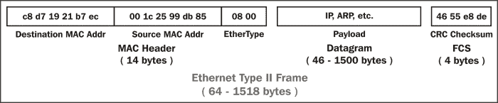

# 二、网络数据包分析器

数据包分析就是分析应用如何通过网络将有用的数据从 A 点传输到 B 点。因此，理解网络如何运作是至关重要的。

在本章中，我们将讨论以下主题:

*   为什么七层 OSI 模型很重要
*   IP 网络和子网
*   交换和路由数据包
*   以太网框架和交换机
*   IP 地址和路由器
*   广域网链接
*   无线网络

七层 OSI 模型将映射到最常见的网络术语，我们将回顾帧、交换、IP 寻址、路由和其他一些感兴趣的网络主题。我们的目标是开发一个网络心智模型，使其能够很好地进行包级分析。

# OSI 模型——为什么重要

**开放系统互连** ( **OSI** )参考模型是由**国际标准化组织** ( **ISO** )制定的行业公认标准，旨在将网络功能划分为七个逻辑层，以支持和鼓励(相对)独立的开发，同时提供来自不同硬件/软件环境、平台和供应商的各层之间的(相对)无缝互连。还有一个更简单的四层 **国防高级研究计划局** ( **DARPA** )模型，它映射到 OSI 模型，但 OSI 版本是最常用的。在讨论各个层时，我将参考这两个模型。

下图比较了 OSI 和 DARPA 参考模型:

除非您从事编写协议的工作，否则没有必要深入研究这七层中的任何一层，但是从概念上理解它们是有帮助的，因为这些层被业界和您的 it 同行所引用。

更重要的是，您必须知道这些层及其相关协议在 Wireshark 的**数据包详细信息**窗格中出现的位置和方式。我们将从这一方面介绍这些层，以帮助您记住它们并从讨论中获得最大的用处。

## 了解网络协议

网络协议，如 OSI 层，是一套工业标准规则和设计，用于在计算机和应用之间交换消息和数据。在任何关于 OSI 层的讨论中，您都直接或间接地提到与给定层相关联的协议(最常见的协议是 IP、UDP、TCP、HTTP 等)以及它们执行的重要功能。

例如，您会经常听到术语网络层和 IP 层可互换使用，并且假定和理解您谈论的是包含和使用 IP 地址的层和相关协议，以通过网络将数据包从 A 点路由到 B 点。接下来的讨论将把 OSI 和 DARPA 层与它们相关的协议联系起来。

## 七个 OSI 层

由于我们涵盖了从第 1 层到第 7 层的 OSI 层，我将概述每层的相关协议如何在 Wireshark 中显示和/或在网络硬件中使用。您通过这种方法开发的心智模型应该是最准确的，对包分析最有用。

### 第 1 层——物理层

物理层包含电气特性和机械标准，以获取从计算机的**网络接口卡** ( **NIC** ) 传输到交换机端口或交换机和路由器端口之间的数据位。您将在这一层遇到的最常见的标准、术语和设备包括:

*   **以太网**:这个是一个**局域网** ( **局域网**)的组网技术家族。
*   **RJ-45** :这些是 8 针模块化连接器，位于铜质以太网电缆的两端，插入计算机的网卡和墙上的插孔或交换机端口
*   **Cat 5 (Cat 5e 或 Cat 6)线缆**:这些是使用双绞线铜线的以太网线缆。“Cat”代表电缆类别，反映其质量和数据速度能力。
*   100Base-T、1000Base-T 和 1000Base-LX :这些代表一种特定的以太网标准。100Base-T 在使用 RJ-45 连接器的双绞线电缆上是 100 Mbps，1000Base-LX 在光纤上是 1000 Mbps，等等。
*   **单模和多模光缆**:这些使用固态发光二极管或激光器发出的光脉冲来传输数据位。

用于将网卡连接到交换机的以太网标准也用于将交换机连接在一起，以及将交换机连接到路由器或其他网络设备，尽管使用的电缆和连接器可能会因电缆类型和速度而异。

还有其他常用的第 1 层标准，包括 802.11 无线、帧中继和 ATM 后两种用于长途 **广域网** ( **广域网**)。

### 第 2 层——数据链路层

数据链路层将来自物理层(通常是以太网)的原始位组织成帧，这是 Wireshark 中通常所说的数据包的第一种表现形式。这一层是物理网络、电气/机械标准和逻辑结构(协议)之间的分界线，逻辑结构用于格式化和传输、接收和解码更高层中的数据包。

在 DARPA 参考模型中，物理层和数据链路 OSI 层结合在一起，称为网络接口层。该层(用于以太网 II 帧)的重要特性和功能包括:

*   **媒体访问控制(MAC)地址**:这些是局域网中使用的网络地址。它们是烧录到网卡、交换机、路由器或其他网络设备端口/接口上的内存芯片中的 6 字节网络硬件地址:

    *   一个 MAC 地址的前三个字节被分配给一个特定的制造商，并且可以与该制造商相关联。Wireshark 有一个列表，可以将 MAC 地址显示为制造商代码和最后三个字节的组合。制造商为每个接口创建一个唯一的后三字节地址，这样每个 MAC 地址在全球范围内都是唯一的。(尽管 NIC 可能被编程为使用另一个任意 MAC 地址，这是为了恶意攻击的 MAC 欺骗。但这是一个非常糟糕的想法，因为另一张卡可能使用相同的地址，并可能导致数据丢失和一些非常混乱的数据包交换问题。)
    *   以太网帧包括目的 MAC 地址和源 MAC 地址。MAC 地址用于在同一局域网上的计算机之间或者在计算机和路由器或局域网上的其它设备端口之间交换(不是路由——我们将很快进行区分)帧。

*   **类型(或以太类型)字段**:该表示下一个更高的协议层(通常是 IP (0800)或 ARP (0806))。Wireshark 使用它来确定数据包解码中要应用的下一个协议解析器。
*   **有效载荷**:这个是以太网帧携带的数据包或数据报。
*   **帧校验序列**:这个是一个 4 字节的**循环冗余校验** ( **CRC** ) 检错码，从一帧中的所有比特位计算出来，加到帧尾。这用于检测通常由于电缆故障、外部电信号在电缆电线上引起的噪声等原因而损坏的帧。收到帧时，会根据收到的位重新计算该代码，并与 FCS 字段进行比较。坏帧随后被丢弃。

下图说明了以太网帧中字段的布局:

这里的一个关键点(理解这一点很重要)是，以太网帧及其 MAC 地址只能在它们所属的局域网(LAN 和 IP 子网)中的设备之间传输帧。

路由器凭借其 IP 子网(子网)寻址形成局域网之间的边界。属于同一个 IP 子网的所有设备都是同一个 LAN 的一部分，要在不同的子网之间收发数据包需要路由器。

一旦一个帧进入路由器端口，被路由到不同的/远距离的网络，带有其 MAC 地址和 FCS 的以太网帧就被剥离并丢弃。该帧中的有效载荷被路由到端口，并在去往下一台设备的途中离开，然后创建另一个具有不同 MAC 地址和重新计算的 FCS 的帧来封装该数据包。然后，该帧被传输到下一个目的地。

在这一层工作的网络设备(通常是交换机)通常被称为第 2 层设备或第 2 层交换机。

最后，您应该知道，第 2 层交换机可以支持多种网络增强功能，如**虚拟局域网** ( **VLAN** ) 和 **服务类别** ( **CoS** )标记，这是通过在 MAC 地址和以太网类型字段之间添加一个 4 字节的 802.1Q 字段来实现的。您可能会在交换机之间看到这些帧(但不会在用户端口上看到)。

VLAN 是第 2 层解决方案，允许将交换机上的各种端口划分为独立的广播域。位于不同 VLANs 上的设备可以有效地相互隔离，就像它们位于不同的物理网络上一样。如果交换机支持 VLAN 标记，VLAN 可以分布在多个交换机上，而无需为每个 VLAN 铺设单独的电缆。不同 VLANs 上的设备之间的通信通常需要使用路由器。

在下面的 Wireshark packet details 截图中，以太网 II 帧**目的地**和**源** MAC 地址、**类型**(表示下一层协议是 IP)、以及**帧校验序列**被圈起来，同样被圈起来的还有**帧**摘要。

### 注意

Wireshark 显示每个帧的摘要，包括帧大小、捕获的时间戳和帧间时间以及其他有用的信息。这是 Wireshark 计算的元数据，用于帮助分析，而不是捕获帧的一部分。

以下截图突出显示了以太网帧的重要字段:

### 注意

Wireshark 在**数据包详细信息**窗格的任何区域中提供的任何额外分析，如果是计算出来的，或者不是实际数据包内容的一部分，都将放在括号中。

### 第 3 层——网络层

网络层(在 DARPA 模型中称为互联网层)主要处理数据包在从源计算机到目的主机的路径上根据目的 IP 地址在其他网络之间和向其他网络的路由。这一层最常见的两种协议是互联网协议和地址解析协议。

#### 互联网协议

在这一层使用的最常见的协议是 **互联网协议版本 4** ( **IPv4** )，它包括几个基本字段来完成跨网络路由数据包的任务:

*   **区分服务(DiffServ)** :该字段支持对 IP 的增强，通常称为**服务质量** ( **QoS** )，并允许对某些类型的流量(语音、视频等)进行分类，以便在网络拥塞的情况下这些数据包可以得到优先处理。
*   **总长度**:这个是数据包的总长度(减去以太网 MAC 头)。
*   **标识(IP ID)** :这个是一个递增的数字，用来支持分片。
*   **标志**:这些用于支持分段(将数据包分成两个或多个较小的数据包),以防大数据包必须分成几个较小的数据包才能通过数据包大小受限的链路。这些标志和 IP ID 字段值允许将分段的数据包正确重组为原始数据包。
*   **片段偏移量**:如果 **标志**字段为 **1** (更多片段)，则该字段中的值表示该片段包所包含的原始净荷起始处的偏移量，单位为字节。
*   **生存时间(TTL)** :这个是一个“跳”或时间计数器，每当一个数据包通过路由器时它就递减。如果 TTL 达到零，数据包将被丢弃。主要目的是防止数据包永远存在，并在无意中出现路径环路时使网络崩溃。
*   **协议**:这个标识 IP 包有效载荷中的协议。Wireshark 使用它来确定应用于数据包解码的下一个协议解析器。
*   **源和目的 IP 地址**:这些是发送机器和最终目的机器的 IP 地址。IP 地址的长度为 4 个字节，由句点分隔的四个八位字节(十进制数为 0 到 255)表示。

在下面的屏幕截图中，重要的 IPv4 字段被圈起来。当在这一层进行数据包分析时，这些是您想要检查的字段。

#### 地址解析协议

您将在网络层看到的另一个协议是**地址解析协议** ( **ARP** )，当一个设备只知道另一个设备的 IP 地址时，它使用该协议来获取该设备的 MAC 地址。

在下面的 Wireshark packet details 截图中，注意以太网帧目的 MAC 地址是**Broadcast(ff:ff:ff:ff:ff:ff:ff)**， **Type** 是 **ARP (0x0806)** ，站点已经在 ARP 协议 **Sender** 字段中提供了自己的 MAC 和 IP 地址(其他站点监听并使用它来建立 MAC 和 IP 地址表)。它提供目标设备的 IP 地址，并将所有零放入**目标 MAC 地址**字段。目标设备应该返回一个类似的地址为请求者的 ARP 数据包，其 MAC 地址在**发送者**字段中。

只有在以下情况下，工作站才会发送 ARP 请求:

*   需要目标设备的 MAC 地址的站点没有听到该站点的 MAC 地址的先前广播，或者它的 ARP 表已经超时(ARP 条目只保留一段时间)。
*   需要目标设备 MAC 地址的工作站(根据目标设备的 IP 地址和自己的子网掩码)已经计算出目标设备应该位于同一个 LAN 上。否则，该站假定目标设备在不同的网络上，并根据发送站的默认网关配置设置中的条目，向默认网关(路由器)MAC 地址发送其第一个会话发起数据包。默认网关会将数据包转发到适当的出口端口，以将其路由到目的地。
*   需要向远程网络发送数据包的站点不知道其默认网关的 MAC 地址(例如，刚刚加电)。

下面的屏幕截图突出显示了 ARP 数据包的重要字段:

在这一层使用的其他协议包括 **互联网控制消息协议** ( **ICMP** ，用于在设备之间发送网络错误消息，以及**互联网群组管理协议**(**IGMP**)，主机和相邻路由器使用该协议为网络应用(如视频流和游戏)建立多播(一对多)群组成员关系。

### 第 4 层——传输层

传输层，在 OSI 和 DARPA 模型中都称为，负责通过端口号在应用之间或用户和应用之间的唯一会话中传输数据包。设备或用户的 IP 地址和分配给该设备或用户的端口号的组合(称为套接字)将不同于其他设备或用户的 IP 地址和端口号(在客户端)。

如果数据包的源主机是服务器，那么源端口可能是标准应用和服务的一个众所周知的数字，例如 HTTP 的端口 80。

传输层通常使用两种协议中的一种，即用户数据报协议或传输控制协议，后者在大多数应用中更为流行。

#### 用户数据报协议

**用户数据报协议** ( **UDP** )是一个相当简单的协议。它被认为是一种*不可靠的*传输方式，因为它不能保证数据包的传送或排序，但它的开销较低，用于对时间敏感的应用，如语音和视频流量，以及网络服务应用，如 DNS。

UDP 报头只有 8 个字节长，由以下内容组成:

*   **源端口号和目的端口号** : 每个都是 2 个字节。
*   **长度**:这个是 UDP 头加上有效载荷的长度。这是一个 2 字节的字段。
*   **校验和**:2 字节字段，用于检查 UDP 头和数据的错误。如果变送器没有生成校验和，则校验和将全为零。

下面的屏幕截图显示了 UDP 报头中包含的字段:

#### 传输控制协议

与 UDP 不同， **传输控制协议** ( **TCP** )通过检测丢失、重复或无序的数据包，请求重新传输丢失的数据，或者在将数据包传送到应用之前按正确的顺序重新排列数据包，来提供可靠的数据传送。TCP 还可以接受来自应用的大块数据，并处理使用多个数据包将数据可靠地传输到另一端，并在另一端重组它们(UDP 也可以，但不可靠；应用必须确定丢失的分组并从丢失的分组中恢复)。

TCP 报头的内容和长度可以根据可能使用的选项而变化，但在其最简单的实现中，它包括:

*   **源端口和目的端口(每个 2 字节)**:这些是众所周知的注册端口，用于(在服务器上)访问标准应用服务，比如 HTTP、FTP、SMTP、数据库等等。分配给客户端/用户会话的端口号通常在一个较大的数字范围内，并按顺序分配。
*   **序列号(4 字节)**:这个是一个数字，代表任何给定段中的第一个八位字节。序列号在新会话开始时被初始化为随机数，然后作为数据字节递增并发送。
*   **Acknowledgment number (4 bytes)** : When the ACK flag bit is set, this field contains the next sequence number expected from the sender, Which in turn acknowledgements receipt of all the bytes received up to that point.

    ### Note

    TCP uses sequence numbers and acknowledgement numbers to ensure the reliable transmission of data by tracking the number and order of received bytes.

    The serial number and confirmation number are so large that it is difficult for human beings to track them. Wireshark can convert these values and display them as relative values starting from 0 at the beginning of the session, so as to check them easily and associate these values with the number of bytes sent and received.

*   **标志(9 位)**:这些位用于控制连接建立、终止和流量控制机制。
*   **窗口大小(2 字节)**:该表示该主机上缓冲区的当前大小，该缓冲区用于存储接收到的数据，直到该数据被移交给接收应用。该信息允许发送主机在网络或主机拥塞时调整数据流速率。

下面的屏幕截图突出显示了 TCP 报头的重要字段:

### 第 5 层——会话层

会话层处理两台计算机之间的应用内会话的建立、控制和结束。例如，这不一定与 TCP 连接是一回事，尽管两者是相关的。应用会话可以跨越多个网络连接，并且持续时间更长。在这一层运行的网络协议的一个例子是**网络基本输入/输出系统** ( **NetBIOS** )。

### 第 6 层——表示层

表示层将传入和传出的数据从一种格式转换为另一种格式，并在需要时处理加密/解密和/或压缩。表示层还负责向应用层传递和格式化信息，以便进一步处理或显示。演示服务的一个例子是将 EBCDIC 编码的文本计算机文件转换成 ASCII 编码的文件。

### 第 7 层——应用层

应用层，可以(也可以不)执行独立于应用本身的功能，处理消息格式化、人机接口等等。这一层代表直接支持应用的服务，例如用于文件传输、数据库访问、电子邮件等的软件。

在许多广泛使用的应用中，表示层和应用层之间没有区别。例如，**超文本传输协议** ( **HTTP** )，即通常被认为是应用层协议，它具有表示层方面的功能，例如识别字符编码以进行适当转换的能力，然后在应用层进行转换。

在 DARPA 模型中，OSI 第 5-7 层被合并成一个应用层。从数据包分析的角度来看，顶层功能的特定表现形式和可见性(在 Wireshark 中)会因应用和支持这些功能的特定协议而异。

下图总结了 OSI 和 DARPA 层，以及各种网络协议和服务如何与这些层以及这些层之间的关系:

#### 封装

到现在为止，你可能已经观察到数据包将各种协议封装到连续的层中，就像剥洋葱一样。以太网帧包含数据报有效载荷；该数据报是具有 IP 报头和有效载荷的数据包。IP 数据包有效负载由 TCP 报头和数据段组成，而数据段又可能包含 HTTP 报头和有效负载。在 Wireshark 的**数据包详细信息**窗格中工作时，这种封装更容易可视化。

# IP 网络和子网

在继续之前，简单回顾一下典型的 IP 子网划分术语和典型应用应该有助于澄清本书中使用的术语，并作为那些已经精通 IP 寻址的人的复习资料。

在图表或设备配置中，放在网络 IP 地址之后的`/24`指示符是一个**无类域间路由** ( **CIDR** )指示符，它表示以下内容:

*   4 字节 IP 地址中 32 位中的前 24 位代表该网络中任何 IP 地址的网络部分。该网络被指定为`10.1.1.0`(下一个`/24`网络将是`10.1.2.0`，然后是`10.1.3.0`，依此类推)。
*   The last 8 bits of the 32-bit address can be used to give workstations, hosts, and other devices an IP address, with the following exceptions:

    *   该网络上的第一个主机地址被保留作为构建路由表的网络指示符:`10.1.1.0`(通常称为环回地址)
    *   该网络上的最后一个*主机*地址被保留为 IP 广播地址:`10.1.1.255`

    8 位二进制等于 256 十进制，减去前面两个例外。这为设备留下了 254 个可用的 IP 地址，从`10.1.1.1`、`10.1.1.2`到`10.1.1.254`依次类推。

*   表示子网掩码的另一种方式是点分十进制格式，`255.255.255.0`，它再次表示 IP 地址的前 24 位是网络，其余 8 位是主机。
*   There are Class A, Class B, and Class C address ranges, as well as a subset of IP ranges reserved as private addresses to use within organizations.

    下表显示了三个主要类别的 IP 地址范围:

    | 

    IP 地址类别

     | 

    起始 IP 地址

     | 

    结束 IP 地址

     |
    | --- | --- | --- |
    | A | `1.0.0.0` | `126.255.255.255` |
    | B | `128.0.0.0` | `191.255.255.255` |
    | C | `192.0.0.0` | `223.255.255.255` |

    下表显示了私有 IP 地址范围:

    | 

    私有 IP 地址的类别

     | 

    起始 IP 地址

     | 

    结束 IP 地址

     |
    | --- | --- | --- |
    | A | `10.0.0.0` | `10.255.255.255` |
    | B | `172.16.0.0` | `172.32.255.255` |
    | C | `192.168.0.0` | `192.168.255.255` |

*   子网掩码可以配置为允许每个子网有更多或更少的主机，相应的权衡是拥有更少或更多的网络地址，以便在更大的组织内构建多个网络。

对 IP 寻址和子网划分的深入探讨超出了本书的范围。如果您不熟悉这些概念，最好再学习一些，因为对 IP 子网划分的深入了解对于大多数分析活动来说是必不可少的。

# 交换和路由数据包

到目前为止，我们已经讨论了讨论数据包如何通过局域网和/或广域网从计算机 A 路由到主机 B 所需的主题，距离可以从一个房间到全球。要记住的重要概念是，以太网帧与交换机一起工作，IP 包与路由器一起工作来完成这一壮举，我们将在下一节讨论这一点。

## 以太网框架和交换机

重申一下第 2 层(数据链路层)讨论中概述的内容，以太网帧根据目的 MAC 地址从入口端口交换到适当的目的端口。网络交换机构建属于每个端口的 MAC 地址表，将帧的目的 MAC 地址与这些表进行比较，如果目的地在同一交换机上，则将帧交换到适当的出口端口，否则将帧从中继端口交换到另一个交换机或路由器。

请注意，交换机第一次看到它不认识的目的 MAC 地址时，它会将数据包(通常是 ARP 数据包)从所有端口发送出去，直到设备应答，它可以将新的 MAC 地址添加到它的**内容可寻址存储器** ( **CAM** )表，该表将 MAC 地址映射到特定端口。

携带目的地为远程网络的数据包的帧被发送到默认网关端口 MAC 地址。如果您在 Wireshark 的 **Conversations** 表的**以太网**选项卡中查看 MAC 地址列表，并看到一个流量明显高于其他站点的地址，这很可能是默认网关(路由器)端口 MAC 地址。这个端口是从/到其它网络进入/离开这个局域网的路径。

在任何给定的局域网上，你都会看到工作站、服务器和路由器生成 ARP 和**域名服务** ( **DNS** ) 请求:

*   **ARP** :用于将 IP 地址解析为 MAC 地址
*   **DNS** :用于将主机名解析为 IP 地址

在下图中，有两个用户工作站和一个服务器在位于`10.1.1.0/24` IP 网络上的 LAN 中连接在一起。一台路由器连接到该网络，该网络通过 WAN 链接到另一个位置。

以下两个场景利用此图展示了如何利用 MAC 地址在局域网中交换以太网帧:

*   The workstation with MAC address B wants to use an application on the server Venus, which is unknown to all the network devices as it was just powered up. The workstation knows the IP address of Venus as the IP address was preconfigured in the client application, but it doesn't know the server's MAC address.

    工作站广播一个 ARP 数据包，它以自己的 MAC 和 IP 地址作为发送方，以 Venus 服务器的 IP 地址作为发送方，并在**目标**字段中为 MAC 地址添加全零。Venus 向工作站发送 ARP 响应，在发送方 MAC 地址中包含其 MAC 地址 C。

    然后，工作站使用服务器的 MAC 地址作为以太网帧中的目的 MAC，向服务器发送会话启动数据包。

    这些以太网帧穿过交换机 3，交换机 3 通过观察 ARP 对话获知了两台设备的 MAC 地址。LAN 网络中的其余交换机在工作站 C 广播其 ARP 数据包时获知了它的 MAC 地址(因为交换机 3 将该 ARP 数据包从所有端口发送出去)，但没有获知服务器的 MAC 地址，因为服务器直接响应 C。

*   The workstation with MAC address A now wants to use an application on the server Venus. It doesn't know the server's MAC address either, so it sends an ARP request as well, which switch 2 broadcasts out all its ports, as does switch 1 and switch 3 as the switches only look at MAC addresses and the destination MAC address of any ARP request is **ff:ff:ff:ff:ff:ff**, so each switch is obliged to send the broadcast frame out all ports.

    然而，当服务器 Venus 使用 A 的 MAC 地址响应 A 的 ARP 数据包时，路径中的每台交换机都知道它看到 A 的 MAC 地址来自哪个端口。因此，每台交换机只将 Venus 的响应从相应的端口发送回工作站 a。对于学习到的非广播帧也是如此。如果交换机无法识别非广播帧的目的 MAC 地址，这些地址也会在第一时间从所有端口发出。

    随着交换机 CAM 表中填充了 MAC 地址及其相关端口，必须发送到 LAN 中每台设备的帧数量以及所有这些设备上的工作负载都大大减少了。

## IP 地址和路由器

当数据包需要离开局域网到达远程 IP 网络时，路由器需要根据数据包的目的 IP 地址对其进行路由。下面的场景(仍然参考前面的截图)说明了一种可能情况下涉及的一些细节。

工作站 A 现在想要使用服务器 Mars 上的应用，该应用驻留在与前面场景不同的网络上。而在这种情况下，工作站 A 不知道服务器的 IP 地址；它只需要它的名字。工作站 A 将向其网络设置中配置的 DNS 服务器 IP 地址(此处未显示 DNS 服务器)发送一个 DNS 请求数据包，主机名为 MarsDNS 服务器将返回 Mars 10.1.2.25 的 IP 地址。工作站 A 通过将其 IP 地址和子网掩码与 Mars 的 IP 地址进行比较，计算出该主机不在自己的网络上，因此它向路由器 1 发送会话发起数据包，路由器 1 在其网络设置中被配置为默认网关。我们假设工作站 A 已经从先前的 ARP 交换中知道了路由器 1 端口的 MAC 地址，以便从给定的 IP 地址中找到路由器 1 的 MAC 地址。

当路由器收到发送到路由器端口 MAC 地址的 A 的帧时，它会检查 IP 报头中的目的 IP 地址，并查找将数据包转发到的适当端口。路由器根据其它路由器广播的路由信息构建的路由表条目支持这一路由过程；每台路由器都会告诉所有其它路由器它知道通往哪个网络的路由。

在这种情况下，A 的数据包周围的以太网帧被剥离，剩余的有效负载(数据包)通过 WAN 链路发送到路由器 2，路由器 2 也会检查 IP 报头目的 IP 地址，并查找将数据包转发到的正确端口。路由器 2 将数据包封装在一个新的以太网帧中，以自己的 MAC 地址 X 作为源，以 Mars 服务器的 Y 地址作为目的 MAC(假设路由器的 MAC 表中已经有了该服务器)，然后将数据包传输到 LAN 并交换到 Mars 服务器，如下图所示:

# 万链接

实际上，网络数据包可能会经过几个路由器和 WAN 链路到达目的网络，每经过一个路由器称为一个跳。在数据包分析中，您应该意识到 WAN 链路会由于以下四个主要因素而导致数据包传输延迟或延时:

*   **物理光速传播延迟**:这个是电信号或光信号通过铜缆/光缆长距离传输所需的时间。
*   **网络路由/地理距离**:点与点之间的 WAN 链路路由从不在一条直线上。他们不得不穿过主要的电话交换中心，沿着铁路、公路和其他机会主义的道路走。
*   **WAN 链路内部和之间的串行化延迟**:WAN 链路通常是速度较慢的链路，在这些链路上一次一位地发送分组数据需要有限的时间。
*   **排队延迟**:在网络设备缓冲区中，包括可能由服务质量策略引起的额外延迟，一些数据包获得优先级，而其他数据包必须等待更长时间才能传输。

通过检查会话设置数据包之间经过的时间，可以在 Wireshark 数据包跟踪中看到和测量 LAN 和 WAN 链路上发生的网络延迟的影响。

# 无线网络

无线网络利用一系列 802.11 规范在 2.4 或 5 GHz 频段上以各种速度提供连接。无线帧与有线网络帧的显著区别如下:

*   无线网络采用载波侦听(每个站都在侦听)、多址接入(共享介质)和冲突避免(避免冲突而不仅仅是从冲突中恢复)技术，这些技术降低了吞吐量
*   除了转发到有线网络的数据帧之外，无线帧类型还包括以下几种:

    *   **管理帧**:这是用于认证和关联任务的
    *   **控制帧**:这控制共享介质上的发送/接收功能，以帮助避免冲突

Wireshark 可用于捕获和分析无线网络上的数据包。然而，为了分析控制和管理帧，以及选择要捕获的无线电信道而不必与特定信道相关联，需要专门的适配器。这些适配器可从不同的网络供应商处获得。

这些无线适配器及其驱动程序使 Wireshark 能够在**数据包详细信息**窗格中的帧标题下方显示一个伪标题，其中包括以下信息:

*   **数据速率**:这是无线信道上可能的最大数据传输速率
*   **频道频率**:这个是电台正在使用的射频频道频率
*   **信道类型**:这个是使用的`802.11`协议，常见的类型有 *a* 、 *b* 、 *g* 、 *n*
*   **射频信号和噪声水平**:这个是接收到的射频信号强度和背景噪声水平；这两者之间的差异越大，信号解码就越好

请记住，在分析无线网络时，无线接入点利用有线 LAN 连接到网络的其余部分，这可能需要进行单独的分析。接入点剥去 802.11 报头，将数据包封装在以太网帧中，然后通过有线网络发送出去。

下面的截图展示了一个典型的**无线报头**和 **IEEE 802.11 帧**的内容；注意**数据速率**、**通道频率**和**信号/噪声**值:

### 注意

您可以阅读大量参考资料和书籍来了解更多有关网络和网络协议的知识。一个经典的来源是 *TCP/IP 图文并茂的第一、二、三卷*、 *W. Richard Stevens* 、*Addison-Wesley Professional*，可以在网上或以书籍形式获得。

# 总结

本章讲述的要点包括:如何根据目的 MAC 地址将以太网帧交换到 LAN 上适当的交换机端口，数据包如何根据目的 IP 地址路由到远程网络，以及如何将携带目的 IP 地址为远程网络的数据包的帧发送到默认网关的端口 MAC 地址。

我们还讲述了较慢和/或较长距离的 WAN 链路如何以及为什么会给数据包传输增加大量延迟，从而降低应用数据交换的速度并增加用户响应时间。我们讨论了 Wireshark 如何使用专用适配器捕获和分析 802.11 无线网络上的数据包，从而结束了本章。

在下一章，我们将详细介绍如何使用 Wireshark 捕获和过滤数据包。