# 三、捕获所有正确的数据包

为了分析数据包以排查连通性、性能或安全问题，您必须成功捕获所有正确的数据包，然后识别并过滤掉与当前目标相关的数据包。

在本章中，我们将讨论以下主题:

*   选择最佳捕获点
*   分路器和交换机端口镜像
*   Wireshark 的捕获接口、过滤器和选项
*   验证一个好的捕获
*   隔离感兴趣的对话
*   使用 Wireshark 对话窗口
*   Wireshark 的显示过滤器
*   过滤表达式按钮
*   跟随 TCP/UDP/SSL 流
*   标记和忽略数据包
*   保存过滤的流量

您会发现，这些活动中有许多与我们在[第 1 章](ch01.html "Chapter 1. Getting Acquainted with Wireshark")、*了解 Wireshark* 中完成的活动相同，执行捕获并过滤加载网页时涉及的数据包。在这一章中，我们将扩展并完善你在所有这些主题中的技能。

# 挑选最佳拍摄点

确定执行数据包捕获的最佳位置取决于几个因素:

*   被调查问题的性质
*   在对分析最有用的位置执行捕获的相对能力
*   在给定地点执行抓捕所需的技术难度、风险和时间的总量

## 用户位置

如果您正在对用户投诉进行故障排除，第一个捕获点应该在用户的工作站，以便从用户的角度获得一个视图，并验证/澄清用户报告的情况。从这个有利位置，您可以:

*   确保 ARP 和 DNS 等基本网络服务正常工作
*   如果用户身份验证涉及不同于目标应用服务器的设备，则分析初始登录过程
*   测量从用户到目标主机的网络往返时间
*   确定 TCP 会话设置握手是否适合所访问的应用
*   测量服务响应时间(例如 HTTP 或 SMB 响应时间)
*   确定用户是否遇到数据包丢失和重新传输、数据包乱序或其他网络相关异常
*   捕获发送给用户的任何应用错误消息以及导致这些错误的请求

从实用的角度来看，从用户的位置捕获通常要简单得多，并且需要处理的流量也少得多，这使得捕获的大小更小，并且过滤感兴趣的数据包也更简单。断开用户的以太网电缆几分钟以插入一个窃听装置(我们将在下一节讨论)或在用户的工作站上安装 Wireshark 通常不需要特殊授权或准备，因为对其他用户的风险可以忽略不计。

## 服务器位置

如果从抱怨用户的工作站进行捕获是不可能的或不实际的，那么从服务器端进行捕获仍然是有用的，但是应用捕获过滤器只收集进出用户工作站的流量(基于用户的 IP 地址)来限制捕获文件的大小可能是有利的。您仍然可以测量网络往返时间、服务器响应时间、分析 TCP 握手细节、检测由数据包丢失引起的重新传输，或许还可以从这个位置检测登录/验证过程。

在分析后端服务响应时间时，从服务器位置进行捕获也是合适的。例如，如果用户与应用服务器交互，但该应用服务器与后端数据库执行事务以满足用户请求，并且如果有人抱怨响应时间缓慢，那么对应用服务器到数据库服务器交互的分析可以帮助隔离一个或另一个主机性能不佳的真正原因以及导致响应缓慢或错误的请求类型。

## 其他拍摄地点

对于大多数数据包捕获，您可能会在用户工作站或服务器交换机端口，但也有一些情况需要在其他位置执行捕获。

### 中间网络捕获

确定网络路径上过多数据包丢失或无序的来源可能需要在该路径上的不同点执行数据包捕获，通常是在分布或核心交换机干线，或路由器、防火墙等的接口，以找到数据包丢失变得明显的网段。

### 专用网络设备的双方

今天的现代网络经常使用许多网络设备，这些设备实际上可以改变在客户机和服务器之间流动的数据包的内容；在某些情况下(偶尔或最后手段)，可能有必要在这些设备的两端进行采集，以隔离或证明功能或配置问题:

*   **Routers and gateways**: These are also called Internet gateways in some configurations and may be configured to perform a **Network Address Translation** (**NAT**) function that alters and hides the user's actual IP address from an outside network. This is done by substituting a public IP address for the user's real address. This usually involves translating port numbers as well so that a single public IP address can be used to support multiple sessions; in which case, the solution is called **Port Address Translation** (**PAT**). The end result of the PAT functionality is that a capture from the client side and a capture at the server side of the same session conversation will involve different IP addresses and port numbers.

    下图说明了 PAT 设备如何将内部专用网络的 IP 地址和端口转换为外部可见的 IP 地址，以及如何转换用于单个用户会话的端口:

    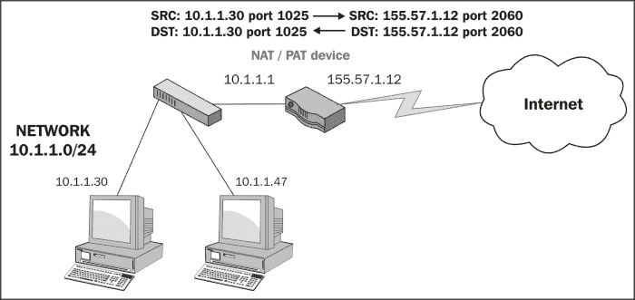
*   代理服务器和防火墙:这类设备可以作为想要使用其他(通常是外部)服务器资源的客户端之间的中介。这些设备通常部署在公司内部用户和通过互联网访问的外部(web)服务之间。这些设备因其安全功能而被采用，允许对可以访问的内容和可以在两个网络之间传递的数据内容类型、恶意软件扫描等进行管理控制。从数据包分析的角度来看，您应该知道，除了执行 NAT/PAT 功能之外，这些设备的某些实现可能会在一端实际终止用户会话，并在另一端代表用户在设备和外部主机之间发起完全不同的会话，这样，TCP 握手和会话参数、IP 地址和端口号以及数据包大小在任一端都可能不同。
*   **使用通用路由封装的 IP 隧道**:这些隧道用于连接两个 IP 网络，这两个网络之间没有本地路由路径。原始数据包封装在具有不同 IP 地址的数据包中，这些 IP 地址适用于它们将通过的网络介质。IP 隧道最常见的用途是通过公共互联网连接将私有企业网络连接在一起，或者通过传统的 IPv4 网络路径将**互联网协议第 6 版** ( **IPv6** )网络连接在一起。可以在路由器和高端交换机之间配置 IP 隧道。

尽管可能有必要(向其他支持团队验证问题)或更实际地在前面描述的设备接口处或附近进行捕获，但在用户和/或服务器位置执行捕获通常更容易且同样有效。除非你是网络支持团队的一员，否则你不必在如此高级复杂的环境中进行分析。

# 测试接入端口和交换机端口镜像

如果您从一个用户位置进行捕获，并且不能或不希望在用户的机器上安装 Wireshark，或者您在网络中的另一个位置进行捕获，您有两种选择来获得通过网络的数据包的副本:测试接入端口或交换机端口镜像。

## 测试接入端口

一个**测试接入端口** ( **分接头**)是一个将流经它的所有数据包复制到一个或多个监控端口的设备。安装了 Wireshark 的工作站可以连接到其中一个监控端口来捕获数据包。

您应该选择一个聚合分路器，该分路器支持正在分析的网络端口的链路速度(通常为 100 Mbps 或 1 Gbps)，并将复制和合并双向流动的数据包(从用户工作站传输数据，从网络接收数据)；聚合分路器将流量集中到一个连接(传输到 Wireshark 站)，以便您可以通过 Wireshark 站上的一个网络接口捕获两个方向的流量。请注意，由于您是将数据包从两个方向复制到一个管道中，然后再传送到 Wireshark 站，因此如果流量非常高，可能会导致监控端口超额预订。如果发生这种情况，多余的数据包将被丢弃。超额订阅通常不是用户工作站的问题，但它可能是交换机中继或其他高流量区域的问题。

下图说明了如何在用户工作站和该工作站的交换机端口之间插入一个窃听装置，以及如何连接一个 Wireshark 工作站来捕获数据包:

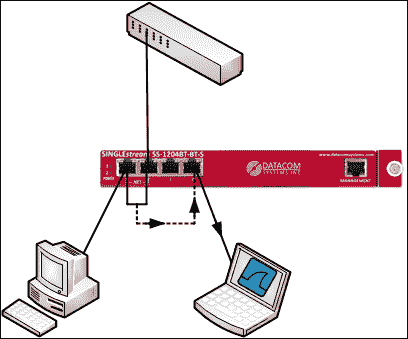

## 交换机端口镜像

交换机端口镜像，也称为**交换机端口分析器** ( **SPAN** ) 功能或跨越端口，是将网络交换机配置为执行与 TAP 相同的功能的实践:复制进出指定端口的数据包，并将它们发送到未使用的监控端口，Wireshark 工作站连接到该端口以捕获数据包。

使用端口镜像的优点是插入分接头时不需要断开任何连接。监控端口可以由交换机管理员轻松配置，也可以轻松禁用。

此选项的潜在问题包括，并非所有交换机都支持端口镜像，有证据表明，使用此功能可能会影响交换机的性能，至少对于被监控的端口是如此。对于端口镜像，也存在使监控端口超额订阅过多的发送和接收流量水平的可能性，使用分路器时就是这种情况，并且当监控到其他交换机的交换机中继时也可能出现这种情况，因为这些交换机将为多个用户传输流量。

下图简单说明了交换机上的端口镜像场景。进出工作站端口的数据包被复制到 Wireshark 工作站连接的端口。

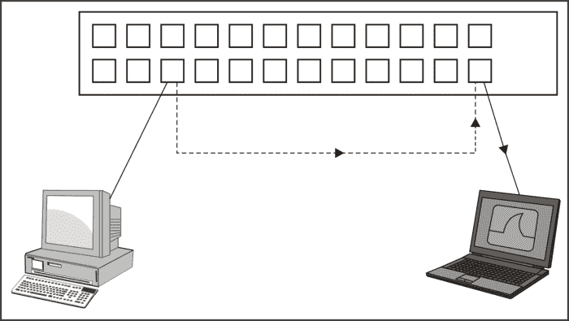

### 在高流量链路上捕获数据包

如果您需要捕获高流量链路上的数据包，例如大型交换机之间的中继链路，Wireshark 可能不是最佳解决方案。它可能跟不上繁忙的链路。Wireshark 实际上是一个 GUI 工具，它调用一个名为 **dumpcap** 的命令行可执行程序，该程序捕获数据包并将其保存到磁盘文件中。Wireshark 读取该文件，并将处理后的数据包呈现给用户界面。Wireshark 的替代方法是直接使用 dumpcap 或 **tcpdump** 可执行文件(这些将在[第 8 章](ch08.html "Chapter 8. Command-line and Other Utilities")、*命令行和其他实用工具*中介绍)或由众多供应商提供的高性能捕获设备。

# 捕获界面、过滤器和选项

使用 Wireshark 捕获数据包包括选择正确的网络接口来捕获数据包，应用任何合适的捕获过滤器，以及应用正确的选项来以所需的方式完成捕获。我们将在接下来的章节中讨论这三个主题。

## 选择正确的网络接口

正如[第 1 章](ch01.html "Chapter 1. Getting Acquainted with Wireshark")、*了解 Wireshark* 中所讨论的，如果您的机器上有多个网络接口，您需要确定并选择正确的接口来捕获数据包。在 Wireshark 的**捕获**菜单中，点击**界面**或点击图标栏上的第一个图标。

**Wireshark 捕获接口**窗口提供了您机器上网络接口的列表和描述、分配的 IP 地址以及每个接口的总数据包数和每秒数据包数。如果接口分配有 IPv6 地址并且正在显示，您可以单击该地址来切换和显示 IPv4 地址。

下面的屏幕截图显示了一个典型的**捕获接口**窗口，其中列出了 LAN 和无线接口及其 IP 地址和数据包计数器:

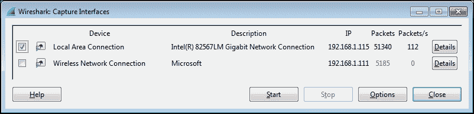

**捕获接口**窗口提供了以下两个选项:

*   点击任何一个列出界面的**细节**按钮，打开一个**界面细节**窗口，该窗口提供广泛的信息，可用于验证界面的操作。**链路的状态**和**链路速度**信息显示在**特性**选项卡中，所选网卡的 MAC 地址显示在 **802.3(以太网)**选项卡中。
*   其余的捕获选项在**捕获选项**窗口中配置，点击**捕获界面**窗口中的**选项**按钮，或者从**捕获**菜单中选择**选项**，或者点击图标栏中的第二个图标即可打开。

下面的截图展示了一个典型的**捕获选项**窗口，其中指定了多个选项。您可以参考关于**捕获选项**的主题示例。

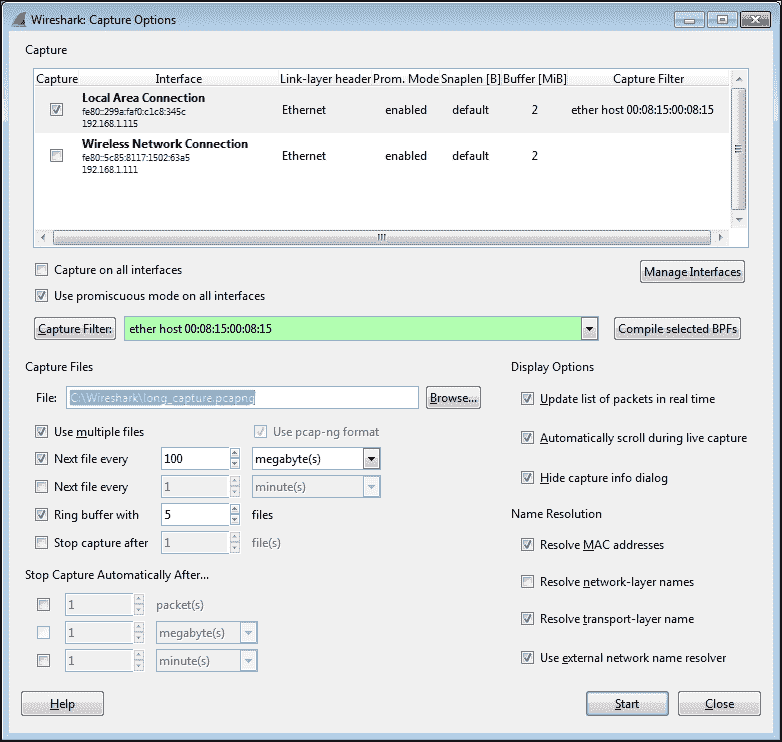

如前面截图所示，**捕获选项**窗口显示可用接口及其 IP 地址，并允许您选择一个或多个接口来执行捕获。Wireshark 可以同时从多个接口以及虚拟接口进行捕获。从**捕获接口**窗口开始的主要优势是数据包计数器可以帮助识别活动接口，这是**捕获选项**窗口所没有的功能。否则，如果您知道您想要使用哪个接口，您可以跳过使用**捕获接口**窗口，从这里开始。

点击**捕获选项**窗口中的**管理接口**按钮，弹出**接口管理**窗口。从**本地接口**选项卡，您可以选择隐藏您不希望在**捕获接口**和**捕获选项**窗口中显示的接口。

有一个选项可以在所有接口上快速启用**捕获，还有一个默认启用的**在所有接口**上使用混杂模式选项。在大多数情况下，此选项应保持启用，以便所选接口可以捕获和保存看到的所有数据包。否则，只有发送到 Wireshark 工作站的 MAC 地址的数据包、广播和/或组播数据包才会被看到和捕获，这基本上否定了它作为捕获设备的用途。**编译选定的 bpf**按钮提供编译的捕获过滤器的机器语言显示，但没有其他功能目的。**

### 注意

**捕获过滤器**字段具有高亮显示功能，指示有效和无效的过滤器语法。绿色背景表示良好的过滤器，红色背景表示无效或不完整的过滤器。

## 使用捕获过滤器

捕获过滤器用于减少数据包捕获过程中节省的流量。实际上，如果使用捕获过滤器的话，应该尽量少用，以帮助确保不会因为不符合捕获过滤器参数而无意中遗漏对分析很重要的数据包。请记住，您总是可以从捕获中过滤掉不需要的流量，但是一旦捕获完成，您就无法对丢失的数据包做任何事情。如果您对捕获不确定，请使用更宽松的捕获过滤器或根本不使用过滤器再次执行捕获。

适合使用捕获过滤器的一种情况是，您希望捕获长时间运行。然后，您应该过滤掉尽可能多的无关流量，以控制捕获文件的大小。但是，请注意确保您应用的捕获过滤器没有排除任何可能对分析有用的流量。

在进行您想要保留的正式采集之前，使用采集过滤器来验证过滤器是否按预期工作通常是一个好主意。

## 配置捕获过滤器

Wireshark 提供了一个**捕获过滤器**窗口，可以轻松选择预先配置的捕获过滤器，或者您可以根据需要配置自己的过滤器。

点击**捕获选项**窗口中的**捕获过滤器**按钮，打开**捕获过滤器**窗口。在此窗口中，您可以从许多有用的预配置捕获过滤器中进行选择，根据您的需要创建新的唯一的捕获过滤器，或者删除不需要的或错误的过滤器。创建一个新的过滤器只需要给过滤器一个名称，输入捕获过滤器语法，点击 **New** 保存过滤器，最后点击 **OK** 。或者，您可以单击现有的过滤器，然后单击 **New** ，这将在列表底部创建该过滤器的副本，然后可以根据您的需要进行修改。

下面的截图展示了一个典型的**捕获过滤器**窗口。在这种情况下，选择了只允许特定以太网 MAC 地址的流量进出的捕获过滤器:

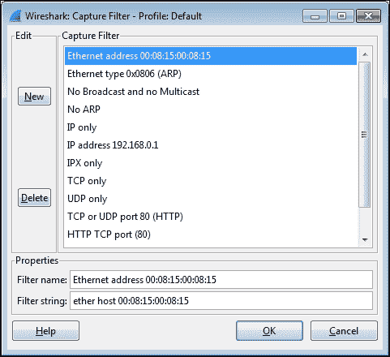

Wireshark 的捕获过滤器使用一种称为 **Berkley 数据包过滤器** ( **BPF** )格式的语法，这种格式起源于 Unix 世界，今天仍在数据包级驱动程序中使用。请注意 Wireshark 中用于捕获过滤器的语法与用于显示过滤器的语法有很大不同。

从**捕获过滤器**窗口中默认选择的捕获过滤器有助于提供捕获过滤器语法的例子。下表列出了捕获筛选器语法的一些其他示例以及该语法的示例:

| 

描述

 | 

句法

 | 

例子

 |
| --- | --- | --- |
| 过滤以太网 MAC 地址过滤以仅捕获来自或去往 MAC 地址的流量 | 以太主机`xx:xx:xx:xx:xx:xx`乙醚`src`或乙醚`dst` | 以太主机`00:1c:25:99:db:85`乙醚`src 00:1c:25:99:db:85` |
| 根据 IP 地址或主机名进行过滤过滤器仅捕获两个 IP 地址之间的流量仅过滤两台主机之间的单向流量 | 主持人`xxx.xxx.xxx.xxx``src`主机和`dst`主机 | `host 192.168.1.115``host www.wireshark.org``host 192.168.1.115`和`host 10.1.1.125``src host` `192.168.1.115`和`dst host 10.1.1.125` |
| 基于端口号的过滤器 DNS 数据包筛选器 DHCP 数据包过滤器 | `port`、`dst port`和`src port` | `port 53``port 67` |
| 基于协议的过滤器仅过滤 HTTP 流量 | `arp`、`icmp`、`ip`、`upd`、`tcp`、`http`、`ip6`和`icmp6` | `http` |
| 捕获过滤器逻辑运算符过滤以排除 ARP 和 DNS 数据包 | `=`、`!=`、`>`、`<`、`>=`、`<=`、`!`、`not`、`&&`、`and`、`&#124;&#124;`、`or` | `not arp`和`port not 53``! arp && port ! 53` |

关于捕获过滤器的更多信息和示例可以在 Wireshark wiki 上的[http://wiki.wireshark.org/CaptureFilters](http://wiki.wireshark.org/CaptureFilters)找到，协议特定的捕获过滤器语法包含在位于[http://wiki.wireshark.org/ProtocolReference](http://wiki.wireshark.org/ProtocolReference)的参考信息中。

## 捕获选项

Wireshark **捕获选项**窗口提供了多种控件来配置捕获以满足特定需求。

### 捕获文件名和位置

点击**文件**选项上的**浏览**按钮，您可以导航到一个选定的目录，您可以在其中存储捕获文件并输入捕获文件的文件名。

当使用 **文件**选项时，Wireshark 会在您指定的文件名后附加一个文件编号和日期时间戳，并且不会提供文件扩展名。您应该在文件名中指定一个`.pcapng`扩展名。这可以用一个例子来更好地说明。

用户提供的目录和文件名是`C:\Wireshark\long_capture.pcapng`，Wireshark 将以`C:\Wireshark\long_capture_00001_20140724132952.pcapng`的格式创建数据包并保存到文件中。

如果 Wireshark 配置为捕获多个文件(这将在后面讨论)，文件编号和日期时间戳将随着捕获的进行而相应增加，例如，`long_capture_00002_20140724133343.pcapng`和`long_capture_00003_20140724133612.pcapng`。

### 多个文件选项

Wireshark 可以配置为将数据包保存到多个文件，以允许长期捕获，并提供了许多选项来控制如何实现这一点。

选择**使用多个文件**选项会使适当的底层控件随着特定选项的启用而激活。当每个文件达到给定的大小和/或经过一段可配置的时间后，您可以选择启动一个新的(下一个)文件。

### 注意

当处理比 100 MB 大得多的捕获文件时，Wireshark 会变得非常缓慢，甚至可能崩溃，因此您应该将此视为一个很好的最大文件大小。

### 环形缓冲器

**环形缓冲区**选项与**下一个文件间隔**选项协同工作，使 Wireshark 填充指定数量的文件，随着捕获的继续进行，它会删除最旧的文件。

此功能有助于在等待某些间歇性问题或事件发生时保持捕获运行，然后手动停止捕获。环形缓冲区文件提供停止采集之前一段时间的历史采集数据，而不会用过多的大型采集文件填满硬盘。

### 停止捕获选项

Wireshark 可以选择在指定数量的数据包、文件大小或时间段后自动停止捕获。如果启用了**使用多个文件**选项，可以使用一个在指定数量的文件后停止捕获的选项。否则，可以在经过指定数量的数据包、文件大小或时间段后停止捕获。

### 显示选项

**实时更新数据包列表**选项指定 Wireshark 在捕获期间定期读取正在写入的捕获文件，并相应地更新**数据包列表**的内容。否则，Wireshark 用户界面将在捕获过程中变灰。

**在实时捕获过程中自动滚动**选项指定 Wireshark 更新并在**数据包列表**窗格中显示最新捕获的数据包，这样当列表更新时，数据包似乎会向上滚动。必须启用**实时更新数据包列表**选项，此选项才能起作用。

这两个选项都有处理时间成本，可能导致数据包丢失和/或显示缓慢，如果在非常繁忙的链路上捕获，则应禁用这两个选项。但是，在捕获过程中，将无法查看和确认预期的数据包流。

**Hide capture info dialog** 选项(默认启用)控制在捕获期间是否显示一个简单的窗口，显示协议的数据包计数和百分比。除非特别需要，否则最好隐藏此窗口。

### 名称解析选项

如果启用了 **解析 MAC 地址**选项，Wireshark 会显示带有指定制造商代码的 MAC 地址，而不是前三个八位字节。比如 Wireshark 会显示 **CiscoCon_21:b7:ec** 而不是 **c8:d7:19:21:b7:ec** 。制造商代码列表保存在 Wireshark 安装目录的`manuf`文件中。

**解析网络层名称**选项与**使用外部网络名称解析器**协同工作，以确定是否或如何将捕获的 IP 地址解析为其主机名，如下所示:

*   **解析网络层名称**选项指定 Wireshark 应该尝试将 IP 地址解析为主机名。如果启用了**使用外部网络名称解析器**选项，Wireshark 将对每个唯一的 IP 地址执行反向 DNS 查找。这会导致 Wireshark 产生自己的流量。
*   如果**使用外部网络名称解析器**选项被禁用，Wireshark 将尝试使用用户提供的`hosts`文本文件(使用典型的 IP 地址`<tab>`主机名语法)解析 IP 地址，该文件在使用默认配置文件时位于 Wireshark 安装目录中，在使用自定义配置文件时位于适当的配置文件目录中。

在捕获期间，最好禁用**解析网络层名称**选项，以便 Wireshark 在捕获期间尝试解析 IP 地址时不会产生额外的网络流量。在捕获完成后，该功能始终可以临时启用(通过从菜单导航到**视图** | **名称解析** | **启用网络层**)。

如果启用了**解析传输层名称**选项，它会使 Wireshark 在**数据包列表**窗格的信息显示字段中显示人类可读的、特定于端口和协议的服务名称，而不是端口号。例如，TCP 端口 80 将显示为 HTTP。端口号服务列表保存在 Wireshark 安装目录的`services`文件中。

本节开头的屏幕截图显示了一个设置为使用 LAN 接口的**捕获选项**窗口，该窗口是一个过滤器，仅用于捕获进出特定以太网 MAC 地址的流量，在环形缓冲区场景中最多保存五个各为 100 MB 的文件，并使用特定的前导文件名和扩展名将这些文件保存在提供的目录中。**显示选项**和**名称解析**选项保留默认设置。

一旦选择了所有需要的**捕获选项**，点击**开始**按钮将开始捕获。

已经介绍了所有最有用的**捕获选项**功能，现在可能是时候告诉你，对于你的许多捕获，特别是从相对低流量的位置，如从用户工作站，你不希望或不需要设置任何捕获选项(除了从适当的界面捕获),可以通过点击图标栏上的第三个(绿色鲨鱼鳍形状)图标或从**捕获**菜单中选择**开始**来简单地使用所有默认设置开始捕获。不使用捕获过滤器可让您捕获所有相关的数据包，不会遗漏任何内容，并在捕获完成后使用显示过滤器过滤掉任何不需要的流量。

# 验证一次成功的捕获

在捕获完成后，您应该滚动并检查**数据包列表**窗格中的数据包，以确保您看到的是预期的流量——通常是进出特定主机的流量。

您还应该确保没有数据包丢失，这将显示在 Wireshark 用户界面底部中心的**状态栏**的**数据包信息**部分。丢弃的数据包表示 Wireshark 或选定的网卡无法跟上流量，不得不丢弃数据包，这当然会影响您的分析质量。如果发生丢包，您可能需要使用性能更高的工作站来执行捕获，或者选择一个流量较低的捕获位置。

# 保存批量捕获文件

在完成并验证一个良好的捕获后，您应该将批量(所有捕获的数据包)捕获文件(假设单个文件捕获)保存到您选择的目录中。您稍后将过滤数据包的子集并将其保存到一个较小的文件中，但是如果在分析过程中您发现您可能无意中过滤掉了比您想要的更多的数据包，那么稍后能够再次加载原始的捕获文件是非常有利的。

使用**文件**菜单中的**另存为**选项，导航至您选择的目录并给文件命名。如果没有指定文件扩展名，Wireshark 将根据选择的**另存为类型**选项追加一个文件扩展名；默认为`.pcapng`格式。但是，如果您打算与使用不同协议分析工具的人共享捕获文件，您可以将文件保存为其他几种流行的特定于供应商的格式。

如果使用多个文件和/或环形缓冲区捕获选项之一保存了多个文件，导航到**文件** | **文件集** | **列表文件**选择并打开其中一个文件。

# 隔离感兴趣的对话

在完成数据包捕获并保存批量捕获文件后，您将在**数据包列表**窗格中看到数量惊人的各种类型和地址的数据包。现在是时候将它分解成只与手头的分析任务相关的数据包了。

这个想法是逐步消除不相关的数据包；分析相关对话，寻找异常情况；并再次逐步过滤、测量和分析数据包流量和应用行为，直到您发现并记录问题的根本原因。

有两种基本方法来隔离和检查感兴趣的数据包和对话，您可能会在大多数分析活动中使用以下两种方法:

*   **Conversations** :该窗口根据 MAC 或 IP 地址和/或 TCP/UDP 端口创建可排序的对话对列表。它显示过滤器，这些过滤器将隔离并仅显示可以从该窗口快速应用的选定会话数据包。
*   **显示过滤器**:这些过滤器基于 MAC 或 IP 地址和/或协议特定字段，限制在**数据包列表**窗格中显示的数据包。

我们将在下面的小节中讨论这些方法。

# 使用对话窗口

使用**对话**窗口的基础知识在[第一章](ch01.html "Chapter 1. Getting Acquainted with Wireshark")、*了解 Wireshark* 的第一次捕获中已经讲述过。在这一节中，我们将介绍**对话**窗口的其他一些便利特性。

## 以太网选项卡

根据可用的**名称解析**设置， **对话**窗口展示了**以太网**选项卡中的特定行为。如果**名称解析**菜单(可在**视图**菜单中找到)中的**启用网络层**，并且**名称解析**也在**对话**窗口中启用，则与给定设备的 MAC 地址相关联的 IP 地址显示为 IP 地址，而不是 MAC 地址。在这种情况下，切换**名称解析**选项有助于轻松将设备的 IP 地址与其 MAC 地址相关联。

如果**启用网络层**选项未启用，则**对话**窗口中的**名称解析**选项控制 MAC 地址是显示制造商前缀还是显示为基本的 6 位八位 MAC 地址。

## TCP 和 UDP 选项卡

**对话**窗口的 **TCP** 和 **UDP** 选项卡列出了所有基于 IP 地址和端口的设备之间的对话。考虑到一对设备之间的网络通信，每个设备都有其相关联的 IP 地址，可能包括具有不同端口号的多个连续或同时的会话， **TCP** 和 **UDP** 选项卡(取决于所使用的协议)使得检查这些单独会话的数量、相对大小以及开始/持续时间变得更加容易。

正如在**对话**窗口的任何其他选项卡中所做的那样，使用右键单击功能可以快速准备或应用显示过滤器。

在调查 TCP 或 UDP 会话时，一个有用的做法是最初仅对 IP 地址应用显示过滤器，然后在**对话**窗口底部启用**限制以显示过滤器**选项。在返回到 **TCP** 或 **UDP** 选项卡时，仅显示过滤后的主机对之间的端口级会话，这使得调查这些会话比从整个列表中挑选它们容易得多。

下面的屏幕截图显示了在应用显示过滤器(来自批量捕获文件)并在**对话**窗口中启用**限制显示过滤器**选项后，加载[https://www.wireshark.org/](https://www.wireshark.org/)主页所涉及的多个 TCP 会话。可以看到，用户工作站上的端口 **54581** 和端口 80 (HTTP)之间的(top)会话承载了绝大部分流量；其余港口的运输量要小得多。

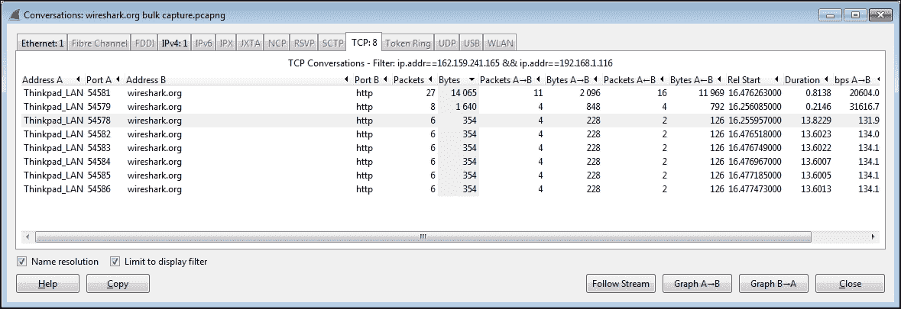

## 无线局域网选项卡

由于 **对话**窗口标签是按字母顺序排列的，**无线局域网**标签排在最后。该选项卡显示无线站 MAC 地址，以及**字节**、**数据包**，以及其他选项卡中提供的其他列。

# Wireshark 显示过滤器

Wireshark 提供了非常广泛的特定于协议的显示过滤器，通过允许您根据您定义的标准专注于特定的数据包，这些过滤器对于分析活动非常有用。您可以只过滤您想要查看的流量，也可以过滤不需要的流量。显示过滤器是 Wireshark 最有用的功能之一，因此应该非常熟悉。

显示过滤器可通过多种方式创建:

*   通过从**显示过滤器**窗口应用显示过滤器
*   通过键入显示过滤器语法(使用自动完成)
*   通过从**对话**(或**端点**)窗口应用显示过滤器
*   通过应用过滤器表达式按钮中保存的显示过滤器
*   使用**表达式**按钮帮助创建过滤器
*   Using right-click menus on specific packet fields

    ### Note

    Please remember that the display filter uses a proprietary Wireshark filter format, which depends on the protocol and is quite different from the capture filter syntax.

## 显示过滤窗口

从**分析**菜单中选择 **显示过滤器**，点击图标栏上的**编辑/应用显示过滤器**图标，或者点击显示过滤器栏上显示过滤器文本框旁边的**过滤器**按钮，即可打开显示过滤器窗口。

**Display Filter** 窗口的外观和功能与 capture filters 窗口相似，如下图所示。通过输入过滤器名称和适当的语法并点击**新建**或点击现有过滤器，您可以创建一个新的自定义显示过滤器添加到该窗口。点击**新建**，根据您的要求修改/重命名。

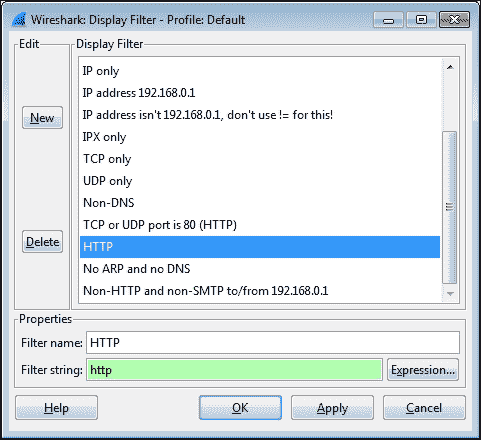

此窗口中列出的显示过滤器保存在默认配置文件的 Wireshark 安装目录中的`dfilters`文件中，当使用自定义配置文件时，保存在适当的**个人配置**目录中。

当您应用显示过滤器时，Wireshark 用户界面屏幕底部的**状态栏**会反映数据包总数和显示的数据包，如下图所示:


## 显示过滤语法

先前显示的**显示过滤器**窗口中的捕获过滤器默认选择提供了基本捕获过滤器语法的示例。下表列出了显示筛选器语法的其他示例:

| 

描述

 | 

句法

 | 

例子

 |
| --- | --- | --- |
| 基本协议 | `arp`、`bootp`、`dns`、`dhcp6`、`eth`、`snmp`、`smb`、`smb2`、`icmp`、`rtp`、`ip`、`ipv6`、`udp`、`tcp`、`http`和`sip` | 与语法示例相同 |
| 显示过滤器比较运算符 | `eq`、`==`、`ne`、`!=`、`gt`、`>`、`lt`、`<`、`ge`、`>=`、`le`、`<=`、`!`、`not`、`and`、`&&`、`or`、`&#124;&#124;`、`XOR`和`^^` | `ip.addr == 192.168.1.115`和`!(ip.addr == 192.168.1.125)` |
| 特定于协议的扩展 | 特定于协议 | `ip.addr`、`tcp.port`、`tcp.dstport`、`tcp.analysis`、`udp.port`和`udp.srcport` |
| IPv4 地址上的**无类域间路由** ( **CIDR** )符号 | `A.B.C.D/CIDR`符号 | `ip.addr == 192.168.1.0/24`匹配`192.168.1.0`子网中的任何 IP 地址 |

### 注意

在诸如`eth.addr`、`ip.addr`、`tcp.port`和`udp.port`等表达式上使用`!=`操作符可能不会像预期的那样工作，因为一个数据包中通常有两个地址和端口，并且`!`操作符不会匹配两个实例。

对这些类型的过滤器使用`!` ( `ip.addr == x.x.x.x`)或类似的语法。

更多信息和显示过滤器示例可以在 http://wiki.wireshark.org/DisplayFilters[的 Wireshark wiki](http://wiki.wireshark.org/DisplayFilters)上找到，协议特定的显示过滤器语法包含在 http://wiki.wireshark.org/ProtocolReference[的参考信息](http://wiki.wireshark.org/ProtocolReference)中。

## 输入显示过滤器

您可以在显示过滤器栏的**过滤器**文本框中直接输入显示过滤器语法，然后点击**应用**应用过滤器或**清除**清除过滤器并重新开始。

在文本框中键入显示过滤器语法的一个有用功能是自动完成功能。在键入协议和句点(.)，文本框将显示可选择的可用协议相关扩展的列表，然后在点击**应用**之前显示适当的比较运算符和值。

文本框还有一个颜色编码的背景，指示显示过滤器语法状态。如果语法不正确或不完整，背景为红色，而正确的过滤器会产生绿色背景。黄色背景是警告，表示输入的语法可能无法按预期工作。

## 从对话或端点窗口显示过滤器

创建一个从**对话**窗口应用的显示过滤器已经被讨论过了。从**统计**菜单中选择**终点列表**和其中一个列出的协议，即可从的**终点**窗口中获得相同的功能。

# 过滤表达式按钮

筛选表达式按钮是您可以基于显示筛选器创建的按钮；这些可用于将先前保存的显示过滤器快速应用于您的捕获数据，以识别网络和应用问题。

例如，创建一个**过滤器表达式按钮**选项，只显示 **TCP SYN** 、 **SYN/ACK** 、 **FIN** 或 **RST** 数据包到分析 TCP 会话设置参数、网络往返延迟时间和会话终止:

1.  在**显示过滤条** :

    ```
    (tcp.flags&02 && tcp.seq==0) ||  (tcp.flags&12 && tcp.seq==0) || (tcp.flags.ack && tcp.seq==1 && !tcp.nxtseq > 0 && !tcp.ack >1)  || tcp.flags.fin == 1 || tcp.flags.reset ==1
    ```

    上的**过滤**文本框中输入以下显示过滤字符串
2.  点击**应用**会将此过滤器应用到您已加载的捕获，以便您可以确认它是否正常工作。
3.  然后，点击**保存**，给按钮起个名字，比如`TCP Handshake`(如下图截图所示)。然后，点击**确定** :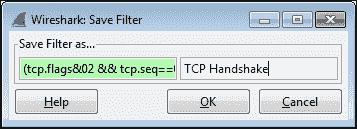

您创建的筛选表达式按钮将出现在显示筛选栏中初始控件的右侧，如下图所示:


过滤器表达式按钮定义存储在您正在使用的配置文件的首选项文件中。您可以在 Wireshark 的首选项窗口中编辑按钮显示顺序、编辑名称或过滤器语法，或者删除按钮。

## 使用表达式窗口按钮

显示过滤器工具栏上文本框的右侧是**表达式**按钮。点击此按钮打开一个**过滤器表达式**窗口，允许您选择一个协议和该协议的扩展，一个合适的关系(比较)运算符，并指定一个比较值。点击**确定**用结果显示过滤器语法填充显示过滤器文本框，然后点击**应用**应用过滤器。

## 右键单击特定数据包字段上的菜单

如果您在**数据包列表**或**数据包详细信息**窗格中的特定字段上单击鼠标右键，您可以选择**应用为过滤器**或**准备过滤器**选项和所需的子菜单选项来创建显示过滤器语法，如下图所示。这是创建显示过滤器语法的一种非常快速的方法:

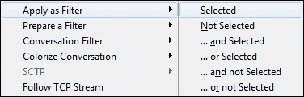

如果您正在选择一个字段并使用右击功能创建显示过滤器语法，通常最好使用**准备过滤器**选项，这将允许您在点击**应用**应用过滤器之前编辑语法。

### 注意

点击**数据包详情**窗格中的协议字段，该字段和反映该字段的显示过滤语法将显示在左下方的**状态**栏字段中。这对于启动将使用特定字段的显示过滤器字符串非常有帮助。

# 跟随 TCP/UDP/SSL 流

在对话中选择一个数据包，单击鼠标右键，并从菜单中选择**跟随 TCP 流**、**跟随 UDP 流**或**跟随 SSL 流**选项(视情况而定)会提供一个显示窗口，其中包含对话中所有数据包的有效载荷数据的文本描述。这是检查流内容的一个很好的方法，不需要选择和检查多个包。查看客户端和服务器之间的交换对于故障排除非常有帮助。

当为给定分组选择了**跟随**流选项时，显示过滤器被自动创建并应用来支持该窗口的创建。下面的截图展示了一个**跟随 TCP 流**窗口。另外，请注意显示过滤器语法( **tcp.stream eq 15** )，它是在选择该流时创建和应用的:

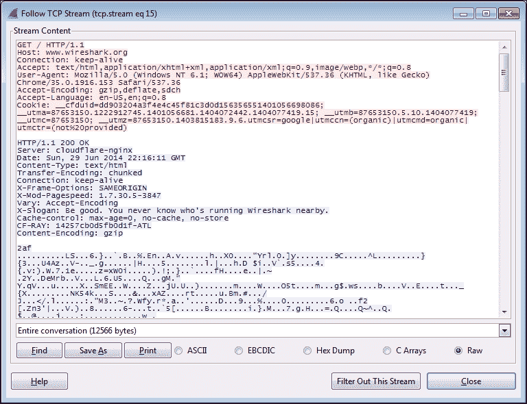

# 标记和忽略数据包

您可以从 Wireshark **编辑**菜单中切换**标记/取消标记数据包**或**忽略/取消忽略数据包**，或者通过在**数据包列表**窗格中右键单击数据包并选择**标记数据包(切换)**或**忽略数据包(切换)**。

在**数据包列表**窗格中右键点击一个数据包所显示的菜单如下截图所示:

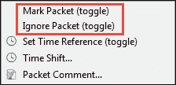

Wireshark 允许您在**数据包列表**窗格中标记一个或多个数据包，通过将数据包条目设置为黑底白字，便于以后查找这些数据包。此标记可以在每个数据包的基础上切换打开和关闭。标记数据包对显示或数据包上下文没有其他影响。

您也可以忽略一个或多个数据包。然而，当您对数据包调用忽略功能时，该数据包条目从**数据包列表**、**数据包细节**和**数据包字节**窗格中消失，并且它实际上(暂时)不再是捕获文件的一部分。请注意，忽略数据包可能会导致 Wireshark 报告重新传输或由丢失的数据包引起的其他错误情况。

被忽略的数据包实际上并没有从捕获文件中删除，因为您可以使用**视图**菜单中的**重新加载**选项或点击图标栏上的**重新加载**图标来恢复被忽略的数据包。

# 保存过滤后的流量

在期间或完成分析后，您可能希望将一组过滤后的数据包保存到一个新的捕获文件中。在 Wireshark 中保存批量捕获数据的过滤子集并打开新的更小的文件，有助于减少在您的分析过程中清除显示过滤器、使用**对话**窗口等时显示的令人分心的背景噪音包。最后，在完成您的分析后，您将需要一个经过过滤的捕获文件来表示分析证据和结论，并且可以在以后快速加载以供审查。

使用**文件**菜单中的**导出指定数据包**选项保存一个新的捕获文件，该文件只包含您过滤的数据包。导航到所需的目录；输入文件名(Wireshark 将提供适当的文件扩展名)；做出适当的选择，保存所有**显示的**数据包、**标记的数据包**，和/或**删除忽略的数据包**；然后点击**保存**。记得使用**文件**菜单中的**另存为**选项保存完整的捕获，因为您可能会再次需要该文件。

以下屏幕截图显示了典型的**导出指定数据包**窗口及其选择:

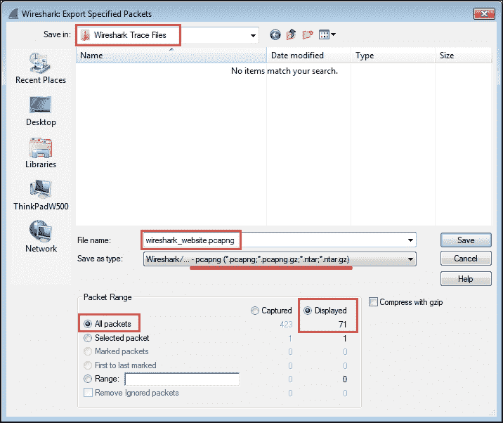

# 总结

本章涵盖的要点包括选择最佳捕获点、在分路器和镜像/SPAN 端口之间进行选择、Wireshark 的捕获过滤器和选项、验证良好的捕获、使用 Wireshark 的**对话**窗口和显示过滤器来隔离感兴趣的数据包、创建过滤器表达式按钮、标记和忽略数据包，以及保存过滤后的流量以供以后或更详细的分析。

在下一章中，我们将介绍 Wireshark 的其他基本数据包分析功能。