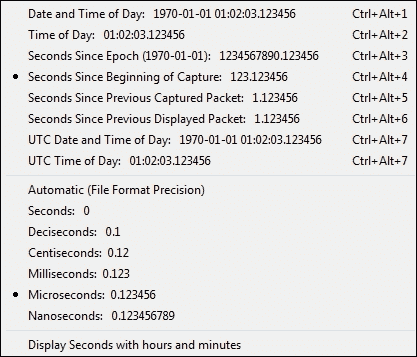
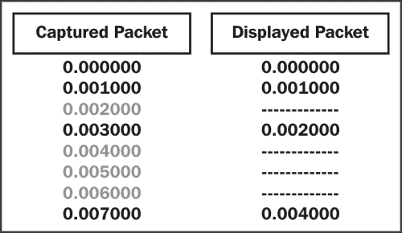
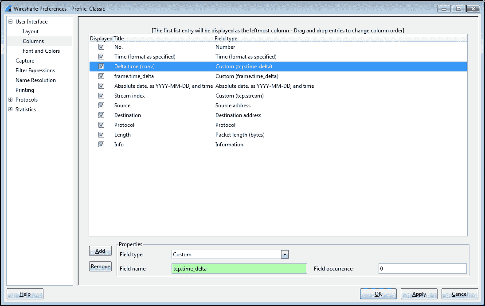
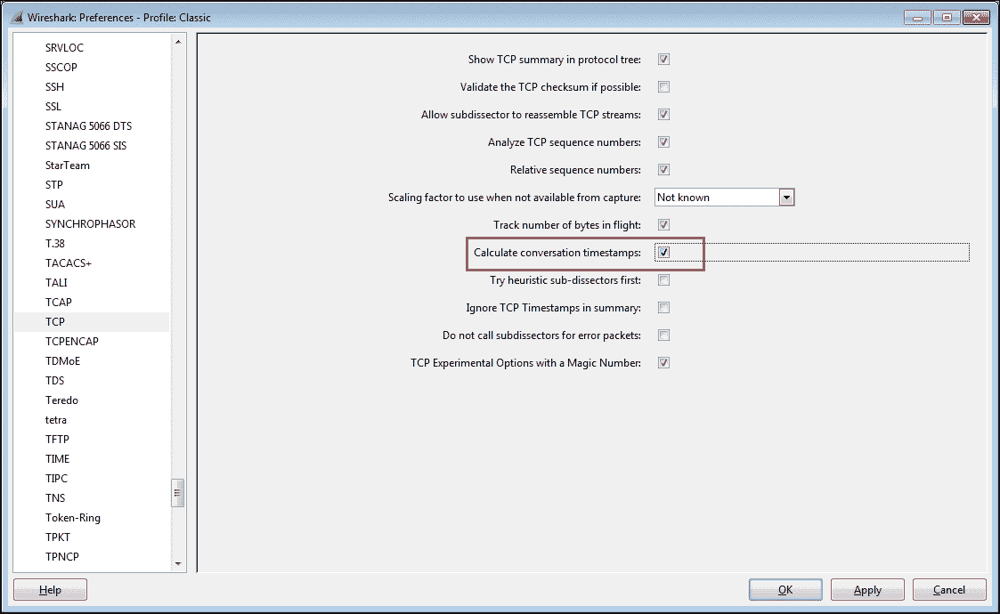
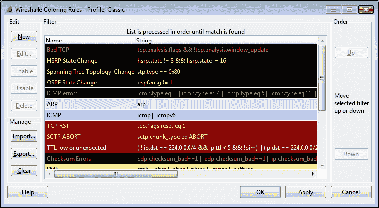
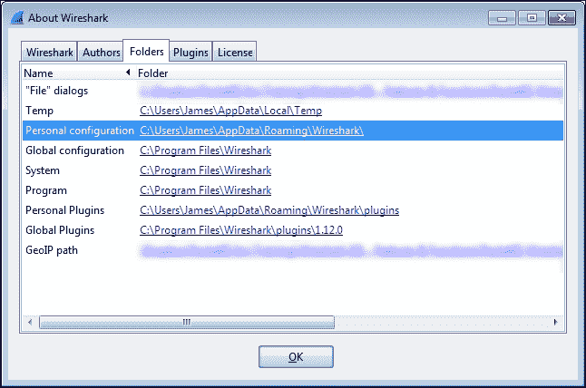
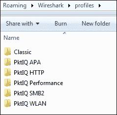
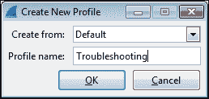
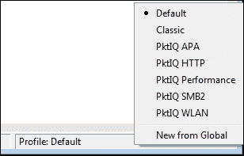

# 四、配置 Wireshark

Wireshark 提供了许多功能，可以对这些功能进行配置，以提高执行数据包分析活动的准确性和简便性，例如排除功能或性能问题。选择最佳格式来测量数据包之间的经过时间是一个重要因素。有许多特定于协议的选项会影响 Wireshark 显示时间相关信息的方式，这些选项也很有用。通过着色规则、首选项设置和配置文件，您可以针对您的特定分析风格以及您可能工作的不同环境定制 Wireshark。

在本章中，我们将讨论以下主题:

*   使用数据包时间戳
*   着色和着色规则
*   Wireshark 首选项
*   Wireshark 档案

这些主题将总结我们对 Wireshark 最基本、最有用的功能和选项的介绍。

# 使用数据包时间戳

理解【Wireshark 如何处理时间并正确使用数据包时间戳显示对于正确分析数据包流和识别与时间相关的异常至关重要。

## 【Wireshark 如何保存时间戳

当数据包被捕获时，Wireshark 会给每个数据包一个时间戳，该时间戳来自捕获发生的机器的系统时钟。基于从时区设置和任何适用于捕获机器的**夏令时** ( **DST** )规则计算的偏移量，该时间戳被转换为**通用协调时间** ( **UTC** )，然后再次转换为纪元编号(自 1970 年 1 月 1 日起基于 UTC 的秒数)。这是保存在每个数据包的捕获文件中的时间值。当 Wireshark 读取捕获文件时，它会将纪元编号变回熟悉的日期和时间显示，并根据您机器的时区和 DST 偏移量进行调整。

这意味着如果在洛杉矶的一台机器上捕获数据包，该机器与 UTC 有-8 小时的偏差，而您在柏林的一台机器上查看相同的捕获文件，该文件是 UTC +1 小时(总共相差 9 小时，加上任何 DST 差异)，在洛杉矶当地时间上午 10 点捕获的数据包将显示柏林时间下午 7 点的时间戳。

下表显示了不同时区的时间戳显示示例:

|   | 

洛杉矶

 | 

伦敦

 | 

柏林

 | 

班加罗尔

 |
| --- | --- | --- | --- | --- |
| 捕获文件时间(UTC) | ten o'clock | ten o'clock | ten o'clock | ten o'clock |
| 相对于 UTC 的本地偏移量 | -8 | Zero | +1 | +5:30 |
| 显示时间(当地时间) | two o'clock | ten o'clock | eleven o'clock | half past five p.m. |

如果您要查看某人发送给您的数据包捕获，并且事件发生的绝对时间对分析很重要，您需要知道或询问捕获发生在哪个时区，确定您所在时区和捕获位置时区之间的时差，并在心里为 Wireshark 将显示的时间戳进行时差调整。否则，这种差异就无关紧要了，因为您通常对经过的时间或捕获中特定事件之间的时间更感兴趣。

## Wireshark 时间显示选项

Wireshark 中有各种各样的数据包时间显示。默认情况下，Wireshark 在**数据包列表**窗格中提供了一个**时间**列，配置为显示从开始捕获开始的**秒，每个数据包的分辨率为微秒(`123.123456`)。**

但是，可以通过从**视图**菜单中的**时间显示格式**选项中选择所需的格式来改变时间在该栏中的显示方式，如下图所示:

如果使用了从捕获开始的 **秒，则捕获中的第一个数据包显示的时间值为**0.000000**；所有其他数据包都参照第一个数据包计时，以便显示从捕获开始经过的时间。**

时间显示菜单选项提供了它们的格式的例子，并且是不言而喻的，除了从先前捕获的包开始的**秒和从先前显示的包**开始的**秒。自上一次捕获数据包后的**秒**选项提供了每个捕获数据包之间的经过时间，而自上一次显示数据包后的**秒**选项显示了应用显示过滤器后可见的上一个数据包的经过时间。**

下面的截图展示了**显示的数据包**选项的工作方式。您可以看到**捕获的数据包**时间戳继续增加，而**显示的数据包**时间戳显示自上次显示数据包以来的时间。

**时间显示格式**菜单中的时间显示精度选项也与显示格式的示例一起显示，并且不言自明，除了**自动(文件格式精度)**设置需要说明。

Wireshark 依靠网卡驱动程序和捕获设备的系统时钟来获取数据包时间戳。这些时间戳在精度和亚秒数字数(毫秒、微秒和纳秒)方面的准确性会有所不同，但通常可以达到毫秒级的分辨率。该精度值保存在捕获文件中。**自动(文件格式精度)**设置告诉 Wireshark 使用该精度值显示时间戳。

使用**纳秒精度**设置的能力依赖于支持这种精度级别的 NIC 驱动程序。如果选择此选项，并且捕获文件不包含更高的分辨率，则每个时间戳的最后三位数字将全为零。

## 添加时间栏

在**数据包列表**窗格中有两个(或更多)时间栏通常有助于提供多种时间显示类型，而不必来回改变单个时间栏的格式。您可以使用两种方法之一添加新的时间列。

下面的是第一种方法，首选项设置方法:

1.  从**编辑**菜单进入**偏好设置**，或者点击**偏好设置**图标打开**偏好设置**窗口。
2.  选择**列**。
3.  点击**添加**在列表底部添加一个新条目。
4.  点击新条目的**标题**区域，并为该列命名。
5.  确保新条目高亮显示，并从下拉**字段类型**框中选择所需的时间显示格式。
6.  点击并在列表中向上拖动新条目，选择其在**数据包列表**窗格中的相对位置。
7.  最后，点击**确定**。

时间显示栏的**字段类型**框中的可选选项包括:

*   **绝对日期，如 YYYY-MM-DD，和时间**:这是基于采集设备时区的实际采集日期和时间。
*   **绝对日期，如 YYYY/DOY，和时间**:这是另一种根据采集设备的时区显示日期和时间的格式。
*   **相对时间**:这是从捕获文件中第一个数据包开始的时间。这类似于从开始捕获选项后的**秒。**
*   **相对时间(会话)**:这是从会话的跟踪文件中的第一个数据包开始的时间(这不起作用)。
*   **Delta time** :这是从前一个数据包到当前数据包经过的时间。
*   **Delta time (conversation)** :这是一个对话中从上一个包到当前包的时间(这个不行)。
*   **显示的时间差**:这是从一个数据包结束到下一个显示的数据包结束的时间。
*   **自定义**:在撰写本文时，首选项设置中列出的**相对时间(对话)**和**增量时间(对话)**选项在当前可用的 Wireshark 版本(1.12)中不再有效。您可以通过使用带有显示过滤器样式的**字段**类型的**自定义**选项来实现先前提供的功能。选择**自定义字段**类型，在**字段名**字段中输入`tcp.time_relative`或`tcp.time_delta`，保留**字段出现**字段的默认条目为 **0** 。

使用**自定义**选项和 **tcp.time_delta** 显示过滤器创建功能性 **Delta time (conv)** 时间列的示例如下图所示:

为了使 **tcp.time_relative** 和 **tcp.time_delta** 字段正常工作，您还必须使用以下步骤在首选项设置中启用**计算对话时间戳**:

1.  在**首选项**窗口中，从**协议**菜单中选择 **TCP** 。
2.  启用**计算对话时间戳**选项。
3.  最后，点击**确定**。

下面的屏幕截图显示了启用**计算对话时间戳**的示例:

下面的步骤向您展示了第二种方法，即添加列的右键单击方法:

1.  在**数据包列表**窗格中选择合适的数据包。
2.  在**数据包细节**窗格中，展开**帧**报头，或者如果适用，展开**传输控制协议**报头。
3.  在**帧**或 **TCP** 部分找到所需的时间值字段(这些被括号包围)。如果您在 TCP 部分选择一个时间值，您需要展开**【时间戳】**部分来查看这些值。
4.  右键单击所需的时间字段，并从菜单中选择**应用为列**。
5.  新列将出现在**数据包列表**窗格中的**信息**列旁边。单击并拖动新列到所需位置。
6.  您可以右键单击新的列标题，选择 **Edit Column Details** ，并根据需要为该列取一个较短的名称。

正如前面在首选项设置方法中讨论的，您必须在首选项设置的 **TCP** 协议选项中启用**计算会话时间戳**，以查看和使用 **TCP** 部分中的时间值。

### 对话与显示的数据包时间选项

对话显示的时间与显示的分组时间选项之间的差异可能是微妙但重要的。

如前所述，如果您正在使用显示的数据包时间选项之一，则给定数据包显示的时间值将是自前一个数据包显示在**数据包列表**窗格中以来经过的时间。在应用显示过滤器之前，这个时间值选项没有任何有用的价值，在应用过滤器之后，您可以很容易地看到显示每个数据包之间经过的时间，而不需要其他心算或调整。如果您使用 **tcp.stream==xx** 显示过滤器设置来依次过滤、清除和查看多个对话，这将非常有用。

但是，如果您没有使用显示过滤器，可能会有来自多个对话的数据包显示在**数据包列表**窗格中。如果您正在使用某个对话时间显示，则为给定数据包显示的时间值将是自该对话的上一个数据包以来经过的时间，而不考虑您正在查看的数据包和该对话中的上一个数据包之间可能散布和可见的其他数据包。这允许快速浏览对话包时间，而不必应用显示过滤器。

## 选择最佳 Wireshark 时间显示选项

有这么多时间显示选项可用，可能很难知道何时何地使用给定的选项。在 Wireshark 时间列中选择最佳时间显示在很大程度上取决于分析的目标:

*   如果您需要知道某个事件在捕获中发生的具体日期和时间，就像您试图查找数据包并将其与用户报告的事件或日志条目相关联时可能出现的情况一样，您应该使用其中一种**绝对时间**格式。
*   如果您正在查找在捕获开始后某个已知时间段发生的事件，请使用**相对时间**格式之一。
*   另一方面，如果您只需要测量某些数据包之间的时间，比如测量请求和响应之间的时间，那么一种**增量时间**格式将是最有用的。

## 使用时间参考选项

Wireshark 的另一个有用的特性是**时间参考**菜单选项，它可以用来测量捕获文件中从一个数据包到另一个数据包的时间。您可以点击一个特定的数据包，使用**编辑**菜单中的**设置/取消设置时间参考**选项，或右击并从弹出菜单中选择**设置时间参考(切换)**选项，为该数据包打开和关闭该选项。数据包将在第一个时间栏中标记一个 ***REF*** 标志符，任何跟在**时间参考**数据包后面的相对时间戳将相对于该数据包显示。

**时间基准**设置是临时的；它不会保存到采集文件中，如果您重新载入该文件，它将会消失。

# 着色和着色规则

在**数据包列表**窗格中显示的数据包的彩色化可以有效地识别和突出显示感兴趣的数据包，尤其是包含或指示某种错误情况的数据包。

Wireshark 具有默认启用的预定义着色规则，这些规则可以在**数据包列表**窗格中产生彩色数据包的万花筒。您可以通过从**视图**菜单中选择**着色数据包列表**或点击图标栏中的**着色数据包列表**图标来启用或禁用着色规则。

您还可以通过从**视图**菜单中选择**着色规则**或点击图标栏中的**编辑着色规则**图标来查看、启用/禁用、添加、删除、重新排序和编辑着色规则。有一个**清除**按钮，可以删除您对规则所做的所有更改，并在需要时将其恢复为默认设置。

下面的屏幕截图显示了一个**着色规则**窗口:

着色规则采用具有特定值的显示过滤器格式来识别应该着色的数据包。这些规则与数据包进行比较，从顶部的规则开始，向下遍历列表。只有第一个符合数据包条件的规则会被套用，所以如果有一个以上的规则符合数据包，规则的顺序会决定要套用哪个规则。如果您创建或修改一个规则，您必须检查顺序，以确保您得到了想要的行为。

点击一个规则，然后点击 **Edit** 允许您修改该规则的前景色和背景色，如果需要，还可以更改过滤器字符串。

如果您想与他人共享，也可以导出/导入颜色规则。根据使用的配置文件，着色规则存储在您的个人配置目录中的一个名为`colorfilters`的文件中。

## 包着色

您还可以通过选择一个对话包，从**查看**菜单中选择**为对话**着色，并从相邻菜单中选择一种颜色，或者右键单击一个包，从菜单中选择**为对话**着色，选择一个特定于协议的选项，然后选择所需的颜色，来对对话中的一系列包进行临时着色。当捕获文件重新加载时，这种着色将消失，或者您可以从**视图**菜单中选择**重置着色 1-10** 。

# Wireshark 首选项

在*添加时间栏*部分，我们使用**编辑**菜单中的**首选项**或者通过点击图标栏中的**首选项**图标来配置时间显示栏选项，打开了**首选项**窗口。您应该了解许多**首选项**选项，并且可能希望调整这些选项来定制您的 Wireshark 环境:

*   **布局**:此用于选择**包列表**、**包细节**和**包字节**窗格的排序。
*   **列**:该用于在**包列表**窗格中添加、删除、移动列。
*   **捕获**:该用于设置默认捕获选项。
*   **过滤表达式**:该用于添加、删除或移动**过滤表达式**按钮。
*   **名称解析**:此用于设置 MAC、传输和网络(IP)解析选项。
*   **协议**:Wireshark 支持的所有协议都有可以设置的选项；其中一些最重要和最有用的选项包括:

    *   **HTTP** :这个用于添加任何额外的 TCP 端口，这些端口应该在您的环境中被识别为 HTTP 流量。
    *   **IEEE 802.11** :此用于添加/编辑**无线解密**密钥，如果需要对加密的无线会话进行解码。
    *   **IPv4** :您可能想要禁用**验证 IPv4 校验和(如果可能的话)**以避免由一个名为校验和卸载的 **NIC** 选项导致的意外错误消息，其中校验和在数据包发送到 Wireshark 后进行检查。
    *   **RTP** :启用**允许子分配器重组 RTP 流**以支持解码来自 VoIP 捕获的音频。
    *   **SMB** :启用**重组 SMB 事务负载**以支持在数据包捕获中从 SMB 流导出文件对象。
    *   **SSL** :如果您有私钥文件，Wireshark 可以解密 SSL/TLS 流量。要向 Wireshark 添加密钥，请转到**首选项**窗口，并单击 **RSA 密钥列表编辑**按钮。然后，在 **SSL 解密**窗口中，点击**新建**，完成 **SSL 解密:新建**字段(**SSL 服务器的 IP 地址**；**端口**，HTTP 通常为 443；**协议**，如 HTTP 以及**密钥文件**，用于选择 RSA 私钥的路径(如果密钥文件是 PKCS#12 密钥库(通常有`.pfx`或`.p12`扩展名)，则必须填写**密码**字段)，最后，点击 **OK** 关闭每个后续窗口。
    *   **TCP** :此为您提供多个选项，如下:

        *   **如果可能的话验证 TCP 校验和**:禁用此选项，以避免校验和卸载导致意外错误消息。
        *   **允许子分配器重组 TCP 流**:启用以支持从 TCP 流导出文件对象。
        *   **相对序列号**:启用以便于读取和跟踪捕获文件中的 TCP 序列号。
        *   **传输中的轨道字节数**:这是在**数据包详细信息**窗格的 TCP 协议报头中计算并显示的值，对性能分析很有用。
        *   **计算会话时间戳**:这个是之前讨论过的设置，需要支持 **tcp.time_relative** 和 **tcp.time_delta** 时间显示。

    

还有许多其他偏好设置可能与您的个人偏好或分析环境有关；你必须调查这些选项中的大部分或全部。如果您不确定某个特定的设置，您可以通过点击**首选项**窗口底部的**帮助**按钮获得更多信息。

首选项设置存储在一个名为`preferences`的文件中，该文件位于您的**个人配置**目录中，具体取决于所使用的配置文件。

# Wireshark 档案

由于我们已经在中介绍了保存在特定文件中的众多 Wireshark 配置选项，例如**捕获过滤器**的`cfilters`、**显示过滤器**的`dfilters`、**着色规则**的`colorfilters`以及首选项设置的`preferences`，我们提到这些文件保存在您的**个人配置**目录之一中，但是我直到现在都没有对配置文件和这些配置目录进行完整的解释，以便您更好地理解配置文件的组成

配置文件是 Wireshark 配置文件的集合，这些文件是根据您的特定需求和喜好定制的，包括捕获和显示过滤器、颜色规则、列和布局等，适用于您所工作的特定环境。您可以创建一个或多个配置文件，并通过选择适当的配置文件来快速重新配置 Wireshark，使其在不同的环境中发挥最佳作用。

当您第一次安装 Wireshark 时，它使用位于**全局配置**目录中的一组默认配置文件运行，该目录通常与 Wireshark 程序文件所在的**系统**目录相同。当您更改任何默认设置时，更改会保存在新的配置文件中，这些文件存储在**个人配置**目录中，该目录的位置因您的安装而异。通过点击**帮助**菜单中的**关于 Wireshark** 选项，并点击**文件夹**选项卡，您可以从 Wireshark 确定并快速打开**个人配置**目录。该选项卡中列出了 Wireshark 使用的所有目录，如以下屏幕截图所示:

您可以双击 Wireshark 目录链接，打开该目录的窗口。

双击**文件夹**选项卡中的**个人配置**链接，打开存储您的自定义配置文件的目录(在`profiles`子目录下)。每个配置文件都存储在一个单独的子目录中，该子目录反映了您为配置文件指定的名称，如下面的屏幕截图所示:

每个自定义`profile`目录包含所有 Wireshark 配置文件，这些文件决定了配置文件如何控制 Wireshark 的功能。您可以复制这些自定义配置文件目录，并与其他 Wireshark 用户共享；将`profile`目录复制到他们的**个人配置**目录中，使得该配置文件可供选择。

## 创建 Wireshark 档案

要创建新的 Wireshark 配置文件，请执行以下步骤:

1.  右键单击 Wireshark 用户界面底部**状态栏**的**配置文件**部分(在右侧窗格上),然后单击**新建**,或者导航到菜单栏中的**编辑** | **配置文件** | **新建**。
2.  在出现的**创建新配置文件**窗口中，您可以为配置文件命名。您也可以从**创建自**下拉列表中进行选择，从现有配置文件的设置开始创建配置文件，或者从头开始。**新建档案**窗口如下截图所示:
3.  点击**确定**将在**个人配置**菜单中以您的`Profiles`目录中的相同名称将新的个人资料保存在其自己的目录中。

## 选择 Wireshark 配置文件

您可以从**编辑**菜单中选择**配置配置文件**，点击其中一个列出的配置文件，然后点击**确定**，从而选择一个自定义配置文件。更快捷的方法是点击**状态栏**的**配置文件**部分，并从弹出菜单中选择一个配置文件，如以下截图所示:

# 总结

本章涵盖的主题包括使用 Wireshark 的时间显示、着色和着色规则、为给定的分析环境选择合适的 Wireshark 首选项，以及将所有这些设置保存在可根据需要选择的配置文件中。

在下一章中，我们将介绍现代网络中常用的网络层、传输层和应用层协议，这将有助于您为后面章节中更高级的数据包分析活动做准备。