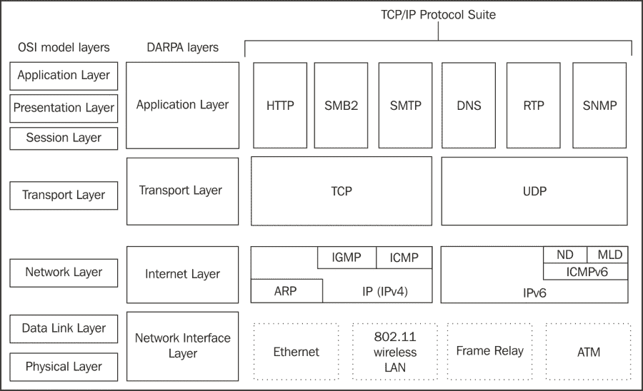
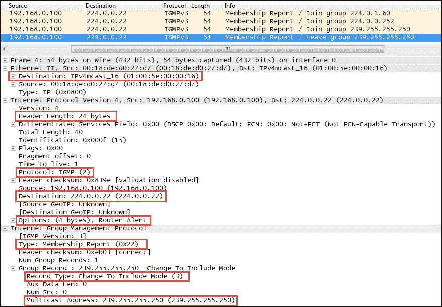
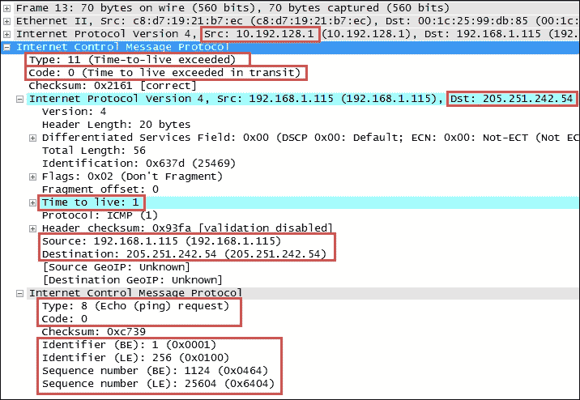
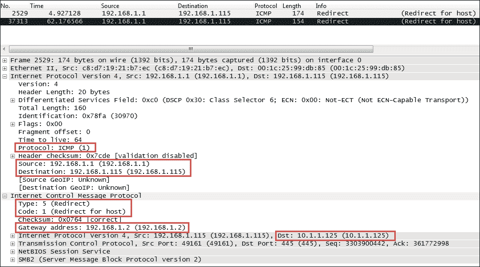
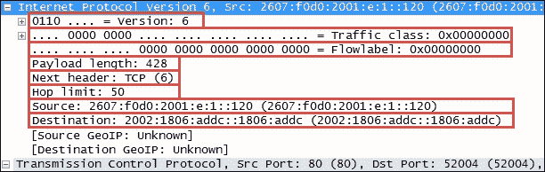
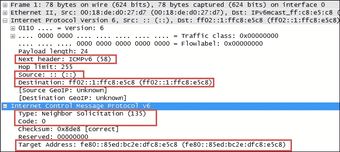
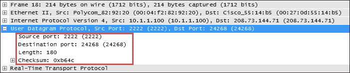
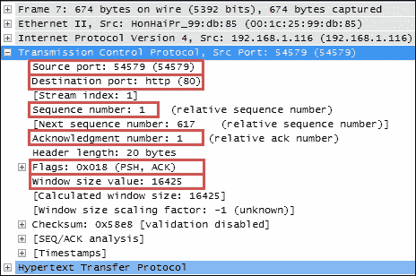
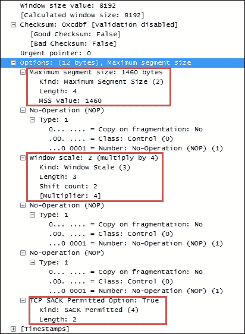
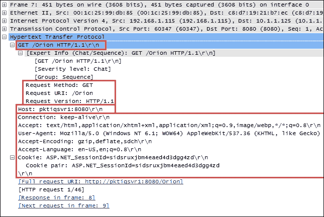

# 五、网络协议

有效的数据包分析需要熟悉现代网络中使用的主要协议。在本章中，我们将回顾各层中最常见的协议:

*   网络层协议
*   传输层协议
*   应用层协议

我们将介绍支持每种协议的网络连接和/或应用功能的重要目的和相关领域，以及每种协议的 Wireshark 捕获和显示过滤器示例。

# OSI 和 DARPA 参考模型

我们在[第 2 章](ch02.html "Chapter 2. Networking for Packet Analysts")、*数据包分析人员网络*中回顾了 OSI 和 DARPA 参考模型的用途。下图中重复了这些协议层的可视化描述，作为对一些主要协议的参考和总结，以及它们在各自层中的位置:

## 网络层协议

网络层协议，在 DARPA 参考模型中也称为互联网层协议，提供基本的网络连接和互联网通信服务。在这一层中，您将主要发现 IP 协议与 ARP、IGMP 和 ICMP 一起用于通过网络传输数据包。

我们在[第 2 章](ch02.html "Chapter 2. Networking for Packet Analysts")、*数据包分析人员的网络*中已经介绍了 IP 和 ARP 协议数据包报头结构和字段，因此这些信息不再重复。但是，此处提供了基本的 Wireshark 捕获和显示过滤器，以下部分还提供了其余协议:

### Wireshark IPv4 过滤器

**捕获** **滤镜** : `ip`

**显示过滤器** : `ip ip.addr==192.168.1.1 ip.src== ip.dst== ip.id > 2000`

### Wireshark ARP 过滤器

**捕获** **滤镜** : `arp`

**显示过滤器** : `arp arp.opcode==1 arp.src.hw_mac==00:1c:25:99:db:85`

## 互联网群组管理协议

主机使用 **互联网群组管理协议** ( **IGMP** ) 向相邻路由器通知已建立的多播(一对任意)群组成员关系。换句话说，IGMP 使提供内容(视频馈送)的计算机能够使用一组多播地址范围(在`224.0.0.0`到`239.255.255.255`D 类多播范围内)向分布式用户组提供这样的内容。此多播功能依赖于能够支持此服务并被配置为支持此服务的路由器；客户端必须加入多播组。当主机想要开始多播时，它向指定该特定组的多播 ip 地址的`224.0.0.2`(所有多播路由器)地址发送 **IGMP 成员报告** 消息。希望加入或离开该组的客户端(以便他们可以接收多播内容)向路由器发送 IGMP 加入或离开消息。下表显示了各种地址范围:

| 

起始地址范围

 | 

结束地址范围

 | 

描述

 |
| --- | --- | --- |
| `224.0.0.0` | `224.0.0.255` | 这些是为特殊的众所周知的多播地址保留的 |
| `224.0.1.0` | `238.255.255.255` | 这些是全球范围(互联网范围)的多播地址 |
| `239.0.0.0` | `239.255.255.255` | 这些是本地范围和管理的多播地址 |

以下截图显示了 IGMP 协议报头中的重要字段:

IGMP 协议报头中前面的重要字段包括:

*   **类型**:这是一种 IGMP 报文。22 型是 IGMPv3 **成员报告**。
*   **记录类型**:有不同类型的**组记录**。**记录类型 3** 的值是**改变为包括模式**，这指示来自源设备的内容将由多播路由器转发到组内主机。
*   **组播地址**:这是特定组的组播 IP 地址。

您还应该注意先前协议层中的以下有趣字段:

*   以太网帧目的地 MAC 地址是多播 MAC 地址范围(`01:00:5e:00:00:00 – 01:00:5e:7f:ff:ff`)中的一个
*   IP 报头中的**协议**字段指定了 IGMP **2**
*   IP 层目的 IP 地址为`224.0.0.22`，是预留的 IGMPv3 组播 IP 地址

IGMP 协议有多个版本，相当复杂。有关更多信息，请参考本章开头提供的协议参考。

### Wireshark IGMP 过滤器

**捕获** **滤镜** : `igmp`

**显示过滤器** : `igmp igmp.type==0x22 igmp.record_type==4 igmp.maddr==244.0.1.60`

## 互联网控制消息协议

**互联网控制消息协议** ( **ICMP** )是，被路由器等网络设备用来发送错误消息，指示所请求的服务不可用，或者无法到达主机或网络路由器。ICMP 是一种控制协议。这意味着，尽管它是以 IP 数据报的形式传输的，但它并不携带应用数据，而是携带有关网络本身状态的信息。

### ICMP ping

ICMP 最广为人知的用途之一是 ping，其中一个设备发送一个 ICMP 回应请求(**类型 8** ，**代码 0** )数据包到一个远程主机(通过该主机的 IP 地址)，该主机将(如果 ICMP 服务没有被中间防火墙禁用或阻止)响应一个 ICMP 回应回复(**类型 0** ，**代码 0** )数据包。Pings 用于确定目标主机是否可用，是否可以通过网络到达。通过测量 ping 请求和回复之间的时间间隔，我们知道了网络路径上的**往返时间** ( **RTT** ) 延迟时间。

### ICMP 跟踪路由

ping 功能的变体用于执行跟踪路由(也称为 traceroute)，它是数据包从发送设备到目标主机或设备所经过的路由器接口的 IP 地址列表。跟踪路由用于确定或确认从发送设备到目标主机或设备的网络路径。

跟踪路由是通过向远程主机发送 ICMP 回应请求数据包来完成的，就像普通的 ping 一样，但是要修改每个数据包的 IP 报头中的 **生存时间** ( **TTL** )字段。traceroute 功能利用了这样一个事实，即网络路径中的每个路由器都会将数据包的 TTL 值递减 1，因此当数据包经过时，路径中的路由器和 TTL 值也会随之递减。如果路由器收到 TTL 值为 1 的数据包，它将向发送方发回一条 ICMP TTL 传输中超时( **Type 11** ， **Code 0** )错误消息(以及它收到的请求数据包的副本)，否则将丢弃(不转发)该数据包。

traceroute 的工作方式是将多个 ICMP 请求数据包中的 TTL 依次设置为 1、2、3 等，这导致网络路径中的每台路由器都向发送方发回 TTL 超出错误消息。由于这些返回的消息是由路径内路由器使用收到 ICMP 数据包的接口的 IP 地址发送的，因此 traceroute 实用工具可以构建并显示路径中路由器接口 IP 地址的渐进式列表，以及到每台路由器的 RTT 延迟。

### ICMP 控制消息类型

下表提供了最常见的 ICMP 控制消息类型的样本，包括它们的类型和代码(子类型)号:

| 

类型

 | 

密码

 | 

描述

 |
| --- | --- | --- |
| Zero | Zero | 这表示回应回复(ping) |
| three | Zero | 这表示目标网络不可达 |
| three | one | 这表示目标主机不可达 |
| three | four | 这表示需要碎片和不碎片位设置 |
| three | six | 这表示目标网络未知 |
| three | seven | 这表示目标主机未知 |
| five | Zero | 这表示网络的重定向数据报 |
| five | one | 这表示主机的重定向数据报 |
| eight | Zero | 这表示回应请求(ping) |
| Eleven | Zero | 这表示 TTL 在传输过程中过期(见于 traceroutes) |

下图所示的 ICMP 数据包的 Wireshark 数据包详细信息字段显示了一条超过**生存时间**的消息，如典型的 traceroute 捕获所示:

以下几点对于分析该数据包非常重要:

*   IPv4 报头摘要中看到的源 IP 地址是 **10.192.128.1** ，这是向发起方发送 ICMP 报文的路由器接口的 IP 地址 **192.168.1.115**
*   ICMP 数据包是**类型 11** ，**代码 0** (传输中超过 TTL)

跟在第一个 IPv4 和 ICMP 报头之后的第二组 IP v4 和 ICMP 报头是由发送者发送的原始分组的副本。该副本被返回以允许确定导致 ICMP 消息的数据包。此 ICMP 消息副本的数据包详细信息中的要点包括:

*   目标目的地 IP 地址是`205.251.242.51`，echo 请求包将被发送到该地址(如果 TTL 值没有被更改的话，应该是该地址)。
*   当这个数据包到达`10.192.128.1`路由器接口时，TTL 值为 **1** 。此数据包无法转发，导致超过 TTL 的消息被发送回发送方。
*   最初的 ICMP 数据包是一个**类型 8** 、**代码 0** 的回应请求消息。
*   回应请求和回复的 ICMP 数据包的**报头数据**部分将包括一个 16 位标识符和 16 位序列号，用于将回应回复与其请求相匹配。

### ICMP 重定向

ICMP 的另一个常见用途是重定向客户端使用不同的默认网关(路由器)到达主机或网络，而不是它最初试图使用的网关。在以下截图中描述的 ICMP **重定向**数据包中，应注意多个数据包字段:

*   ICMP 重定向包的源 IP 地址是`192.168.1.1`，是客户端默认的网关；这是路由器将重定向数据包发送回客户端
*   ICMP **类型**为 **5** ( **重定向**)，代码**为 **1** ( **重定向为主机**)**
*   路由器`192.168.1.1`告诉客户端用来到达所需目标主机的网关 IP 地址是`192.168.1.2`
*   目标主机的 IP 地址是`10.1.1.125`

以下截图显示了 ICMP **重定向**数据包:

#### Wireshark ICMP 过滤器

**捕获** **滤镜** : `icmp`

**显示过滤器** : `icmp icmp.type==8 || icmp.type==0 (pings) icmp.type==5`

`&& icmp.code==1 (host redirects)`

## 互联网协议第 6 版

**互联网协议版本 6** ( **IPv6** )是互联网协议的最新版本，尽管它还处于被采用的最早期阶段，但它旨在最终取代 IP v4——主要是为了缓解可以分配给网络设备的 IP 地址的短缺。具有 32 位地址空间的 IPv4 提供了大约 43 亿个地址，几乎所有这些地址都被分配给了全球的公司和私人企业。

IPv6 利用 128 位地址空间，允许 2 ^(128) 或大约 3.4×10^(38)个地址；这个数字是 340，282，366，920，463，463，374，607，431，768，211，456 个唯一地址。

### IPv6 寻址

IPv6 地址的 128 位用来表示，分为八组，每组 16 位，写成由冒号(:)分隔的四个十六进制数字。IPv6 地址的一个例子是`2001:0db8:0000:0000:0000:ff00:0042:8329`。

为方便起见，只要有可能，IPv6 地址可以通过应用以下规则缩写成更短的符号:

*   移除任何十六进制数字组中的一个或多个前导零；这通常是针对所有前导零或不针对前导零进行的。例如，十六进制组 0042 可以转换为 42。
*   零的连续部分用双冒号(::)替换。双冒号在一个地址中只能使用一次，因为多次使用会导致地址不确定。不得使用双冒号来表示省略零的单个部分。

将这些规则应用于 IPv6 地址的示例如下:

*   **初始地址** : `2001:0db8:0000:0000:0000:ff00:0042:8329`
*   **删除所有前导零后** : `2001:db8:0:0:0:ff00:42:8329`
*   **省略连续的零段后** : `2001:db8::ff00:42:8329`

IPv6 地址的 128 位在逻辑上分为网络前缀和主机标识符。**类域间路由** ( **CIDR** )符号用于表示 IPv6 网络前缀，例如`2001:DB8:0:CD30::/64`表示网络`2001:DB8:0000:CD30::`。

### IPv6 地址类型

有三种基本类型的 IPv6 地址:

*   **单播**:这些来自一对一设备的数据包使用一个单一接口地址。单播地址可以是以下三种类型之一:

    *   **全局单播**:此可路由到互联网或通过互联网路由。全球单播地址一般以`2xxx`开头(如`2000::/3`)。
    *   **Link-local** :这是自动分配给一个接口，用在本地网络链路上；这不可路由到互联网，很像 MAC 地址。本地链路单播地址以`FE80` ( `FE80::/10`)开头。当使用算法初始化接口时，它们会自动分配给接口，该算法使用 IPv6 地址中 NIC 的 48 位 MAC 地址的重新排列版本，并用于在本地链路上通信。这些地址不可路由。IPv6 将链路本地地址用于邻居发现功能。
    *   **唯一本地**:此不可路由至互联网，但在企业内部可路由(类似 IPv4 私有地址)。唯一本地单播地址以`FC00` ( `FC00::/7`)开头。此地址块保留供专用 IPv6 网络使用。

*   **组播**:这些是来自一对多设备的数据包。组播地址以`FFxx`开始。多播地址的一个例子是`FF01:0:0:0:0:0:0:101`，可以简称为`FF01::101`。IPv6 中没有广播地址；多播被用作替换。一些知名的组播地址如下表所示:

    | 

    地址

     | 

    描述

     | 

    范围

     |
    | --- | --- | --- |
    | `ff01:0:0:0:0:0:0:1` | 所有节点地址 T46 | 本地接口（仅跨越一个节点上的单个接口,仅用于多播数据包的环回传输) |
    | `ff02:0:0:0:0:0:0:1` | 所有节点地址 | 本地链路（本地网段上的所有节点) |
    | `ff01:0:0:0:0:0:0:2` | 所有路由器地址 | 界面-本地 |
    | `ff02:0:0:0:0:0:0:2` | 所有路由器地址 | 本地链接 |
    | `ff05:0:0:0:0:0:0:2` | 所有路由器地址 | 本地站点（跨单个站点) |
    | `ff02:0:0:0:0:0:1:2` | DHCP V6 服务器/代理 | 本地链接 |
    | `ff05:0:0:0:0:0:1:3` | DHCP V6 服务器/代理 | 现场-本地 |

*   **任播**:这些数据包来自一组接口中最近的一个。对于任播地址没有特殊的地址方案；它们类似于单播地址。当单播地址分配给多个接口时，会自动创建一个任播地址。任播地址可用于建立一组设备，以便任何一个组设备都可以响应发送到单个 IPv6 地址的请求。

关于 IPv6 寻址的进一步讨论将会涵盖许多额外的特性，这超出了本书的范围。鼓励读者进一步在线研究 IPv6 寻址和/或通过阅读征求意见稿(RFC) 4291 (IP 版本 6 寻址架构)。

### IPv6 报头字段

IPv6 协议报头的一个示例是下面截图中的:

IPv6 报头字段类似于许多 IPv4 报头，这些字段包括:

*   **版本**:这个是 IP 版本号，6 代表 IPv6。
*   **流量类别**:这个类似于 IPv4 **DiffServ** 字段；它用于识别 IPv6 数据包的不同类别或优先级。
*   **流标签**:这些用于标识被标记为集合的数据包序列。IPv6 流由 20 位**流标签**字段以及源和目的地 IPv6 地址字段定义。
*   **有效载荷长度**:这个是 IPv6 有效载荷的长度，不包括任何数据包填充。
*   **下一个报头**:这个字段指示分组中的下一个内容。这相当于 IPv4 **协议**字段。在前面的例子中，下一层是一个普通的 **TCP (6)** 报头。
*   **跳数限制**:这个字段大致相当于 IPv4 中的**生存时间**字段；每转发一次 IPv6 数据包，该值就会递减 1。当该值达到 1 时，数据包将无法转发。
*   **源地址和目的地址**:这些是 128 位 IPv6 源地址和目的地址。

IPv6 支持扩展报头，该报头提供附加信息字段，并且还扩展了 IPv6 报头的长度。有特定的**下一个报头**代码来指示这个附加功能的存在。

### IPv6 过渡方法

作为向 IPv6 过渡的一部分，当前的 TCP/IP 设备支持双栈(同时支持 IPv4 和 IPv6)以及在 IPv4 数据包中封装和隧道传输 IPv6 数据包的能力，以便它们可以通过 IPv4 网络进行路由。三种最流行的封装方法是:

*   **6to4 隧道**:在这种隧道方法中， IPv6 报头跟在 IPv4 报头之后；IPv4 报头的**协议**字段将包含`41` (IPv6)，IPv6 报头中的源 IPv6 地址将以`2002`开头。
*   **特雷多**:在这种隧道方法中，IPv6 报头被封装在 UDP 数据包中。开发这种方法是为了适应不处理协议 41 的 NAT 设备。Teredo 隧道可以通过目的端口`3544`在 UDP 数据包报头中识别。
*   **ISATAP** :这种隧道方法使用本地分配的 IPv4 地址来创建 64 位接口标识符。比如在 ISATAP 中，IPv4 地址`24.6.173.220`变成了`::0:5EFE:1806:addc`。ISATAP 像在 6to4 隧道中一样将 IPv6 头封装在 IPv4 中。

#### Wireshark IPv6 过滤器

**捕获** **滤镜** : `ip6 host fe80::1 ip proto 41 (capture IPv6-over-IPv4 tunneled traffic)`

**显示过滤器** : `ipv6 ipv6.addr == fe80::f61f:c2ff:fe58:7dcb ipv6.addr == ff02::1`

## 互联网控制消息协议第 6 版

**互联网控制消息协议版本 6** ( **ICMPv6** ) 是 IPv6 不可分割的一部分，而基础协议必须被每个 IPv6 节点完全实现。ICMPv6 为 IPv6 环境提供由 IPv4 环境中的其他不同协议提供的服务，例如替代 ARP 的邻居请求。

下表包含一些常见的 ICMPv6 数据包类型:

| 

ICMPv6 数据包类型

 | 

ICMPv6 类型

 | 

目的

 |
| --- | --- | --- |
| 回应请求 | One hundred and twenty-eight | Ping 请求 |
| 回声响应 | One hundred and twenty-nine | Ping 响应 |
| 多播侦听器查询 | One hundred and thirty | 由多播路由器发送,以轮询组成员的网段 |
| 多播侦听器报告 | One hundred and thirty-one | 当主机加入多播组时发送,或者响应路由器发送的多播监听器查询 |
| 多播监听器完成 | One hundred and thirty-two | 当主机离开多播组，并且可能是网段上该组的最后一个成员时，由主机发送 |
| 路由器请求 | One hundred and thirty-three | 发现本地路由器 |
| 路由器广告 | One hundred and thirty-four | 对路由器请求消息做出响应，并在初始化后定期发送该数据包 |
| 邻居恳求 | One hundred and thirty-five | 首先使用进行重复地址检测(使用源地址`::`)，然后获取本地路由器的 MAC 地址；这个函数代替了 ARP |
| 邻居广告 | One hundred and thirty-six | 对邻居请求消息的响应 |
| 重定向消息 | One hundred and thirty-seven | 将设备重定向到正确的路由器，将数据包发送到特定的网络或主机 |

以下屏幕截图显示了一个邻居请求 ICMPv6 数据包的示例:

该数据包中的重要字段包括:

*   **下一个报头**:该域包含 **58** ，表示下一个协议报头是 ICMPv6。
*   **IPv6 源地址**:出现不明地址( **::** )表示这是一个**重复地址检测**包。
*   **IPv6 目的地址**:这基本上是一个组播地址。
*   **ICMPv6 类型**:这个是使用类型 **135** 的邻居请求消息。
*   **ICMPv6 代码**:这是邻居请求消息的子类型；这将是 **0** 。
*   **ICMPv6 目标地址**:这是主机想要使用的地址。如果网络上的另一个节点已经在使用这个地址，它们将做出相应的响应。

### 多播监听器发现

**多播监听器发现** ( **MLD** )是 IPv6 路由器用来发现直连链路上的多播监听器的 IPv6 套件的另一个组件。MLD 是 ICMPv6 协议的一部分，它取代了 IPv4 网络上的 IGMP。

#### Wireshark ICMPv6 过滤器

**捕获** **滤镜** : `icmp6`

**显示过滤器** : `icmpv6 icmpv6.type==1135 && icmpv6.code==0 (Neighbor Solicitation)`

# 传输层协议

传输层协议包括用于传输应用协议的 TCP 和 UDP。

## 用户数据报协议

**用户数据报协议** ( **UDP** )被认为是不可靠的传输。在这种情况下，不能保证数据包的传送或排序，但它的开销较低，并且被时间敏感的应用使用，如语音和视频流量。

下面的屏幕截图显示了 UDP 报头中包含的字段:

UDP 报头只有 8 个字节长，包括:

*   **源端口号和目的端口号**:这个每个 2 字节。
*   **长度**:这个是 UDP 头加上有效载荷的长度。这是一个 2 字节的字段。
*   **校验和**:该是一个 2 字节字段，用于检查 UDP 报头和数据中的错误。如果变送器没有产生校验和，则校验和将全为零。

### Wireshark UDP 过滤器

**捕获** **滤镜** : `udp udp port 2222`

**显示过滤器** : `udp udp.srcport == 161 (SNMP response) udp.length > 256`

## 传输控制协议

**传输控制协议** ( **TCP** )通过检测丢失、重复或乱序的数据包，请求重新传输丢失的数据，或在将数据包传送到应用之前按正确的顺序重新排列数据包，为提供可靠的数据传送。TCP 还可以接受来自应用的大量数据，并使用多个数据包将数据可靠地传输到另一端，并在另一端重新组装这些数据包。

下面的截图突出显示了基本 TCP 报头的重要字段:

TCP 报头的内容和长度可以根据可能使用的选项而变化，但在其最简单的实现中，它包括:

*   **源端口和目的端口**:这些是众所周知的注册端口，用于(在服务器上)访问 HTTP、FTP、SMTP、数据库等标准应用服务。分配给客户端/用户会话的端口号通常在一个较大的数字范围内，并按顺序分配。
*   **序列号**:这个是一个数字，代表任何给定段中的第一个八位字节。序列号在新会话开始时被初始化为随机数，然后随着数据字节的发送而递增。
*   **Acknowledgment number** : When the ACK flag bit is set, this field contains the next sequence number expected from the sender, Which in turn acknowledgements receipt of all the bytes received up to that point.

    ### Note

    TCP uses sequence numbers and acknowledgement numbers to ensure the reliable transmission of data by tracking the number and order of received bytes.

    The serial number and confirmation number are so large that it is difficult for human beings to track them. Wireshark can convert these values and display them as relative values starting from 0 at the beginning of the session, so as to check them easily and associate these values with the number of bytes sent and received.

*   **标志**:这些位用于控制连接建立、终止和流量控制机制。
*   **窗口大小**:该字段指示该主机上的缓冲区的当前大小，该缓冲区用于存储接收到的数据，直到该数据可以被移交给接收应用。该信息使发送主机能够在网络或主机拥塞时调整数据流速率。

### TCP 标志

下表列出了 TCP 报头中最常用的标志:

| 

标志字段名称

 | 

描述

 |
| --- | --- |
| **URG** | 这表示应该检查的**紧急指针**字段(在 TCP 报头校验和之后)。该标志通常为 0；仅当该位被置位时，才会检查**紧急指针**字段。 |
| **确认**(确认) | 这是确认数据包。 |
| **PSH** (推) | 这表示发送节点的 TCP 堆栈是否应该绕过任何缓冲，将数据直接传递到网络和接收应用。 |
| **RST** (复位) | 这用于显式关闭连接。 |
| 同步(同步) | 这用于同步序列号，并在三方 TCP 会话发起握手过程中使用。 |
| **鳍**(完成) | 这在交易完成时使用。这并不意味着要显式关闭连接，但通常会在会话结束时出现。 |

### TCP 选项

TCP 还支持许多附加选项，其中几个是现代网络中常用的选项，您应该知道。以下屏幕截图中显示的 TCP 报头片段描述了几个最常用的选项:

前面截图中突出显示的 TCP 选项包括:

*   **最大数据段大小**:该选项允许您指定 TCP 报头后的字节数。该选项允许调整以适应 VLAN 标签或 **多协议标签交换** ( **MPLS** )。
*   **窗口大小**:该选项克服了标准 TCP 报头中的**窗口大小**字段无法指定大于 65535 字节的窗口大小的问题。窗口缩放允许您指定一个因子来乘以公布的窗口大小，以获得更大的窗口大小。会话的两端都必须能够支持该选项才能应用；这是在会话设置期间确定的。
*   **TCP SACK 允许选项**:该选项表示该节点支持选择性确认，允许节点确认正在进行的和输入的数据包，同时仍然请求特定的丢失数据包。恢复过程只需要重传丢失的数据包，而不是丢失的数据包和所有随后的数据包。会话的两端都必须能够支持此选项才能应用，这在会话设置期间确定。

#### Wireshark TCP 过滤器

**捕获** **滤镜** : `tcp tcp port 80`

**显示过滤器** : `tcp tcp.port == 80 tcp.dstport == 8080 tcp.stream == 2`

# 应用层协议

最常见的应用层协议包括用于获取客户端 IP 地址和配置信息的 DHCP、用于主机名解析的 DNS、用于最常见网络服务的 HTTP、SMB、POP/SMTP 和 FTP，以及用于 VoIP 和视频会议的 SIP、RTP 和 RTCP。

所有上层协议的广泛覆盖超出了本书的范围。将提供 DHCP 和 DNS 的简要概述，因为这些协议普遍支持网络操作，并且 HTTP 是最常见的应用层协议之一。鼓励读者进一步研究这些方案中的任何一个或全部，这取决于它们的兴趣范围和满足所处理的分析任务的需要。

## 动态主机配置协议

**动态主机配置协议** ( **DHCP** ) 允许客户端从 DHCP 服务器管理的池中租用 IP 地址。客户端可以接收其他配置选项，例如默认网关、子网掩码以及一个或多个 DNS 服务器地址。DHCP 源自一个旧的 BOOTP 协议；Wireshark 在显示过滤器语法中使用 bootp。DHCP 的工作原理是客户端使用 UDP 源端口`67`向 UDP 目的端口`68`发送广播数据包。DHCP 服务器将响应请求者的 IP 地址，并使用 UDP 源端口`68`到 UDP 目的端口`67`。

DHCP 服务器不一定要和客户端驻留在同一个本地网段上。路由器等中继代理可以转发 DHCP 请求，并对 DHCP 服务器所在的不同网络做出响应。

### Wireshark DHCP 过滤器

**捕获过滤器**:端口`67` (DHCP 在端口`67`和`68`之间；端口`67`上的过滤足以获得对话的双方

**显示过滤器** : `bootp bootp.option.value == 0` (DHCP 发现消息)

## 动态主机配置协议第 6 版

**动态主机配置协议版本 6** ( **DHCPv6** ) 是 DHCP 的 IPv6 版本。由于 IPv6 不使用广播，DHCPv6 客户端使用`All_DHCP_Relay_Agents_and_Servers (ff02::1:2)`的多播地址来定位 DHCPv6 服务器或中继代理。

### Wireshark DHCPv6 过滤器

**捕获** **过滤器**:端口`546` (DHCPv6 是端口`546`和`547`之间的；两者都可以)

**显示过滤器** : `dhcpv6 dhcpv6.msgtype == 1` (DHCPv6 请求消息)

## 域名服务

**域名服务** ( **DNS** ) 用于转换主机名，比如[www.wireshark.org](http://www.wireshark.org)转换成 IP 地址。DNS 也可用于识别与 IP 地址相关联的主机名(反向或指针(PTR)查询)和其他几种网络信息服务。这是一个需要熟悉的好协议，因为它被广泛用于使用主机名在企业内部和互联网上定位节点。

### Wireshark DNS 过滤器

**捕获** **过滤器**:端口`53`

**显示** **过滤器** : `dns dns.flags.response == 0` (DNS 查询)`dns.flags.response == 1` (DNS 响应)`dns.flags.rcode != 0` (DNS 响应包含错误)

## 超文本传输协议

**超文本传输协议** ( **HTTP** ) 是当有人在互联网上浏览(不安全)网站时使用的应用协议，以及安全版本(HTTPS)。HTTP/1.1 是当前版本—尽管 HTTP/2.0 开始出现在某些环境中。请注意，一些网络设备(如代理服务器和网关)可能还不支持 HTTP/2.0。

下面的屏幕截图显示了一个向 web 服务器发送`GET`请求的 HTTP 数据包示例:

HTTP 协议最常见的特性和字段包括 HTTP 方法、主机和请求修饰符。

在前面的截图中， HTTP 头包括:

*   **请求方式** : **获取**
*   **请求 URI**:**/猎户座**(网络服务器上的一个主页)
*   **请求版本** : **HTTP/1.1**

### HTTP 方法

下表列出并描述了一些更常见的 HTTP 方法:

| 

方法

 | 

描述

 |
| --- | --- |
| `GET` | 这个检索由 **统一资源标识符** ( **URI** )字段定义的信息 |
| `HEAD` | 这个检索与期望的 URI 相关的元数据 |
| `POST` | 这个将数据发送到 HTTP 服务器/应用 |
| `OPTIONS` | 这个决定了与资源相关的选项 |
| `PUT` | 这个将数据发送到 HTTP 服务器/应用 |
| `DELETE` | 此删除由 URI 定义的资源 |
| `CONNECT` | 此用于连接到代理设备 |

### 主持人

**主机**字段标识被请求资源的目标主机和端口号。在前面的截图中，**主机**是端口`8080`上的`pktiqsvr1`。

### 请求修改量

HTTP 请求和响应使用请求修饰符来提供请求的细节。在前面的屏幕截图中，请求修饰符包括:

*   **连接**:这个表示首选持久连接(保持活动)。
*   **接受**:这个是接受的数据格式列表(`text` / `html`、`application` / `xhtml`加`xml`)。
*   **用户代理**:这个是浏览器和操作系统参数列表(Mozilla/5.0(Windows NT 6.1；WOW64) AppleWebKit)用于请求设备。
*   **接受编码**:这个是可接受的 HTTP 压缩方案列表(`gzip`、`deflate`和`sdch`)。
*   **接受语言**:T2 接受的语言(美国和英国；q=0.8)，其中 q=0.8 是在 0 到 1 的范围内指定用户偏好的语言的相对质量因子。
*   **Cookie** :这是一个会话 ID cookie ( `ASP.NET_SessionId=sidsruxjbm4eaed4d3dgg4zd`)，先前存储在用户浏览器的一个 Cookie 中，并被提供给网站。

下表列出了一些更常用的修饰符:

| 

请求修饰符

 | 

描述

 |
| --- | --- |
| 接受 | 可接受的内容类型 |
| 接受字符集 | 可接受的字符集 |
| 接受编码 | 可接受的编码 |
| 接受语言 | 可接受的语言 |
| 接受范围 | 服务器可以接受范围请求 |
| 批准 | 认证用于 HTTP 认证的凭证 |
| 缓存控制 | 缓存指令 |
| 关系 | 用户代理首选的连接类型 |
| 饼干 | HTTP cookie(从网站发送并存储在用户浏览器中的一小段数据，和/或在用户下次访问时发送回网站的包含会话信息的数据) |
| 内容长度 | 请求体的长度,以字节为单位 |
| 内容类型 | 正文的 Mime 类型(用于`POST`和`PUT`请求) |
| 日期 | 消息发送的日期和时间 |
| 预期 | 定义客户端期望的服务器行为 |
| 如果匹配 | 如果客户提供的信息匹配，执行操作 |
| 如果-修改-自 | 提供缓存数据的日期/时间；如果缓存的数据仍然是当前的，则返回 **304 未修改** |
| 中频范围 | 请求获取缺失信息的范围 |
| 如果-未修改-因为 | 如果在提供的日期/时间之后未修改，则仅发送 |
| 最大向前 | 限制通过代理或网关转发的次数 |
| 代理授权 | 代理连接的授权凭证 |
| 范围 | 请求仅实体的一部分 |
| 你呢 | 接受传输编码 |
| 用户代理 | 包含浏览器和操作系统信息的字符串 |
| 通过 | 遍历的个代理 |

#### Wireshark HTTP 过滤器

**捕获** **滤镜** : `tcp port http tcp port https`

**显示过滤器** : `http http.request.method == "GET" or http.request.method == "POST" http.response.code > 399`(识别客户端或服务器错误数据包)

## 附加信息

涵盖所有最常见的上层协议，或者深入探讨这些协议，显然超出了这本书所能涵盖的范围。我鼓励你花些时间学习那些你出于个人或工作原因感兴趣的协议。你在时间上的投资回报是值得的。

本章中讨论的任何协议的附加信息以及所有未涉及的信息都可以在网上找到。

### Wireshark 维基

如果您正在 Wireshark 的**数据包详细信息**窗格中检查某个协议，您可以右键单击协议标题或标题中的字段，并从菜单中选择 **Wiki 协议页面**，以转到 Wireshark wiki 上包含该协议信息的特定页面。更多信息可以在[http://wiki.wireshark.org/ProtocolReference](http://wiki.wireshark.org/ProtocolReference)找到。

您还可以通过选择一个协议头或头中的一个字段，右键单击并选择 **Filter Field Reference** ，获得特定协议上 Wireshark 显示过滤器的完整列表。

### 维基百科上的协议

你可以在维基百科上找到各种协议的一般信息。从互联网协议开始。在 http://en.wikipedia.org/wiki/Internet_Protocol 的也提供了到整个互联网协议套件的额外链接。

### 征求意见

**征求意见稿** ( **RFC** )文档包含所有互联网协议的详细信息。这些文档由**互联网工程任务组** ( **IETF** ) 维护，是协议应该如何实现和运行的最终决定([http://www.ietf.org/rfc.html](http://www.ietf.org/rfc.html))。如果您想通过标题或关键字搜索特定的 RFC，请使用链接[http://www.rfc-editor.org/search/rfc_search.php](http://www.rfc-editor.org/search/rfc_search.php)。

# 总结

本章涵盖的主题包括网络层协议 IPv4、ARP、IGMP、ICMP、IPv6 和 ICMPv6 的协议和字段覆盖；传输层协议 UDP 和 TCP 应用层协议 DHCP、DHCPv6 和 DNS 概述；以及对 HTTP 更深入的了解。

在下一章中，我们将通过使用 Wireshark 对功能和性能问题进行故障排除，充分利用到目前为止所涉及的所有主题。