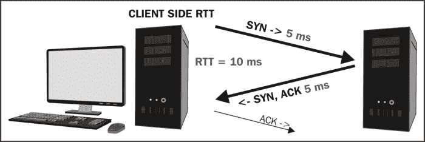

# 六、故障排除和性能分析

在本章中，我们将讨论 Wireshark 的主要用途—排除网络和应用连接、功能和性能问题。

将涉及的主题包括:

*   故障排除方法
*   连通性问题故障排除
*   功能问题故障排除
*   性能分析方法
*   应用性能差的五大原因
*   检测和优先处理延迟
*   服务器处理时间事件
*   应用回合的延迟
*   网络路径延迟
*   带宽拥塞
*   数据传输问题

这些主题涵盖了您在分析工作中会遇到的大多数问题。

# 故障排除方法

进行数据包分析有两个基本原因:

*   排除连接或功能问题(用户无法连接，应用无法工作，或无法正常工作)，我们称之为故障排除
*   分析一个性能问题(应用可以工作，但是很慢)，我们称之为性能分析

第三个灰色区域是一个应用，它基本上可以工作，但速度很慢，偶尔会超时，这可能涉及导致性能问题的底层功能问题，或者只是性能非常差。

对连接性或功能性问题进行故障诊断只是将您正在处理的情况下正常工作的情况与正在发生的情况进行比较。

另一方面，性能问题需要确定完成特定事务的大部分时间花在哪里，测量延迟并将延迟与正常或可接受的延迟进行比较。过度延迟的来源和类型通常指向下一个需要进一步调查或解决的领域。

在任何情况下，您都需要收集信息，以便确定这是连接性问题、功能问题还是性能问题，并根据问题的性质来解决问题。

## 收集正确的信息

在处理问题时，你能做的最重要的事情是确定真正的问题是什么，这样你就能解决正确的问题或问题的正确方面。为了确定真正的问题是什么，或者至少接近问题，你需要提出问题并解释答案。这些问题可能包括以下列表中的适当选项(取决于投诉):

*   定义问题:

    *   您试图做什么(连接服务器、登录、发送/接收电子邮件、一般应用使用、上传/下载文件以及特定事务或功能)？
    *   什么都不工作，或者这只是一个特定应用或多个应用的问题？
    *   您正在尝试/连接什么网站/服务器/应用？您知道用于访问应用的主机名、URL 和/或 IP 地址和端口吗？
    *   问题的症状/性质是什么？这个应用或功能/特性以前工作过吗，或者这是您第一次尝试使用它吗？
    *   您是否收到任何错误信息或其他问题提示？
    *   问题是持续的还是间歇的？看情况？靠什么？
    *   这种情况发生多久了？
    *   最近是否有一些已经或可能产生影响的变化？
    *   目前已经确定或怀疑的有哪些？为解决这一问题做了些什么？有帮助或者改变什么吗？
    *   是否有任何其他相关因素、症状或用户环境的近期变化需要考虑？

*   确定问题的范围:

    *   这个问题是发生在单个用户还是一组用户身上？
    *   这个问题是发生在特定的办公室、地区还是整个公司？
    *   这个问题对不同类型用户的影响是否不同？

*   收集系统、应用和路径信息。为了进行更深入的分析(超越单个用户或小组问题)，可能还需要根据投诉收集和分析以下列表中的适用问题(其中一些信息可能必须从网络或应用支持小组获得):

    *   客户端上的浏览器类型和版本是什么(针对 web 应用)？这与正常工作的客户端有什么不同吗？
    *   客户端和服务器的操作系统类型和版本是什么？
    *   什么是合适的(供应商)应用名称和版本？应用中是否存在与这些症状相符的已知问题(查看供应商的错误报告)。
    *   应用服务器背后的数据库类型和服务器环境是什么？
    *   是否涉及其他后端支持数据源，如在线数据服务或 Documentum 和 SharePoint 服务器？
    *   客户端和服务器之间的网络路径是什么？路径中是否有防火墙、代理服务器、负载平衡器和/或 WAN 加速器？它们的配置和工作是否正常？
    *   您能否使用 traceroute 确认预期的网络路径(以及涉及的任何 WAN 链路)并验证带宽可用性？
    *   你能用 pings 或 TCP 握手完成时间来测量**往返时间** ( **RTT** )从用户到应用服务器的路径延迟吗？

## 确定问题的一般性质

此时，您应该能够确定以下三种基本类型之一的问题的一般性质:

*   确定这是否是连接问题

    *   用户无法连接到任何东西
    *   用户无法连接到特定的服务器/应用

*   确定这是功能问题还是配置问题

    *   用户可以连接(从应用服务器获得登录屏幕或其他响应)但无法登录(或获得预期响应)
    *   用户可以连接并登录，但部分或全部功能失败(例如，无法发送/接收电子邮件)

*   确定这是否是性能问题

    *   用户可以正常连接、登录和使用应用；但是它很慢
    *   应用正常工作，但是有时它会停止和/或超时

## 对半故障排除和其他逻辑

当我在职业生涯早期从事电子设备的组件级维修时，我学会了使用“对半分”的故障排除方法，这种方法在几乎每一种情况下都非常有效。对半故障排除是通过在系统中途注入或测量信号，将问题域(在我的例子中，是一个无线电设备)一分为二的过程。这个想法是看哪一半是正确的，哪一半是错误的，然后将焦点转移到不工作的那一半，中途分析它，等等。重复这个过程，直到你把问题缩小到它的根源。

在网络和应用领域，一般来说，同样的对半故障排除方法也可以应用。如果用户抱怨网络速度慢，请尝试确认或消除网络:

*   靠近服务器的用户是否也遇到了类似的速度缓慢问题？其他偏远地点的用户呢？
*   如果某个应用对远程用户来说很慢，那么其他应用对该用户来说也很慢吗？
*   如果用户无法连接到给定的服务器，他们可以连接到附近或其他位置的其他服务器吗？

通过对什么可行，什么不可行的逻辑检查过程，你可以消除大量的猜测，将你的分析缩小到几个可能的可能性。

如果您有一个一切正常的环境，与不正常的情况相比，确定连接性或功能性问题的来源通常要容易得多。可以对工作场景和非工作场景的数据包捕获进行比较，以查看有何不同以及这些差异是否显著。

重要的是不要对一个问题做太多的假设，即使你正在处理的问题看起来和你之前解决的问题一样。始终验证问题和解决方案，您应该能够应用和删除修复，并可靠地看到问题消失/重新出现。否则，你应该问问自己是否找到了问题的真正根源，或者只是影响了症状。

除非报告的问题明显是系统范围的或特定的服务器问题，否则最好至少在投诉用户的工作站或尽可能靠近该工作站的地方进行初步分析。这具有提供执行以下操作的能力的优势:

*   查看并验证用户报告的实际问题
*   测量到目标服务器的往返时间
*   捕获并查看会话启动时的 TCP 握手过程
*   捕获并调查登录和任何其他后台进程和流量
*   查找用户设备遇到的网络问题(数据包丢失和重新传输)的迹象
*   测量数据下载期间用户工作站的表观网络吞吐量
*   消除使用捕获过滤器的需要；进出单个工作站的流量不应过大

在用户工作站、服务器或其他设备上进行捕获时，应使用聚合**测试接入点** ( **分接头**)而非使用交换机 SPAN 端口的(如[第 3 章](ch03.html "Chapter 3. Capturing All the Right Packets")、*捕获所有正确的数据包*中所述，或作为最后手段，在用户工作站或服务器上安装 Wireshark(如果授权)。

# 排除连接问题

通过确认用户工作站访问本地和远程网络资源所需的网络功能运行正常，可以解决单个用户或小组的连接问题。需要确认的基本要求或项目包括:

*   启用正确的网络接口(工作站配置)
*   确认第 1 层(物理)连通性
*   获取每个接口的 IP 地址、子网掩码和默认网关(DHCP)
*   获取默认网关或其他本地网络服务(ARP)的 MAC 地址
*   获取网络服务(DNS)的 IP 地址
*   连接到网络服务(TCP 握手或 UDP 响应)

我们将依次简要讨论这些问题；虽然前两步不涉及使用 Wireshark，但它们是故障排除方法中的必要部分。如果连接问题影响一组用户或整个办公室，第一步可能不适用。

## 启用网络接口

虽然网络接口需要启用似乎是显而易见的，但设备启动时默认自动启用(尤其是无线连接)的假设可能是错误的。

在 Windows 上，您可以使用命令行实用工具`ipconfig`查看网络接口的状态和基本配置(IP 地址、子网掩码和默认网关);在 Linux 或 MAC 设备上，等效的命令是`ifconfig`或`ip`。

## 确认物理连接

如果连接性问题被隔离到单个用户的工作站，则物理连接是可疑的。有几个项目需要检查，可以采取的故障排除步骤如下:

*   如果从工作站到墙上插座的以太网电缆有问题，您需要用不同的电缆替换。
*   如果从用户的墙上插孔到交换机端口的布线有问题，您需要临时将用户的以太网电缆插入另一个(已知良好的)墙上插孔。
*   如果交换机、交换机端口或端口配置有问题，您需要临时将用户的端口电缆插入另一个(已知良好的)端口。请注意，一些网络安全策略要求禁用交换机端口，直到需要它们时，或者将端口配置为与单个特定的 MAC 地址相关联。如果是这样的话，一个端口可能在你插入时无法工作，尽管它本身没有任何问题。

## 获取工作站 IP 配置

除非工作站是手动配置的，否则它需要从 DHCP 服务器获取 IP 地址、子网掩码、默认网关和 DNS 服务器设置。如果这似乎不能正常工作(在使用`ipconfig` (Windows)或`ifconfig`(Linux 或 Mac OS X)检查配置后)，您需要在工作站初始化/启动过程中使用 TAP 或 SPAN 端口执行数据包捕获，并调查 DHCP 请求和响应。

有八种 DHCP 消息类型(不要与引导请求和引导回复这两种引导协议类型相混淆):

| 

消息类型号

 | 

消息类型

 | 

描述

 |
| --- | --- | --- |
| one | DHCP 发现 | 客户端广播以定位可用的 DHCP 服务器 |
| Two | DHCP 回复 | 服务器向客户端响应 DHCP 发现以提供配置参数 |
| three | DHCP 请求 | 发送到 DHCP 服务器的客户端消息满足以下任一条件:

*   请求一台服务器提供的参数，拒绝其他 DHCP 服务器提供的参数
*   重新启动后，确认先前分配的地址的正确性
*   延长 IP 地址的租期

 |
| four | DHCP 下降 | 发送到 DHCP 服务器的客户端消息，指示提供的地址不可接受 |
| five | DHCP 确认 | 服务器到客户端的配置参数包括承诺的网络地址 |
| six | DHCP 否定确认 | 服务器向客户端指示客户端的地址不正确或已过期 |
| seven | DHCP 版本 | 客户端到服务器释放网络地址并取消租约 |
| eight | DHCP 信息 | 客户端到服务器仅要求本地配置参数 |

对于正在启动并先前在网络上工作的工作站，您通常会看到 DHCP 请求和确认数据包，确认工作站仍然可以使用先前租用的地址。在完全冷启动时，前两个 DHCP 数据包将是 DHCP Discover 和 DHCP Offer 数据包，随后是 Request 和 ACK 数据包。

在 DHCPv6 环境中，典型的数据包序列是 DHCPv6 请求、DHCPv6 通告、DHCPv6 请求和 DHCPv6 回复。

DHCP 响应数据包中要验证的字段(或 DHCPv6 广告数据包中的类似字段)包括以下四个字段:

*   **您的(客户端)IP 地址**:这是为该工作站提供的 IP 地址
*   **子网掩码**:这是在这个网络上使用的子网掩码
*   **域名服务器**:这是 DNS 服务器的 IP 地址
*   **路由器**:这是使用的默认网关的 IP 地址

这是任何网络通信所需的最少数据；下面的屏幕截图显示了 DHCP 回复数据包中提供的这些字段的示例:


您可以应用 Wireshark 显示过滤器来隔离 DHCP 数据包；过滤器是`bootp`，因为这是 DHCP 的传统名称:

*   **DHCP 显示过滤器** : `bootp bootp.option.dhcp == 5 (DHCP Message Type 'ACK')`
*   **DHCPv6 显示过滤器** : `dhcpv6 dhcpv6.msgtype == 2 (DHCPv6 'Advertise')`

在**显示滤镜**工具栏的文本框中输入滤镜字符串，点击**保存**，并给按钮分别起一个名字如`DHCP Pkts`和`DHCPv6 Pkts`，就可以将基本的`bootp`和`dhcpv6`显示滤镜保存为一个**滤镜表达式按钮** ( **FEB** )。或者，您可以在一个按钮中使用一个`or` ( `||`)将两个过滤器结合起来，如下面的屏幕截图所示:


您可能希望保存另一个 FEB，该 FEB 使用以下显示过滤器字符串显示异常 DHCP 条件数据包，并调用 **DHCP Errors** 按钮或类似按钮，如下所示:

```
bootp.option.dhcp == 4 || bootp.option.dhcp == 6 || bootp.option.dhcp == 7
```

DHCPv6 的类似异常事件显示过滤器可能包括:

```
dhcpv6.msgtype == 8 || dhcpv6.msgtype == 9 || dhcpv6.msgtype == 10
```

如果您需要更详细地分析 DHCP、DHCPv6 和各种 DHCPv6 消息类型，您可以在线或从其他来源进行更多的研究。

## 获取 MAC 地址

工作站将利用 ARP 协议来获取网络服务的已知 IP 地址的 MAC 地址，例如它的默认网关或 DNS 服务器，如果它位于同一网段的话。ARP 协议及其典型功能已经在[第 2 章](ch02.html "Chapter 2. Networking for Packet Analysts")、*数据包分析人员网络*中介绍过。

您可能希望使用`arp`显示过滤器语法创建一个 ARP FEB，以便快速轻松地检查那些数据包。

## 获取网络服务 IP 地址

客户端工作站向 DNS 服务器发送查询，以获得给定主机名的 IP 地址；DNS 服务器以该信息作为响应，或者代表客户端向其他 DNS 服务器请求该信息。

Wireshark **数据包详细信息**窗格中显示的 DNS 查询和响应数据包字段的格式相当直观。包含`time.windows.com`的已解析 IP 地址的 DNS 响应数据包示例，实际上提供了别名`time.microsoft.akadns.com`的 IP 地址(`137.170.185.211`),如下图所示:


如果客户端工作站无法获得 web 服务或应用服务器的 IP 地址，那么对请求的数据包级调查(请求的是哪个 URL 或主机名)以及来自 DNS 服务器的响应(如果有)应该会揭示一些问题。将失败的查询与其他主机名或来自其他工作站的正常工作的查询进行比较，应该可以揭示问题的根源(如果 DNS 是问题所在)。无法获得 IP 地址的原因可能是 DNS 服务器无法运行、主机名或 URL 不正确，或者用户与网络其他部分的连接出现问题，我们接下来将对此进行检查。

## 基本网络连接

一些简单的测试可以确认基本网络连接是否正常，或者发现路由问题或其他需要网络支持团队解决的问题。

捕获和分析在以下测试中发送和接收的 ICMP 数据包可能会有所发现；尽管如此，测试结果本身往往足以说明问题:

*   使用通过使用`ipconfig /all` (Windows)或`ip addr show` (Linux)获得的默认网关 IP 地址 Ping 用户的默认网关，以确认用户工作站在本地网络上具有基本连接。
*   Ping 目标服务器的主机名或 URL。如果失败(请求超时消息)，尝试 ping 其他主机或 URL。如有必要，在这些测试的数据包捕获中检查 DNS 和/或 ICMP 响应，以确定故障的性质。否则，记下平均往返时间。
*   如果 ping 通默认网关，但 ping 通其它目标失败，则到目标服务器的 traceroute 可以揭示网络路径中连通性停止工作或被阻塞的位置。

    ### 注意

    视窗中的 traceroute 命令行实用工具是`tracert`，而对于 Linux/Unix 和麦克·OS X 机器上的 traceroute，该命令是`traceroute`.在 Windows 操作系统中做 traceroute，打开一个命令提示符 ( **CMD** )窗口,键入`tracert <hostname or IP Address of target>`.在大多数其他环境中,打开一个终端窗口并键入`traceroute <hostname or IP address of target>`.

如果可以 ping 通目标服务器，并且网络连接正常，则可以进入故障排除过程的下一步。如果没有，请注意，有些主机可能配置为不响应 ICMP ping 请求，并且/或者出于安全原因，ICMP 被用户和服务器之间的防火墙阻止。因此，无法 ping 通设备不一定是网络问题的征兆。Traceroute 结果有助于确定网络连接在通往目标服务器的路径上运行的程度；对其他目标的测试也应该是有启发性的。

下面的屏幕截图显示了一个示例，先 ping 默认网关，然后 ping URL，最后执行到目标 URL 的 traceroute:


### 连接到应用服务

如果从用户工作站到目标服务器的网络连接正常(如 ping 主机的能力所证明的)，连接到该服务器上托管的特定应用的问题可能由多种因素引起:

*   客户端用来访问应用的 URL 或端口是错误的
*   用于访问应用的端口被防火墙阻止
*   应用服务未启动或工作不正常

这些因素中的第一个更有可能是单个用户问题。最后两个因素中的任何一个都会阻止一个组或整个组织中的任何人访问该应用。对试图连接到被阻止的应用的用户进行数据包级分析(从客户端)会产生 ICMP 消息:**目的主机不可达**或**目的端口不可达**，或者如果 ICMP 消息被防火墙阻止，则根本没有响应。

如果服务器启动，则应用可以运行，但无法访问；客户端捕获不能提供任何可靠的线索，但是来自或靠近服务器端的 TCP 会话设置(如果有的话)的数据包捕获应该能揭示一些问题。

# 排除功能问题

如果用户能够连接并建立与应用服务器的 TCP 会话，但是应用不能正常工作，或者不能正常工作，那么，有许多方面可以研究。可以结合使用数据包级分析、错误报告和配置比较以及来自其他用户机器的捕获和配置来调查这些方面:

*   **用户凭证**:应用功能的特定用户问题最常见的原因是缺乏适当的凭证、授权、权限等。这是首先要检查其他用户是否正常工作。
*   **用户机器上的应用设置**:有些应用需要将特定的配置文件放在用户机器的特定位置。应用可能还需要特定于应用的实用工具的特定版本级别，Java。NET 框架等等。通常，应用会提供一条错误消息，至少指出配置问题的一般性质。
*   **应用报告的错误**:您可以在响应包内或用户屏幕上查找可能揭示应用错误性质的错误代码:

    *   HTTP、FTP 或 SIP 响应包中大于 400 的状态代码
    *   SMB 响应包中的错误代码
    *   其他特定于应用的异常、错误代码和消息

*   **网络浏览器的差异**:一些网络应用被设计用于特定的浏览器(Chrome、Internet Explorer、Firefox、Opera 等)，可能无法在其他浏览器上正常运行或者根本无法运行，并且可能不会提供任何错误消息来表明这种情况。将浏览器类型和版本与其他工作用户进行比较可能会有所启发。

网络连接和应用功能问题的原因可能千差万别，因此不可能为每种可能性都画出清晰的路线图。成功解决这些问题的最佳方法是，在没有用系统的、逻辑的故障排除步骤证明这些假设正确的情况下，不要做出过多的假设，而是尝试找到或创建一个场景，在该场景中，系统或至少系统的一部分正常工作，并将工作环境与不工作环境的适当数据包级细节进行比较。

# 性能分析方法

分析应用的性能问题基本上就是识别完成特定任务的大部分时间花在哪里，并测量/比较该时间与该类型任务的正常和/或可接受时间。

## 应用性能不佳的五大原因

一般来说，性能问题可归因于以下五个方面中的之一，按照降低可能性的顺序排列:

*   服务器处理时间延迟
*   申请轮次延迟
*   网络路径延迟
*   带宽拥塞
*   数据传输(TCP)问题

客户端处理时间通常是整体响应时间中相对较小的一部分——除了一些计算密集型桌面应用，这些应用将重点放在网络和服务器环境以及任何影响性能的应用设计特征上。

### 准备工具和方法

正如在准备对连接或功能问题进行故障排除时所做的那样，您需要收集关于应用环境和问题域的正确信息。您还需要确定在分析过程中可能需要使用哪些工具:Wireshark、方便数据包捕获的 TAPs 以及任何其他分析工具。

您还需要确定在哪里执行第一次数据包捕获:

*   客户端捕获是开始性能分析工作的最佳地方。从这一有利位置，您可以查看和验证用户抱怨的内容，查看呈现给用户的任何错误消息或数据包捕获中明显的错误消息，测量网络往返时间，并捕获性能特征以在数据包捕获中进行研究，而无需使用捕获过滤器，因此您知道您不会错过任何内容。
*   可能需要服务器端捕获，因为客户端捕获对于远距离的用户来说可能是不可能的，或者分析后端数据库或其他数据源的服务器到服务器的事务。
*   可能需要在网络路径的某个中间点捕获分组，以隔离过多分组丢失/错误和相关重传的来源。

请记住，使用聚合 TAP 比使用 SPAN 端口更可取，或者您可以将 Wireshark 安装在客户端工作站或服务器上作为最后的手段，但必须以任何方式完成捕获。

### 执行、验证和保存良好的数据包捕获

在执行捕获并保存批量捕获文件后，确认以下内容:

1.  检查文件以确保在 Wireshark **专家信息**菜单中的【警告】选项卡中没有带有**已确认的不可见段**消息的数据包，这意味着 Wireshark 看到了已确认的数据包，但没有看到原始数据包；表示 Wireshark 由于错误的分路器或 SPAN 端口配置或过多的通信量而丢失数据包。在任何情况下，如果出现的不止一部分，您将需要在确认捕获设置后再次进行捕获。
2.  接下来，您需要在**对话**窗口中查看在 **IPv4** 中捕获的对话，并对**字节**列进行排序。用户和应用服务器之间的 IP 对话应该在顶部或顶部附近，这样您可以选择该对话，右键单击它，并在**选择的**菜单中选择 **A < - > B** 。
3.  在检查过滤后的数据以确保其包含您所期望的内容后，从**文件**菜单中选择**导出指定的数据包**，并用文件名保存过滤后的捕获文件，该文件名反映了这是批量捕获文件的过滤子集。
4.  最后，打开刚刚保存的过滤文件，这样你就可以使用一个更小、更快的文件，而不会有任何干扰与你的分析无关的其他对话。

### 初始误差分析

在开始分析时，您应该浏览 Wireshark 的**专家信息**窗口(**分析** | **专家信息**)的**错误**、**警告**和**注释**选项卡，以查找重大错误，如过度重新传输、零窗口条件或应用错误。这些非常有助于提供线索，找出所报告的不良绩效的来源。

虽然在大多数数据包捕获中，少量的数据包丢失和重新传输是正常的，并且影响很小，但是过多的数量表明在用户和服务器之间的某个路径上发生了网络拥塞，数据包被丢弃，并且从这些丢失的数据包中恢复可能会损失大量的时间。

在**专家信息注释**窗口中看到大量重复的 ACK 包可能会引起警惕，但也可能会产生误导。在下面的屏幕截图中，对于一个丢失的数据包，有多达 69 个重复的 ack，对于第二个丢失的数据包，计数上升到 89(在下面的屏幕截图中未显示):


然而，在 Wireshark 中使用**编辑**菜单中的**设置/取消时间参考**功能标记第一个重复 ACK 发生的时间，然后通过点击**专家信息**屏幕中的数据包编号并检查**数据包列表**窗格中的**相对时间**栏，转到该系列中的最后一个重复 ACK，仅过了 30 毫秒。这不是一个显著的时间量，特别是如果**选择性确认**被使能(如本例所示),并且其他分组同时被传递和确认。在延迟时间较长的网络路径上，重复 ACK 计数可能会高得多；只有当丢失的数据包和需要重新传输的数据包的总数过高时，用户才会注意到延迟。

在**专家信息注释**窗口中寻找的另一个条件包括 **TCP 零窗口**报告，这是由于客户端或服务器上的接收缓冲区太满而无法接受更多数据，直到应用有时间检索和处理数据并在缓冲区中腾出更多空间。这不一定是错误情况，但它会导致传输数据的大量延迟，这取决于缓冲区释放的时间。

您可以通过用时间参考标记 TCP 零窗口包并查看发送 **TCP 窗口更新**包之前经过的相对时间来测量该时间，这表示接收器准备好接收更多数据。如果这种情况经常发生，或者零窗口和窗口更新数据包之间的延迟很长，您可能需要检查遇到缓冲区已满情况的主机，以查看是否有任何后台进程对您正在分析的应用产生不利影响。

### 注意

如果还没有添加，需要在**包列表**窗格中添加**相对时间**和**时差**列。导航到**编辑** | **首选项** | **列**来添加它们。添加时间列也在第 4 章、*配置 Wireshark* 中进行了说明。

您可能会在**警告**选项卡中看到连接重置(RST)消息。如果这些错误发生在客户端-服务器交换或会话结束时，则不是错误状况的指示；它们是会话被终止的正常标志。

您可能想要添加到 Wireshark 的一个非常方便的**过滤器表达式**按钮是一个 **TCP 问题**按钮，使用如下显示过滤器字符串:

```
tcp.analysis.flags && !tcp.analysis.window_update && !tcp.analysis.keep_alive && !tcp.analysis.keep_alive_ack
```

这将过滤并显示大多数数据包，您将在**专家信息**窗口中看到这些信息，并提供任何重要问题的快速概述。

### 检测和优先处理延迟

由于我们正在解决应用的性能问题，因此第一步是确定数据包流中的任何延迟，以便我们可以关注周围的数据包，从而确定延迟的来源和性质。

识别延迟事件的最快方法之一是对 **TCP Delta time** 列进行排序(通过点击列标题),以便将最高延迟的数据包排列在数据包列表的顶部。然后，您可以检查这些数据包的**信息**字段，以确定哪些数据包(如果有的话)反映了影响事件的有效性能，因为大多数数据包并不反映。

在下面的屏幕截图中， **TCP Delta time** 列按照包间时间降序排列:


让我们详细地看一下所有的包:

*   前两个包是 **TCP 保持活动状态**包，它们只是做它们被称为的事情。它们是客户端(或服务器)确保在一段时间没有任何活动的过去后，连接仍然存在(而不是因为另一端已经断开)的一种方式。你可以忽略这些；它们通常与用户体验无关。
*   第三个包是 Reset 包，它是会话流中的最后一个包，被发送来终止连接。同样，它对用户体验没有影响，因此您可以忽略这一点。
*   具有高分组间延迟的下一系列分组是**get**和 **POST** 。这些是新请求的开始，因为用户单击了应用上的按钮或其他动作而发生。然而，在这些数据包出现之前过期的时间被用户思考时间消耗掉了，这是用户阅读最后一页并决定下一步做什么的时间。这些也不会影响用户的响应时间体验，可以忽略不计。
*   最后， **Frame #** **3691** ，是一个 **HTTP/1.1 200 OK** ，是服务器对之前请求的响应；这是用户等待的 1.9 秒的合法响应时间。如果这个响应时间消耗了几秒钟以上，用户可能会对等待感到失望，而类型的请求和过度延迟的原因将需要进一步分析，以确定为什么需要这么长时间。

本讨论的要点是说明并非您在数据包跟踪中看到的所有延迟都会影响最终用户体验；你必须找到并专注于那些有关系的人。

您可能想给 Wireshark 添加一些额外的列来加速分析过程；您可以右键单击列标题并选择**隐藏列**或**显示列**来显示或隐藏特定的列:

*   **TCP Delta**(**TCP . time _ Delta**):这是从 TCP 会话中的一个包到同一会话/流中的下一个包的时间
*   **DNS Delta**(**DNS . time**):这是 DNS 请求和响应之间的时间
*   **HTTP Delta** ( **http.time** ) : This is the time between the http requests and responses

    ### Note

    You should ensure that **calculate session timestamp** is enabled in the **TCP** option. You can find this option by navigating to **Edit** | **Reference** | **Protocol** so that the delta time series can work normally.

添加列时，以下内容在性能分析过程中也会有所帮助:

*   **Stream #**(**tcp . Stream**):这是 TCP 会话流的编号。您可以右键单击该列中的流编号，并从 **Apply as a filter** 菜单中选择 **Selected** ，以快速构建一个显示过滤器来检查单个对话。
*   **计算窗口大小** ( **tcp.window_size** ):这是计算出的 tcp 窗口大小。当缓冲区大小减少到零窗口条件发生或几乎发生的程度时，此列可用于快速发现数据传递流中的时间段。

### 服务器处理时间事件

响应时间不佳的最常见的原因之一是过长的服务器处理时间事件，这可能是由应用服务器本身的处理时间和/或对后端数据库或其他数据源的大量请求的长响应时间导致的延迟造成的。

在 Wireshark 中，使用以下方法可以很容易地确认和测量这些响应时间:

1.  使用上一节讨论的排序的**增量时间**列方法来识别合法的响应时间事件后，单击可疑数据包，然后单击**增量时间**列标题，直到它不再处于排序模式。这将导致选中的数据包在**数据包列表**窗格的中间突出显示，并且显示的数据包恢复到原来的顺序。
2.  检查前几个数据包，找出导致长响应时间的请求。你会多次看到的模式是:

    1.  用户向服务器发送请求。
    2.  服务器相当快地确认请求(用一个**【ACK】**包)。
    3.  一段时间后，服务器开始发送数据包服务请求；第一个数据包是您在排序的 **Delta Time** 视图中看到并选择的数据包。

当服务器实际开始发送数据时，在第一个用户请求包和第三个包之间到期的时间是 **第一字节**响应时间。在这方面，您将会看到由服务器处理时间导致的较长的响应时间。这种影响可以在用户和服务器之间看到，也可以在应用服务器和数据库服务器或其他数据源之间看到。

在下面的截图中，您可以看到一个来自客户端的 **GET** 请求，随后是 198 毫秒后来自服务器的 ACK 包(在 **Delta Time Displ** 列中的 **0.198651** 秒)； **1.9** 秒后，服务器发送第一个数据包( **Info** 字段中的 **HTTP/1.1 200 OK** ，随后是一系列附加数据包的开始，以传送所有请求的数据。在该图中，请求数据包上设置了**时间参考**。查看 **Rel Time** 栏，可以看到在原始请求包和第一个字节包之间经过了 **2.107481** 秒:


需要注意的是，第一个字节数据包如何在**信息**字段中汇总取决于 **TCP** 菜单中**允许子处理器重组 TCP 流**设置的状态，通过导航到**编辑** | **首选项** | **协议**可以找到，如下所示:

*   如果该选项被禁用，第一个字节包将在**信息**字段显示第一个数据包的内容摘要，如前面截图所示的 **HTTP/1.1 200 OK** ，后面是一系列数据传递包。这个交付过程的结束没有显著的特征；数据包流会停止，直到收到下一个请求。
*   如果**允许子扇区重组 TCP 流**选项被启用，第一个字节包将被简单地总结为重组 PDU 或类似符号的 **TCP 段。 **HTTP/1.1 200 OK** 摘要将显示在本次发送过程中最后一个数据包的 **Info** 字段，表示请求的数据已经发送。下面的屏幕截图展示了启用此选项的一个示例。这与前面屏幕截图中显示的请求/响应流相同。在 **Rel Time** 栏中可以看到，从最初的请求到最后一个数据传递包所用的总时间为 **2.1097** 秒:**

### 注意

SMB 协议首选项中的**重组 SMB 事务有效负载**设置将影响 SMB 和 SMB2 响应在**信息**字段中的汇总方式，类似于 TCP 协议首选项中的相关设置。

在任一情况下，用户所经历的总响应时间将是从客户端请求包到数据传递包结束所经过的时间加上客户端应用处理接收到的数据并在用户屏幕上显示结果所需的(通常)少量时间。

总之，测量从第一个请求到第一个字节包的时间就是服务器响应时间。从第一个请求包到最后一个数据传递包的时间很好地代表了用户的响应时间体验。

### 申请回合的延迟

下一个最有可能导致响应时间不佳的原因是相对较高的应用周转次数，特别是对于远距离访问应用的远程用户来说。一个应用回合是一个实例，其中客户端应用发出请求，在收到响应之前不会发生任何其他事情，之后会发生另一个请求/响应循环，依此类推。

每个客户机/服务器应用都受到应用转换效应的影响，每个请求/响应周期都会产生一个转换效应。通常由于糟糕的应用设计，应用需要大量的应用来完成一项任务，这可能会导致终端用户在更高延迟的网络路径上响应时间很短，因为等待这些多个请求和响应在网络上来回传输所花费的时间越来越多，而 it 可以很快做到这一点。

例如，如果一个应用需要 100 个应用回合来完成一个任务，并且用户和应用之间的**往返时间** ( **RTT** )是 50 毫秒(典型的越野值)，则应用回合延迟将是 5 秒:

```
100 App Turns X 50 ms RTT network latency = 5 seconds 

```

除了任何服务器处理和网络传输延迟之外，这种应用转换的效果是额外的等待(响应)时间，总共浪费了 5 秒钟的时间。由此产生的更长的时间不可避免地被归咎于网络；网络支持团队断言网络运行良好，应用团队指出应用运行良好，直到网络参与进来。这种情况还在继续，因此了解应用的转弯效果、其原因以及如何测量和解释它们非常重要。

由于需要下载一个或多个 CSS 文件、JavaScript 文件和多个图像来填充一个页面，Web 应用可能会导致相对较高的应用浏览量。网页设计师可以使用技术来减少应用的周转和下载时间，现代浏览器允许同时使用大量连接，以便可以同时处理多个请求，但在较长的网络路径上，这种影响仍然很明显。许多旧的、传统的应用和微软的**服务器消息块** ( **SMB** )协议也是强加的高应用访问量。

应用转换的存在和影响在数据包捕获中并不直观，除非您知道它们的存在以及如何识别和计数。您可以在 Wireshark 中使用显示过滤器为客户端捕获执行此操作:

```
ip.scr == 10.1.1.125 && tcp.analysis.ack_rtt > .008 && tcp.flags.ack == 1
```

您需要将`ip.src` IP 地址替换为您服务器的 IP 地址，并将`tcp.analysis.ack_rtt`值调整为用户和服务器之间网络路径的 RTT。应用过滤器后，您将看到代表应用轮次的数据包显示，并且您可以在用户界面底部 Wireshark 的**状态栏**选项中间部分的【T2 显示的字段中看到应用的总轮次计数。

如果您测量完成一项任务所需的总时间(从第一个请求数据包到最后一个数据传输数据包),并将该时间除以应用周转时间(应用周转次数 X 网络 RTT ),您可以得出一个近似的应用周转时间百分比:

```
5 seconds app turns delay / 7.5 seconds total response time = 66% of RT 

```

任何超过 25%的百分比都需要进一步研究如何降低 RTT 延迟(服务器放置)或应用周转次数(应用设计)。

### 网络路径延迟

高响应时间的第二个主要原因是网络路径延迟，它加剧了上一节中讨论的应用轮换的影响，并影响数据传输吞吐量以及从数据包丢失和后续重新传输中恢复所需的时间。

您可以使用 ICMP ping 数据包来测量客户端和服务器之间的网络路径延迟，但也可以通过测量 TCP 三次握手过程中从客户端 SYN 数据包到服务器的 SYN，ACK 响应之间的时间来确定数据包捕获的延迟，如下图所示的客户端捕获:



在服务器端捕获中，从 SYN，ACK 到客户端 ACK(三次握手中的第三个数据包)的时间也反映了 RTT。实际上，从任何捕获点来看，从第一个 SYN 数据包到第三个 ACK 数据包的时间都可以很好地表示 RTT，并且假设握手过程中的客户端和服务器响应时间很短。请注意，服务器对 SYN 数据包的响应时间虽然通常很短，但在高负载期间可能会比正常情况下更长，并会影响测量。

高网络路径延迟本身并不是一个错误条件，但显然会对应用在网络上的操作产生负面影响，如前所述。

### 带宽拥塞

带宽拥塞通过延长在网络路径上传输给定数量的数据所需的时间来影响应用的性能；对于通过繁忙的 WAN 链路访问应用服务器的用户来说，这些影响可能会变得很大。网络支持团队应该能够为路径内 WAN 链路生成带宽使用和可用性报告，以检查这种可能性，但您也可以通过使用正确配置的 Wireshark IO 图来查看较大数据传输期间的网络吞吐量，从而寻找带宽拥塞的证据。

下面的屏幕截图显示了受有限带宽影响的数据传输；2.5 Mbps 标记处的平坦线(本例中的总带宽可用性)清晰可见，因为没有更多的带宽可用于支持更快的传输:


您可以通过配置 IO 图来确定峰值数据传输速率，单位为**比特每秒** ( **bps** ) ，如下所示:

*   **X 轴滴答间隔** : **1 秒**
*   **Y 轴单位** : **位/节拍**
*   **图 2 滤波器** : `ip.dst == <IP address of server>`
*   **图 4 滤镜** : `ip.src == <IP address of server>`

这些设置使能够精确显示客户端到服务器(红色)和服务器到客户端(蓝色)方向的网络吞吐量的每秒位数。可以根据需要修改 **X 轴**面板中的**每刻度像素**选项、 **Y 轴**面板中的**刻度**选项以及其他设置，以获得最佳显示效果，而不会影响测量精度。

请注意，大多数现代应用可能会产生数 Mbps 的短期峰值带宽需求(通过无限制的链路)。网络路径上的 WAN 链路应该有足够的备用容量来满足这些短期需求，否则响应时间将会受到影响。这是一个重要的性能考虑因素。

### 数据传输

有许多 TCP 数据传输效应会影响应用的性能；这些都可以在 Wireshark 中分析。

#### TCP 流图

Wireshark 提供 TCP **流图**来分析几个关键数据传输指标，包括:

*   **往返时间**:该图了从一个数据包到相应 ACK 包的 RTT。
*   **吞吐量**:这些是以字节每秒为单位的吞吐量图。
*   **Time/sequence(Stephen ' s-style)**:可视化基于 TCP 的数据包序列号(以及传输的字节数)随时间的变化。一个理想的图形以一种平滑的方式从左下角流向右上角。
*   **时间/顺序(tcptrace)** :这类似于 Stephen 的图表，但是提供了更多的信息。数据包用一个 I-bar 显示屏表示，其中 I-bar 越高，发送的数据越多。还会显示一个代表接收窗口大小的灰色条。当灰色条越来越靠近 I 形条时，接收窗口大小会减小。
*   **window scaling** : this plots the receive window size.

    ### Note that

    TCP flow graph is unidirectional. You want to select a packet for the direction of data transmission to get the correct view.

通过在**数据包列表**窗格中选择 TCP 流中的一个数据包，并从**统计**菜单中选择 **TCP 流图**，然后选择**时序图(tcptrace)** 等选项，可以使用这些分析图。

在**控制窗口**的**图形类型**选项卡中会出现所选择的图形和**控制窗口**，您可以选择其他类型的分析图形，如下图所示:


下图所示的**时间/顺序图(tcptrace)** 描绘了数据传输过程中增加的序列号，以及灰色的接收窗口大小线:


您可以在图形的某一部分上单击并拖动鼠标来放大某一部分，或者按 *+* 键放大，按 *-* 键缩小。点击任何图形中的一个点，会将您带到 Wireshark 的**数据包列表**窗格中相应的数据包。

#### IO 图

您还可以通过将 TCP 分析显示过滤器字符串应用到 Wireshark 的 IO 图来分析 TCP 问题对网络吞吐量的影响，例如:

```
tcp.analysis.flags && !tcp.analysis.window_update

```

在下面缓慢的 SMB 数据传输的屏幕截图中，可以看到红线中的多个 TCP 问题(在本例中为数据包丢失、重复 ack 和重新传输)对应于吞吐量的降低(黑线):


单击 IO 图中的点会将您带到 Wireshark 的**数据包列表**窗格中相应的数据包，以便您可以调查问题。

#### IO 图–Wireshark 2.0

Wireshark 2.0 ，也称为 Wireshark Qt，是 Wireshark 版本历史上的一个重大变化，因为它从 GTK+用户界面库过渡到了 Qt，为支持的平台提供了更好的持续 UI 覆盖。Wireshark 的大部分功能和用户界面控制基本保持不变，但 IO 图有所变化。

这些显示在下面的屏幕截图中，其中显示了与前面的屏幕截图中相同的 TCP 问题:


新的 IO 图形窗口具有添加任意多行(使用 *+* 键)和放大图形行的能力，以及将图形保存为图像或 PDF 文档的能力。

# 总结

本章涵盖的主题包括故障排除方法、如何使用 Wireshark 对连接和功能问题进行故障排除、性能分析方法、应用性能不佳的五大原因以及如何使用 Wireshark 分析这些原因。

在下一章中，我们将回顾恶意流量的一些常见类型和来源，并介绍安全专家如何使用 Wireshark 来检测这些威胁。