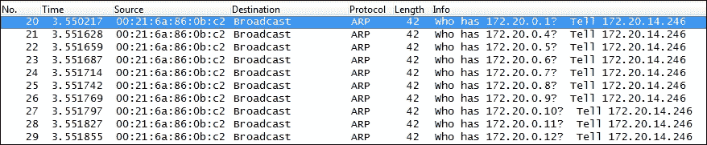
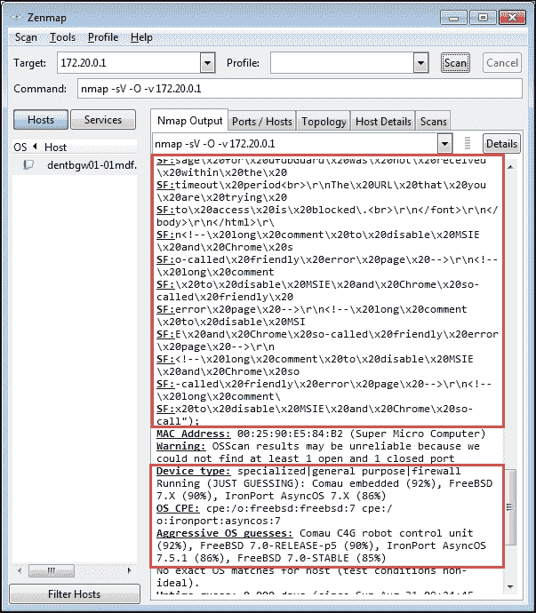
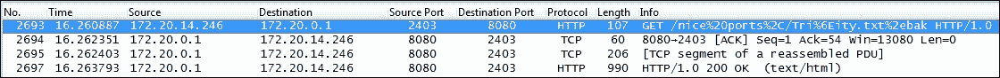
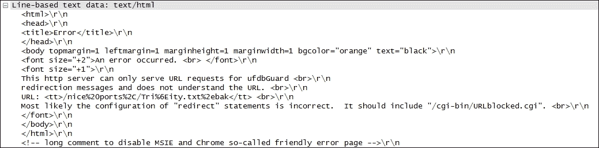

# 七、安全任务的数据包分析

随着黑客、身份窃贼和企业数据盗窃的威胁日益增加，您需要能够在数据包级别分析网络的安全性。

本章将涉及的主题包括:

*   安全分析方法
*   扫描和清扫
*   操作系统指纹识别
*   畸形数据包
*   电话家庭流量
*   密码破解流量
*   异常流量

# 安全分析方法

数据包级别的安全分析基于对可疑流量的检测和分析，也就是说，由于存在不寻常的协议类型或端口，或者不寻常的请求、响应或数据包频率而不符合正常模式的流量。可疑流量可能包括侦察(发现)扫描、呼叫总部行为、拒绝服务攻击、僵尸网络命令或直接攻击或基于病毒或僵尸网络的代理的其他类型的行为。

Wireshark 捕获网络中的战略点，以调查来自特定主机或网段上的可疑数据包，出口点还可以补充任何可能用于向 IT 人员发出可疑流量警报的入侵检测系统 ( **IDS** )系统。

## 基线的重要性

如果您对正常情况有一个基准，那么识别异常流量模式的能力将变得更加容易，这些异常流量模式需要调查，而流量是由表现不佳的应用、错误配置或故障设备引起的。基线是与您的主要应用和服务器的典型对话以及它们所在网段上的后台流量的快照。在潜在的安全漏洞情况下，您可以将基准中的正常协议、流量模式和用户会话与当前捕获进行比较，过滤掉正常流量，然后检查差异。

要在安全分析中进行基线比较，您需要定期捕获和存储足够长时间的数据包跟踪文件，以提供典型用户和后台流量模式的良好样本，同时保持文件大小便于在 Wireshark 中使用，例如每个文件 100 MB 到 1 GB。您可以在 Wireshark 的**捕获选项**窗口中配置**环形缓冲区**选项，以保存一系列合理大小的文件，用于更长时间的捕获或更繁忙的网段。

虽然您的基准需求和实践将取决于您的环境，但您应该检查的一些流量方面包括:

*   广播和组播类型和速率:

    *   哪些设备和应用正在使用广播和组播？
    *   典型的广播和组播数据包速率是多少？

*   应用和协议:

    *   网络上运行着哪些应用？
    *   他们使用的是什么协议和端口？
    *   应用启动序列和典型任务
    *   应用会话是否加密？
    *   是不是所有用户都强制使用加密？有例外吗？
    *   登录/注销顺序和依赖关系是什么？

*   路由协议和路由更新
*   ICMP 流量
*   启动序列
*   名称解析会话
*   无线连接包括正常的管理、控制和数据帧内容
*   VoIP 和视频通信
*   空闲时间流量是指没有用户登录时主机与其它主机的通信
*   哪些备份流程在夜间运行，运行多长时间？
*   是否有任何可疑的协议或广播/扫描正在发生？

当您检查您的基线捕获时，从 Wireshark 的**统计**菜单中选择**协议层级**来查看正在使用的协议的摘要是很有帮助的。例如，在下面的屏幕截图中，您可以看到有一些 **互联网中继聊天** ( **IRC** )流量，以及 **普通文件传输协议** ( **TFTP** )流量，这两种流量在您的网络中可能都不正常，可能是与外部实体进行恶意通信的迹象:


分析正常流量水平和模式的基线也是熟悉您的网络环境及其典型的数据包流和协议的一种很好的方式，这样可以让您更好地发现异常流量。

# 安全评估工具

安全专家使用几个流行的工具来执行安全评估和漏洞测试。由于这些工具可以生成与黑客和恶意代理可能使用的相同类型的扫描、指纹识别和其他利用活动，因此它们对于数据包分析人员来说非常有用，可以分析他们使用 Wireshark 生成的数据包，从而熟悉不同类型的活动如何出现在数据包跟踪中，还可以构建显示过滤器来检测它们。

最流行的工具之一是 **网络映射器** ( **Nmap** )，一个免费的开源工具，用于网络发现和安全审计。Nmap 运行在所有主要的计算机操作系统上，并提供命令行和 GUI 版本( **Zenmap** )。

### 注意

你可以在[http://nmap.org](http://nmap.org)找到关于 Nmap 的更多信息，在[http://sectools.org](http://sectools.org)可以找到关于其他顶级安全工具的信息。

# 识别不可接受或可疑的流量

Wireshark 可用于识别网络流量中的异常模式或数据包内容，包括网络扫描、格式错误的数据包以及不应该在您的网络上运行的异常协议、应用和/或对话。以下是可能不可接受和/或需要调查以验证其在您的环境中的合法性的流量类型的一般列表:

*   **MAC 或 IP 地址扫描**:这些试图识别网络上活跃的主机
*   **TCP 或 UDP 端口扫描**:这些试图识别活跃的应用和服务

网络管理应用可以生成 IP 地址和端口扫描，以构建或维护要监控/管理的设备和应用列表，但这通常是这些类型流量的唯一合法来源。

*   **明文密码**:这些是您可以在 Wireshark 的**数据包详情**或**数据包字节**字段中看到的密码。这些对于**文件传输协议** ( **FTP** )登录来说是典型的，但在其他地方并不典型或不可接受。
*   **明文数据**:这个是数据包有效载荷中可以读取的数据。这是 HTTP 请求和响应的典型情况，常见于应用服务器对数据库的请求和响应，但这些数据库交换应该在隔离的非公共网段上的主机之间进行，或者在物理上安全的环境中进行。
*   **密码破解尝试**:这些是重复的、系统的尝试，通常是从一台设备上发现一个工作密码。
*   **恶意形成的数据包**:这些是在协议字段中带有故意无效或格式不正确的数据的数据包，旨在利用应用中的漏洞。
*   **呼叫总部流量**:这种是来自流氓代理的流量，该代理可能驻留在服务器或工作站上，定期向远程(通常是离网)主机登记。
*   **洪泛或拒绝服务(DOS)攻击**:这种是有意以非常高的每秒数据包速率向一台或多台主机发送的流量，试图向主机或网络洪泛大量流量，使其他人无法访问它们的服务。
*   **颠覆性活动**:这些包括许多准备和促进中间人攻击的技术，在这种攻击中，设备被诱骗向恶意主机发送数据包以拦截数据。

这只是您可能在网络上看到的恶意流量类型的一个示例；网络安全是日益复杂的攻击和后续对策的不断演变的交换。

随着您安全分析技能的提高，您可能希望在 Wireshark 中构建一个特殊的安全配置文件，其中包括基于显示过滤器的数据包着色规则，以帮助识别可疑或格式错误的数据包，以及一组 **过滤器表达式按钮**，用于隔离和显示您可能正在寻找的各种类型的可疑流量。

隔离和检查可疑数据包的显示过滤器的一些示例包括:

| 

过滤器描述

 | 

显示过滤器字符串

 |
| --- | --- |
| 检测 ICMP pings 和可能的 ping 扫描 | `icmp.type == 8 &#124;&#124; icmp.type == 0` |
| ICMP 目标无法到达过滤器(包括重定向) | `(icmp.type >= 3 && icmp.type <= 5) &#124;&#124; icmp.type == 11 &#124;&#124; (icmpv6.type >= 1 && icmpv6.type <= 4)` |
| 异常 ICMP 回应请求 | `(icmp.type == 8) && !(icmp.code == 0x00)` |
| TCP 握手对于检测 TCP 扫描以及检查正常会话设置/拆除/重置非常有用 | `(tcp.flags&02 && tcp.seq==0) &#124;&#124; (tcp.flags&12 && tcp.seq==0) &#124;&#124; (tcp.flags.ack && tcp.seq==1 && !tcp.nxtseq > 0 && !tcp.ack >1) &#124;&#124; tcp.flags.fin == 1 &#124;&#124; tcp.flags.reset ==1` |
| 检测圣诞节扫描(设置 URG、FIN 和 PUSH 标志) | `tcp.flags == 0x029` |
| 其他可疑的 TCP 设置:TCP SYN/ACK w/ Win 大小大于 1025，SYN、FIN、PSH、URG 位设置，无 TCP 标志设置，TCP 最大段大小设置小于 1460 | `((tcp.flags == 0x02) && (tcp.window_size < 1025)) &#124;&#124; tcp.flags == 0x2b &#124;&#124; tcp.flags == 0x00 &#124;&#124; tcp.options.mss_val < 1460` |
| **网络中继聊天** ( **IRC** )流量(在你的网络里这正常吗？) | `tcp.port == 194 &#124;&#124; (tcp.port >= 6660 && tcp.port <= 6669) &#124;&#124; tcp.port == 7000` |
| 大量 DNS 应答(可能是命令和控制服务器列表) | `dns.count.answers > 5` |

# 扫描和扫掠

恶意程序和流氓进程可能会在发起攻击前使用各种扫描进程调查网络环境中的可用端口和主机。识别这些侦察过程的存在可以在攻击发起前阻止攻击，以及追踪和/或阻止恶意活动的来源——特别是如果该来源在公司内部，其中一些就是如此。

## ARP 扫描

ARP 扫描，也称为 ARP 扫描，用于发现网段上活跃的本地主机。ARP 扫描可能很难检测，除非您应用显示过滤器，并观察来自同一设备的稳定、增量扫描，如下面的屏幕截图所示:



由于 ARP 数据包无法通过路由器传递，进行 ARP 扫描的源设备必须位于发现 ARP 数据包的同一网段。

## ICMP ping 扫描

ICMP ping 扫描用于发现本地或远程网段上的活动主机(因为 ICMP 使用 IP 并且是可路由的),使用 ICMP 类型 8 回应请求和类型 0 回应回复一系列 IP 地址。您可以使用显示过滤器`icmp.type == 8 || icmp.type == 0`轻松检测 ping 扫描。

## TCP 端口扫描

TCP 端口扫描允许恶意代理发现目标主机上哪些 TCP 端口是打开的。网络端口是服务器或工作站的入口点；侦听给定端口的服务能够处理来自客户端的请求。恶意代理有时可以利用服务器代码中的漏洞来访问敏感数据或在机器上执行恶意代码，这就是为什么测试所有活动端口对于任何安全验证的完整覆盖都是必要的。

基于 TCP 的服务最常用的一些端口包括:

*   80 HTTP
*   443 号
*   8080 HTTP 代理
*   8000 HTTP 备用
*   21 FTP
*   22 嘘
*   23 远程登录
*   3389 微软远程桌面
*   5900 号
*   25 SMTP
*   110 POP3
*   143 IMAP
*   3306 MySQL
*   1433 Microsoft SQL Server
*   1720 年
*   5060 小口

TCP 端口扫描设备将向目标主机上的端口发送 TCP SYN 数据包，如果端口打开，该设备将使用 SYN 或 ACK 对做出响应，如果端口关闭，则使用 RST。与 ARP 扫描类似，TCP 扫描可以通过从单个 IP 地址到一系列端口号上的目标 IP 地址的一系列 SYN 数据包来检测。显示过滤器可以使检测这些类型的扫描更加容易:

```
ip.dest == <IP Address of target host> && tcp.flags.syn
```

## UDP 端口扫描

UDP 端口扫描类似于 TCP 扫描，但它们是针对典型的基于 UDP 的服务运行的，最常见的服务包括:

*   53 个域名
*   161/162 SNMP
*   67/68 DHCP
*   5060 小口
*   135 Microsoft Endpoint Mapper
*   137/139 NetBIOS 名称服务

前面的主题仅涵盖恶意代理使用的最常见扫描的示例。安全分析器应进一步研究这一主题，以识别可能用于利用其特定环境漏洞的所有扫描类型。

# 操作系统指纹

操作系统指纹识别是一种技术，其中远程机器向目标设备发送各种类型的命令，并分析响应以尝试识别目标设备的操作系统和版本。了解设备运行的操作系统，就有可能利用特定于该操作系统的漏洞。

Nmap 根据一系列端口扫描、ICMP pings 和许多其他测试来检测操作系统，然后根据结果运行一系列后续测试，以进一步定义运行的操作系统版本。

在下面的屏幕截图中，您可以看到 GUI 版本的 Nmap (Zenmap)在完成操作系统检测扫描时的测试结果，以及它对操作系统和版本的最佳估计:



Wireshark 捕获的操作系统检测活动之前描述的作为一个正在运行的操作系统指纹脚本的示例，向目标设备(`172.20.0.1`)发出一个`bogus` HTTP 请求，让`/nice%20ports%2C/Tri%6Eity.txt%2ebak`查看生成了哪种错误响应，这有助于查明操作系统版本:



来自上述请求的 HTML 响应的确切格式可用于识别操作系统和/或 web 服务器版本，如以下 Wireshark 数据包详细信息屏幕截图所示:



分析这些类型的数据包捕获操作系统指纹识别请求和响应将更容易发现来自恶意实体的类似活动。

# 格式错误的数据包

恶意的畸形数据包通过故意改变网络协议中数据字段的内容，利用操作系统和应用中的漏洞。这些漏洞可能包括导致系统崩溃(一种拒绝服务形式)或迫使系统执行任意代码。

格式错误的数据包漏洞的一个例子是思科安全顾问*思科-sa-20140611-ipv6* ，其中在某个系列的路由器中解析格式错误的 ipv6 数据包的漏洞可能会导致承载网络流量的某个卡的重新加载(重新启动)，这可能会间歇性地导致服务中断。

这种漏洞的另一个例子是在一些未打补丁的 Windows 或 Linux 系统中，如果它们接收到一系列片段相互重叠的碎片包，就会崩溃。

畸形数据包的类型和可能性是无穷无尽的，但漏洞通常会在发现时公布，一些漏洞可能会提供数据包的详细信息。您可以在 Wireshark 中构建显示过滤器和/或构建着色规则来检测这些数据包。它还有助于研究和理解不同协议字段正常和合法包含的值的范围，以及 TCP 和其他协议序列通常是什么样子，以便您可以发现数据包流中的可疑内容。

# 电话回家流量

呼叫总部流量源自设备上的恶意应用，该应用定期连接到远程(通常是离网)主机，以接收更新或命令，或传送从受感染主机收集的数据。大多数呼叫总部流量将是操作系统和病毒防护更新、Dropbox 或其他外部服务，以及类似的授权和适当的服务，因此需要一些努力来识别这种混合的恶意流量。

了解呼叫总部流量可能带来的风险很重要:许多僵尸网络**分布式拒绝服务** ( **DDoS** )攻击得到了被劫持计算机的“僵尸大军”的支持，这些计算机运行的软件可能在一段时间内未被发现，除了与它们的**命令和控制** ( **C & C** )服务器定期通信，等待攻击目标的指令。以类似的方式，击键记录流量将向收集主机发送视频截图和击键数据的定期报告。

识别潜在恶意呼叫总部流量的一种方法是在这些会话启动时捕获并检查 DNS 查询，查看两个不同的区域:

*   合法服务的主机名通常是可以合理识别的。
*   对联系 C&C 服务器的非法应用的 DNS 查询通常会返回一长串别名，这些别名的 IP 地址不都在同一个大致范围内(即来自世界各地)。有助于识别具有长响应列表的 DNS 响应的显示过滤器是`dns.count.answers > 5`。

它还有助于建立一个基准，其中包括空闲期流量和已知更新/服务对话框的样本，以便与可疑的捕获进行比较。

# 破解密码的流量

通过观察从目标主机发送到客户端的大量错误消息，可以检测到密码破解流量反复尝试登录但未成功。有两种常见的密码破解尝试:

*   字典攻击从常用单词、名称和数字列表开始
*   暴力攻击使用一系列字符、数字和密钥值

这两种类型都经常被登录安全措施所阻挠，这些措施会在几次失败的登录尝试后锁定一个帐户。

# 不寻常的流量

虽然很难预料黑客可能会使用什么方法试图渗透网络或主机，但有几件事可能永远不会发生在正常、健康的网络上。由于 ICMP 数据包在测试和传送错误条件方面的有用性，它们很可能成为恶意重定向的目标。由于 TCP 是大多数应用使用的主要传输协议，您应该注意 TCP 报头或有效负载中的异常，这些异常可能是恶意的迹象。

下表讨论了一些需要注意的异常示例:

| 

可疑内容

 | 

描述

 |
| --- | --- |
| TCP 错误标志 | 非法或不太可能的 TCP 标志组合。SYN、SYN/ACK、ACK、PSH、FIN 和 RST 标志在适当的地方使用时是正常的；任何值得调查的事情。 |
| SYN 数据包包含数据 | 初始 TCP SYN 数据包不应包含有效负载数据；它仅用于建立会话。但是，请注意，TCP 中的第三个 ACK 包可以包含数据。 |
| 可疑数据报有效负载内容 | 对操作系统或其他非应用目录、奇怪的可执行文件或其他有效负载数据的引用，这些数据似乎不符合用于发送数据的应用的目的。 |
| 可疑的 ping 负载文本 | 用于填充 ICMP 回应请求数据包有效负载的文本通常是一系列良性的字母和数字或类似的无意义文本。如果该文本似乎携带命令或有意义的数据，它值得调查。 |
| FTP 或 Telnet 会话中的明文密码 | 看到 FTP 被用来传输敏感的商业数据，或者 Telnet 来管理交换机和路由器，不是黑客的恶意企图。这是员工的疏忽行为，因为这两种协议都是通过设计在网络上传输明文登录 id 和密码，即使是不老练的黑客也很容易捕获它们。有 **安全 FTP** ( **sftp** )和 **安全 Shell** ( **SSH** ) (Telnet 替代)解决方案，适用于网络上的所有平台。 |

# 总结

本章中关于安全分析的主题包括检测扫描和扫描以识别计划攻击的目标、操作系统指纹识别、检测格式错误的数据包、可疑的分段或乱序发送的数据包、来自恶意代理的呼叫总部流量、识别密码破解尝试以及识别其他异常数据包和有效负载。

在下一章中，我们将回顾 Wireshark 安装中提供的几个关键命令行实用工具，以及几个可以补充您的工具集的附加数据包分析工具。