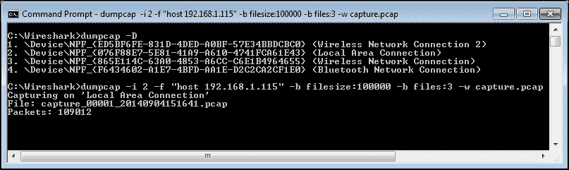
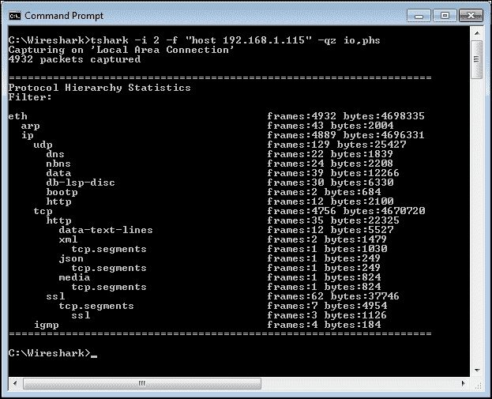
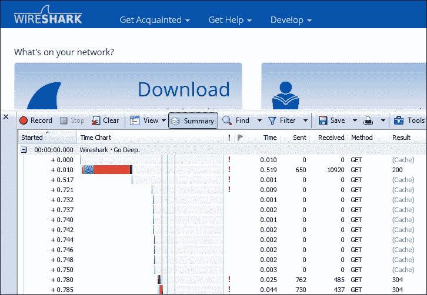
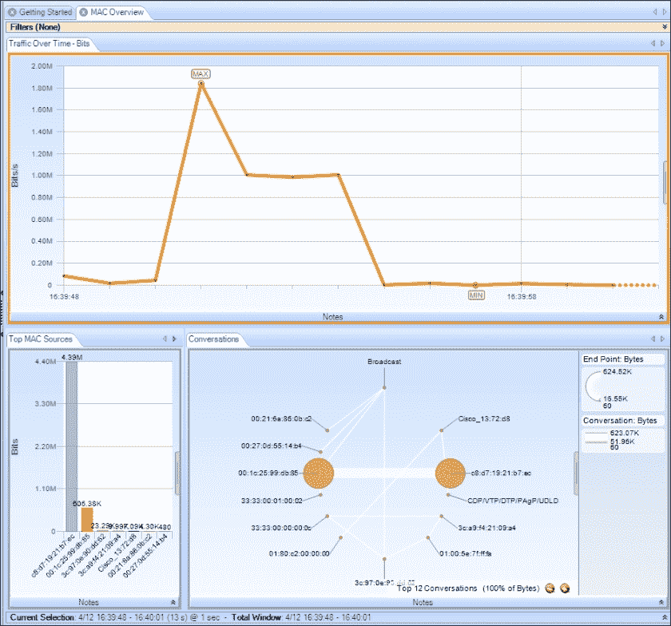
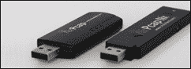

# 八、命令行和其他实用工具

Wireshark 包括许多命令行实用工具来操作数据包跟踪文件并提供无 GUI 的数据包捕获，还有一些其他工具可以帮助完善您的分析工具集。

本章将涉及的主题包括:

*   用 Dumpcap 和 Tshark 捕获流量
*   使用 Editcap 编辑跟踪文件
*   使用 Mergecap 合并跟踪文件
*   其他有用的工具

# Wireshark 命令行工具

安装 Wireshark 时，还会安装一系列的命令行工具，包括:

*   `capinfos.exe`:该打印跟踪文件的信息
*   `dumpcap.exe`:这个捕获数据包，保存到一个 libpcap 格式文件
*   `editcap.exe`:这个分割一个跟踪文件，改变的时间戳，并删除重复的数据包
*   `mergecap.exe`:该将两个或多个包文件合并成一个文件
*   `rawshark.exe`:这个读取一个包流并打印字段描述
*   `text2pcap.exe`:这个读取一个 ASCII 十六进制转储并写入一个 libpcap 文件
*   `tshark.exe`:这个捕获网络数据包或者显示保存的跟踪文件中的数据

`Wireshark.exe`文件启动您所熟悉的 GUI 版本，但是您也可以从带有许多参数的命令行启动 Wireshark 键入`Wireshark –h`查看选项列表和/或创建快捷方式来启动 Wireshark 的任何选项。

### 注意

将 Wireshark 程序目录添加到系统的`PATH`语句非常有用，这样您就可以从任何工作目录执行任何命令行实用工具。

# 使用 Dumpcap 捕获流量

`dumpcap.exe`文件是 Wireshark 实际上在后台运行的可执行文件，用于捕获数据包并将它们保存到 libpcap 格式的跟踪文件中。您可以在命令行上运行 Dumpcap，以避免使用 Wireshark GUI 并使用更少的资源。通过键入`dumpcap.exe -h`可以获得命令行选项列表。

一些最有用的选项如下:

*   `-D`:此打印可用接口和出口的列表
*   `-i <interface>`:该指定要捕获的接口的名称或索引号
*   `-f <capture filter>`:这个在 **Berkeley 包过滤器** ( **BPF** )语法中应用了一个捕获过滤器
*   `-b filesize`:这个是文件大小
*   `-w <outfile>`:这是保存文件的文件名

下面的屏幕截图显示了一个示例，查看接口列表，然后运行 Dumpcap，使用 IP 地址捕获过滤器(注意过滤器语法两边的引号)捕获特定接口，该过滤器配置为使用三个文件的环形缓冲区，文件大小为 100 MB，输出文件名源自`capture.pcap`:



你可以在[https://www.wireshark.org/docs/man-pages/dumpcap.html](https://www.wireshark.org/docs/man-pages/dumpcap.html)获得更多关于 Dumpcap 选项的信息。

# 用 Tshark 捕获流量

Tshark 可用于捕获网络数据包和/或显示来自捕获或先前保存的数据包跟踪文件的数据；数据包可以显示在屏幕上或保存到新的跟踪文件中。

用于使用 Dumpcap 执行基本捕获的相同语法也适用于 Tshark，因此我们在此不再赘述。然而，Tshark 提供了非常广泛的附加功能，具有相应的大量命令行选项，可以像在所有 Wireshark 实用工具中一样，通过在命令提示符中键入`tshark –h`来查看这些选项。

许多 Tshark 选项用于查看统计数据；下面的屏幕截图展示了一个命令语法和来自捕获的统计结果的示例(在按下 *Ctrl* + *C* 结束捕获之后):



你会在[https://www.wireshark.org/docs/man-pages/tshark.html](https://www.wireshark.org/docs/man-pages/tshark.html)的找到大量关于使用统计和其他 Tshark 选项的细节和例子。

# 用 Editcap 编辑跟踪文件

您可以使用 Editcap 将太大而无法在 Wireshark 中使用的跟踪文件分割成多个较小的文件，根据开始和停止时间提取 T2 跟踪文件的子集，修改时间戳，删除重复的数据包，以及许多其他有用的功能。

在命令提示符下键入`editcap –h`以获得选项列表。通过数据包编号提取单个数据包或一系列数据包的语法如下:

```
editcap  –r  <infile>  <outfile>  <packet#> [- <packet#>]

```

必须指定`<infile>`和`<outfile>`。`–r`指定保留而不是删除指定的数据包或数据包范围，例如:

```
editcap  –r  MergedTraces.pcapng   packetrange.pcapng   1-5000

```

您可以将一个源跟踪文件分割成多个连续的文件，每个文件包含由`–c`选项指定的数据包数量:

```
editcap  –c 5000  MergedTraces.pcapng   SplitTrace.pcapng

```

您可以消除一个文件中五个数据包附近的重复数据包:

```
editcap  –d  hasdupes.pcapng  nodupes.pcapng

```

如果您有两个跟踪文件，它们之间的时间跨度很大，并且您希望将它们合并到一个文件中，但是它们之间的距离更近，那么您可以在一个 IO 图或类似的分析函数中调查所有的数据包；您可以首先在其中一个文件上使用`–t`选项，将该文件中的时间戳调整一个常量(以秒为单位)。例如，要从跟踪文件的时间戳中减去 5 小时，请使用以下命令:

```
editcap  -t  -18000  packetrange.pcapng   adj_packetrange.pcapng

```

比较 Wireshark 中的两个跟踪会发现以下详细信息:

*   **调整前的包# 500**:`2014-09-04 15:27:38.696897`
*   **调整后的 500 号包** : `2014-09-04 10:27:38.696897`

你可以在[https://www.wireshark.org/docs/man-pages/editcap.html](https://www.wireshark.org/docs/man-pages/editcap.html)获得更多关于 Editcap 选项的信息和示例。

# 使用 Mergecap 合并跟踪文件

您可以使用 Mergecap 将两个或更多的跟踪文件合并成一个文件。基本语法如下:

```
mergecap –w <outfile.pcapng>  infile1.pcapng   infile2.pcapng  …

```

例如:

```
mergecap –w merged.pacap   source1.pcapng   source2.pcapng    source3.pcapng

```

在 Mergecap(和其他几个命令行实用工具)中，您有时可能想要使用的一个有用选项是`–s <snaplen>`。这将在每个帧的开始处截断指定长度的数据包，从而产生一个更小的文件；`<snaplen>`的典型值是 128 字节:

```
mergecap –w merged_trimmed.pcapng  -s 128  source1.pcapng  source2.pcapng

```

## Mergecap 批处理文件

如果您想要合并的采集文件有多种命名格式，您可以创建一个包含以下 Windows 批处理命令的`MergeTraces.bat`文件:

```
@echo off
cls
echo MergeTraces.bat
echo.
echo Merges multiple packet trace files with a .pcapng extension into one .pcapng file
echo.
echo Usage: Copy MergeTraces.bat into the directory with the .pkt files and execute
echo The utility will generate a 'MergedTraces.pcap' file 
echo and a 'MergedFileList.txt' file which lists the .pcapng files processed.
echo.
echo.
echo IMPORTANT!! You must type 'CMD /V:ON' from this window which enables 
echo 'Delayed environment variable expansion' in order to properly execute
echo this batch utility.
echo.
echo You must also add the path to Wireshark's mergecap.exe to your path statement.
echo.
echo If you've not done this, Type Ctrl-C to exit; Otherwise
pause
echo.
echo Deleting old MergedFileList.txt...
if exist "MergedFileList.txt" del MergedFileList.txt
for %%f in (*.pcap-ng) do echo "%%f" >> MergedFileList.txt
echo Deleting old MergedTraces.pcapng...
if exist "MergedTraces.pcapng" del MergedTraces.pcapng
echo Preparing to merge:
echo.
type MergedFileList.txt
echo.
echo Merging..........
set FILELIST=
for %%f in (*.pcap-ng) do set FILELIST=!FILELIST! %%f
:: DEBUG
:: echo %FILELIST%
mergecap -w MergedTraces.pcapng %FILELIST%
echo.
if exist MergedTraces.pcapng @echo Done!
if NOT exist MergedTraces.pcapng @echo Error!! -- Check your settings.
echo.

```

将批处理文件复制到仅包含您想要合并的包跟踪文件的目录中，并执行它。批处理文件会将所有的`.pcapng`文件合并成一个名为`MergedTraces.pcapng`的文件。这比试图在命令行中指定一长串唯一的源文件要容易得多，尤其是在文件名包含日期时间戳的情况下。如果需要处理`.pcap`文件，在批处理命令中把`.pcapng`的所有实例都改成`.pcap`；您也可以根据需要更改输出文件名。

### 注意

您也可以通过单击并拖动文件到 Wireshark 桌面来合并跟踪文件。从 Wireshark **文件**菜单中选择**合并**后，文件将根据时间戳按时间顺序合并。只要文件的总大小不超过 1GB，这种方式就能很好地工作。

你可以在[https://www.wireshark.org/docs/man-pages/mergecap.html](https://www.wireshark.org/docs/man-pages/mergecap.html)获得更多信息和 Mergecap 选项的示例。

# 其他有用的工具

Wireshark 是一个极其通用和有用的工具。然而，有些事情它并不容易做或者根本不做，所以我们将讨论一些您可能希望包含在您的分析工具集中的其他工具。

## HttpWatch

HttpWatch 是一个基于数据包的性能分析工具，它与 Internet Explorer 和 Firefox 浏览器集成，以查看浏览器和网站之间 HTTP 交互的图形描述和统计值。这种实用工具使得从用户的角度发现和测量重大延迟以及这些延迟的来源变得容易。

下面的截图显示了通过加载[www.wireshark.org](http://www.wireshark.org)主页进行的 HttpWatch 可视化和数值分析:



你可以从[http://www.httpwatch.com/](http://www.httpwatch.com/)获得更多关于 HttpWatch 的信息。另外，一个类似的性能分析工具是 Fiddler，可以在【http://www.telerik.com/fiddler】的[找到。](http://www.telerik.com/fiddler)

## SteelCentral 数据包分析器个人版

SteelCentral 数据包分析器(以前称为 Cascade Pilot)有标准版和个人版两种版本。与 Wireshark 不同的是，这个实用工具能够打开和分析数千兆字节的跟踪文件；您可以快速隔离感兴趣的对话，右键单击该对话，并将该对话保存在单独的数据包跟踪文件中，或者直接启动 Wireshark，并从同一菜单将该对话传递给它。

此外，实用工具提供了各种称为**视图** 的网络分析屏幕，这些屏幕提供了各种性能视角的图形显示和报告。以下截图展示了一组 **MAC 概述**视图:



您可以在[http://www . riverbed . com/products/performance-management-control/network-performance-management/Packet-analysis . html](http://www.riverbed.com/products/performance-management-control/network-performance-management/packet-analysis.html)获得更多关于 SteelCentral 数据包分析仪产品的信息。

## air cap 适配器

如果您正在使用 Wireshark 来分析无线网络，您将需要一个无线适配器，该适配器能够查看所有可用的信道，并提供一个 Radiotap 报头，该报头提供每帧的附加信息，如无线信道和信号/噪声强度。

在 Windows 平台上与 Wireshark 或 SteelCentral Packet Analyzer 配合使用的常见无线适配器是**Riverbed air cap 适配器**，可从 Riverbed 网站获得。AirPcap 适配器插入 USB 端口，并包括与 Wireshark 集成的驱动程序，并提供 Radiotap 报头信息。有几个产品模型提供了各种 WLAN 频带的不断增加的覆盖范围；AirPcap Nx 提供了最广泛的覆盖范围。下图描述了两种可用的适配器:



您可以在[http://www . Riverbed . com/products/performance-management-control/network-performance-management/wireless-packet-capture . html](http://www.riverbed.com/products/performance-management-control/network-performance-management/wireless-packet-capture.html)获取更多关于 Riverbed AirPcap 适配器的信息。

# 总结

本章涵盖的主题包括 Wireshark 的几个命令行实用工具，用于捕获数据包、编辑和合并数据包跟踪文件，以及补充您的分析工具集的几个有用工具。

这是本书关于 Wireshark 的最后一章。我希望您喜欢阅读它，更重要的是，我希望您将它作为成为 Wireshark 专家的基础！