# 一、Wireshark 入门——是什么、为什么以及如何入门？

嗅探和解释网络上的流量已经并将永远是网络分析器工作中不可或缺的一部分。它不仅仅限于网络分析器的职业，而且在软件开发、网络安全和数字取证领域也发挥着重要作用。Wireshark 是大多数工作场所的首选工具，其受欢迎程度和功能似乎不会降低，因此使其成为“必备”工具。本章简要介绍了:

*   嗅探及其目的
*   贸易工具
*   使用 Wireshark 开始运行

# 嗅

根据定义，嗅是用我们的嗅觉去品味某样东西，比如闻到香水的味道。在这种情况下，我们的鼻子充当了嗅探器的角色。我们可以使用被归类为数据包嗅探器的各种工具在网络上执行嗅探，以捕获或收集网络中流动的数据包。它们只是我们查看整个 IT 基础架构上的网络流量和带宽信息的一种方式。使用数据包嗅探器来嗅探通过有线或稀薄空气(无线)传输的数据的技术称为数据包嗅探。

## 嗅的目的

执行数据包嗅探是为了更好地了解流经我们网络的内容。正如流经人体血管的毒素有可能杀死一个人一样，流经我们网络的恶意流量也会对网络设备、性能和业务连续性产生严重的、有时是不可挽回的影响。

嗅探有助于网络分析器验证网络和网络安全设备(如路由器、交换机、防火墙、IDS 或 IPS)的实施和功能是否符合预期，并确认数据是否通过安全的通信通道传输。

安全在出现安全漏洞的情况下，分析器使用嗅探来收集有关攻击来源、攻击时间和持续时间、涉及的协议和端口号以及为攻击目的而传输的数据的证据。它还有助于证明用于传输敏感信息的任何不安全协议的使用。

正如英国出生的美国作家克里斯托弗·希钦斯曾经说过的那样:

> “没有证据就能断言的，没有证据就能驳回。”

使用数据包嗅探器有助于我们获得证据。

## 数据包分析

现在，找出香水的气味是令人愉快的、美味的还是难闻的是分析的一部分。因此，解释和分析流经网络的数据包的技术被称为数据包分析或网络分析。掌握这项技能是一项久经磨练的技能，如果网络管理员对 TCP/IP 协议套件有扎实的理解，熟悉数据包流，并对所选择的嗅探器有很好的掌握，就可以实现。

学习数据包级别的技术有助于巩固最难的概念。举个简单的例子，假设一个用户想要浏览一个名为`example.com`的网站。一旦用户在地址栏中输入 URL 并点击 **GO** ，数据包就开始根据该请求在网络上流动。为了理解这个数据包流，我们需要开始嗅探来查看传输中的数据包。下面的截图显示了用户打开`example.com`时穿越网络的数据包。

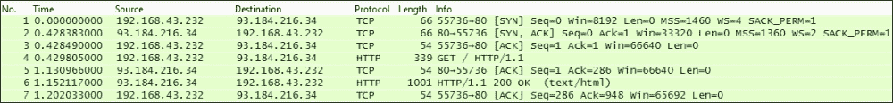

我们可以在使用选择的嗅探器捕获数据包后对其进行分析，在我们的例子中，我们会注意到告诉我们源和目的 IP 地址、使用的协议、单个数据包的长度以及其他相关信息的列。随着这本书的进展，我们将深入更详细的分析。

当我们谈论企业网络时，在任何给定的时间点，网络上都有海量的流量，分析这样的流量不是在公园里散步。这种流量可能是由相互通信的大量网络设备、响应用户请求或在需要时通过互联网发出自己的请求的服务器以及试图完成日常工作任务的最终用户产生的。没有比执行数据包级分析更好的理解信息流的方法了，正如网络分析中的一句名言所说的那样，*数据包从不说谎*。此外，Wireshark 的幕后黑手 Gerald Combs 曾发推文如下:

> “数据包永远不会说谎”，但是随着流量的增加，你最终会得到一万亿个真相。诀窍在于找到重要的问题。”

像 IT 领域的其他事情一样，学习这些技巧需要经验。举个例子，如果你想提高你的编程技能，你必须日复一日地练习写代码，以便能够写出结构化的和优化的代码，这些代码能够发挥魔力。数据包分析也是如此。

数据包分析可以进一步帮助管理员:

*   监控并提供网络活动的详细统计数据
*   区分正常流量和异常流量
*   执行网络诊断
*   识别并解决网络性能问题，如带宽利用率过高
*   进行深度数据包检测
*   调查安全漏洞

# 贸易的工具

市场上有许多免费的和商业的数据包嗅探器，通常被称为网络分析器，选择一个最符合您需求的是一个选择的问题。决定这一点有几个因素，如使用的操作系统、支持的协议集、易用性、可定制性，当然还有预算。以下是比较受欢迎的几个:

*   Tcpdump : Tcpdump 是一个免费且流行的命令行数据包捕获实用工具，在没有基于 GUI 的工具的情况下，它非常方便。然而，即使在通过 tcpdump 捕获流量之后，用户也可以使用任何基于 GUI 的免费或商业工具来分析和解释流量，因为这在视觉上很容易。参见[http://www.tcpdump.org/manpages/tcpdump.1.html](http://www.tcpdump.org/manpages/tcpdump.1.html)处的 TCPDUMP 概述。
*   **Nagios Network Analyzer 和 OmniPeek** :这些是商业级网络分析仪，为组织提供数据包分析能力，并具有一些自己独有的功能。这些产品的定价可以在他们的个人网站上看到。
*   Wireshark : Wireshark 的前身是 Ethereal，是免费的开源软件，是目前最流行的数据包分析器。它跨多个平台工作，并通过一个易于使用的 GUI 支持大量的协议族。参见[http://wiki.wireshark.org/ProtocolReference/](http://wiki.wireshark.org/ProtocolReference/)。

除了我们刚刚介绍的专用嗅探器工具之外，包嗅探功能和模块集成在许多流行的安全相关工具中，例如 Snort、Metasploit 和 Scapy 等等。Snort 最初是一个嗅探器，后来利用其嗅探能力发展成为我们今天所知的流行的**网络入侵防御系统** ( **NIPS** )和**网络入侵检测系统** ( **NIDS** )解决方案。

另一个例子是 Metasploit 中的`sniffer`模块。使用 Metasploit 成功危害机器后，用户可以执行该模块，并开始嗅探危害机器上的通信量，以便进一步枚举。Metasploit 提供的嗅探选项如下所示:

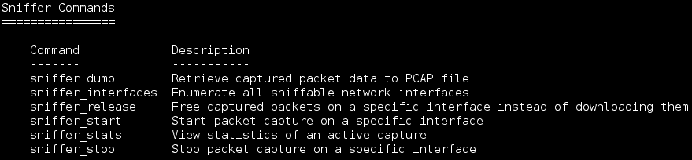

另一个很好的选择是在 Scapy 中使用`sniff()`。Scapy 是一个用 Python 编写的包操作工具，可以用来生成、处理和解码包并捕获它们。它在许多与安全测试相关的活动中很有帮助。

这本书的重点是“Wireshark”。那么，我们开始吧。

# Wireshark 是什么？

正如前面所讨论的，Wireshark 是最受欢迎的数据包分析器，它的大量粉丝背后是有原因的。它拥有大量功能，支持大量常见和不常见的协议，具有易于导航的 GUI，可以在流行的操作系统上轻松安装和使用，如 Windows、Linux 和 Mac OS X，完全免费。

Wireshark 可以从官网([http://www.wireshark.org](http://www.wireshark.org))下载安装。安装设置相对简单，只需点击几下鼠标，您就可以在 Windows 机器上启动并运行 Wireshark。

### 注意

Windows、Unix 和 Mac OS X 的安装指南可以在[https://www . wireshark . org/docs/wsug _ html _ chunked/chapterbuildinstall . html](https://www.wireshark.org/docs/wsug_html_chunked/ChapterBuildInstall.html)找到。

在撰写本文时，最新版本是 Wireshark 1.12.6。下载并安装后，您应该能够启动 Wireshark，并且会出现一个类似如下所示的屏幕:

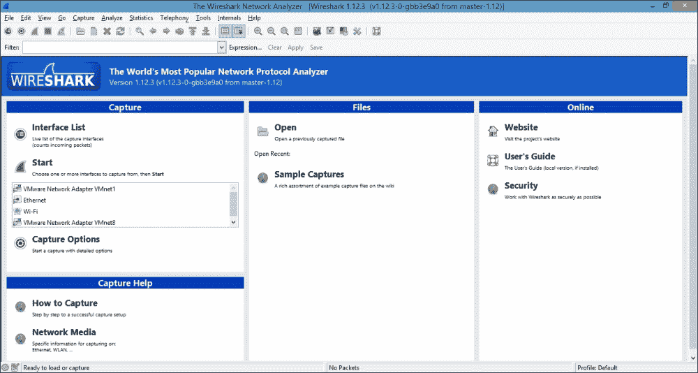

# Wireshark 接口–开始捕获之前

让我们从 Wireshark 接口的各个方面开始。

## Title

这个包含 Wireshark 的默认标题以及当前使用的版本。要启用或禁用标题，请导航至**编辑** | **首选项** | **用户界面**并修改选项**欢迎屏幕和标题栏显示版本**以满足您的要求。要修改标题，请导航至**编辑** | **首选项** | **用户界面** | **布局**，并在**自定义窗口标题**字段中输入合适的标题，如下图所示:

### 注意

注意:这将被附加到当前标题，如前面的屏幕截图所示。

## 菜单

菜单栏包含了 Wireshark 的所有特性，这些特性都被分类在合适的标题下。在本书的过程中，这些选项将在需要时被采用。例如，您可以通过导航到**帮助** | **关于 Wireshark** 并选择**作者**选项卡来查看参与 Wireshark 开发的作者。

这就是它的样子:

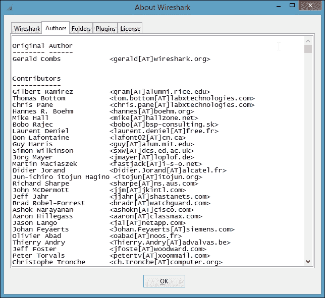

## 主工具栏

主工具栏包含 Wireshark 中更常用项目的图标。您会注意到有些选项是灰色的。这是因为在当前上下文中并非所有选项都可用。一旦我们开始捕获，我们将看到它们中的大部分被突出显示并可供使用。

## 过滤工具栏

过滤流量可以帮助分析器大海捞针。Wireshark 中有两种类型的过滤选项。一个叫做 **捕获滤镜**，第二个叫做**显示滤镜**。

捕获过滤器定义哪些帧将被捕获并发送到 Wireshark 的捕获引擎进行处理，然后在 Wireshark 中显示，而显示过滤器定义哪些帧在被捕获后显示。我们可以重新定义显示过滤器，而不需要重新开始捕获，这不是捕获过滤器的情况；因此，我们需要谨慎使用它们。侧面的**表达式**选项帮助我们以一种简单的方式创建过滤器表达式，因为有一个巨大的过滤器列表，我们不需要浪费时间去记忆它们。

Wireshark 通过提供我们使用的过滤器是否正确(被 Wireshark 接受)的视觉指示器，通过将背景颜色更改为*红色*(错误的过滤器表达式)和*绿色*(正确的过滤器表达式)来提供帮助，如下面的屏幕截图所示:

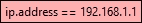

错误的过滤器

正确的过滤器应该是这样的:

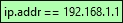

正确的过滤器

### 注意

您可能会注意到，有时过滤器显示黄色背景。这可能是因为您输入的筛选表达式没有按预期工作。一个例子是使用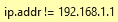代替正确的滤波器，即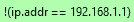。

一旦过滤器表达式准备就绪，您可以按**进入**，或者点击**应用**将该过滤器应用于所选的数据包列表，并且您可以通过点击**清除**来移除当前的过滤器表达式。

### 注意

在大型捕获中应用*显示过滤器*可能需要一些时间，并且进度是可见的。

在花了一些时间创建过滤器后，您会注意到您使用多个`AND` ( `&&`)和`OR` ( `||`)语句组合了许多过滤器，并且还想在另一个捕获文件中使用相同的过滤器表达式。为此，您可以使用过滤器工具栏最右侧的**保存**按钮在 Wireshark 中保存过滤器。

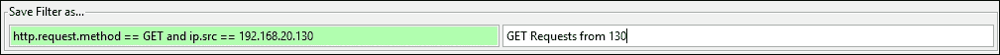

过滤以仅查看 192.168.20.130 发出的 HTTP GET 请求

## 捕获帧

这个帧有助于识别开始捕获数据包的接口以及这些接口的相关选项。

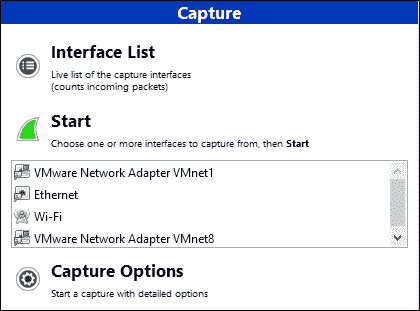

这里，在捕获帧，我们有三种方式开始捕获:

*   **接口列表**:如果你不确定用于捕获的活动接口，选择这个选项是一个不错的选择，因为它给你一个可用接口、使用中的 IP 地址和每个接口传输的数据包数量的完整列表。使用这些信息，我们可以很容易地确定使用哪个接口来捕获流量。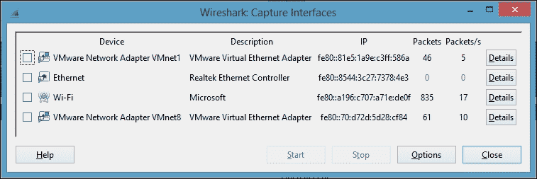简单来说就是界面，点击**开始**开始抓图。

    ### 注意

    您可以选择在开始捕获之前点击**选项**.然而,这将打开在**捕获选项**中讨论的相同捕获选项

*   **开始**:如果你知道有问题的网络接口，这是最简单和最快的开始捕获的方法。您只需从可用的接口列表中选择接口，然后点击**开始**。
*   **Capture Options**: This is an advanced way to start a capture, as it provides tweaking capabilities before a capture is even started.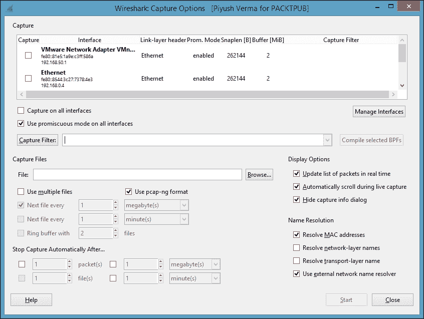Here you can  an individual interface to capture or **Capture on all interfaces**, to do exactly what it says.

    通过单击捕获过滤器，您可以在捕获开始前选择/创建任何过滤器。在此之后，您可以调整一些选项来执行无人值守的捕获。例如，我们希望创建多个 200 KB 的文件，并在 2 分钟后自动停止捕获。下面的屏幕截图显示了这是如何做到的:

    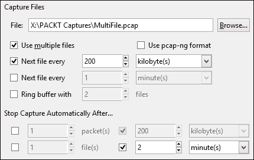

    为多个文件配置

    以下是生成的文件:

    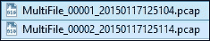

    多个文件

### 注意

Wireshark 以`FileName_FileNumber_YEARMMDDHRMINSEC.pcap`格式保存文件名。

关于此框架上其他选项的详细信息，请访问[https://www . wireshark . org/docs/wsug _ html _ chunked/chcapcaptureoptions . html](https://www.wireshark.org/docs/wsug_html_chunked/ChCapCaptureOptions.html)。

## 捕获帮助

以下是**捕获帮助**菜单的外观，稍后我们将看到该菜单下可用选项的描述。

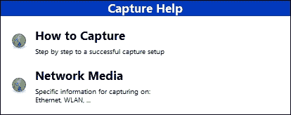

在这里，我们有两个选项可以帮助我们高效地使用 Wireshark 进行捕获。单击这些选项会将用户重定向到:

*   当读者点击**如何捕获**时，他们将被重定向到[http://wiki.wireshark.org/CaptureSetup](http://wiki.wireshark.org/CaptureSetup)。
*   当读者点击**网络媒体**，他们将被重定向到[http://wiki.wireshark.org/CaptureSetup/NetworkMedia](http://wiki.wireshark.org/CaptureSetup/NetworkMedia)。

## 文件菜单

下面的是**文件**菜单的样子，稍后我们将看到该菜单下可用选项的描述。

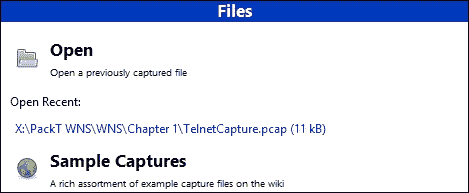

该菜单提供了以下选项:

1.  浏览并打开已经捕获的跟踪文件。
2.  单击并打开任何最近打开的文件。此处列出的最近文件的数量可以通过转到**编辑** | **首选项** | **用户界面**然后编辑**最大最近文件数**选项至所选值进行修改。
3.  在官方网站([http://wiki.wireshark.org/SampleCaptures](http://wiki.wireshark.org/SampleCaptures))下载样本采集文件。

## 在线

顾名思义，点击此类别下列出的选项会将我们重定向到 Wireshark 的在线资源。

## 状态栏

状态栏用于显示信息性消息。它分为以下三个部分:

*   状态栏的左侧显示与上下文相关的信息，其中包括指示当前专家信息级别的彩色项目符号，以及编辑或添加捕获注释的选项。
*   中间部分显示了当前的数据包数量和加载时间。
*   状态栏的右侧显示当前使用的配置描述文件。默认情况下，存在三种配置文件[ **默认**、**蓝牙**和**经典** ]，用户可以随时根据需要创建和使用新的配置文件。

    状态栏

# 第一次数据包捕获

让我们按照以下步骤使用 Wireshark 从第一个数据包捕获开始:

1.  启动 Wireshark
2.  选择正确的接口来捕获流量。这可以通过导航到菜单栏并点击**捕获** | **接口**来完成(作为一种快捷方式，我们可以选择 *Ctrl* + *I* )。一旦我们打开了**Wireshark:Capture Interfaces**窗口，执行以下步骤:

    1.  选择面向互联网的接口(例如，在我的例子中是 Wi-Fi)。窗口右侧的**数据包**和**数据包/秒**栏是活动界面的一个很好的指示，如下图所示: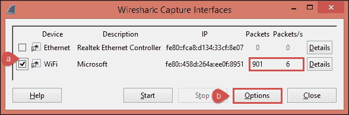
    2.  选择接口后，点击**选项**按钮，如截图中突出显示的，弹出 **Wireshark:捕获选项**窗口，如下图所示: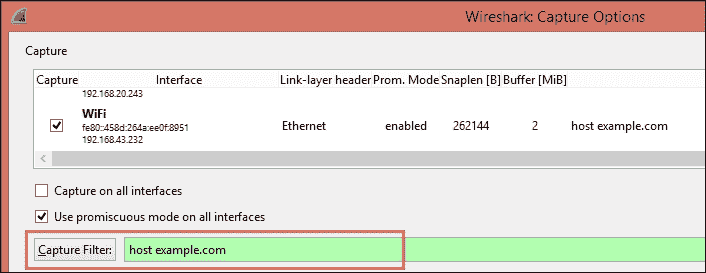在**捕获过滤器**字段中输入`host example.com`，因为我们只想捕获进出域`example.com`的流量,并点击**输入**键。我们将在下一章详细讨论捕获过滤器

3.  下一步是让 Wireshark 在后台运行，打开你选择的浏览器(例如，在我的例子中是 Mozilla Firefox)并浏览`example.com`。
4.  Once `example.com` loads, navigate to Wireshark, and stop the packet capture, by clicking on the **Stop** button  in the main toolbar. Once stopped, the capture appears as shown in the following screenshot: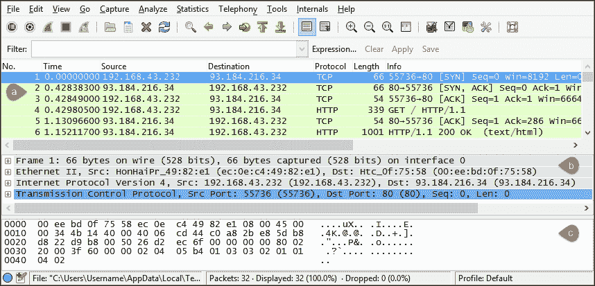

    在前面的截图中，我们可以看到 Wireshark 的菜单栏、主工具栏和过滤器工具栏，后面是三个不同的窗格和状态栏。这三个窗格如下:

    1.  **数据包列表窗格**:该窗格反映 Wireshark 捕获的数据包以及这些数据包的一些基本细节。例如，我们捕获的第一个数据包是从客户端到服务器的三次握手的 SYN 数据包。

        ### 注意

        请注意,此窗格下显示的数据包可能会受到过滤器工具栏中使用的显示过滤器的影响

    2.  **Packet Details pane**: If we select any packet in the Packet List pane, its details are shown under this pane. For example, after selecting the first packet in our capture, we can look at the packet at a more granular level, that is, the changes it undergoes at different layers of networking (for example, source and destination ports under the Transmission Control Protocol (TCP), that is, the Transport layer of the TCP/IP model).

        此窗格以树格式显示协议和协议字段，并且当当前数据包与同一捕获中的另一个数据包有关系时，还会显示任何链接(例如，单个通信的请求和响应关系)。

    3.  **数据包字节窗格**:该窗格以十六进制转储格式显示所选数据包的字节，并受前一窗格即**数据包详情**窗格所选内容的影响。

5.  最后一步是保存捕获的数据包。我们可以通过导航到菜单栏，点击**文件** | **保存**，并在您选择的目录中以适当的名称保存。

恭喜你！这样，我们就成功地捕获并保存了我们的第一个跟踪文件。

# 总结

在本章中，我们回顾了嗅探的基础及其在现实世界中的实际重要性，可供我们使用的执行嗅探的不同工具，以及了解 Wireshark GUI 以快速开始嗅探并执行我们的第一个数据包捕获。我们将在下一章开始分析部分。