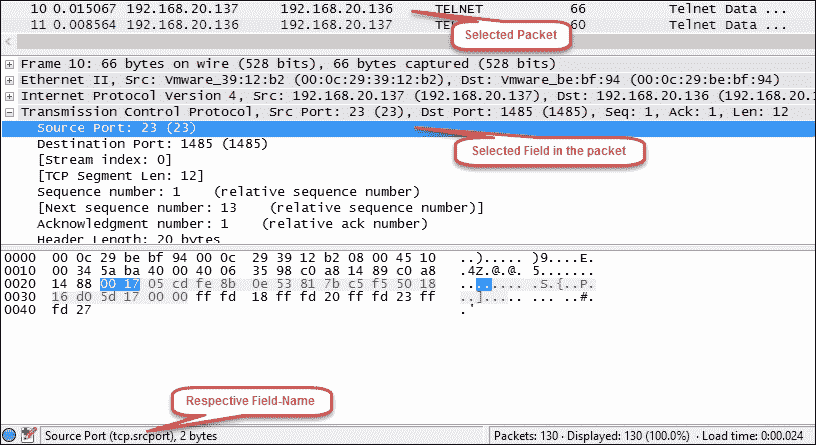
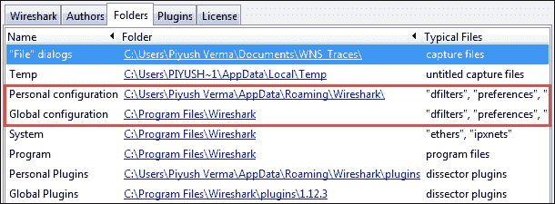
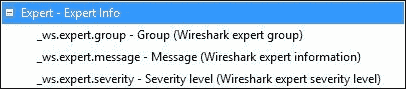

# 二、调整 Wireshark

不言而喻，一旦你开始在一个繁忙的网络上嗅探，你将被大量的流量淹没，你很快就会失去你所寻找的东西并寻求帮助。因此，理解嗅探器的不同特性变得至关重要。本章将在使用 Wireshark 分析多个跟踪文件时重点介绍这些功能。在本章结束时，您将对以下内容感到满意:

*   在 Wireshark 中使用过滤器
*   创建多个配置文件
*   使用先进的技术
*   使用 Wireshark 预装的实用工具执行命令行 fu

# 通过 Wireshark 过滤

过滤器类似于程序员/开发人员在编写代码时使用的条件。如果我们只想看到`TelnetCapture.pcap`文件中的 ARP 数据包，我们将在**过滤器**工具栏中为 ARP 和*应用一个条件，如果*当前文件包含 ARP 数据包，它们将被显示*否则*根本看不到任何数据包。


仅显示 ARP 流量

Wireshark 的当前稳定版本 1.12.6 总共包括 13 个默认捕获过滤器和 15 个默认显示过滤器。要查看可用的捕获过滤器列表，我们可以进入菜单栏，点击**捕获** | **捕获过滤器...**，并查看可用的显示过滤器，点击**过滤器**工具栏上的**过滤器**按钮。我们可以按原样使用它们，也可以将它们用作模板，并对它们进行定制，以添加/创建新的模板来满足我们的需求。


Wireshark 中可用的默认捕获过滤器

Wireshark 提供了以下两种类型的过滤选项:

*   捕获过滤器
*   显示过滤器

### Tip

捕获和显示过滤器的语法是不同的。捕获过滤器使用 **Berkeley 包过滤** ( **BPF** )过滤器语法也使用 by **tcpdump** ，而显示过滤器使用 Wireshark 的专用显示过滤器格式。要深入了解这些过滤器，请访问以下 URL:

捕获滤镜:[http://wiki.wireshark.org/CaptureFilters](http://wiki.wireshark.org/CaptureFilters)

显示过滤器:[http://wiki.wireshark.org/DisplayFilters](http://wiki.wireshark.org/DisplayFilters)

## 捕获过滤器

捕获过滤器在任何界面上开始捕获之前使用，不能应用于现有的捕获文件。

当我们确切地知道我们在寻找什么时，没有什么比捕获过滤器更好的了。例如，当我们需要排除网络上与 **动态主机配置协议** ( **DHCP** )相关的问题，并且不关心网络上的任何其他帧时，那么我们可以应用下面的捕获过滤器:`port bootpc`，并且我们将看到的只是网络上的 DHCP 流量，而不是其他。

### 注意

从技术上讲，所有流量首先通过捕获过滤器，然后转发到捕获引擎进行进一步处理。如果应用了捕获过滤器，符合条件(捕获过滤器)的帧将被转发到 Wireshark 的**捕获引擎** ，其余的将被完全丢弃。这是使用捕获过滤器的主要好处，因为它减轻了计算机解析任何无用帧的负担。但这是一把双刃剑，我们在应用捕获过滤器时需要小心，因为我们不想丢弃任何从分析角度来看可能很重要的帧。

在武器库中拥有一套优秀的捕获过滤器可以帮助我们快速定位网络上的任何异常。

### 注意

关于快速解决网络问题，需要注意的另一个要点是将分析仪放置在正确的位置，即**位置**。例如，如果网络上的许多客户端抱怨网络性能，那么将分析器放在离服务器更近的地方将是一个很好的开始，而不是在每个客户端进行分析。

以下是捕获过滤器的列表:

除了前面提到的默认的一组捕获过滤器之外，您的武器库中还有许多方便的捕获过滤器。它们如下:

| 

捕获过滤器

 | 

描述

 |
| --- | --- |
| `ether host <Client's MAC> and ether host <Server's MAC>` | 仅客户端和服务器流量，基于各自的 MAC 地址 |
| `port bootpc` | 仅 DHCP 流量 |
| `vlan <vlan-id>` | 对于特定的 VLAN |
| `ip6` | 仅 IPv6 流量 |
| `ip proto 1` | 仅 ICMP 流量 |
| `port ftp` | 仅 FTP 流量 |
| `not port 3389` | 排除 RDP 流量 |
| `udp dst port 162` | SNMP 请求 |

到生成捕获过滤器的有用链接是[https://www.wireshark.org/tools/string-cf.html](https://www.wireshark.org/tools/string-cf.html)。

### Tip

每当您不确定使用哪种捕获过滤器时，建议从不太严格的捕获过滤器开始，或者根本不使用捕获过滤器，然后使用显示过滤器缩小问题范围。一个例子是使用捕获过滤器`udp dst port 162`和显示过滤器`snmp.community`来查看 SNMP 请求中的社区字符串。

## 显示过滤器

显示过滤器主要用于分析已经捕获的数据包。但是，它们也可以在捕获时使用，因为它们不限制被捕获的数据包，它们只是限制可见的数据包数量。

现在，有时我们不想在开始数据包捕获之前应用任何过滤器，而是需要捕获通过我们网络的所有内容。

例如，每当网络上触发安全事件时，我们必须捕获网络上流动的所有数据包，然后使用 Wireshark 等数据包/网络分析工具分析和重建事件，这一点非常重要。在分析过程中，我们可能需要根据某些条件过滤掉流量，例如基于 IRC 的通信或跟踪上传到另一个国家的服务器的 FTP。为此，Wireshark 提供了**显示过滤器**，让生活变得更加轻松。显示过滤器允许我们最大限度地利用 Wireshark 解析器，它负责解码和解释每个数据包的字段。

Wireshark 中有大量的显示过滤器，幸运的是，记住它们并不是我们应该做的。如果我们碰巧知道字段名，我们可以点击**过滤器**工具栏中的**表达式**，并通过从协议子树中选择**字段名**、**字段名**和**字段值**之间的关系手动创建一个表达式，然后最后给它赋值。


Wireshark 的过滤器表达式窗口

另一种方法是简单地选择特定的数据包，在**数据包详细信息**窗格中定位我们正在寻找的字段，过滤器的相应**字段名**将在底部的状态栏中突出显示。

例如，我们可以看到下面的截图，其中我们试图找到用于过滤基于 TCP 源端口 23 的流量的**字段名称**。



最终过滤器如下所示:


源端口 23 的显示过滤器[TCP]

### 显示过滤器的列表

下面的表格显示了一组方便的显示过滤器:

| 

显示过滤器字段名称

 | 

描述

 |
| --- | --- |
| `ip.addr` | 进出 IP 地址的流量 |
| `eth.addr` | 进出以太网地址的流量 |
| `tcp.port` | 指定一个 TCP 端口 |
| `frame.time_delta` | 距离前一个捕获帧的时间增量 |
| `http.request` | 仅 HTTP 请求 |
| `arp.src.proto_ipv4` | ARP 数据包中的发送者 IP |
| `tcp.analysis.ack_rtt` | 往返时间 |
| `tcp.analysis.retransmission` | 显示所有重新传输 |
| `icmp.type` | ICMP 数据包的类型 |
| `wlan.addr` | 硬件地址[以太网或其他 MAC 地址] |

有关显示过滤器的更全面列表，您可以参考以下链接:

*   [https://www.wireshark.org/docs/dfref/](https://www.wireshark.org/docs/dfref/)
*   [http://packet life . net/media/library/13/Wireshark _ Display _ filters . pdf](http://packetlife.net/media/library/13/Wireshark_Display_Filters.pdf)

# Wireshark 档案

随着我们对 Wireshark 的使用越来越熟悉，我们将在此过程中创建几个过滤器，其中一些在关键情况下会非常简洁和有用。此外，当修复特定问题需要使用多个显示和/或捕获过滤器、各种彩色化方案来突出显示流量中的坏的/意外的帧以帮助在视觉上区分这种流量，以及定制的偏好设置和布局改变时，将会出现这种情况。因此，为攻击场景、故障排除或任何特定情况创建我们自己的配置文件始终是一个不错的选择。

要查看 Wireshark 中当前使用的配置文件，请查看状态栏的右下角。到目前为止，我们已经使用了默认的概要文件。

## 创建新的个人资料

要创建一个新配置文件，请在键盘上按下*Ctrl*+*Shift*+*A*组合键，然后点击 **New** ，或者转到**Edit**|**Configuration****Profiles****。**我们也可以右击状态栏中的 **Profile** 区域，选择 **New** 。

下面的截图显示了为不同场景创建的多个配置文件，加上**切换到**选项，这使得在多个配置文件之间快速切换变得容易:


新创建的配置文件会突出显示

每个配置文件配置位于本地不同的文件夹中。要找到文件夹的位置，只需进入**帮助** | **关于 Wireshark** 并选择**文件夹**选项卡。



在前面的屏幕截图中，突出显示的部分包含个人和全局配置文件的文件夹位置。

### 注意

为了在另一个系统上使用您的定制配置文件，只需将整个`profiles`文件夹复制并粘贴到另一个系统的`profiles`文件夹中。

# Wireshark 中的基本技术

在深入包分析之前，本节介绍的技术将为您提供将要处理的内容的基本知识；从数据包分析的角度来看，这些技术非常重要。这些大多属于菜单栏下的**统计**菜单，如下图所示:


统计类别下的众多选项

## 汇总窗口

要在 Wireshark 中访问的**摘要**窗口，请进入菜单栏中的**统计**并选择**摘要**。**汇总**窗口包括以下内容:

*   文件详细信息
*   时间详情
*   捕获细节
*   显示详细信息

从这里可以推断出一些重要的细节:

*   捕获时间和持续时间
*   操作系统和 Wireshark 的版本详细信息
*   捕获接口
*   使用的任何捕获/显示过滤器
*   平均包/秒，平均包大小
*   平均字节/秒

## 协议层级窗口

要查看该视图，请进入菜单栏中的**统计** 并选择**协议层级**。本节为我们提供了当前打开的捕获文件中的协议分布，如下所示:


来自 TelnetCapture.pcapng 的协议层次结构统计信息

## 对话窗口

对话是两个实体或端点之间的通信。对话可以发生在不同的层上，如 MAC 层、网络层和传输层。要查看对话，请前往**统计** | **对话**。


WebBrowsing.pcap 的对话窗口

如果我们将移动到 **TCP** 选项卡，我们将看到允许我们跟踪 TCP 流和创建图表的选项。

## 端点窗口

一个端点只是对话的一方，它可以是以太网、IPv4 和其他选项，这些选项在**端点**窗口中显示为选项卡。导航到**统计** | **端点**查看**端点**窗口。

当我们导航到**端点**窗口的 **IPv4** 选项卡时，它向我们显示了新的列，如**国家**、**城市**、**纬度**和**经度**。为了让这些列反映这些值，我们需要首先配置 GeoIP 服务。按照后面提到的步骤在 Wireshark 中配置 GeoIP。

以下是在 Wireshark 1.12.6 中配置 GeoIP 的步骤:

1.  Download the GeoIP database. Since Wireshark does not prepackage its own set of GeoIP database(s), we will need to download a GeoIP database from [http://geolite.maxmind.com/download/geoip/database/](http://geolite.maxmind.com/download/geoip/database/). This URL points to a freely available version of GeoIP database; however, you may also choose to buy it, if interested.

    从前面提到的 URL 下载 GeoLite Country 和 GeoLite City 的二进制/gzip 文件，并将这些文件解压缩并保存在选择的目录中。提取后，它们将如下所示:

    
2.  Point Wireshark to the directory containing the GeoIP database. Launch Wireshark and navigate to **Edit** | **Preferences** and select **Name Resolution** under **User Interface** menu on the left-hand side of the window and click on **Edit** where it mentions **GeoIP database directories**, as highlighted in the following screenshot:

    点击**编辑**后，我们将看到 **GeoIP 数据库路径**窗口，需要按照下面截图中突出显示的步骤来提及保存 GeoIP 数据库的目录路径，在我的例子中是`D:\GeoIP`。

    

    选择路径后，点击**确定**，然后再次点击 **GeoIP 数据库路径**窗口中的**确定**，以应用路径更改，最后点击 **Wireshark 首选项**窗口中的最后一个**确定**。

3.  关闭 Wireshark 并重新启动它。
4.  Open any trace file of choice, navigate to the **Endpoints** window, and click on **Map**, as highlighted in the following screenshot:

    通过点击**地图**，Wireshark 使用纬度和经度值，动态创建地图。下面的截图反映了一个鸟瞰图，但是，如果我们放大，我们将能够看到黄点进一步扩展到其相应的纬度和经度值。

    

    地图上的黄点表示端点窗口中显示的相应纬度和经度所指向的位置

在 **统计数据**类别下还有其他有趣的选项，我们将在本书的过程中不时深入探讨。

## 专家信息窗口

要从菜单栏打开**专家信息**窗口，导航至**分析** | **专家信息**，或简单点击状态栏左上角的彩色按钮。

Wireshark 使用**专家信息**提供专家建议，以帮助我们解决问题，并在某些情况下引导我们找到根本原因。该建议分为**错误**、**警告**、**注释**和**聊天**，其中**错误**表示最严重的问题，而**聊天**表示最不严重的问题。


如前图所示，这些类别旁边的彩色 led 也出现在状态栏的左上角，指示每个数据包的严重性级别。

**专家信息**也有自己的一套显示过滤器，如下所示:



# Wireshark 命令行傅

为了方便地使用 Wireshark 附带的命令行工具，建议将本地 Wireshark 目录的路径添加到系统环境变量中。随着我们继续前进，我将假设您已经如上所述配置了系统环境变量。说到这里，现在让我们来看看 Wireshark 附带的以下更有用的命令行实用工具:

*   `tshark`
*   `capinfos`
*   `editcap`
*   `mergecap`

### Tip

将`-h`参数传递给任何命令行实用工具，以浏览每个实用工具的帮助选项。例如，打开命令提示符并运行`tshark –h`。

## 听着

Wireshark 的命令行版本: **tshark** 是用于在我们没有特权使用交互式用户界面，或者我们担心数据包丢失的典型情况下捕获并经常显示数据包。因为在网络上传输大量流量的情况下，Wireshark 的捕获引擎可能无法以数据包在接口上传输的速度进行捕获，也可能会崩溃。因此，使用 tshark 来捕获这样的流量总是一个明智的选择。

要查看 tshark 的所有可用选项，请运行命令`tshark –h`。

### 开始捕获

如果您在没有任何参数的情况下运行,它将在遇到的第一个非环回接口上开始捕获。要查看可用接口，我们可以运行以下命令:

```
C:\>tshark –D

```


用 tshark 列出接口

只需选择您想要使用的接口，并通过运行以下命令开始捕获该接口(在本例中为`2`)上的流量:

```
C:\>tshark –i 2

```

### Tip

**停止捕获**

要手动停止，请按下 *Ctrl* + *C* 的组合。

要自动停止，使用带条件的`–a`选项。当满足应用的条件时，捕获停止。例如，以下捕获在 10 秒后停止:

```
C:\>tshark –i 2 –a duration:10

```

### 将捕获保存到文件中

现在，有些时候需要将捕获的数据包保存在一个文件中。在这种情况下，您可以使用`–w`选项:

```
C:\>tshark –i 2 –w FirstCapture.pcap

```

### 使用过滤器

在使用 tshark 捕获流量时，您可以同时使用显示和捕获过滤器。

要将捕获过滤器与 tshark 一起使用，请使用下面给出的`–f`选项:

```
C:\>tshark –i 2 –f "port bootpc" –w DHCP_Only.pcap

```

要将显示过滤器与 tshark 一起使用，使用如下给出的`–R`选项:

```
C:\>tshark -2 –R "http.request.method==GET" –r HTTP_Traffic.pcap –w HTTP_Get.pcap

```

使用上面的命令，我们读取`HTTP_Traffic.pcap`，应用`http.request.method==GET`的显示过滤器，然后将过滤后的数据包写入`HTTP_Get.pcap`。

### 统计

**tshark** 也给了我们一个通过使用`–z`参数来查看统计数据的选项。

要查看**协议层级**，使用以下选项:

```
C:\>tshark –r HTTP_Traffic.pcap –qz io,phs

```


## 首都信息

**capiinfos**用于打印捕获文件的信息，如下所示:


capinfos 最常用的选项

`-H`参数用于使用常用的哈希算法`SHA1`、`RIPEMD160`和`MD5`创建捕获文件的哈希。

我们既可以单独使用这些参数，也可以如前所示将它们组合起来。

### 注意

您可以在不传递任何参数的情况下运行 capinfos 命令，以查看捕获文件的摘要，如下所示:

```
capinfos HTTP_Traffic.pcap

```

## editcap

这个实用工具在修改捕获文件时很方便，比如将一个大文件分成多个文件集，从一个文件中删除重复的包，或者将一个捕获文件从一种格式转换成另一种格式。


使用 editcap 将一个文件拆分成多个文件集

以下示例显示了如何从跟踪文件[ `Duplicates.pcap` ]中删除重复的数据包。这个通常是为了避免重复检查相同数据包的麻烦，从而缩短分析时间。

```
C:\>editcap –d Duplicates.pcap NoDuplicates.pcap

```

## mergecap

这个工具主要用于将多个捕获文件合并成一个输出文件。从下面的截图中可以看出，两个 PCAP 文件被作为输入提供给了`mergecap`实用工具，它生成了一个名为“HTTP_Merged.pcap”的合并版本。


将多个 HTTP 捕获文件合并到 HTTP_Merged.pcap 中

# 总结

在这一章中，我们看到了在繁忙的网络中使用捕获过滤器的强大功能，以及如何使用显示过滤器或简单地将一个大的跟踪文件分割成多个文件以方便导航。我们还在 Wireshark 中创建了新的配置文件来帮助我们简化日常活动，并学习了如何使用 Wireshark 附带的出色的命令行实用工具。随着我们在本书中继续深入，我们将使用这些以及先进的技术。在下一章，我们将分析对局域网安全的威胁。