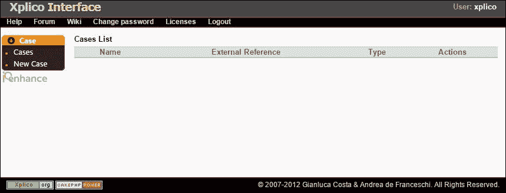
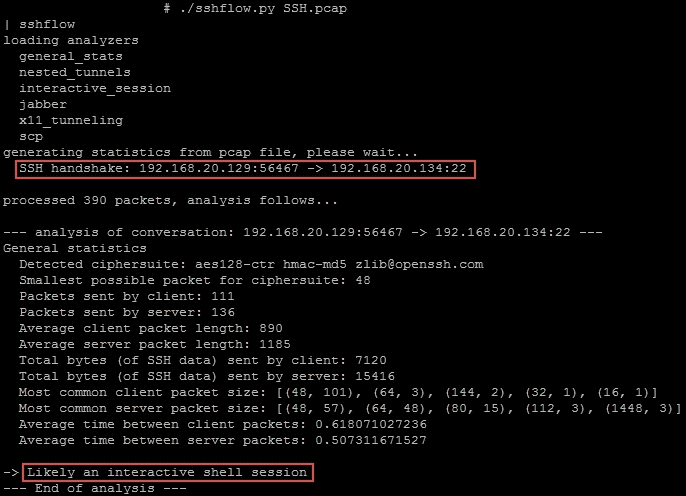
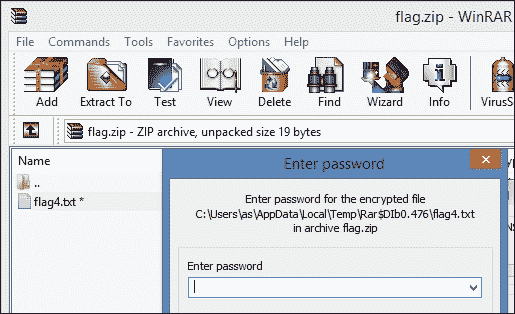
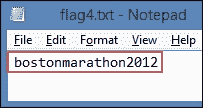

# 三、分析局域网安全威胁

|   | *“认识自己是一切智慧的开始”* |   |
|   | ——*亚里士多德* |

对流经我们网络的流量有一个清晰的了解，对于理解任何通过网络的可疑流量非常重要。简单来说，我们应该能够区分好的和坏的流量。为良好的流量建立基准是朝着这个方向迈出的重要一步，可以显著减少威胁分析所需的工作量。在本章中，我们将讨论局域网安全面临的威胁，以及如何使用 Wireshark 来分析这些威胁。我们最后还会解决一个现实世界**夺旗** ( **CTF** )的挑战。

兰是我们自己的王国，我们，这个王国的战士，有义务维护一个不被侵犯的环境。和任何王国一样，威胁总是存在，而且不容易根除。威胁可能来自许多媒介，例如，王国里淘气的人，来自外部世界的敌人，等等。

现在，时间快进，在现实世界中，王国是我们受雇的组织，威胁最终可能来自任何地方，如自然灾害、不满的员工、外部的任何人，甚至是咬断您的网线的老鼠。是的，老鼠咬断电缆是一种威胁，但绝对不是您可以通过 Wireshark 分析的威胁。

安全威胁不断创新，采用不同的攻击媒介，并且在不断演变。对策很多，许多公司以基于软件和硬件的解决方案的形式提供安全解决方案来防止和检测这种攻击。检测这些攻击与预防它们同样重要，当我们谈到企业时，他们所信任的工具都预先配置了某种集成的嗅探功能。前面已经讨论过集成嗅探功能的这类工具的例子。自动化是好的，我自己也是这方面的一个大布道者，但是完全依赖工具也不是一个明智的方法，就检测网络攻击而言，让某人在流量流动时进行分析是一个很好的选择。此外，Wireshark 凭借其广泛的功能，如前几章所述，可以帮助我们检测网络上发生的大多数攻击。

让我们从分析明文流量开始。

# 分析明文流量

首先我们将看看穿越我们网络的明文流量。这种流量的最大安全问题是它的可读和可理解的格式，甚至是用户凭证这样的敏感信息。正如我们将在本节中看到的那样，人类无需任何额外处理就可以轻松理解明文流量。我们网络中的许多常见协议都以这种方式进行通信。以下是常用协议的列表:

*   文件传送协议
*   用于远程联接服务的标准协议或者实现此协议的软件(可为动词)
*   超文本传送协议
*   普通文件传送协议(Trivial File Transfer Protocol)
*   简单邮件传输协议
*   POP3

## 在 Wireshark 中查看凭证

现在，我们将看看如何分别查看这些明文协议的凭证。

### FTP

**文件传输协议** ( **FTP** )，用于通过 TCP 传输文件，默认情况下通过端口 21 运行，除非定制为使用不同的端口。这是文件传输最常用的协议之一。以下是在 Wireshark 的数据包列表窗格中显示用户凭据的 FTP 通信截图:


明文形式的 FTP 凭据

### 远程登录

Telnet 是一种通常用于与远程计算机交互的协议。这是远程配置网络设备或控制 web 服务器的最常见方式。当使用 Telnet 时，数据再次通过明文传输，但幸运的是，我们正在转向使用更安全的协议，如 SSH 来远程管理设备并与之通信。

默认情况下，Telnet 通过 TCP 端口 23 运行。

查看 Telnet 流量凭证的步骤如下:

1.  进入**统计** | **对话**并移至 **TCP** 选项卡。
2.  选择适当的 Telnet 对话(显示为端口 23)并点击底部的**跟随流**。【T2

跟踪 TCP 流后，我们可以清楚地看到 Telnet 流量和凭证，如下所示:


### 注意

默认情况下，TCP 流中的*红色*表示客户端发送的数据，*蓝色*表示服务器发送的数据。因此，我们看到了一个奇怪的用户名，它是发送和接收的一个字节的组合。如果我们把这些字节分开来单独看，我们可以很容易地算出用户名。

### HTTP

**超文本传输协议** ( **HTTP** )是一种流行的应用层协议，通常用于浏览网站和在网络服务器和客户端(通常是网络浏览器)之间传输超文本文档。

默认情况下，HTTP 使用 TCP 端口 80，由于许多组织更喜欢为其 web 服务使用自定义端口，Wireshark 提供了一些常见端口的列表，它将这些端口解析为 HTTP 流量。这些可以在**编辑** | **首选项** | **协议** | **HTTP** 下找到并进一步编辑。


### 注意

最近，HTTP 从 1999 年的 HTTP/1.1 升级到了 HTTP/2，在撰写本文时，还没有正式开始使用 HTTP/2 的日期，但是许多人可能在不知不觉中仍在使用它。最新的服务器(Windows 10 下的 IIS)和浏览器(Firefox Beta 36)据说已经开始支持 HTTP/2。

HTTP 流量也以纯文本形式传输，使用什么类型的请求(GET 或 POST)并不重要:它们都不安全，因为协议本身不提供任何类型的加密。因此，我们使用 HTTPS (HTTP over SSL/TLS)来发送敏感信息。

### 注意

HTTPS 是 HTTP 的安全替代品，但是说使用 HTTPS 保护一切是天真的，因为我们最近已经看到针对 SSL 和 TLS 发现了漏洞，即 HeartBleed、BEAST、CRIME、POODLE 和 FREAK，使 SSL v3.0 成为过时和不安全的协议。

在本章的后面，我们将看到一个臭名昭著的攻击，它使用了与前面提到的攻击不同的媒介。在这种攻击下，我们将从 HTTPS 中剥离 SSL，从而将它转换成 HTTP[明文形式]，使我们更容易阅读和理解通信。

### TFTP

我们几乎总是需要一个可靠的协议来传输文件；因此，我们将使用 FTP，或者现在我们知道有相当安全的替代方案，我们可能想从中选择。但是我们很少使用 TFTP，因为它在 UDP 上工作，而且由于 UDP 是一种不可靠的协议，所以不推荐它用于文件传输。

你会注意到非常罕见的 TFTP 流量。例如，将 IOS 映像传输到 Cisco 设备的方法之一是使用 TFTP 协议，但您并不经常这样做。你知道吗？

**底线** : TFTP 是网络上常见的一种不同寻常的协议，我们需要确保每当遇到这种穿越网络的流量时，我们都会仔细分析这种流量。

## 重组数据流

当流量以明文形式传输时，重组数据以查看哪些文件正在通过网络传输或下载变得很容易。稍后将分享一个案例研究，其中磨练这些技能会有所帮助。

### 案例研究

在我最近参与的一次法医调查中，我们被要求处理一起诈骗案。在仔细检查了组织提供的所需数据后，我决定分析捕获文件。

在分析这些捕获文件的过程中，一些事情引起了我的注意。我注意到文件传输在每隔一天的特定时间发生。这些传输是通过 FTP 进行的，从公司内部的一台客户机传输到一个外部 IP 地址，该地址对公司来说是未知的。

我的下一步是从 TCP 流中提取传输的数据(重新组装 FTP 数据流)，为此，我遵循了与下面类似的步骤:

1.  检查 TCP 对话。根据传输的最大**字节**对对话进行排序，通过点击**跟随流**选择并跟随可疑流(通常基于传输的大量字节)，如下:
2.  在查看流之后，您需要通过查看传输的字节来选择正确的数据方向/流向，如下:
3.  选择后，下一步是通过分析流中的文件签名来识别正在传输的文件，在本例中是`JFIF`，它是 JPG 文件的指示器。
4.  最后一步是通过点击**另存为**保存数据流，并将其保存为指定的格式。在这种情况下，我把它保存为 JPG 文件。

这个案子是通过首先重组数据，提取一个图像文件，然后分析它来解决的，只有使用一种被称为**隐写术**的技术来缩小 XLS 文件隐藏在图像后面的范围。

### 注意

隐写术是一门将数据隐藏在其他看似无害的信息中的科学。

高级取证工具包和开源工具可用于从捕获文件中分析和提取信息和文件。然而，这是 Wireshark 在这种情况下如何得心应手的一个例子。

对于其他明文协议，数据流也可以以类似的方式重组。

### 注意

SMTP 和 POP3 将在下一章中简要介绍，即[第 4 章](ch04.html "Chapter 4. Probing E-mail Communications")、*探测电子邮件对话*。

# 检查嗅探攻击

嗅探活动是由恶意用户/攻击者在**中间人** ( **MitM** )场景中执行的，他们想要掌握网络上的数据流。嗅探攻击有两种类型:

*   被动嗅探
*   主动嗅探

被动嗅探指的是在有集线器的网络上进行嗅探，其中网络上的所有设备都连接到一个集线器，由于所有数据包都发送到集线器上所有连接的设备，攻击者只需插入该集线器并监听该集线器上发生的对话。在使用集线器的网络上很容易嗅探，但很少发现有集线器的网络。

主动嗅探是指在交换网络上进行嗅探，其中设备连接到交换机，而交换机与集线器不同，它不会将所有数据包广播到网络上的所有设备。因此，在使用交换机的网络上执行嗅探并不容易。然而，在交换网络上也不是不可能的。

在当前使用交换机的环境中，我们不能只插上笔记本电脑就启动嗅探器。事实上，即使插上笔记本电脑并访问网络也不容易有许多基于**网络访问控制** ( **NAC** )的解决方案，更不用说启动嗅探器了。

为了嗅探基于交换机的环境，攻击者需要执行额外的攻击。在这种情况下，我们假设攻击者是内部人员或在局域网上有足够权限执行这些攻击的人。这些攻击如下:

*   MAC 泛洪
*   ARP 中毒

## MAC 泛滥

MAC flooding，也称为 CAM table exhaustion 攻击，是一种攻击者用大量随机 MAC 地址淹没交换机以填充交换机 CAM 表的攻击。这种攻击利用了交换机有限的内存来维护 MAC 地址到其物理端口的映射，当这种攻击成功时，交换机变成一个集线器，开始向所有端口发送数据包，使攻击者很容易嗅到网络上的流量。

用于这次攻击的工具是 Macof 和耶尔森氏菌。

使用 Wireshark 检测 MAC 泛洪攻击:

**Wireshark 的专家信息**:在 MAC flooding 攻击的情况下，首先 Wireshark 将所有数据包标记为格式错误的数据包，这在**专家信息**窗口下也是可见的，如下所示:


现在，让我们看看下面截图中 MAC 泛滥的一些其他迹象:


*   在这里，随机源 IP 地址(1)具有相同的 TTL 值(2)，这令人惊讶，在这种情况下，也指向相同的目的地。
*   还有很多帧的源 MAC 地址属于 IEEE 802.3-2002 组(显示过滤器:`eth.src_not_group)`)。

## ARP 中毒

**地址解析协议** ( **ARP** )，用于从已知的 IP 地址解析设备的 MAC 地址，需要注意的一点是，ARP 请求是广播，而 ARP 回复是单播。

ARP 中毒是一种非常常见的 MitM 攻击方式。在攻击过程中，攻击者的 MAC 地址与目标主机的 IP 地址或网络上的所有主机相关联，具体取决于所选攻击的类型。以下快照显示了攻击进行时其中一台主机的 ARP 缓存表:


需要的工具有 Ettercap、Arpspoof 和 Cain and Abel。

以下是使用 Wireshark 检测 ARP 中毒攻击的步骤:

*   Look for **Duplicate IP address configured** in the **Expert Info** window's **Warnings** tab as shown in the following screenshot:

    否则，使用`arp.duplicate-address-detected`过滤流量。

*   我们还可以过滤那些有网关 IP 地址但没有网关 MAC 地址的数据包，因为一般来说攻击者试图伪造网关 MAC 地址。Wireshark 的显示过滤器将是:

    ```
    arp.src.proto_ipv4 == <Gateway's IP> && !(eth.src == <Gateway's MAC address>)

    ```

# 分析网络侦察技术

**侦察**的字典定义是*对一个地区的军事观察，以确定敌人的位置或确定战略特征*。一个很好的侦察类比是，一个小偷在他/她甚至想从邻居那里偷东西之前，会研究邻居，观察哪些房子是空的，哪些是被占用的，住在被占用的房子里的家庭成员的数量，他们的进入点，这些被占用的房子空着的时间等等。

网络侦察是指收集有关目标网络基础设施、驻留在网络上的设备、此类设备使用的平台以及其上开放的端口的信息，以最终得出设备的简要网络图，然后相应地计划攻击。

接下来，我们将使用 Wireshark 检测此类活动。

## 检查网络扫描活动

执行网络扫描活动所需的工具随时可用，并且可以从互联网上轻松下载。其中一个流行的工具是**网络映射器** ( **Nmap** )。它由 Gordon“Fyodor”Lyon 编写，是执行基于网络的侦察的常用工具。

网络扫描活动可以如下:

*   扫描实时计算机
*   端口扫描
*   检测防火墙或附加 IP 协议的存在

### 检测正在运行的机器的扫描活动

一个攻击者会想要找出网络上的活机器，而不是在假设所有机器都是活的情况下执行任何活动。以下是可以使用的两种流行技术以及使用 Wireshark 检测它们的方法。

#### 平扫

这种技术利用一种简单的技术来 ping 一个 IP 地址，以便识别它是否有效。几乎所有的现代网络都阻止 ICMP 协议；因此，这种技术不是很成功。但是，如果您的网络支持基于 ICMP 的流量，您可以通过查找大量发往网络上某个 IP 地址范围的 ping 请求来检测此攻击。在这种情况下，一个有用的过滤器是:

```
icmp.type == 8 || icmp.type == 0
ICMP Type 8 = ECHO Request
ICMP Type 0 = ECHO Reply

```

#### ARP 扫描

无法在网络上禁用 ARP 响应；因此，这种技术在尝试识别本地网络上的活动机器时非常有效。利用这种技术，攻击者可以发现可能被防火墙隐藏起来而不被其他发现方法(如 ping 扫描)发现的主机。

为此，攻击者发送一个 ARP 广播(目的 MAC 地址—FF:FF:FF:FF:FF:FF ),针对给定子网上所有可能的 IP 地址，响应这些请求的机器被标记为活动的。

为了检测 ARP 扫描企图，我们需要从网络上的客户机寻找大量的 ARP 广播。另一件要注意的事情是这些广播发送的持续时间。这些在下面的截图中突出显示:


ARP 扫描正在进行中

### 注意

需要注意的一点是这些 ARP 请求的来源，以避免误报，因为此类请求也可能由合法服务(如 SNMP)发出。

### 识别端口扫描尝试

现在，我们将看看攻击者使用的不同端口扫描技术，以及如何使用 Wireshark 检测它们。

#### TCP 连接扫描

在 TCP 连接扫描中，客户端/攻击者在一系列端口号上向服务器/受害者发送 SYN 数据包。对于使用 SYN/ACK 响应的端口，客户端通过发送 ACK 来完成三次握手，然后通过向服务器/受害者发送 RST 来终止连接，而关闭的端口使用客户端/攻击者发送的 RST/ACK 数据包来回复 SYN。

因此，为了识别这种类型的扫描，我们需要寻找大量的 RST ( **专家信息**)或 SYN/ACK 数据包。一般来说，当建立连接时，会传输某种形式的数据；然而，在扫描尝试中，没有数据被发送，这表明有人正在执行扫描(导航到**对话** | **TCP** )。

另一个指示是这些分组被发送的短时间段；导航到**统计** | **流程图**。

##### Wireshark 的流程图

在观察**流图**中的 TCP 流时，我们注意到一系列的 SYN、SYN/ACK 和 ACK 以及 SYN 和 RST/ACK。另一个指示是这些数据包发送的秒数部分(显示在左侧)。


开放端口的完整三次握手，以及“时间”栏下的数据包发送速度

##### Wireshark 的专家信息

甚至**专家信息**窗口也显示大量连接重置。


专家信息下的警告选项卡

##### Wireshark 的对话

我们可以查看 TCP 对话，观察正在进行的扫描类型以及与每个对话相关的字节数。


每次会话传输的数据包和字节数

**数据包**栏中的数字`4`表示 SYN、SYN/ACK、ACK 和 RST 数据包，数字`2`表示 Nmap 发送的 SYN 和关闭端口接收的 RST/ACK。

#### 隐形扫描

秘密扫描不同于之前解释的 TCP 连接扫描，并且不会被应用层检测到，因为在该扫描期间不会建立完整的 TCP 三次握手，因此也称为半开扫描。

在扫描过程中，客户端/攻击者通过一系列端口号向服务器/受害者发送 SYN 数据包。如果 Nmap 收到对 SYN 请求的 SYN/ACK，说明端口是开放的；然后，Nmap 发送一个 RST 来关闭连接，甚至没有完成三次握手，而关闭的端口用 RST/ACK 数据包来回复 SYN 请求。

检测这种攻击的方式与前面的扫描类似，在扫描中您会注意到网络上有很多没有数据传输的 RST ( **专家信息**)或 SYN/ACK 数据包(**对话** | **TCP** )。

另一个指示是这些分组被发送的短时间段(**统计** | **流图**)。

现在，我们将查看 Wireshark 中的**流程图**、**专家信息**和**对话**窗口进行隐形扫描。

##### Wireshark 的流程图

在观察**流图**中的 TCP 流时，我们注意到一系列 SYN、SYN/ACK 和 RSTs(表示半开连接)以及 SYN 和 RST/ACK。另一个指示是这些数据包发送的秒数部分(显示在左侧)。


此图显示了正在进行的半开放扫描，以及“时间”栏下的数据包发送速度

##### Wireshark 的专家信息

大量的连接重置是扫描正在进行的另一个迹象。


专家信息下的警告选项卡

##### Wireshark 的对话

TCP 对话还提供了一种洞察力，表明正在进行半开放扫描，以及与每次尝试相关的字节数。


每次会话传输的数据包和字节数

数据包栏中的数字`3`表示 SYN、SYN/ACK 和 RST 数据包，数字`2`表示 Nmap 发送的 SYN 和关闭端口接收的 RST/ACK。

#### 零扫描

在空扫描期间，发送带有 *no* 标志的异常 TCP 数据包。如果其结果是*无响应*，这意味着该端口是开放的或过滤的，而 RST/确认响应意味着该端口是关闭的。

检测这种扫描是否正在进行的快速方法是过滤`tcp.flags == 0x00`。


#### UDP 扫描

最后三种技术与基于 TCP 的扫描相关。许多常见的协议也在 UDP 上工作(DNS、SNMP、TFTP 等)，并且进行扫描来检测这些端口是否打开。

对 UDP 端口扫描没有响应表示该端口是开放的或受防火墙保护的，ICMP `Destination Unreachable` / `Port Unreachable`的响应表示该端口已关闭。

通过在`(icmp.type == 3) && (icmp.code == 3)`上过滤来检测 UDP 扫描。

```
ICMP Type 3 = Destination Unreachable
ICMP Code 3 = Port Unreachable

```

### 其他扫描尝试

下面的扫描技术超越了传统的端口扫描技术，帮助攻击者进一步枚举网络。

#### 确认扫描

ACK 标志扫描从不定位开放端口；更确切地说，它只以*过滤*或*未过滤*的形式提供结果，通常用于检测防火墙的存在。

无响应意味着端口被过滤，RST 响应表明端口未被过滤。


ACK 标志扫描的流程图(TCP)

#### IP 协议扫描

攻击者进行 IP 协议扫描，以确定受害者是否使用了其他 IP 协议。例如，如果使用这种技术扫描路由器，可能会发现使用了其它协议，如 EGP、IGP、EIGRP 等。

无响应表示协议存在或响应被过滤，而 ICMP `Destination Unreachable` / `Protocol Unreachable`表示设备不支持该协议。

要使用 Wireshark 检测这种扫描，我们可以根据以下内容过滤流量:`(icmp.type == 3) && (icmp.code == 2)`。

```
ICMP Type 3 = Destination Unreachable
ICMP Code 2 = Protocol Unreachable

```

## 操作系统指纹尝试

操作系统指纹是一种技术，攻击者试图识别目标机器上运行的操作系统。攻击者可以执行被动或主动指纹识别。

在被动指纹识别中，攻击者监控进出目标机器的流量，并寻找某些指示，如初始 IP TTL 值、TCP 窗口大小或用户代理字符串，以及其他独特的操作系统特征，以识别所使用的操作系统。例如，Mozilla/5.0 的用户代理字符串(X11Linux i686RV:31.0)Gecko/2010 01 01 Firefox/31.0 ice weasel/31 . 5 . 0 帮助攻击者假设目标运行的是 Linux 机器。但是，用户代理字符串和其他因素可以使用许多工具进行修改。因此，这不是一个可靠的方法。

需要的工具是 P0f 和 Ettercap。

主动操作系统指纹识别为攻击者提供了更可靠的结果，但在此活动期间发送的探测使其可被 Wireshark 和其他高级检测工具检测到。

以下是用于操作系统指纹识别的不同技术:

*   **ICMP-based fingerprinting:** Certain tools make use of unique ICMP probes to detect how an OS responds and make a guess based on that. The following are important filters for such a case:

    ```
    (icmp.type == 8) && (!(icmp.code == 0))

    ```

    一些工具(例如，xprobe2)使用带有异常 ICMP 代码的 ICMP 回应请求，因此前面的过滤器帮助我们检测这些尝试。

    ```
    (icmp.type == 13) || (icmp.type == 15) || (icmp.type == 17)

    ```

    其他工具倾向于发送 ICMP 时间戳请求(13)、ICMP 信息请求(15)和 ICMP 地址掩码请求(17)，以便执行操作系统指纹识别。

*   **TCP/IP-based fingerprinting**: Specific TCP probes with specific field values are sent and monitored for OS-based responses in order to detect the type of OS in use.

    例如，进行的测试之一是发送 TCP SYN 数据包并记录 SYN/ACK 响应，以测试**初始序列号** ( **不是**)的值。

    关于这些尝试的更多细节可以在 https://nmap.org/book/osdetect-methods.html T2 找到。

### 注意

劳拉·沙佩尔在 2013 年鲨鱼节上分享了一个有趣的*样本安全简介*。该配置文件包括基于特定过滤器的着色规则，用于不同的扫描、指纹识别和网络上的其他非法活动。截至发稿时，这个简介可以从 bit.ly/nmapcolors 的[下载到 T2 的](http://bit.ly/nmapcolors)。

# 检测密码破解企图

密码破解是一个有意义的或随机的猜测密码的过程。有几种技术可以做到这一点。然而，以下是破解密码的两种最流行的方法。

*   暴力攻击
*   基于字典的攻击

## 暴力攻击

暴力破解是一种尝试用数字、大小写字母和特殊字符的组合来破解密码的方法。这可以使用某些工具来完成，如 Brutus、THC Hydra、Medusa、Burp Suite intruder 和许多其他在线工具。可以对网络上运行的许多涉及身份验证的服务进行暴力攻击，例如 FTP、SSH、POP3、HTTP、Telnet、RDP 等等。

### 识别 POP3 密码破解

在下面的例子中，我们看到一个捕获的暴力破解 POP3 的企图。


在上图中，我们使用了一个显示过滤器(`pop.request.command == PASS`)来缩小访问 POP3 服务的密码尝试的范围，并查看过滤的数据包；可以看出，暴力破解正在进行中。

这些尝试的另一个迹象是这些尝试进行得有多快。一个人不可能在几秒钟内做出如此多的尝试，正如在**时间**栏中突出显示的那样，因此表明使用了密码破解工具。

### HTTP 基本认证

当用户试图访问无线接入点和路由器等设备的任何基于 web 的管理时，通常会发现这种类型的身份验证。在一次安全评估中，我发现了一个管理思科**自适应安全设备管理** ( **ASDM** )设备的门户网站，该设备具有这种类型的认证，很容易被暴力破解，因为它也没有任何锁定机制。

### 注意

对于 HTTP 基本身份验证，需要注意的一点是凭据是 Base-64 编码的，而不是像 FTP 或 POP3 那样以明文形式发送。然而，Base-64 很容易被解码，我们将在解决 CTF 挑战时看到。

## 基于字典的攻击

在基于字典的攻击中，有限的一组单词(单词表)被用来破解密码。

### 检测 FTP 密码破解

为了这个演示的目的，我们使用 THC Hydra 通过基于字典的攻击来破解 FTP 的密码。以下是跟踪文件:


使用 ftp.request.command 过滤 ftp 请求

在上图中，我们可以注意到随机单词被尝试用作用户`admin`的密码，这表明基于单词列表的攻击正在进行中。另一个指示是在几秒钟内尝试这些密码，这可以在**时间**栏中查看。

为了以防万一，我们需要验证攻击者是否成功地进行了这些尝试，我们可以在`ftp.response.code == 230`上进行过滤，并查看是否有任何符合该过滤器的数据包。


在当前场景中，我们找到了一个符合过滤规则的数据包。这表明攻击成功，攻击者找到了用户`msfadmin`的密码。

### Tip

检测密码破解企图的另一个标志是 TCP 对话的巨大数量，可以在**统计**下查看。

# 杂项攻击

在本节中，我们将从网络的角度来看一些未分类但很重要的攻击。

## FTP 反弹攻击

这是以一种隐秘的方式执行端口扫描的老技术。该漏洞存在于 FTP 在`ACTIVE`模式下传输数据时使用的`PORT`命令中。

利用这种技术，攻击者可以指示 FTP 服务器打开到可能不是原始客户端的机器的特定端口的连接。这种情况可能允许攻击者通过隐藏自己的身份在目标上执行端口扫描。Nmap 有一个选项`–b`来执行这种类型的扫描。然而，大多数 FTP 服务器都知道这种攻击，并相应地进行配置来阻止这种扫描，从而防止 FTP 反弹攻击。

在极少数情况下，如果您怀疑有人试图对网络进行此类攻击，您可能需要使用以下过滤器:

```
ftp.request.command == "PORT"
ftp.response.code == 226 || ftp.response.code == 426
Response Code of 226 means "Closing data connection. Requested file action successful" and 426 means "Connection closed; transfer aborted". Nmap uses these response codes to determine whether the port is open or closed.

```

### 注意

FTP 更安全的替代方案是 SFTP 和 SCP，它们通过加密通道传输数据。

## DNS 区域迁移

默认情况下，DNS 使用 UDP 端口 53 进行普通查询和响应，使用 TCP 端口 53 进行区域传输和更大的名称查询和响应。

仅用于 DNS 流量的捕获过滤器是 tcp 端口 53 或 udp 端口 53。

DNS 区域迁移是一种跨多个 DNS 服务器复制 DNS 数据库的技术。它可以通过以下两种方式执行:

*   完全/完整[AXFR]
*   增量[IXFR]

攻击者可能试图执行区域转移来了解 DNS 数据库。你不会经常在网上看到这样的流量。从攻击的角度来看，我们应该寻找完整的区域转移尝试，下面的过滤器在像`dns.qry.type == 252`这样的场景中会很有用。

## SSL 剥离攻击

简单地说，这种攻击迫使受害者的浏览器通过 HTTP 而不是 HTTPS 进行通信，由于受害者通过 HTTP(一种纯文本协议)进行交互，这使得攻击者很容易理解通信。

### 注意

这种攻击的内部工作方式非常有趣，我强烈建议您访问[http://www.thoughtcrime.org/software/sslstrip/](http://www.thoughtcrime.org/software/sslstrip/)了解这种攻击，下载 Python 脚本，并在本地测试环境中执行这种攻击。

如上所述，为了这次攻击的目的，我们将使用 **sslstrip** (由莫邪·马林斯派克编写)。这个工具也预装在 Kali Linux 的当前版本中，一个渗透测试 Linux 发行版，(【https://www.kali.org/】T4)。

以下是成功执行攻击后以纯文本格式捕获的 Gmail 凭据示例:


纯文本格式的 Gmail 凭据

接下来，我们可以看到雅虎！纯文本邮件凭证。


雅虎！纯文本邮件凭据

# Wireshark 的补充工具

在此部分，我们将了解一些神奇的工具，它们是 Wireshark 的补充，有助于我们进行更好的分析。

## Xplico

Xplico 是一个奇妙的开源网络取证分析工具，它与流行的 pen-testing 和 forensics Linux 发行版打包在一起。

在 Kali Linux 上运行 Xplico:

1.  要手动安装 Xplico，请运行以下命令:

    ```
    sudo apt-get install xplico

    ```

2.  安装完成后，我们需要通过运行:

    ```
    /etc/init.d/xplico start

    ```

    来启动 Xplico 的服务
3.  此外，请确保 web 服务正在运行。这可以通过运行`/etc/init.d/apache2 start`来完成。现在我们需要打开浏览器，浏览`http://127.0.0.1:9876`，使用`xplico`和`xplico`作为用户名和密码。

    Xplico 的图像使用者界面登录后

4.  首先，我们需要创建一个新案例，然后在该案例中创建一个新会话，稍后上传 PCAP 文件进行分析。

正如在其维基页面中提到的，Xplico 可以帮助重建用数据包嗅探器获取的内容。

## Sysdig

对于执行故障排除活动的人来说，这是一个的令人敬畏的工具，是对 Wireshark 的很好补充。Sysdig 让系统级故障排除变得更轻松、更有趣。Sysdig 可以使用`–w`命令行标志创建跟踪文件，并使用`–r`标志读取它们，如下面的屏幕截图所示:


使用 Sysdig 写入和读取跟踪文件

Sysdig 还包括一组有用的脚本，术语中也称为凿子，可以与`–c`标志一起使用。要查看 Sysdig 使用的凿子列表，请查看`–cl`标志，如下所示:


Sysdig 中的凿子列表

我们也可以创建自己的凿子来和 Sysdig 一起工作。目前，Sysdig 将其凿子分为九类，如下所述:

*   CPU 使用率
*   错误
*   输入－输出
*   日志
*   多方面的
*   网络
*   表演
*   安全性
*   系统状态

### 注意

要想深入了解 Sysdig 的，我建议去 http://www.sysdig.org/[和 T2【体验】一下这个工具。](http://www.sysdig.org/)

## PCA x2 XML

Pcap2XML 是一个方便的实用工具，用于在宏观层面解析 802.11 数据包。它将捕获文件转换成等效的 XML 和 SQLite 文件，然后执行 XPath、XQuery 和/或 SQL 查询，从这些文件中获取宏统计信息。

该工具通过提供 Wireshark 目前没有的功能来补充 Wireshark。例如，我们可以使用该实用工具解析出 802.11 捕获文件中的唯一 MAC 地址。


使用 Pcap2XML 将 PCAP 转换为数据库文件

将捕获文件转换为数据库文件后，我们可以用任何用于编辑与 SQLite 兼容的数据库文件的软件打开它，并执行 SQL 查询以获得所需的结果。


对数据库文件执行的 SQL 查询

我们还可以在使用 Pcap2XML 的`–x`选项将 PCAP 文件转换成 XML 文件后运行 XPath 查询。

### 注意

pcap 2 XML 可以从[https://github.com/securitytube/pcap2xml](https://github.com/securitytube/pcap2xml)下载。

## SSHFlow

SSHFlow 是由 Alex Weber 编写的一个有趣的“正在开发中”的实用工具，用于检查 SSH 流量的 PCAP 文件。它是用 Python 编写的，其工作原理是根据最常见的数据包大小来猜测通过 SSH 会话传输的是什么。

该实用工具的当前功能包括以下检测:

*   文件传输
*   互动会议
*   嵌套隧道
*   X11 转发

下面的是 SSHFlow 的一个使用示例。这个屏幕截图反映了一个用户通过 SSH 与远程机器进行交互。



在 SSH.pcap 文件中检测到交互式会话

下面的屏幕截图显示了正在运行的文件复制:


在 SSH2.pcap 文件中检测到文件传输

### 注意

你可以在[https://github.com/alexwebr/sshflow](https://github.com/alexwebr/sshflow)找到更多关于 SSHFlow 的。

# 重要显示过滤器

在此部分，我们将了解一些显示过滤器，它们将在日常的安全协议分析中派上用场。

## 基于协议的过滤器

在本部分，我们将了解一些最常用协议的最有用的显示过滤器。

### DNA

DNS 常用的显示过滤器如下:

```
dns
dns.query.response == 0 
dns.query.response == 1
dns.flags.rcode == 2 [Server Failure]

```

### FTP

遍历 FTP 通信时可以使用的一些常用显示过滤器如下:

1.  `ftp.request.command == "USER"`:该过滤器用于根据特定的 FTP 命令过滤数据。可以在 http://en.wikipedia.org/wiki/List_of_FTP_commands 的[找到 FTP 命令列表。](http://en.wikipedia.org/wiki/List_of_FTP_commands)
2.  `ftp.request.arg == "anonymous"`:我们可以使用这个过滤器来缩小传递给 FTP 命令的精确参数的范围。
3.  过滤特定的 FTP 响应代码可以帮助我们识别网络上的任何特定问题。例如，如果我们在 FTP 流量中看到许多 530 响应代码，则很有可能有人试图破解密码。
4.  `ftp || ftp-data (command control and data transfer)`:这个过滤器允许我们查看网络上完整的 FTP 流量，包括通过网络传输的命令和数据。

### HTTP

下面的是 Wireshark 中用于 HTTP 或 HTTP/2 流量的相关显示过滤器:

```
http
http2
http.set_cookie
http.cookie
http.request.method 
http.response.code >=300 and http.response.code <400 [Redirections]
http.response.code >=400 and http.response.code <500 [Client-Side Errors]
http.response.code >500 [Server-Side Errors]
http.user_agent [Malwares might try to beacon using some specific User-Agent String, or Scanners/Tools can be identified using a particular User-Agent String]

```

以下是 Wireshark 根据用户代理字符串检测到的常见自动 SQL 注入工具的示例:

*   Havij(一个自动化的 SQL 注入工具)在运行中如下面的截图所示:
*   Sqlmap(一个自动化的 SQL 注入工具)在下面的截图中显示:

下面的命令有助于过滤掉恶意或异常的主机名流量。例如，当恶意软件执行呼叫总部机制时。

```
http.host matches "some-domain-name"

```

## 基于唯一签名和正则表达式的过滤器

独特的签名:我们也可以选择过滤不同文件类型的独特签名。例如，当在跟踪文件中查找 ZIP 文件时，我们可以使用以下显示过滤器:

```
frame contains "\x50\x4B\x03\x04"

```

`\x50\x4B\x03\x04`是 ZIP 文件的唯一签名。这些签名有时被称为幻数。下表突出显示了一些常见文件扩展名的签名，可以在显示过滤器中与`contains`关键字一起使用。

这些签名的示例用法如下:

**语法** : `frame contains "<Signature>"`

**示例** : `frame contains "\x25\x50\x44\x46"`(用于 PDF 文件)

这些在分析过程中会很方便。

### 注意

在[http://en.wikipedia.org/wiki/List_of_file_signatures](http://en.wikipedia.org/wiki/List_of_file_signatures)可以找到文件签名的综合列表。

### 正则表达式

Wireshark 为我们提供了另一个简洁的特性:将**正则表达式** ( **RegEx** )与我们的显示过滤器一起使用。为了使用带有显示过滤器的正则表达式，我们使用`matches`关键字。以下是一些例子:

1.  要在跟踪文件中定位任何关键字(`password`、`confidential`或`secret`，请使用以下过滤器:、

    ```
    frame matches "(?i)(password|confidential|secret)"

    ```

    、
2.  要在 HTTP 流量中查找任何`.com`域，请使用以下过滤器:

    ```
    http matches "[a-zA-Z0-9\-\.]+\.(?i)(com)"

    ```

3.  要查找 SMTP 流量中的任何电子邮件地址，请使用以下过滤器:

    ```
    smtp matches "[a-zA-Z0-9._%+-]+@[a-zA-Z0-9._%+-]"

    ```

通过使用正则表达式，我们可以在字符串字段和字节序列中搜索流行的文本。我们对 RegEx 使用得越好，遍历跟踪文件的速度就越快，从而缩短分析时间。

### 注意

Wireshark 中的正则表达式使用了 **Perl 兼容的正则表达式** ( **PCRE** )。

在[http://regexone.com/](http://regexone.com/)了解更多关于 RegEx 的。

# 挑战 CTF

CTF 事件是全球安全会议的常见内容。在一些 CTF 挑战赛中，我们会收到一个 PCAP 文件，需要对其进行分析，以解决特定的挑战或获得旗帜。这正是我们接下来要做的。我们将解决**黑客 3**(【http://hack3rcon.org/】T5)大会中给出的 CTF 挑战。

**挑战:**夺取给定的 PCAP 文件中的旗帜。这个文件可以从[http://sickbits.net/other/hc3.pcap-04.cap](http://sickbits.net/other/hc3.pcap-04.cap)下载。

**解决方案**:我们将使用 Wireshark 解决这一挑战，并引入一些其他实用工具来帮助解决这一问题。步骤如下:

1.  使用 Wireshark 打开 PCAP 文件，查看运行中的协议。
2.  We can see that this file contains 802.11 frames. The next step would be to identify the security algorithm in use, to see if we can crack the encrypted 802.11 frames and actually see what is going on behind the scenes. We can do this by filtering on unique signatures in each type of security algorithms, namely, WEP, WPA, and WPA2.

    我们可以使用 **IV** ( **初始化向量**)，一个与数据加密密钥一起使用的随机数，来识别 WEP 是否在使用中。因此，`wlan.wep.iv`上的过滤将在跟踪文件中显示任何 WEP 加密的流量。

    

    根据过滤器显示总数据包的 74.4%

    在前面的图像中，我们注意到有 155051 个数据包与我们的过滤器匹配，如果我们进一步观察第 5 帧，我们可以看到以下内容:

    

    因此，目前，我们可以假设 WEP 用于加密 802.11 流量。

3.  WEP is a weak algorithm with numerous weaknesses, and we can attempt to crack it. However, to crack WEP, we need to have a minimum number of IVs captured, and if we notice in the screenshot that shows 74.4 percent of the total packets based on the filter, we have 155051 frames containing IV, which is enough to attempt to crack the WEP key.

    为了破解 WEP，我们将利用一个名为`aircrack-ng`的流行而神奇的工具。这种情况下用来破解 WEP 的命令是`aircrack-ng hc3.pcap-04.cap`。

    

    成功破解 WEP

4.  现在，我们可以使用`airdecap-ng`来解密 PCAP 文件中使用该密钥的帧，或者我们可以通过删除找到的密钥中的冒号(:)来向 Wireshark 添加解密密钥。让我们使用 Wireshark 来实现这一点。

    检查无线工具栏,并从无线工具栏中选择"解密密钥…"选项

    将（=water-extendedpolyester）水扩展聚脂解密密钥添加到 Wireshark 的步骤
5.  将解密密钥添加到 Wireshark 后，从无线工具栏突出显示的下拉菜单中选择 **Wireshark** ，点击主工具栏上的 ( **重新加载**按钮)，重新加载跟踪文件。一旦重新加载，我们可以看到 802.11 流量和其他协议的混合，如 ICMP 和 ARP。要去除 802.11 流量，使用显示过滤器:`llc`，然后我们将看到一些可以分析的有趣的流量。此时，我们可以选择将这些数据包导出到一个单独的 PCAP 文件中[推荐]或直接使用它。
6.  After going over to **Statistics** | **Conversations** and then to the **TCP** tab, we can see conversations over FTP, SMTP, and POP3.

    有趣的对话

    在跟踪突出显示的对话上的 TCP 流之后，我们能够注意到 ZIP 文件的文件签名；因此，我们使用**另存为**按钮将其保存为 ZIP 文件，如下所示:

    

    将 TCP 流保存为 ZIP 文件

我们还在 TCP 流中看到一个有趣的关键字，如前面的图片中突出显示的，因此选择将该文件保存为`flag.zip`。

1.  我们还没有完成，因为这个 ZIP 文件被密码保护如下:
2.  让我们回到我们的 PCAP，看看我们是否错过了什么。进一步跟踪，我们注意到 SMTP 和 POP3 通信。如果我们移动并扩展**帧 105840** 上的，我们会注意到**互联网消息格式** ( **IMF** )的使用，并且在该帧上的扩展将 Base-64 编码的字符串反映为，如下图所示:
3.  Base-64 本身可以使用许多工具和在线资源轻松解码。以下是反映解码后的 Base-64 字符串的屏幕截图。

恭喜你！

我们能够通过使用解码的密码`bostonMA1977`打开受密码保护的 ZIP 文件。下面的是我们的挑战旗帜:



旗帜在图像中突出显示

# 总结

在本章中，我们研究了局域网环境中最常见的攻击，并了解了如何使用 Wireshark 的最佳功能来检测这类攻击。此外，我们需要强调良好流量的基线，以便更好地应对局域网安全威胁，这样任何异常都可以通过 Wireshark 轻松检测到。另一个方便的技巧是拥有一个好的过滤器和着色规则列表来匹配它们并节省分析时间。我们简要地看了一下那些很好地补充 Wireshark 的工具，并在最后使用了一些工具来解决 CTF 挑战。