# 四、检测电子邮件通信

几个世纪以来，信息一直在交换；然而，交换这些信息的方式已经发生了变化，隐私变得比以往任何时候都更加重要。从使用信使以物理方式传递消息的时代到最近使用互联网传递消息的时代，这些漏洞一直存在，并且直到今天也没有完全修复。在这一章中，我们将探讨一种当代的信息传递方式，即电子邮件，以及它带来的安全威胁。

在本章中，我们将学习以下内容:

*   如何使用 Wireshark 检测对 SMTP 的大量攻击
*   使用 Wireshark 和 Python 解决 SMTP 取证难题
*   检测异常 SMTP 流量的重要过滤器

在 20 世纪 60 年代，我们接触到了电子邮件(e-mail ),从那时起，无论是随意地还是专业地在互联网上交换信息已经成为事实上的标准。这种通信中使用的协议是 SMTP、POP3 和 IMAP。从本质上讲，这些协议通过明文传输数据，正如我们在前一章中所看到的那样，这些数据很容易在网络上被截获。

在一个相当简单的场景中，电子邮件通信使用 SMTP (TCP/25)或 submission (TCP/587)，也称为 push 协议，来发送电子邮件，并且它们可以使用 POP3 (TCP/110)或 IMAP (TCP/143)，也称为 pull 协议，来在 Outlook 等电子邮件客户端上接收电子邮件。我们也可以选择在 TLS 等安全通道上运行这些，例如 SMTP(TCP/465)、pop 3(TCP/995)和 IMAP(TCP/993)。

如今，大多数组织都在其安全设备中集成了反垃圾邮件机制，这往往会提供实时垃圾邮件保护，防止零日威胁和恶意软件、僵尸网络、网络钓鱼等混合攻击。然而，有时这些解决方案可能会错误地将合法电子邮件识别为垃圾邮件(误报)或允许垃圾邮件(误报)。在这种情况下，如果网络上正在进行捕获，Wireshark 可用于探测此类通信。

假设您知道电子邮件通信是如何工作的，我们将从一些有趣的在线挑战开始，并使用 Wireshark 解决它们。

# 电子邮件取证挑战

在此部分，我们将分析跟踪文件以解决挑战。跟踪文件包含有趣的电子邮件流量，等待分析。让我们开始吧。

## 挑战 1–正常登录会话

**描述**:一个用户登录邮件服务器访问他的电子邮件。

### 注意

本次挑战所需的文件可在[http://securityoverride.org/challenges/forensics/3/](http://securityoverride.org/challenges/forensics/3/)获得。

**目标**:从给定的跟踪文件中识别用户名和密码。

**分析**:本次挑战可用的跟踪文件要点如下:

*   **ESMTP(扩展 SMTP)** :这可以在这个跟踪文件中看到。ESMTP 通过提供扩展来扩展 SMTP 协议。
*   **SMTP-AUTH** :这个扩展在这个跟踪中用于认证目的。
*   **AUTH LOGIN** :这个 trace 的 packet 8 中的这个命令用于对服务器进行认证登录。在`AUTH LOGIN`命令被发送到服务器后，服务器通过向客户端发送 Base64 编码的文本(问题)来询问用户名和密码。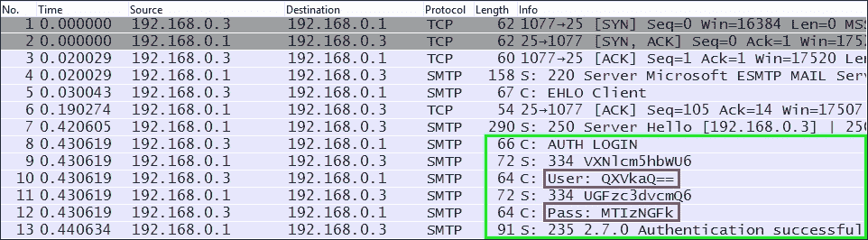

    身份验证过程显示凭据编码为 base64

    T9

### 注意

Base64 是一种编码(不同于加密)方案，旨在通过将二进制数据转换为 radix-64 表示，将二进制数据表示为 ASCII 文本。Base64 很容易被解码，不建议用于机密信息。

Base64 可以在 Wireshark 中对该跟踪进行解码，只需遵循下面截图中提到的步骤:

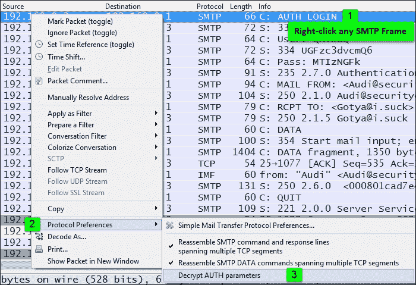

另一种解码 Base64 的方法是使用任何工具，如 Burp Suite(它比简单地解码 Base64 执行更复杂的任务)；在线资源可在 https://www.base64decode.org/[获得](https://www.base64decode.org/)。

对于我们当中的编码人员，我们也可以选择用 Python 编写脚本。以下是在 Linux 上编写的用于解码 Base64 的示例 Python 脚本:

```
#!/usr/bin/python

import sys, base64

try:
    decodedResult = base64.b64decode(sys.argv[1])
    print("Base64 decoded value = " + decodedResult)

except:
    print("Please enter a valid Base64 encoded string, and TRY AGAIN !")

#END
```

这段代码简单地将 Base64 编码的字符串作为输入，并返回解码后的值，如下所示:

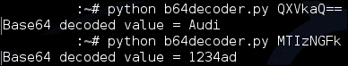

最终解决方案如下表所示:

| 

项目

 | 

Base64 编码

 | 

base64 解码

 |
| --- | --- | --- |
| 用户名 | `QXVkaQ==` | `Audi` |
| 密码 | `MTIzNGFk` | `1234ad` |

## 挑战 2——商业间谍

**描述**:一名间谍设法从一家汽车公司的内部系统中复制一辆汽车的原型图像。她知道电子邮件内容可以被嗅探，因此将图像粘贴到文件中，并将该文件作为附件发送。在这个挑战中，我们提供了一个名为`Dhakkan.cap`的跟踪文件，其中包含间谍活动进行过程中捕获的数据包。

### 注意

本次挑战所需的文件可在[http://securityoverride.org/challenges/forensics/9/](http://securityoverride.org/challenges/forensics/9/)获得。

**目标**:从附件中分析并提取图像，提交以下细节:

*   图像的 MD5
*   会场
*   日期

**分析**:在对数据包进行简要概述后，我们了解到跟踪文件包含 SMTP 流量，其中包括许多数据命令。

在这种情况下，一种实用的方法是查看 **TCP 会话**，并根据**字节**对会话进行排序。选择最大字节数的对话后，点击**跟随流**打开该 TCP 流。

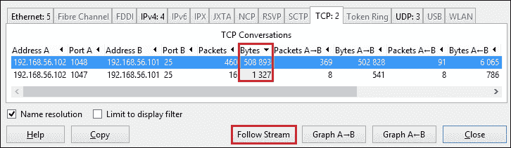

按字节排序的 TCP 会话

在检查了 TCP 流之后，我们推断如下:

*   **电子邮件发送者** : `<[Dhakkan@securityoverride.com](mailto:Dhakkan@securityoverride.com)>`
*   **电子邮件收件人** : `<[hacku@dhakkansecurity.com](mailto:hacku@dhakkansecurity.com)>`
*   **主题**:秘密概念车照片
*   **内容-传输-编码**:引用-可打印
*   **附件名称及格式** : `secret.rtf`(富文本格式)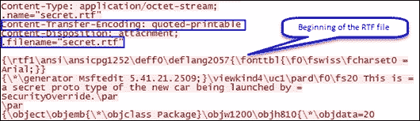

    TCP 流

现在，我们可以从收集的信息中看到，电子邮件是以 quotable-printable 格式编码的，附件是 rtf 格式的。

1.  Extract the attachment from the provided trace file. Copy the RTF content from the stream and decode it as per the encoding scheme. Begin copying from the *beginning of the RTF file* as highlighted in the following screenshot and finish it.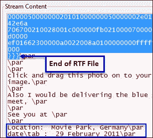

    前面的图像也反映了挑战中要求的**地点**和**日期**的细节。接得好。

    ### Tip

    另一种提取电子邮件附件的方法如下:

    使用`imf`作为显示过滤器，并转到所选 IMF 数据包的数据包详细信息窗格。

    展开**互联网消息格式**头，跟随展开到**媒体类型**，右键**导出选中的数据包字节**，此导出将导致附件文件的提取。

2.  Once the attachment is extracted from the trace file, we will need to decode the RTF content, which was copied from the TCP stream.

    下面是我在 Linux 上写的一个小 Python 脚本，用于解码:

    ```
    #!/usr/bin/python

    import os, quopri

    encodedFile=open('/home/piyush/secret.rtf')
    decodedFile=open('/home/piyush/decoded_secret.rtf', 'wb')

    quopri.decode(encodedFile, decodedFile)

    #END
    ```

    不，我们将快速浏览一下代码。该代码首先导入以下两个模块:

    *   `os`读取和写入文件
    *   `quopri`解码引用的可打印编码方案

    然后，`encodedFile`变量存储由`open()`函数返回的文件对象。在这种情况下，它打开了我们想要解码的`secret.rtf`。

    下一行代码创建一个名为`decodedFile`的文件对象，并创建一个新文件`decoded_secret.rtf`并打开它以二进制模式(wb)写入。

    最后，我们使用`quopri`模块中可用的`quopri.decode()`函数读取`encodedFile`文件对象，即读取`secret.rtf`文件并解码。解码后的输出写入`decodedFile`文件对象，即写入`decoded_secret.rtf`。

    ### 注意

    解码引用可打印编码的在线资源如下:

    [http://www.motobit.com/util/quoted-printable-decoder.asp](http://www.motobit.com/util/quoted-printable-decoder.asp)。

    请随意选择任何资源，只要你能解码它。

3.  解码后，使用写字板打开`decoded_secret.rtf`，如下图所示: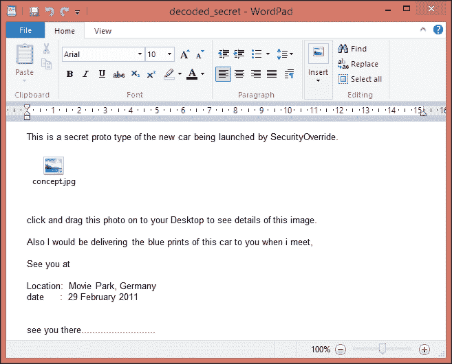

    解码的多文本格式文件

在的最后几个步骤中，我们使用 Wireshark 和 Python 脚本从给定的跟踪文件中提取并解码了附件。

现在，为了解决这个问题，我们应该从 RTF 文件中提取出`content.jpg`文件，并为该图像创建一个 MD5 散列。为了解决这个难题的最后一部分，我们可以将`content.jpg`拖放到一个文件夹或桌面，然后使用软件创建它的 MD5，作为 **HashCalc** 或一个 Linux 实用工具， **md5sum** ，如下所示:

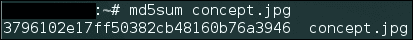

最终解决方案如下:

*   **图像的 MD5**:*3796102 e17ff 50382 CB 48160 b76a 3946*
*   **集合地点** : *电影公园*，*德国*
*   **日期**:*2011 年 2 月 29 日*

# 分析对电子邮件通信的攻击

电子邮件通信可以被篡改，从重要的邮件帐户发送垃圾邮件和伪造的电子邮件，甚至可以利用最近的 Shellshock 漏洞。

可以使用`EXPN`、`VRFY`或`RCPT`命令来枚举 SMTP 服务器上的用户。这可以通过简单地通过端口 25 连接到 SMTP 服务器并运行相应的命令来手动实现，如下面的屏幕截图所示，也可以通过工具(如 Nmap 和 Metasploit)自动实现，这将在本节中进一步讨论。

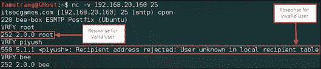

使用 VRFY 命令手动枚举 SMTP

## 检测 SMTP 枚举

为了检测任何 SMTP 枚举尝试，我们需要寻找以下迹象:

*   跟踪文件中有大量的`VRFY`或`EXPN`命令
*   包含`MAIL`和`RCPT`命令以及很少或没有`DATA`命令的数据包
*   大量数据包包含 SMTP 响应代码`550`
*   捆绑`RSET`个命令中的

### 在 Metasploit 中使用辅助模块

Metasploit 包含一个名为`smtp_enum`的辅助模块。该模块使用一个字典来执行用户名枚举，在成功执行该模块后，我们能够通过发送一些`RCPT`命令来验证它是否工作。

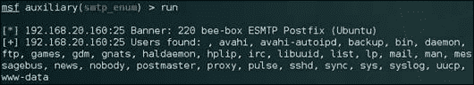

用户枚举来自 Metasploit 的辅助模块

下面是 Metasploit 的辅助模块对用户枚举的过滤流量。

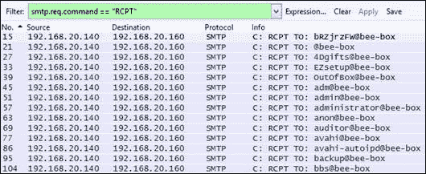

Wireshark 对上述攻击的过滤捕获

显示筛选器以识别 SMTP 枚举:

```
smtp.req.command == "VRFY" || smtp.req.command == "EXPN" 
smtp.req.command == "RCPT" 
smtp.response.code == 550 
//Indicates Requested action not taken: mailbox unavailable
smtp.req.command == "RSET" 
```

## 分析 SMTP 中继攻击

SMTP 中继攻击被攻击者用来发送伪装在真实 SMTP 服务器下的垃圾邮件和恶意软件。流行的工具，比如 Metasploit 和 Nmap，可以用来验证邮件服务器是否允许开放中继，否则也可以手动执行。在以下示例中，Wireshark 用于分析 Nmap 的开放中继攻击企图。

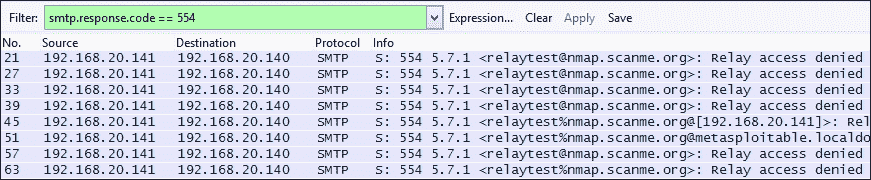

SMTP 开放中继攻击正在进行中

显示过滤器以识别 SMTP 中继攻击:

*   `smtp.response.code == 554`:表示交易失败
*   `smtp.response.code == 553`:表示接收方无效
*   `smtp matches "[a-zA-Z0-9._%+-]+@nmap.scanme.org"`:执行开放中继测试时，显示与 Nmap 签名匹配的过滤器

### Tip

另一个技巧是跟踪通信的 TCP 流，因为当 SMTP 中继攻击正在进行时，它可能会反映一些不寻常的发件人或收件人地址。

# 重要过滤器

以下过滤器可用于检测电子邮件通信中的任何问题/错误:

```
smtp.response.code >= 400
pop.response.indicator == "-ERR"
```

显示用于查找电子邮件凭证的过滤器如下:

```
pop.request.command == "USER" || pop.request.command == "PASS"
imap.request contains "login"
smtp.req.command == "AUTH"
```

# 总结

在本章中，我们使用 Wireshark 解决了 SMTP 取证难题，并学习了如何使用 Wireshark 检测通过流行的安全工具(如 Metasploit 和 Nmap)进行的电子邮件通信攻击。在下一章中，我们将查看恶意跟踪文件，并学习如何在 Wireshark 的帮助下分析它们。