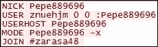

# 五、检查恶意软件流量

恶意软件是任何具有恶意意图的软件，通常指病毒、蠕虫、特洛伊木马、间谍软件、广告软件、勒索软件等等。这是我们经常听到的(不幸的是)。分析这样一个软件，以了解它的工作方式，它影响的文件，它独特的签名，以及它可能对系统造成的伤害，这就是所谓的恶意软件分析。恶意软件分析是一种不同的球类游戏，它有自己的一套工具，与我们在本课中将深入探讨的工具不同。在本章中，我们将重点介绍以下内容:

*   使用 Wireshark 和一些常识分析恶意流量
*   锁定网络上任何恶意软件的重要指针
*   了解机器人如何通过 IRC 通信
*   分析恶意 IRC 通信时要注意的细节

您可能会想到的第一个问题是“当我的反病毒和其他带有“闪烁灯”的解决方案完全保护我免受此类异常情况的影响时，我为什么需要检查恶意软件流量？”。好吧，如果你认为你的安全解决方案可以保护你免受任何恶意攻击，那么我建议你走出你一直生活的虚拟世界，在现实中深呼吸。此外，现实表明，没有任何安全解决方案可以为您的系统和网络提供 360 度的保护，因为有些时候这些解决方案可能会被绕过，您需要自己解决问题并深入了解情况，当然需要工具的一些帮助。

这是其中一种情况。当您怀疑您网络上的系统感染了一种全新且未被检测到的恶意软件，并且很有可能它的签名不可用，或者没有使用正在使用的**防病毒** ( **AV** )或**入侵检测系统** ( **IDS** )解决方案进行更新。否则，让我们考虑一下，你的 AV 足够聪明，可以检测并删除它，但几天后，同样的问题又出现了。你是做什么的？你去找谁？这时，您需要浏览网络流量并自己分析恶意软件，以确定根本原因。

IDS 工作的方式之一是基于签名。分析恶意软件流量类似于电影幕后的,因为开发并集成到 IDS 中以检测恶意流量的大多数签名都是基于网络流量分析的结果，定期开发的大量签名足以证明其重要性。在这一章中，我们将强调这一点。

# Wireshark 蓄势待发

为了简化对恶意流量的分析，Wireshark 需要做一些调整。简而言之，我们需要在 Wireshark 中创建新的配置文件来检查恶意软件流量。

## 更新栏目

我们在 Wireshark 中添加了以下栏目:


可以通过进入菜单栏并导航到**编辑** | **首选项** | **选择列**(在**用户界面**下)来添加/修改列。

*   **SPort**—源端口(未解析)
*   **d 端口**—目的端口(未解析)
*   **HTTP 主机**—显示过滤器:`http.host`
*   **URI**—显示过滤器:`http.request.uri`

## 更新了着色规则

对于任何包含异常数量 DNS 答案的数据包，我们用背景色——黑色和前景色——橙色对其进行着色，如下图所示。


在**数据包细节**窗格的**帧**标题下可以看到任何数据包隐含的着色规则。


上述数据包隐含的着色规则

## 重要显示过滤器

也可以保存一些正在使用的常用显示过滤器，如以下过滤器工具栏所示:


只需将滤镜放入可用空间，等到背景变成*绿色*，点击**保存**(滤镜工具栏中**应用**旁边)。以下是使用的显示过滤器:

*   HTTP 请求:`http.request`
*   通过 DHCP 的主机:`bootp.option.hostname`
*   通过 DNS 的主机:`dns.qry.name`
*   IRC 的加入命令:`irc && tcp matches "(?i) join"`
*   IRC 的请求命令:`irc.request`

### 注意

该配置文件是一个样本配置文件，仅限于本章的分析需要。请根据您的要求随时更新档案。

# 恶意流量分析

对网络流量的定期分析有助于检测我们网络上是否存在任何受恶意软件感染的主机。没有一种*通用的*方法来分析恶意软件流量，因为可能会有各种因素，如通信渠道、不同的攻击签名和使用的有效载荷，以及更多会影响我们采取的方法的因素。我们将通过以下案例研究来了解当前最流行的威胁之一，并分析由此产生的流量。

## 案例研究——黑洞利用工具包

漏洞利用是一段利用漏洞的代码，而漏洞利用工具包只是一个包含漏洞利用代码和有效载荷的工具集，用于自动化危害系统的过程，并负责漏洞利用后的工作。

据维基百科称，漏洞工具包黑洞是 2012 年最普遍的网络威胁，并在一个地下黑客论坛上发布。

### 注意

要了解这个漏洞利用工具包的功能，请参考[https://naked security . sophos . com/exploring-the-black hole-exploit-kit/](https://nakedsecurity.sophos.com/exploring-the-blackhole-exploit-kit/)。

我们现在将获取包含受感染流量的捕获文件，并对其进行分析。在分析过程中，我们会指出重要的线索，引导我们找到感染的根本原因。

### 注意

这里使用的抓图文件可以从[http://www . malware-traffic-analysis . net/2013/07/21/index . html](http://www.malware-traffic-analysis.net/2013/07/21/index.html)下载。该网站是一个极好的来源，因为它包含一个包含恶意流量的跟踪文件的综合数据库，并由 Brad(一位热情的安全研究员)定期更新。

### 行动中的协议

要查看运行中的协议，我们可以查看**统计信息**菜单下的**协议**层次结构，在我们正在使用的跟踪文件中，我们可以看到 HTTP 和 HTTP2 协议的使用，以及使用 SSL 对传输中的数据进行加密。


### 被感染机器的 IP 地址

我们有多种方法可以识别被感染机器的详细信息。检查 **TCP 对话**、**端点**，甚至在这种情况下检查 HTTP 请求，可以帮助我们缩小到客户端(`Infected Box`)。


TCP 对话显示 192.168.204.150 用于所有对话

因为该跟踪包含 HTTP 流量，所以过滤 HTTP 请求是发现发出请求的客户端的一个好选择。


显示 192.168.204.150 是所有 HTTP 请求的来源

在添加中，如果你已经注意到`192.168.204.150`是跟踪文件中唯一的私有 IP 地址，我们可以得出以下结论。

**被感染机器的 IP 地址** : `192.168.204.150`

### 注意

如果跟踪文件包含任何 DNS 或 DHCP 流量，通过过滤 NBNS/DNS 流量[`dns.qry.name`]或 DHCP 流量[`bootp.option.hostname`]，甚至可以找到受害者的主机名。

### 任何不寻常的端口号

如果我们查看 **TCP 会话**，并根据目的端口对其进行排序，即**端口 B** ，那么我们可以清楚地看到总共使用了三个端口，即 80、443 和 16471。其中，16471 看起来很奇怪，因为 80 和 443 用于 HTTP 和 HTTPS 通信，这完全证明了前面确定的协议是正确的。

出于好奇，在谷歌上简单搜索一下，就会发现以下关于端口 16471 的信息。


不寻常的端口号导致关于零访问僵尸网络的信息

经过进一步研究，我们知道 ZeroAccess 木马是黑洞漏洞利用工具包提供的有效载荷之一。

同样，如果我们搜索与端口 16471 相关联的 IP 地址，我们将在[https://www.malwares.com/](https://www.malwares.com/)上找到以下结果:


显示 IP 的通信历史:92.55.86.251

### 注意

在线资源可用于验证是否有任何域/URL 或 IP 地址也被列入黑名单。一些好的资源是:

[https://www.malwares.com/](https://www.malwares.com/)

[https://www.virustotal.com/](https://www.virustotal.com/)

### 被入侵的网站

在分析了上述细节后，例如，使用 HTTP 进行通信，我们可以得出结论客户端访问了一个恶意网站，这开始了整个灾难。为了确定客户访问的网站或域，我们首先需要检查跟踪文件中存在的所有域，并将这些点连接起来。由于该跟踪文件中没有 DNS 流量，我们可以通过过滤 HTTP 流量来查看域。在这种情况下，以下显示过滤器很有帮助:

```
http.request
http.host
```

下面的屏幕截图显示了主机的详细信息:


由`http.host`过滤的主机列下的域列表

在分析了来自每个域的流量后，我们可以得出以下结论:

1.  客户端访问[http://tonerkozpont.hu/](http://tonerkozpont.hu/)，被重定向到`raiwinners.org`，这里可以看到:

    数据包四上的以下传输控制协议（Transmission Control Protocol）流可见的重定向网址

2.  同样，如果我们跟随重定向请求到包 13，我们注意到在 HTTP 302 响应中通过**位置**报头到`domenicossos.com`的另一个重定向。通过数据包 13 上的以下传输控制协议（Transmission Control Protocol）流进行的另一次重定向

在**统计**菜单下的**流程图**中可以看到另一个被感染网站的指示。该图表明客户端最初访问了`91.186.20.51`，该 IP 地址解析为[http://tonerkozpont.hu/](http://tonerkozpont.hu/)。


该流程图表明首先访问的是 91.186.20.51

**被攻陷的网站**:[tonerkozpont.com](http://tonerkozpont.com)(`91.186.20.51`)

### 受感染的文件

在这一部分，我们将从 Wireshark 捕获中提取文件，给文件一个适当的扩展名，并测试它们是否有任何不适当的内容。

从 Wireshark 捕获中提取文件可以手动完成，也可以转到**文件** | **导出对象** | **HTTP** 到从 HTTP 流量中提取文件，因为在这种情况下使用 HTTP 进行通信。


此跟踪文件的 HTTP 对象列表

### 注意

要获得了解如何手动提取文件的链接，您可以参考[http://digital-forensics . sans . org/blog/2009/03/10/pulling-binaries-from-pcaps/](http://digital-forensics.sans.org/blog/2009/03/10/pulling-binaries-from-pcaps/)。

提取文件的步骤如下:

1.  点击**保存所有**下的 HTTP 对象列表。这将在所选位置保存所有 HTTP 对象。下一步将是识别这些文件的类型/扩展名。
2.  为了识别提取文件的扩展名，我们需要首先从前面截图中突出显示的列中找出数据包编号，然后导航到**数据包列表**窗格，右键单击数据包选择**跟随 TCP 流**。

接下来，我们将为提取的文件分配适当的文件扩展名。以下是文件的 TCP 流，突出显示了文件扩展名:

文件 1 是从数据包 163 的 TCP 流中提取的 java-archive 文件，如下图所示:


文件 2、3 和 4 是从数据包 665 的 TCP 流中提取的三个可执行文件，它们被提及如下:


第一个可执行文件，名为 calc.exe

第二个文件如下:


第二个可执行文件，名为 info.exe

第三个文件如下:


第三个可执行文件，名为 readme.exe

在成功提取并给文件指定适当的名称和扩展名后，我们得到了以下内容:


从跟踪文件中提取的重要文件

现在，分析文件的过程由您决定。在这种情况下，我们的选择是:

*   该文件可以发送给专家，他们可以对其进行逆向工程，并缩小任何异常，例如对有效载荷的调用
*   这些文件可以上传到一个检查可疑签名的网站上。

以下是在[https://www.virustotal.com/](https://www.virustotal.com/)上传`readme.exe`后的报告样本。


49 家反病毒软件供应商中有 36 家检测到此文件是恶意的

### 结论

在这个案例研究中，我们得出了以下结论:

客户/受害者(`192.168.204.150`)访问了一个被感染的网站([http://tonerkozpont.hu/](http://tonerkozpont.hu/))，该网站将他进一步重定向到一个在`mydb.php`页面上托管黑洞利用工具包的网站(`domenicossos.com`)。可疑的网站随后下载了受害者盒子上的 java 漏洞(`JavaArchive.jar`)，然后发送了三种不同的有效载荷(`calc.exe`、`info.exe`和`readme.exe`)。一旦被感染，会注意到`ohtheigh.cc`的多个子域有额外的 HTTPS 流量，并且还存在到端口 16471 的流量，这指向 **ZeroAccess** 特洛伊木马。

# IRC 僵尸网络

**互联网中继聊天** ( **IRC** )，是一个用于在互联网上通信的聊天系统，而僵尸网络是一个被入侵机器(bot)的网络，其中由攻击者使用**命令和控制** ( **C & C** )服务器进行远程控制。IRC 是僵尸网络最常用的 C & C 通道。

### 注意

公司网络上出现 IRC 应该会引起*红色警报*！

简单来说，一旦机器被入侵，它就会被编程为连接到预设的 IRC 通道，并等待服务器的进一步指示。然后，攻击者可以远程控制被入侵的机器人来代表他或她执行操作，在最糟糕的情况下，攻击者可以一起使用多个机器人，对选择的目标执行灾难性的攻击，如分布式拒绝服务 ( **DDoS** )(在流行的中情局三人组的保护伞下针对信息的*可用性*的攻击)。

### 注意

请参考以下内容，以便更好地理解:

IRC 通信:[https://tools.ietf.org/html/rfc1459](https://tools.ietf.org/html/rfc1459)

基于僵尸网络的通信:[http://honeynet.org/papers/bots/](http://honeynet.org/papers/bots/)

## 检验

为了进行分析，我们将从[https://mcfp . felk . cvut . cz/public datasets/CTU-Malware-Capture-Botnet-45/Botnet-Capture-2011 08 15-rbot-dos-icmp . pcap](https://mcfp.felk.cvut.cz/publicDatasets/CTU-Malware-Capture-Botnet-45/botnet-capture-20110815-rbot-dos-icmp.pcap)中提取一个跟踪文件。

1.  Since, we expect this to be IRC communication, then using an appropriate display filter can prove handy, And the output is shown here:

    By default, the frame communicated through port 6667 is decoded as IRC

    ### Note

    in Wireshark. One indicator in this case is the visibility of common IRC commands, such as `USER`, `NICK`, `JOIN`, `MODE` and `USERHOST`. Then, we need to manually set Wireshark to decode IRC and other traffic by selecting **under **Analysis** in the menu bar to decode it into** and selecting the appropriate decoding settings.

2.  Filtering on DNS communications show us the packets based on the coloring rule (`dns.count.answers>5`) defined earlier. It can be seen as follows:

    在彩色数据包中收到的 DNS 响应突出显示，它们在 DNS 响应中包含五个以上的答案。跟踪文件中的 DNS 答案如下:

    
3.  因为 IRC 流量以明文形式通过；因此，对 IRC 流量执行 **Follow TCP Stream** 是跟踪机器人执行的活动和 IRC 命令的好办法。

    *   `NICK`:这是用来给用户一个昵称或者改变一个已经存在的昵称
    *   `USER`:这是用来在连接开始的时候指定用户名、主机名、服务器名、 新用户的真实姓名
    *   `USERHOST`:这是一个以昵称为参数并返回昵称信息的命令
    *   `MODE`:该命令用于改变用户名或频道
    *   `JOIN`的模式:该命令用于加入或连接到一个特定的 IRC 频道

深入挖掘 TCP 流，我们得出以下结论:


C&C 服务器发出了几个 PRIVMSG 命令来执行 DoS 攻击。

# 总结

在这一章中，我们学习了如何使用 Wireshark 寻找并整合恶意软件流量分析难题的不同部分，还详细介绍了 IRC 僵尸网络感染的通信。在下一章中，我们将看看如何使用 Wireshark 来满足我们的网络性能需求。