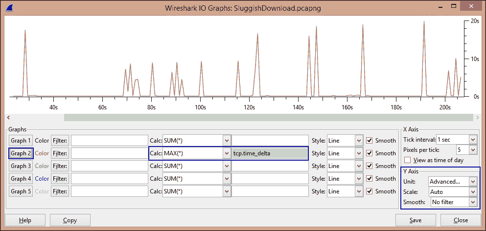

# 六、网络性能分析

网络正常运行时间和最佳性能是任何技术人员最关心的问题，影响网络正常运行时间和最佳性能的问题可能是众多问题中的一个，完全取决于所讨论网络的规模和复杂性。这些异常包括但不限于以下内容:

*   慢速互联网
*   瓶颈
*   分组丢失和/或重传
*   过度的带宽消耗
*   意外的 BitTorrent 流量

深入了解网络协议如何交织和工作对于排除网络性能故障是不可或缺的。例如，如果我们不能有效地理解 TCP 的流程和错误控制机制，那么我们可能无法有效地测试基于 TCP 的性能问题。

很多次，有人问我，“Wireshark 如何解决我的网络问题？”老实说，Wireshark 可能并不总能引导您找到问题的根源，但它绝对可以帮助您检测到问题的位置。缩小问题原因的范围完全取决于分析器的技能。例如，Wireshark 可能会帮助您找到在网络上丢弃数据包的设备，但可能并不总能让您找到其背后的原因。

Wireshark 有助于分析性能问题的一些特性如下:

*   专家信息窗口
*   图形
*   时间变化
*   着色规则

# 为故障排除创建自定义配置文件

我们将首先创建一个坚如磐石的配置文件用于故障排除，然后查看可能会阻碍网络性能的不同问题。

到目前为止，我假设您已经习惯了在 Wireshark 中创建配置文件。简介的重点如下:

1.  取消选中/禁用**允许子分配器重组 TCP 流**选项。这应该仅在获取 HTTP 或 SMB 对象时启用。
2.  To deal with sequencing issues in TCP, we first need to enable **Analyze TCP sequence numbers** under **Preferences** | **Protocols** | **TCP**. The following is how my TCP Preferences look like:

    故障排除配置文件:TCP 首选项

    接下来，将序列号、下一个序列号和确认号放入 Wireshark 中的三个不同的列中，以便于分析 TCP 序列，如下一个屏幕截图所示。

3.  "Time" is always a major factor when looking for delays on the network and hence we will begin by tweaking it. First of all, we will change the display format of time by navigating to **View** | **Time Display Format** and selecting **Seconds since previously displayed packet**.

    现在，在已经存在的**时间**列旁边加入 delta 时间列(`tcp.time_delta`)，如下一个屏幕截图所示。

4.  包含另一列窗口大小(`tcp.window_size`)，以检查与 TCP 窗口过程相关的任何问题，如下一个屏幕截图所示。
5.  创建并保存以下显示过滤按钮:

    *   **HTTP 错误** : `http.response.code > 399`
    *   **DNS 错误** : `dns.flags.rcode > 0`
    *   **FTP 错误** : `ftp.response.code > 399`
    *   **WLAN 重试次数**:`wlan.fc.retry == 1`

    

    故障排除配置文件：列和保存的显示过滤器

前面的配置文件是一个故障排除配置文件示例。因此，请根据您的环境随意添加和/或修改。例如，您可能希望根据基于 Torrent 的流量的签名来更新它。

# 分析前优化

选择正确的地方开始捕获通常是解决性能挫折的关键。例如，建议将分析仪放在更靠近经常抱怨网络性能差的员工系统的地方，而不是放在任何随机用户的系统中，因为这将使我们更好地了解问题。

### 注意

如果在服务器上捕获是我们唯一的选择，那么我们需要确保使用一组良好的捕获过滤器来避免任何不必要的流量，或者我们可以选择使用显示过滤器从完整的跟踪文件中提取相关的对话。

例如，如果我们只对进出 IP 地址为`10.1.0.20`的特定主机的流量感兴趣，那么我们可以使用`host 10.1.0.20`作为我们的捕获过滤器，或者在捕获完整的流量后，我们可以使用`ip.host == 10.1.0.20` 作为显示过滤器，并使用**导出指定的数据包**来提取该对话。

这很重要，并且通过避免不相关的帧节省了大量的分析时间。

另一个建议是，如果需要长时间执行捕获，可以使用命令行工具，比如 tshark 或 tcpdump。

# 基于 TCP 的问题

**专家信息**选项卡是一个很好的指示器，可以指示由于 TCP 问题而出现的任何问题；否则，我们还可以使用显示过滤器`tcp.analysis.flags`来缩小 Wireshark 发现的任何 TCP 问题的范围。下面是一些常见的 TCP 问题及其各自的显示过滤器:

*   前一段未被捕获(`tcp.analysis.lost_segment`)
*   重复确认(`tcp.analysis.duplicate_ack`)
*   TCP 快速重新传输(`tcp.analysis.fast_retransmission`)
*   TCP 重新传输(`tcp.analysis.retransmission`)
*   无序段(`tcp.analysis.out_of_order`)
*   零窗口(`tcp.analysis.zero_window`)

需要注意的要点是:

*   每当数据包在网络上丢失时，我们都会注意到网络上的快速重新传输和/或重新传输。一般的经验法则是重复的 ack 会导致快速重传，而发送端过期的**请求超时** ( **RTOs** )会导致重传。

    专家信息"窗口,在"注释"选项卡下显示快速重新传输和重新传输

*   当应用在 TCP 上运行时，我们可以通过查看 SYN 和 SYN/ACK 之间的延迟(路径延迟)以及来自服务器的 ACK 和随后的实际数据之间的延迟来检测路径和服务器延迟，例如，服务器延迟的 DNS 响应延迟(如果有)。
*   每当 Wireshark 检测到 TCP 对话的任何一方将 TCP 窗口大小值(`tcp.window_size_value == 0`)作为`0`进行广告时，它会将数据包标记为**零窗口**。当接收方的接收缓冲区跟不上数据接收速率时，就会产生此情况。这里要注意的一点是，如果数据包的 RST、SYN 或 FIN 位设置为 1，它们将不会被标记为**零窗口**，如下所示:

    零窗口示例

# 案例研究 1——慢速互联网

我们公司的一名员工找到网络支持极客(让我们称他为 Bob ),请求检查互联网是否有问题，因为在过去几天里，他从互联网上收到的应用响应非常慢。经过他那边的一些调查，Bob 发现这是一个普遍存在的问题，许多人在过去两天都注意到了这一点。

由于问题出在互联网上(根据用户的分析和观点)，Bob 决定首先将分析器连接到出口节点，即路由器，将网络连接到互联网，并捕获一些流量进行分析。

## 分析

跟踪文件中的大部分流量都来自特定的主机`192.168.10.132`，因此 Bob 在`ip.host==192.168.10.132`上进行过滤，并将这些数据包导出到不同的跟踪文件中进行分析。

**对话**窗口显示在捕获帧的短时间内有大量 TCP 和 UDP 对话。在 UDP 选项卡下的**字节**列上排序后；Bob 注意到通信发生在客户端的同一个端口上，即 **46816** 到不同的 IP 地址。


此外，查看 DNS 查询，发现查询是针对不同国家的域进行的，并暗示使用 Vuze(BitTorrent 客户端)是潜在的罪魁祸首:


DNS 查询

这两个指标对 Bob 来说都足够强大，他可以亲自去那个系统(`192.168.10.132`)进行检查。他发现用户正在运行 BitTorrent 客户端，并通过 Torrent 下载内容。一旦下载被停止，Vuze 被从用户的机器上卸载，一切正常，用户获得了最佳的网速。

# 案例研究 2–缓慢的下载

在这个案例研究中，我们将查看一个跟踪文件，该文件包含一个抱怨下载缓慢的用户的系统中发生的下载帧。

## 分析

在模拟用户执行的相同下载并在他的系统中捕获流量后，我们得出了一个巨大的跟踪文件，并因此过滤了(使用 **tshark** )下载所来自的特定 IP 上的流量。

检查延迟时首先要注意的是增量时间，更具体地说，是通过 TCP 下载时的 TCP 增量时间。按照 TCP delta 时间对流量进行排序，我们会看到时间上的显著延迟，如下图所示:


高 TCP 增量时间

还可以创建一个图表来指示高 TCP 增量时间，这对于向其他人显示和解释问题是必不可少的。



该图可通过执行以下步骤生成:

1.  进入**统计** | **IO 图**。
2.  在 **Y 轴**部分，从**单元**下拉菜单中选择**高级**。
3.  从**计算**下拉菜单中选择**最大值(*)** ，并输入 TCP 增量时间所需的过滤器(`tcp.time_delta`)。
4.  点击最左侧的**图表 2** 按钮。

接下来，我们可以查看**专家信息**窗口，看看 Wireshark 是否在跟踪文件中检测到任何错误。以下是观察结果:

*   **前一段未捕获到** : 1309 帧
*   **重复确认** : 12249 帧
*   **TCP 快速重传** : 625 帧
*   **TCP 重传** : 1216 帧
*   **无序段** : 1226 帧
*   **零窗口** : 3 帧

为了确定数据包丢失的位置，我们决定分析 TCP 序列号(我们之前添加到配置文件中的三列， **SEQ#** 、 **NEXTSEQ#** 和 **ACK#** )，并得出结论，数据包丢失发生在客户端附近，经过进一步调查，结果是由于中间设备的配置错误。

# 案例研究 3–拒绝服务

**拒绝服务** ( **拒绝服务**)是一种攻击，在这种攻击中，授权人员需要访问服务时，被拒绝访问。例如，最近在 HTTP.sys 中发现的影响**互联网信息服务器** ( **IIS** )的漏洞，如果被利用，可能导致拒绝服务条件，从而导致对易受其攻击的 web 服务器的拒绝访问(CVE-2015-1635)。简而言之，这是对信息可用性的攻击。

在过去，许多黑客活动组织或黑客出于政治和其他原因执行了**分布式拒绝服务** ( **DDoS** )来证明一个观点，他们已经成为许多头条新闻，这是不言自明的，而不是我在这里解释。

让我们来看看一个非常标准的 DoS 攻击，并通过 Wireshark 进行分析。

## 合成洪水

SYN flood 攻击是指攻击者发送大量 SYN 位设置为`1`的 TCP 帧，表示他/她正在尝试发起连接。然而，当服务器在很短的时间内收到大量这样的请求时，这往往会耗尽其资源；因此，合法用户无法使用该特定服务，从而导致 DoS 情况。

下面是一个跟踪，显示使用`hping3`实用工具对 web 服务器进行的 SYN flood 攻击。


正在进行 SYN flood 攻击

### 注意

检查 SYN flood 攻击的一个有用的显示过滤器是:

```
tcp.flags.syn==1 && tcp.flags.ack==0
```

# 总结

在本章中，我们了解了如何创建相关的故障排除配置文件，并学习了如何使用 TCP 增量时间对任何时间延迟进行排序，以及如何使用 IO 图来更好地表示性能问题。故障排除的关键仍然是对协议的深入理解，因为工具只能帮助我们解决问题，但我们的工作是找出问题所在。