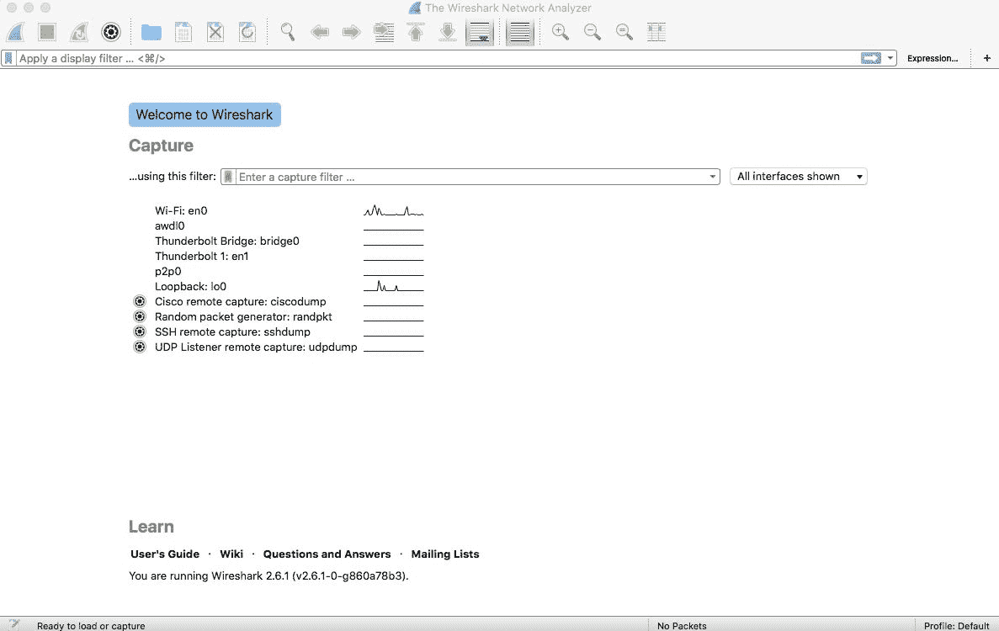
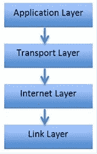
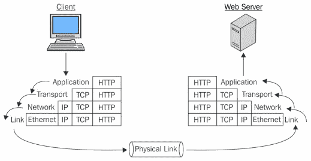

# 一、安装 Wireshark

本章向您介绍 TCP/IP 模型的基础知识，并逐步演示如何在您喜欢的操作系统上安装 Wireshark。将向您介绍以下主题:

*   Wireshark 是什么？
*   TCP/IP 模型概述
*   在不同平台上安装和运行 Wireshark
*   常见安装错误疑难解答

# Wireshark 简介

Wireshark 是一个先进的网络和协议分析器，它让您以图形的形式可视化网络的活动，并协助专业人员调试网络级的问题。Wireshark 通过提供对网络流量的详细了解，增强了网络和安全专业人员的能力。但是，Wireshark 也被恶意用户用来嗅探网络流量，以获取纯文本形式的敏感数据。

# 为什么使用 Wireshark？

许多人，包括我自己，都对 Wireshark 提供的简单的数据包捕获功能着迷。让我们快速浏览一下为什么大多数专业人员更喜欢 Wireshark 而不是其他数据包嗅探器的一些原因:

*   **用户友好**:Wireshark 的界面易于使用和理解，工具&的特性被很好的组织和表现。
*   **健壮性** : Wireshark 能够轻松处理巨大的网络流量。
*   **平台无关** : Wireshark 可用于不同风格的操作系统，无论是 Windows、Linux 还是 Macintosh。
*   **过滤**:Wireshark 中有两种过滤选项:
    *   您选择要捕获的内容(**捕获过滤器**)
    *   您可以选择捕获后要显示的内容(**显示过滤器**)
*   **成本** : Wireshark 是一款免费的开源数据包分析器，由专业人士社区开发和维护。Wireshark 也提供一些付费的专业应用。更多详情请参考 Wireshark 的官方网站【https://www.wireshark.org/ 。
*   **支持** : Wireshark 由一群分散在全球各地的贡献者持续开发。我们可以注册 Wireshark 的邮件列表，也可以从在线文档中获得帮助，这些文档可以通过 GUI 本身访问。各种其他在线论坛也可供您获得最有效的帮助；请访问 Google 付费 Wireshark 支持网站，了解更多可用的支持。

# 安装过程

Wireshark 的安装非常简单，容易理解。完成以下步骤，将其安装到您的系统上:

1.  本书中的食谱和例子将在麦金塔电脑和视窗电脑上使用；对于其他操作系统，安装是相同的。有些操作系统，如 Kali Linux，预装了 Wireshark 版本。
2.  找到适用于您的平台的正确版本的 Wireshark(Wireshark 2 . 6 . 1 Intel 64 . dmg)后，按照向导安装 Wireshark。
3.  安装过程完成后，重新启动计算机以提交所做的更改。
4.  双击桌面上的 Wireshark 图标运行应用:

Wireshark 屏幕

# 常见安装错误疑难解答

查看以下简单的清单，确保您能够成功运行 Wireshark(确保满足所有这些标准):

*   您仅从已知的可信来源下载了 Wireshark
*   您拥有运行 Wireshark 的管理权限
*   Wireshark 和 Winpcap 驱动程序的安装已成功完成，没有任何异常
*   您已连接到要从中捕获网络流量的网络
*   如果您尝试使用虚拟机进行嗅探，请确保您已将网络适配器设置为桥接模式
*   重新启动您的计算机，以确保在成功安装 Wireshark 后应用了更改
*   您的网卡支持混杂模式嗅探(需要时)
*   您可以在 Wireshark 的主屏幕上看到所有接口(有线、无线和逻辑)
*   接口名称后面的线形图显示了主屏幕上的活动
*   此外，您拥有捕获网络流量的合法权限

# TCP/IP 模型概述

网络通信的世界是由一组协议(规则和条例)管理的，以便按预期运行。协议管理端点之间的通信信道上的网络分组/段/帧的传输。为了理解网络数据包是如何粘在一起形成数据流的，我们需要理解 TCP/IP 模型这一网络基础知识。TCP/IP 模型最初被称为 DoD 模型，是由美国国防部管理的一个项目。我们在互联网和其他网络上看到的所有通信都是通过 TCP/IP 进行的。

TCP/IP 模型负责数据包生命周期的每个部分，即数据包是如何产生的，数据包是如何生成的，与数据包相关的信息是如何附加到数据有效负载(PDU)上的，它是如何通过中间节点路由的，如何与其他数据包链接等等。

在继续之前，强烈建议您自学一下 TCP/IP 及其工作原理，因为这本书要求您对协议有相当的了解。

# TCP/IP 模型中的各层

TCP/IP 模型包括四层，如下图所示。每一层都有特定的用途，并利用一组协议来促进通信。每层中的每种协议都有特定的用途:

第一层是**应用层**，直接与用户及后续层和协议交互；它主要关注以用户可理解的格式表示数据。应用层还跟踪用户会话，监视谁在连接；它使用一组协议来帮助与用户和 TCP/IP 模型中的其他层进行交互。应用层中一些流行的协议如下:

*   **超文本传输协议** ( **HTTP** )
*   **文件传输协议** l ( **FTP**
*   **简单网络管理协议** ( **SNMP**
*   **简单邮件传输协议** ( **SMTP**

第二层是**传输层**。这一层的目的是创建套接字(端口和 IP 地址的组合)，以便让两个端点进行通信。套接字有助于在两个或多个设备之间创建多个不同的连接(在 Chrome 中可以打开多个标签)。

不同网络/网段中的设备之间的通信需要 IP 地址(例如两个路由器接口之间的通信或互联网上的通信)。也可用于**局域网** ( **LAN** )通信，通过物理地址(MAC)建立。除了端口号的限制范围之外，操作系统和应用可以选择任意端口(除端口`1`到`1013`之外)进行通信。

传输层也是通信的主干。在这一层工作的两个最重要的协议是 TCP 和 UDP:

*   **TCP** 是面向连接的协议，也称为可靠协议。首先，在端点之间建立专用通信信道，然后进行数据传输。相等划分的块从源传输，并且接收端为每个接收到的分组发送确认。如果在规定的时间内没有收到确认，发送数据的一方将重新发送数据包。
*   UDP 是一种无连接协议，通常被称为不可靠的通信形式。在 UDP 中，不建立专用信道，这也使其成为更简单、更快速的通信方式。端点也没有发送确认数据包。例如，如果您正在玩在线游戏，在通信信道上丢失几个数据包不会影响您的游戏体验，因为通过的数据包数量非常大，丢失几个数据包不会对网络流的整体质量产生太大影响。

第三层是**互联网层**，主要负责网络间数据的路由和移动。在这一层工作的主要协议是 **IP** ( **互联网协议**)。IP 为网络数据包提供到达目的地所需的路由功能。这一层包含的其他协议有 ICMP 和 IGMP。

第四层也是最后一层是**链路层**(通常称为网络接口层)。它与物理网络硬件连接。TCP/IP 没有在这一层指定任何协议；但是实现了几个协议，比如**地址解析协议** ( **ARP** )和**点对点** **协议** ( **PPP** )。这一层涉及信息在通信信道(有线或无线)中如何传播。链路层负责建立和终止连接，以及将信号从模拟转换为数字，反之亦然。网桥和交换机等设备在这一层运行。

随着数据从应用层进入链路层，一些信息以报头或报尾的形式附加到数据上，这使得 TCP/IP 的不同层可以相互通信。添加这些额外比特的过程被称为数据封装，在这个过程中，一个**协议数据单元** ( **PDU** )在联网过程的最后被创建(通过应用到链路层)。

PDU 由数据、网络地址和协议信息组成，作为报头或报尾的一部分。当 PDU 到达最底层时，它已经嵌入了传输所需的所有信息。一旦 PDU 到达目的地，当它通过 TCP/IP 模型的每一层并在模型中向上行进时，附加的报头和报尾 PDU 元素被一个接一个地撕掉。

下图描述了封装的过程:

# 摘要

在本章中，我们讨论了您需要了解的基本网络概念，以及 Wireshark 简介。Wireshark 是一种协议分析器，被世界各地的技术专业人员用来捕获和分析网络级数据包。

我们还学习了 TCP/IP 模型。TCP/IP 模型有四层:应用层、传输层、网络层和链路层。数据在从一层传递到另一层时被封装；底部生成的数据包称为完整的 PDU。

TCP 是一种可靠的协议，因为确认是其过程的一部分，而 UDP 是一种不可靠的协议，因为不发送确认。

要安装 Wireshark，您只需访问[http://www.wireshark.org](http://www.wireshark.org)，然后下载适合您操作系统的版本。

排除 Wireshark 故障的方法是，确保网络工作正常，您拥有安装和运行该应用所需的全部权限，并且安装已经完成，没有任何异常。

在下一章中，我们将运行我们的第一个 Wireshark 捕获，并感受一下协议分析的体验。