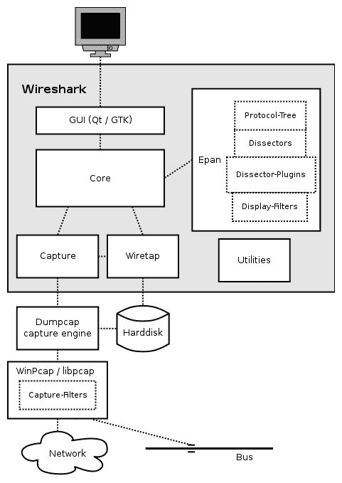
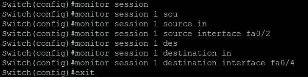
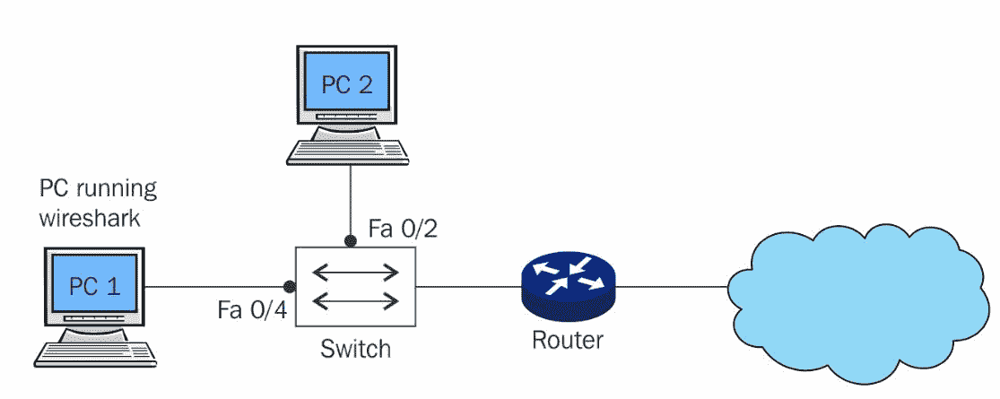
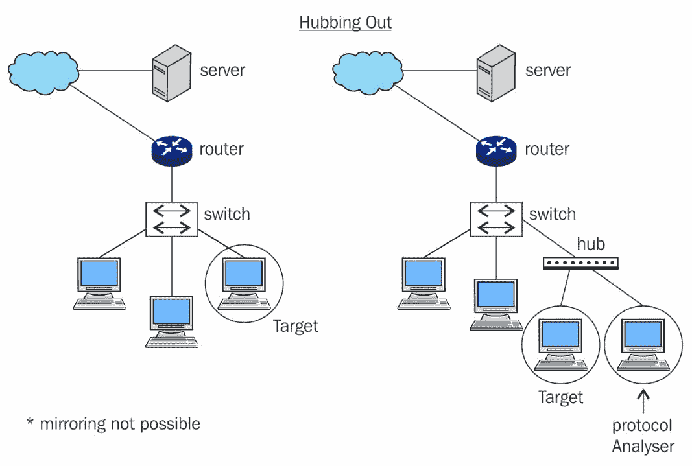
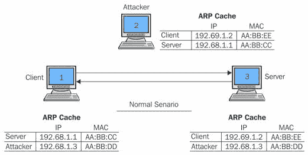
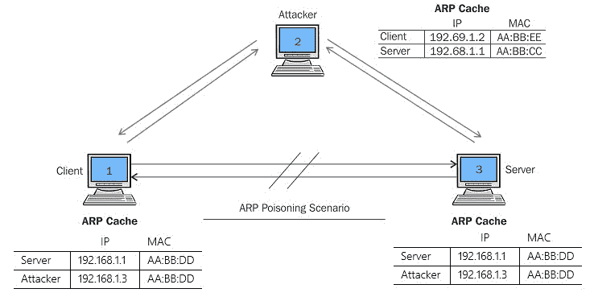
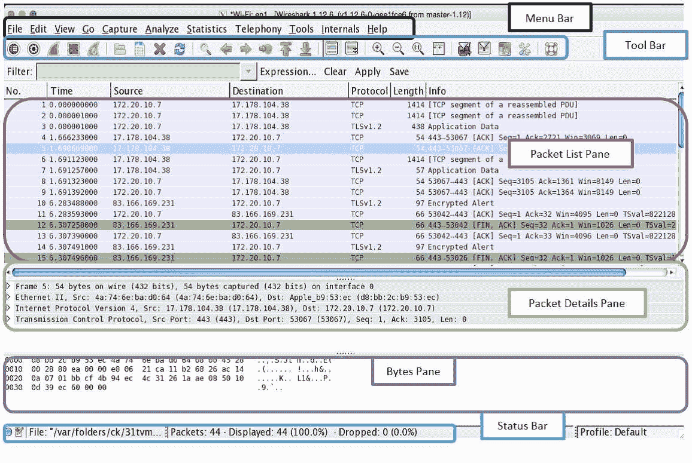
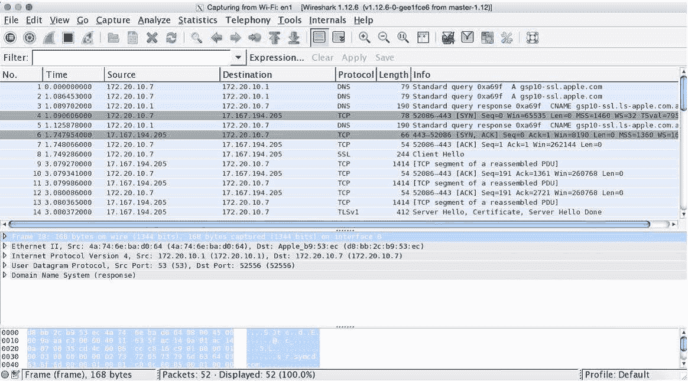
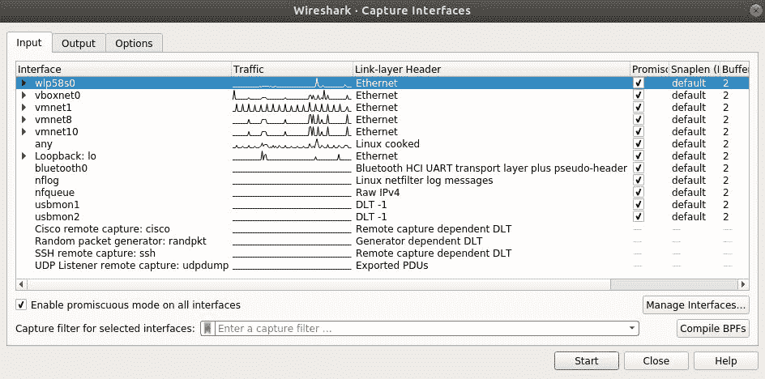
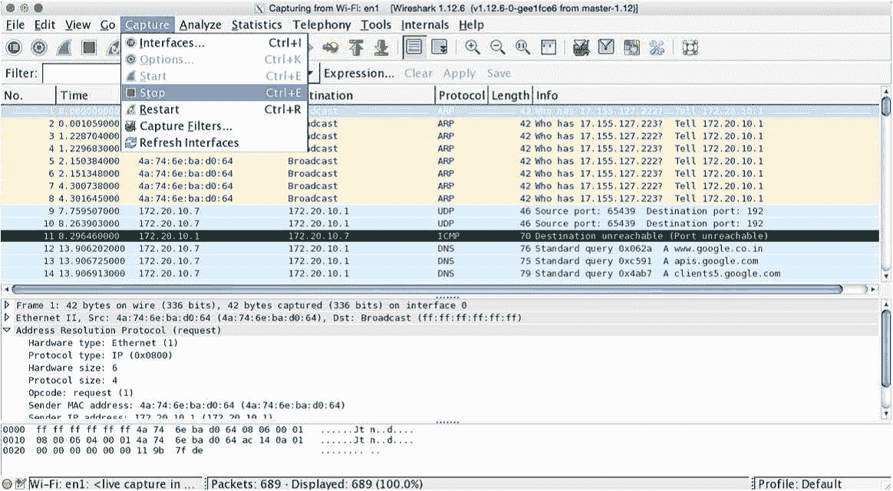

# 二、Wireshark 和数据包分析简介

本章将帮助你理解包分析背后的基础和科学。Wireshark 非常方便，对于处理网络、安全和数字取证角色的专业人员来说，它就像一把瑞士刀。在本章中，您将了解以下主题:

*   Wireshark 简介
*   Wireshark 的工作原理
*   捕获方法
*   了解 Wireshark 的 GUI
*   开始我们的第一次抓捕

# Wireshark 是什么？

Wireshark 是一种数据包嗅探应用，由 IT 专业人员用于各种需求(包括取证、故障排除和增强网络性能)。你可以从[https://www.wireshark.org/download.html](https://www.wireshark.org/download.html)免费下载，在那里它适用于大多数平台，包括 Linux、Macintosh 和 Windows。

数据包嗅探也称为接入线路，主要是读取通信信道中传输的信息。在捕获网络数据包之前，需要评估嗅探器的放置、要分析的协议和通信信道类型等因素。

# Wireshark 的工作原理

Wireshark 通过计算机的网络接口从网络上收集网络流量，以混杂模式运行(如果需要)，以检查和显示与协议、IP 地址、端口、报头和数据包长度相关的信息。下图说明了所有元素如何协同工作来向用户显示数据包级别的信息(来源:[https://www.wireshark.org](https://www.wireshark.org)):



Wireshark 附带了 Winpcap/libcap 驱动程序，它使 NIC 能够以混杂模式运行；在混杂模式下，您唯一不需要嗅探的时候是当数据包直接、有意地发往您的设备和/或从您的设备生成时。

在操作系统上，您应该拥有运行 Wireshark 的权限。每个协议分析器都要遵循三个过程:收集、转换和分析。这些描述如下:

*   **收集**:选择一个接口监听流量，捕获网络数据包。
*   **转换**:增加非人类可读数据的可读性。数据包通过 GUI 转换成易于理解的信息。
*   **分析**:通过使用统计和图形特性，分析与数据包、协议、原始数据等相关的网络流量。

如前一章所述，协议是一组规则和条例，用于管理两台网络设备之间的通信过程，并控制设备的运行环境。

# Wireshark 数据包分析简介

数据包/流量分析是对网络流量的研究，目的是了解数据包的结构、移动和行为。数据包分析是在实时流量上执行的，或者是在已经捕获的流量流上完成的。

日常网络基础设施中会出现许多问题，如果您负责处理网络或数字环境的安全，您需要为自己配备故障排除和分析工具。大多数问题会升级，并在网络中的数据包级别得到纠正。数据包级出现的问题可能会逐渐中断关键的业务通信，导致收入损失。即使最好的网络硬件利用最先进和最安全的协议和服务，也可能对您不利或表现异常。要在这种情况下执行根本原因分析，您可能需要深入到数据包级别，以便了解异常情况。数据包分析可用于以下目的:

*   通过查看数据包及其报头来分析网络问题，以获得更好的洞察力。
*   通过过滤模式和特征来检测和分析网络入侵企图。
*   通过在您的安全设备中建立防火墙规则，然后监控这些规则，来检测内部或外部用户对网络的滥用。
*   研究和隔离被利用的系统，使受影响的系统不会成为枢纽。
*   监控和分析在网络中实时传输的数据。
*   更好地控制网络中允许和限制的信息类别。例如，假设您想要在防火墙中创建一个规则来阻止对 torrent 站点的访问(点对点文件共享)。也可以通过访问列表在可管理的路由器上阻止对这些数据包的访问，但是可以通过流量分析来识别和验证这些数据包的来源。
*   通过过滤数据包踪迹来收集和报告网络统计数据。
*   了解谁在实时网络上以及他们在做什么(他们可能正在消耗网络带宽或尝试连接到受限制的网站)，并了解是否有人试图绕过您配置的网络限制。
*   调试客户端/服务器通信，以便可以审核网络上传输的所有请求和回复。
*   识别位于网络角落并消耗带宽的应用。它们可能会使您的网络不安全、无响应或对公共网络可见。
*   调试网络协议实现和由于无意的错误配置或人为错误而产生的任何异常。
*   识别您网络中的异常/恶意流量模式，然后进行分析、控制/监督，并为此类事件做好准备。

执行数据包分析时，需要考虑以下事项:

*   要解释的协议
*   您是否需要捕获来自所有来源和所有目的地的流量
*   充分放置你的嗅探器
*   捕获与特定端口或服务相关的流量，以避免不必要的噪音

您应该记录和构建与网络流量模式和行为相关的用例。用例可以帮助工程师解决网络问题。

数据包分析器可以解释大多数网络协议(如 IP 和 ICMP)、传输层协议(如 TCP 和 UDP)和应用层协议(如 DNS 和 HTTP)。

# 如何进行数据包分析

网络数据包以原始的二进制形式被捕获，并通过 wiretap 库和捕获引擎，然后到达带有解析器插件和过滤器的核心引擎。然后翻译后的数据通过**图形工具包** ( **GTK** )以数据包的形式显示出来。

# 捕获方法

为了捕获正确的数据包流，您需要知道在哪里放置您的协议分析器。根据不同的需求(数据包来源、数据包数量、数据包类型等)，需要在网络中的某个位置放置协议分析器。此外，网络设备中的一些配置更改可能是必要的，例如交换机配置更改(在网络交换机中进行镜像以捕获来自一个或多个源的数据包)。以下小节讨论了在某些类型的拓扑中评估配置协议分析的最佳方式的几种方法。

# 基于集线器的网络

在基于集线器的网络拓扑中进行嗅探相对容易，因为您可以自由地将嗅探器放置在任何您想要的位置，因为集线器被设计为将每个数据包广播到所有连接的设备。

然而，由于这种设计缺陷，基于集线器的网络拓扑面临着整体性能方面的问题。网络集线器不具备将流量优先化或仅转发到特定端口的能力。他们经常成为碰撞相关问题的受害者。例如，如果连接到集线器的多台设备同时开始发送数据，数据包很可能会发生冲突，无法到达目的地。发送端将被告知丢失的分组，然后这些分组将被重新发送，但是这将耗费网络及其管理员的时间、不适当的带宽利用以及性能问题。

# 交换环境

由于在基于交换机的基础设施中存在相对较少的限制，包分析变得相当具有挑战性。像集线器一样，除了接收数据包的端口之外，交换机不会将数据包广播到每个网络端口。它们通过 **ARP** ( **地址解析协议**)了解设备的物理地址，并用相应的 MAC 地址填充端口号列表。即便如此，通过一些硬件或配置的改变，还是有可能从其他端口捕获数据包。两种最流行的技术是 hub out 和端口镜像。

为了捕获来自一个或多个端口的数据包流，请使用交换机配置控制台配置端口镜像。大多数智能交换机都提供了通过易于理解的图形界面进行配置的选项。

让我们用一个逻辑图来简化一下。例如，假设我们有一台 24 端口的交换机和八台 PC，它们连接到不同的交换机端口。我们可以将嗅探器(Wireshark PC)放在任何空闲的交换机端口上，然后配置端口镜像，它会将所有流量从我们想要嗅探的设备复制到我们选择的端口。以下屏幕截图显示了 Cisco 交换机中用于配置端口镜像的一组命令:



那么，让我们更好地理解一下:在前面的截图中，我已经配置了什么来监听从端口`fa0/2`到端口`fa0/4`始发的所有数据包。端口`fa0/2`将是目标机器，端口`fa0/4`将是 Wireshark 机器。

一旦完成配置，我们将能够轻松地嗅探和分析从端口`fa0/2`来回流动的网络数据包。这项技术是最容易配置的技术之一；你唯一需要事先知道的是如何使用网络设备。

下图描述了端口镜像的简单演示:



端口镜像

**当您的交换机不支持端口镜像时，清除**是可行的。要使用该技术，您必须将目标 PC 从交换网络中拔出，然后将集线器插入交换机，然后将分析仪和目标设备连接到集线器，这样目标设备就成为同一网络的一部分。

现在，协议分析器和目标机器属于同一个广播域。下图将使我们更容易以更简单的方式准确理解该过程:



走出去

# ARP 中毒

毒害设备的 ARP 表条目，然后通过您的机器转发它们，这是从目标机器捕获流量的一种不道德的方式。

比方说，我们在 IP `192.168.1.1`处有一个默认网关，在 IP `192.168.1.2`处配置了一台客户机。这两台设备都维护着本地 ARP 缓存条目。这使它们能够通过局域网发送数据包。现在，位于 IP `192.168.1.3`的 Wireshark(使用`arpspoof`或`ettercap`来毒化 ARP 条目)机器将通过用多个 ARP 包淹没客户端和网关机器来毒化 ARP 缓存条目，向客户端 PC 声明默认网关已经被改变为 IP `192.168.1.3`，并声明客户端现在位于 IP `192.168.1.3`的网关；这将使每个数据包都通过 Wireshark 机器。

查看您的 PC/路由器/服务器中的 ARP 缓存的命令是`arp -a`，它将显示与特定 IP 地址相关的 MAC 地址。看看正常的 ARP 条目:



ARP 中毒(正常情况)

下面是 ARP 中毒前条目的样子:

```
Before ARP is Poisoned

192.68.1.1 - (Server)
192.68.1.2 - AA:BB:EE
192.68.1.3 - AA:BB:DD

192.68.1.2 - (Client)
192.68.1.1 - AA:BB:CC
192.68.1.3 - AA:BB:DD

192.68.1.3 - (Attacker)
192.68.1.1 - AA:BB:CC
192.68.1.2 - AA:BB:EE
```

既然您已经了解了 ARP 是什么以及它是如何工作的，我们可以尝试用攻击者的 MAC 地址来毒化默认网关和客户端的 ARP 缓存。简单来说，我们将用攻击者的 MAC 地址替换默认网关的 ARP 缓存中客户端的 MAC 地址。我们将在客户端的 MAC 地址中做同样的事情，用攻击者的 MAC 地址替换默认网关的 MAC 地址。因此，从默认网关来回发往客户端的每个数据包都将通过攻击者的机器发送。下面是在一次成功的中毒攻击后，来自客户端、服务器和攻击机器的 ARP 条目。

```
After ARP is Poisoned 
 192.68.1.1 - (Server) 
192.68.1.2 - AA:BB:DD 
192.68.1.3 - AA:BB:DD 

192.68.1.2 - (Client) 
192.68.1.1 - AA:BB:DD
192.68.1.3 - AA:BB:DD 

192.68.1.3 - (Attacker) 
192.68.1.1 - AA:BB:CC 
192.68.1.2 - AA:BB:EE 
```

中毒的机器将无法确定他们的 ARP 是否被修改，除非主动检查。下图描述了 MiTM 攻击场景中涉及的所有三个系统的 ARP 表条目:



ARP 中毒(中毒场景)

除了这两种技术之外，市场上还有各种各样的硬件，通常称为 taps，可以放在任意两个设备之间来嗅探和分析流量。尽管这种技术在某些情况下可以有效地捕获网络流量，但由于其恶意性，它只应在授权和受控的环境中实施或部署。

# 通过路由器

在处理路由环境时，数据包分析的重要方面是将我们的嗅探器放在合适的位置，从那里我们可以捕获所需的流量数据包。在网络技术方面，处理路由结构需要更多的技能，当然在路由器方面也是如此。为了便于理解，考虑以下假设的路由环境。

路由器 1、路由器 2 和路由器 3 协同工作；每个服务器至少处理 2-3 台电脑的流量。路由器 1 充当根节点，同时控制其子网络节点(路由器 2 和路由器 3)的路由。

路由器 3 无法连接到路由器 1。为了解决这个问题，管理员在 router 3 区域内放置了一个嗅探器(协议分析器),并开始分析流量，但无法找出导致停机的异常情况。管理员决定更改协议分析器的位置，转到 router 1 区域，现在按照类似的步骤进行故障排除。过了一会儿，他们发现了问题所在，并成功地解决了问题。

结论是，在您的网络基础设施中放置嗅探器是一个非常关键的决定和任务。

读完这篇文章后，我希望我们对在某些拓扑结构中如何进行协议分析有了一定的了解。现在，让我们看看 Wireshark 接口是什么样子，以及我们如何开始捕获网络数据包。

如果你没有安装 Wireshark，你可以从[https://www.wireshark.org/download.html](https://www.wireshark.org/download.html)获得一份免费的拷贝。要完成本书中的演示，您还需要熟悉界面。

# Wireshark GUI

在讨论它的强大功能之前，让我们先来谈谈 Wireshark 领域的一些关键事件。

Wireshark 建于 20 世纪 90 年代末。Gerald Combs 是一名来自堪萨斯城的年轻大学毕业生，他开发了 Ethereal(Wireshark 的基本版本)，当 Combs 开发出这项令人敬畏的发明时，他已经为自己找到了一份工作。服务几年后，库姆斯决定辞职，通过进一步开发 Ethereal 来追求自己的梦想。不幸的是，根据法律条款，库姆斯的发明是该公司专有软件的一部分。尽管如此，库姆斯还是辞去了工作，开始开发新版本的 Ethereal，并将其命名为 Wireshark。自 2006 年以来，Wireshark 一直处于积极开发阶段，并在全球范围内广泛使用。它支持公司 It 和 **ICS** ( **工业控制系统**)800 多种协议。

在开始第一次捕获之前，我们需要熟悉一下可用的选项和菜单。

Wireshark GUI 有六个主要部分，解释如下:

*   菜单栏:这是一个概括形式的工具，在应用菜单中组织
    。
*   主工具栏:这包括经常使用的工具/功能，提供软件的有效利用。
*   数据包列表窗格:显示 Wireshark 捕获的所有数据包。
*   数据包详细信息窗格:用于查看与数据包列表窗格中所选数据包相关的详细信息。关于分组的详细信息被分成对应于 TCP/IP 模型的每一层的类别。这可用于查看源和目的 IP 地址，以及以自下而上方式(链路层到应用层)排列的用于通信的不同协议。
*   字节窗格:以十六进制字节
    的形式显示数据包中的数据及其对应的 ASCII 值；它以
    的形式显示了这些值在线路中传输的情况。
*   状态栏:显示详细信息，如捕获的数据包总数。

下面的屏幕截图将帮助您识别应用中的不同部分；在继续下一步之前，请确保您已经熟悉了所有这些内容:

**** 

在工具栏区域，我们有一些有用的工具。我想给大家简单介绍一下其中的一些:

*   :选择监听接口
*   :定制捕获过程(界面、过滤器等)
*   :开始/停止/重新开始拍摄过程
*   :打开保存的抓图文件
*   :将当前抓图保存到文件中
*   :重新加载当前抓图文件
*   :关闭当前抓图文件
*   :转到上一个数据包
*   :转到下一个数据包
*   :转到特定的数据包编号
*   :打开/关闭数据包的颜色编码
*   :打开/关闭自动滚动
*   :放大、缩小、重置默认缩放
*   :根据需要改变颜色编码
*   :缩小窗口捕获数据包
*   :配置显示过滤器，只查看需要的内容

即使选择了接口，列表窗格中有时也不会列出任何数据包；这可能有多种原因，其中一些原因如下:

*   您没有任何网络活动
*   由于权限问题，您的接口无法捕获所需的数据包
*   您没有激活混杂模式，或者没有混杂模式选项

单击工具窗格中的 Capture 按钮后，Wireshark 将开始捕获，您将能够看到一些用不同代码、协议名称、数据包编号、IP 地址等标记的流量活动:



Wireshark 捕获屏幕

# 开始我们的第一次抓捕

既然已经向您介绍了 Wireshark 的基础知识，并且您已经学会了如何安装 Wireshark，我觉得您已经准备好开始您的第一次捕获了。我将指导您完成以下一系列步骤来启动/停止/保存您的第一次 Wireshark 捕获:

1.  打开 Wireshark 应用。
2.  选择一个界面来收听。

在您点击开始之前，我们有选项按钮，这给了我们自定义捕获过程的优势；但是现在，我们将使用默认配置:



捕获定制屏幕

以下是捕获过程的步骤:

1.  单击开始按钮启动流量捕获。
2.  打开浏览器。
3.  在您的浏览器中访问任何网站，以产生一些基于 HTTP 的流量:

The Wireshark website

4.  切换回 Wireshark 屏幕；如果一切顺利，您应该能够在 Wireshark GUI 的数据包列表窗格中看到许多被捕获的数据包。
5.  要停止捕获，您只需单击工具栏中的停止捕获按钮。区域，或者您可以单击捕获菜单栏下的停止:

Stopping capture

6.  现在，最后一步是保存捕获文件以备后用。
7.  在文件夹中以默认的`.pcapng`扩展名保存文件。

如果您已经阅读了到目前为止的所有步骤，我建议您创建您的第一个捕获文件，并将其保存在您选择的某个工作区中。

# 摘要

本章奠定了基本网络概念的基础，并介绍了 Wireshark GUI。Wireshark 是一种协议分析器，全世界的 IT 专业人员都使用它来捕获和分析网络级数据包。

Wireshark GUI 是用户友好的、健壮的和独立于平台的；即使是新的 IT 专业人员也可以轻松采用该工具。

协议分析的一个重要方面是将嗅探器放在正确的位置；每个组织的基础设施都是不同的，所以我们可能需要
来应用不同的技术，以便获得正确的数据包来使用。

Hubbing out、端口镜像、ARP 中毒和窃听是一些有用的技术，可用于监控和分析不同情况下的流量。

Wireshark 工具窗口有六个主要部分:菜单栏、主工具栏、数据包列表窗格、数据包详细信息窗格、字节窗格和状态栏。

在数据包分析场景中使用后退/前进键非常有用。您应该知道主工具栏区域中显示的所有工具。

在下一章中，您将学习如何使用 Wireshark 中不同种类的过滤器。