# 三、在 Wireshark 中过滤

本章将帮助您识别和应用 Wireshark 过滤器的用法，即捕获和显示过滤器。过滤提供了一种捕获或查看流量的强大方法；这是将期望的业务流与噪声(业务)分离的有效方法。以下是我们将在本章中涉及的主题:

*   捕获过滤器简介
*   为什么以及如何使用捕获过滤器
*   介绍显示过滤器
*   为什么以及如何使用显示过滤器
*   给流量着色

让我们启动我们的分析器并应用一些过滤器来理解它们的用法和有效性。我们将逐步完成创建显示和捕获过滤器的过程。此外，我们将找到实用工具，它在排除网络故障时非常有效。

# 介绍过滤器

Wireshark 提供的两种过滤器是捕获过滤器和显示过滤器，可用于实时流量和/或保存的捕获文件。过滤器在执行数据包分析时提供了高级功能，用户可以从数据包流中分离出不需要的数据包流进行分析。

# 捕获过滤器

**捕获过滤器**使您能够只捕获您希望被捕获的流量，消除不需要的数据包流。捕获数据包是一项处理器密集型任务，数据包分析器在运行时会使用大量的主内存。

仅当数据包满足特定标准(捕获过滤器表达式)时，才会将其发送到捕获引擎。与显示过滤器一样，捕获过滤器不支持高级过滤选项。

以下是“捕获选项”窗口对话框的屏幕截图:

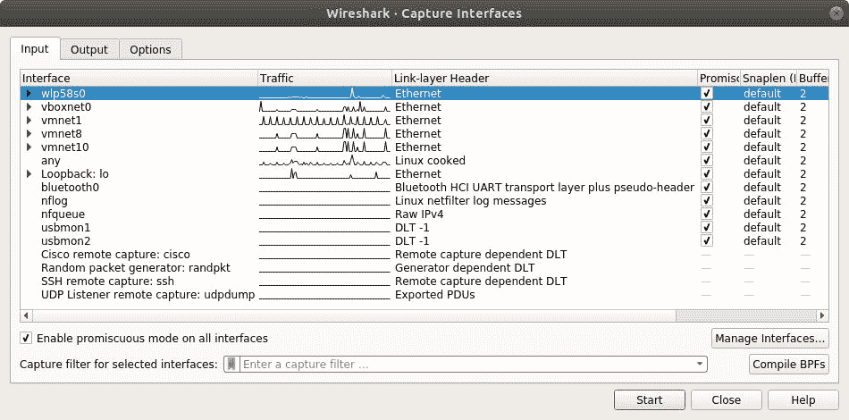

“捕获选项”对话框

让我们浏览一下“捕获”对话框窗口中的可用选项:

*   Capture(在 input 选项卡下):它的目的是选择你希望在哪个接口上监听；也可以选择多个接口并行运行。每个接口的详细信息都列在单独的列中，例如捕获、接口、接口名称、是否启用混杂模式等等。在 Capture 对话框下，您会看到一个复选框来切换混杂模式，这使您能够侦听不是从您的机器生成或发往您的机器的流量。
*   管理接口:方便出于监听目的添加或删除新接口。您甚至可以添加远程机器接口来进行远程监听。
*   捕获过滤器:列出捕获过滤器，也便于添加新的用户自定义过滤器:

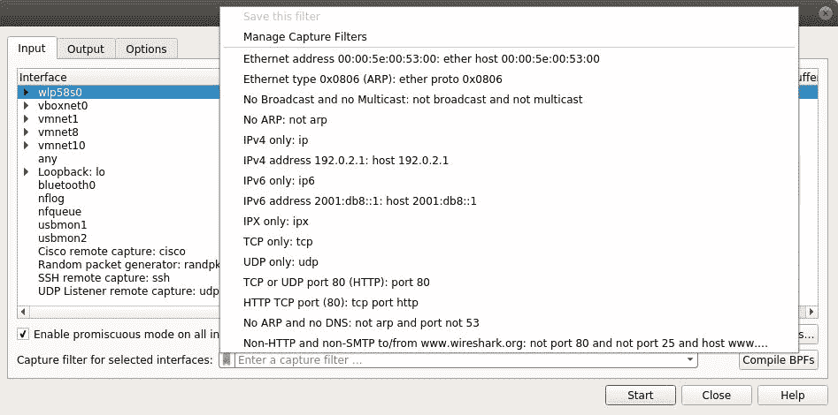

默认捕获过滤器

**Berkley 包过滤** ( **BPF** )语法是一种用于设计过滤器表达式的行业标准，并受到`tcpdump`等协议分析器的支持，这使得过滤器的配置文件可移植。

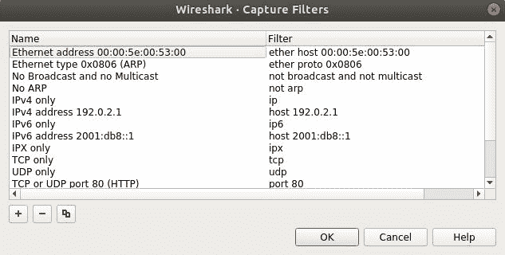

以下是创建第一个捕获筛选器表达式的步骤；考虑一个场景，您必须捕获来自位于`10.10.10.157`的 web 服务器的数据包:

1.  打开“捕获选项”对话框。
2.  点击捕获过滤器。
3.  点击新建。
4.  在过滤器名称文本框中写入`Filtering Host`。

5.  在过滤字符串文本框中写入`host 10.10.10.157`:

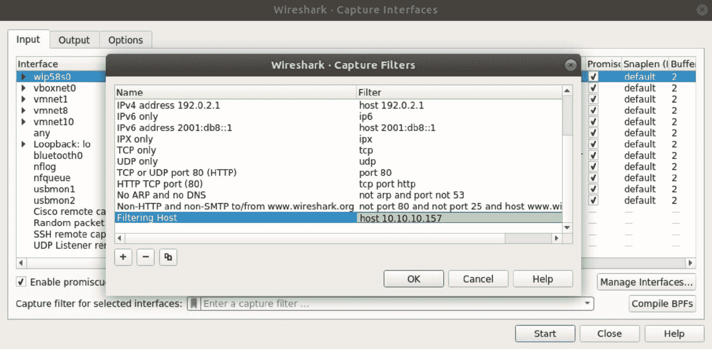Creating a sample capture filter

6.  完成后，单击确定；如果您已经正确地输入了所有内容(主要是过滤器表达式)，那么在“捕获过滤器”按钮后面的文本框将以绿色背景显示。
7.  捕获文件(在输出选项卡下):使用此选项将数据包流附加到现有的跟踪文件中。捕获的数据包将被添加到您选择的文件中。如果您没有选择任何选项，将会创建一个临时文件。要获得将数据包保存到单个/多个文件的更高级方法，请尝试以下方法:
    *   在捕获一定量的数据(KB、MB 或 GB)后，Wireshark 将创建一个新文件来保存数据包流。例如，我想在 Wireshark 捕获 2mb 数据后创建一个新文件。
    *   下一个文件间隔(时间):在一定时间(秒、分或小时)后，Wireshark 将创建一个新文件来保存数据包流。例如，我想每五分钟创建一个新文件。
    *   环形缓冲区:使用此选项根据前面提到的标准设置创建新文件的限制。例如，您已经选择了环形缓冲区选项，并将文件数设置为`5`，并且您已经配置为每隔 5 MB 创建一个新文件。

根据此配置，每 5 MBs 的数据后，将创建一个新文件，并将数据包写入其中。一旦达到您在环形缓冲区中指定的限制，Wireshark 将不会创建新文件；相反，它将开始保存到第一个文件，并将所有捕获的数据包附加到该文件中。下面的屏幕截图显示了类似的配置:

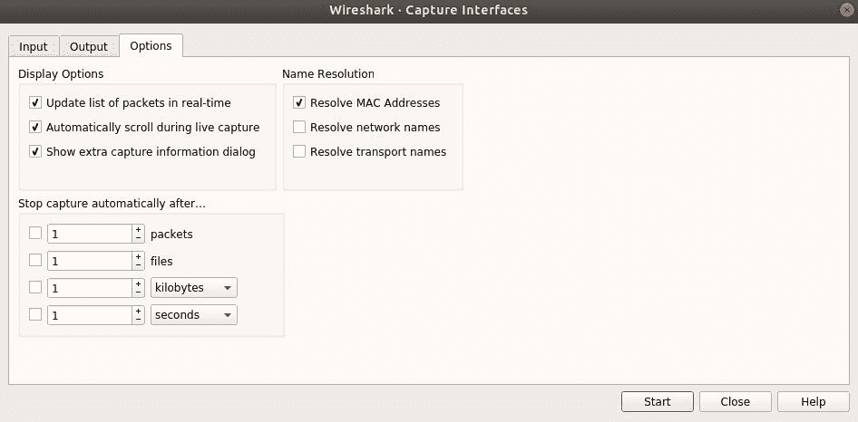

“捕获文件”选项

*   停止捕获设置(选项选项卡):此选项允许您在触发特定条件后停止捕获过程；我们有四种不同的触发器。它们陈述如下:
    *   数据包:达到一定数量的数据包后停止捕获
    *   文件:创建一定数量的文件后停止捕获
    *   千字节(s):捕获一定量的数据后停止捕获
    *   秒:运行一段时间后停止捕获

如果我们一次选择多个选项会怎么样，如下面的屏幕截图所示:

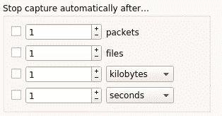The Stop Capture options

您可以一次激活多个选项；Wireshark 将停止捕获最先满足的条件。

*   **名称解析(选项选项卡)**:如果选中，此功能可以将第 2、3、4 层地址解析为相应的名称:

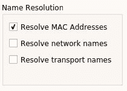Name Resolution

*   **显示选项(选项选项卡)**:使用此选项自定义数据包流和相关信息在数据包列表窗格和协议层次窗口中的显示方式。参考以下截图:

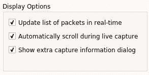

显示选项

*   **实时更新数据包列表**:一旦捕获到新的数据包，数据包列表窗格会立即更新，并自动滚动显示最新的数据包

# 为什么要使用捕获过滤器

当大量数据包在网络中流动时，需要仅捕获符合标准的流量。创建自定义捕获过滤器可以方便地分析根本原因，同时解决网络问题。Wireshark 会丢弃不符合捕获过滤器表达式的数据包，丢弃的数据包不会被传递到捕获引擎。

# 如何使用捕获过滤器

使用**Berkley Packet Filter**(**BPF**)语法通过捕获过滤器对话框创建捕获过滤器。

BPF 是两个参数的组合:标识符和限定符，解释如下:

*   **标识符**:搜索标准是你的标识符。例如，像`host 192.168.1.1`这样的捕获过滤器，其中值`192.168.1.1`是一个标识符。
*   **限定词**:这些限定词又分为三个部分:
    *   **类型**:类型限定符有三种:`host`、`port`、`net`。类型限定符指的是你的标识符所指的名字或数字，例如在你的捕获过滤器`host 192.168.1.1`，`host`就是类型限定符。
    *   **Direction** :有时候，当你需要从一个源或目的地捕获包时，指定方向限定符。例如，在`src host 192.168.1.1`捕获过滤器中，`src`指定捕获来自`192.168.1.1.`的数据包。同样，如果您指定`dst host 192.168.1.1`，将只捕获目的地为`host`T5 的数据包。
    *   **Proto** :这个限定符用于过滤特定协议的数据包。例如，如果您想要捕获来自主机`192.168.1.1`的`http`流量，那么表达式将为`src host 192.168.1.1 and tcp port 80`
*   Wireshark 支持使用*和* *或*运算符连接多个表达式，请参考以下示例:
    *   过滤器`src host 192.168.1.1 and tcp port 80`声明所有从`192.168.1.1`发出并去往端口`80`的数据包都应该被捕获。
    *   过滤器`src host 192.168.1.1 or tcp port 80`声明只应捕获源自`192.168.1.1`的每个数据包或与端口`80`相关联的任何数据包。
    *   过滤器`not port 80`声明任何与端口`80`相关的数据包都不应该被捕获。

# 示例捕获过滤器

要访问默认过滤器，请转到 Capture | Capture Filers，或者单击主工具栏中的 Capture Options 按钮，然后单击 Capture Filter。

请参考下表了解样本采集过滤器:

| **过滤器** | **描述** |
| 主持人`192.168.1.1` | 与主机`192.168.1.1`相关的所有流量 |
| 端口`8080` | 与端口`8080`相关的所有流量 |
| src 主机`192.168.1.1` | 来自主机`192.168.1.1`的所有流量 |
| `dst host 192.168.1.1` | 目的地为主机`192.168.1.1`的所有流量 |
| src 端口`53` | 来自端口`53`的所有流量 |
| dst 端口`21` | 去往端口`21`的所有流量 |
| `src 192.168.1.1`和 tcp 端口`21` | 源自`192.168.1.1`并与端口`21`相关联的所有流量 |
| `dst 192.168.1.` 1 或`dst 192.168.1.2` | 去往`192.168.1.1`或去往
主机`192.168.1.2`的所有流量 |
| 非端口`80` | 与端口`80`无关的所有流量 |
| 不是 src 主机`192.168.1.1` | 所有不是来自主机`192.168.1.1`的流量 |
| 非端口`21`和非端口`22` | 与端口`21`或端口`22`无关的所有流量 |
| 传输控制协议 | 所有 tcp 流量 |
| Ipv6tcp 或 udp 主持人[www.google.com](http://www.google.com)以太主机`07:34:AA:B6:78:89` | 所有 ipv6 流量所有 TCP 或 UDP 流量所有进出谷歌 IP 地址的流量与指定 MAC 地址相关联的所有流量 |

# 显示过滤器

与捕获过滤器相比，显示过滤器灵活而强大。显示过滤器不丢弃任何数据包；相反，数据包是隐藏的。丢弃数据包不是非常有效的做法，因为数据包一旦被丢弃，就无法恢复。应用显示过滤器将限制数据包在 Wireshark 的列表窗格中显示。

在数据包列表窗格上方的过滤器对话框中，显示过滤器可用于捕获文件和实时流量。显示过滤器支持各种参数，如 IP、端口、协议等。

让我们学习如何使用显示过滤器表达式对话框来创建过滤器。

筛选器表达式

1.  单击表达式按钮配置显示过滤器

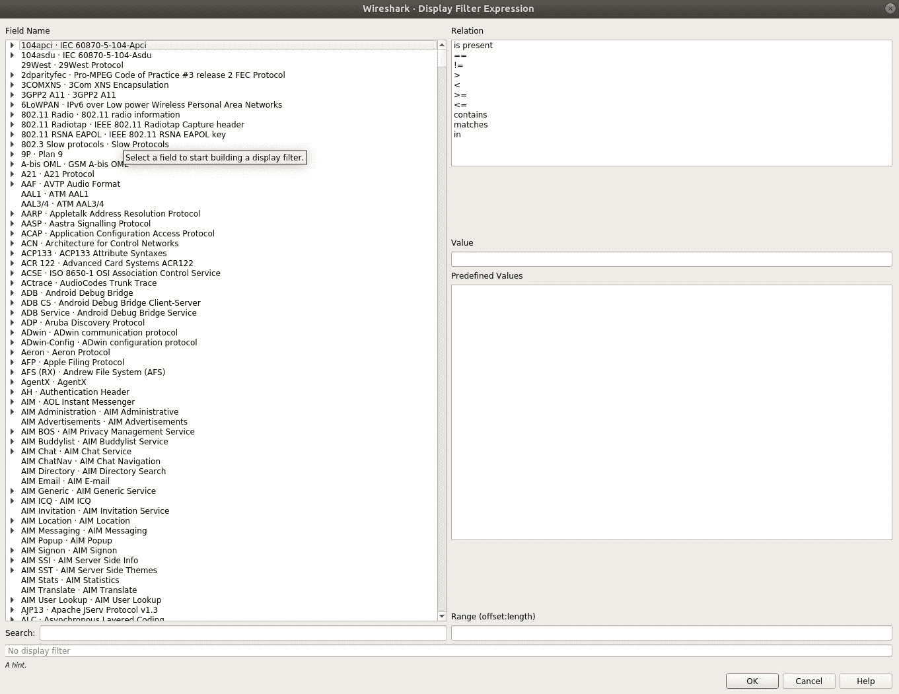 

2.  例如，如果您只想查看与`ip:192.168.1.1`相关的数据包，则向下滚动字段名称以查找 IPv4。然后，展开该部分并选择 ip.addr 选项。
3.  从旁边的关系框中，选择要添加到表达式中的运算符。
4.  最后，在“值(IPv4 地址)”框中输入您的 IP 地址，然后单击“确定”

在创建过滤器复杂过滤器时，比较和逻辑操作符非常方便。

下表列出了可用于创建过滤器的比较运算符:

| **操作员** | **描述** |
| `==/eq` | 等于 |
| `!=/ne` | 不等于 |
| `</lt` | 不到 |
| `<=/le` | 小于等于 |
| `>/gt` | 大于 |
| `>=/ge` | 大于等于 |

下面是用于将多个标准组合在一起的逻辑运算符列表。下表列出了所有这些选项:

| **操作员** | **描述** |
| `AND/&&` | 当我们希望表达式的两部分都表示`true`时，使用 AND 逻辑运算符。例如，`ip.src==192.168.1.1`和`tcp`过滤器将只显示源自`ip 192.168.1.1`并与`tcp`协议相关的数据包。 |
| `OR/&#124;&#124;` | 当我们一次只关注一个条件为真时，使用 OR 逻辑运算符；例如，`port 53`或`port 80`过滤器将显示与端口`53` ( `DNS`)相关联的所有数据包，以及与端口`80` ( `http`)相关联的所有数据包(如果有的话)。 |
| `NOT/!` | 当我们想从列表窗格中排除一些数据包时，使用 NOT 逻辑运算符。例如，`!dns`过滤器会隐藏所有与 DNS 协议相关的数据包。 |

# 保留过滤器以备后用

保留过滤器节省了键入复杂显示过滤器所需的时间和精力。Wireshark 通过保存自定义过滤器来帮助保留。要为自己创建一个，请遵循以下步骤:

1.  转到分析|显示过滤器:

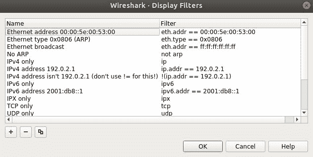

添加显示过滤器

2.  单击新建(+)，在过滤器名称和过滤器字符串字段中输入值。例如，我们想为`NO ARP`数据包创建一个显示过滤器。然后，这些值将类似于下面的屏幕截图:

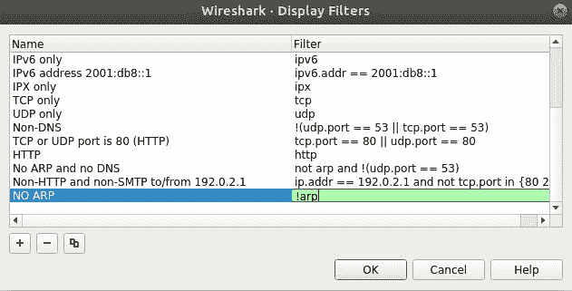

创建新过滤器

3.  点击应用。现在，您最近创建的过滤器将列在列表的底部，供以后使用。
4.  确保过滤器字符串框以绿色背景显示，这意味着您的表达式是正确的；如果它是红色的，那么有问题，如果它是黄色的，这表示结果可能是意想不到的。
5.  单击过滤器字符串框旁边的表达式按钮，通过单击并选择所需内容来创建过滤器。
6.  删除(-)按钮将从列表中删除现有过滤器。
7.  取消按钮将放弃任何未保存的更改并关闭窗口。
8.  确定按钮提交保存并关闭窗口。

# 使用查找对话框搜索数据包

要搜索符合标准的数据包，请使用显示过滤器旁边的查找工具栏。您可以通过导航到编辑|查找数据包或使用快捷键 *Ctrl* + *F* 来访问查找实用工具:

“查找数据包”对话框

您还可以使用以下过滤器来查找数据包:

让我们看看更多可用的可配置选项:

*   显示过滤器:根据特定的 IP/端口/协议查找数据包，例如:
    *   `ip.addr == 192.168.1.1`(基于 IP 地址)
    *   `port 8080`(基于端口号)
    *   `http`(基于协议)
*   十六进制值:如果您有数据包的十六进制值，则使用此选项。例如，写入由冒号分隔的物理地址，例如:
    *   `0A:C4:22:90:45:00`
    *   `AA:BB:CC`
*   字符串:输入 DNS 服务器的名称、机器的名称以及您要查找的任何名称(输入任何字符串或单词)，例如:
    *   加拿大白鲑
    *   行政人员
    *   网络服务器
    *   谷歌
*   搜索范围:通过该选项，您可以在 Wireshark 的特定窗格中进行搜索。例如，如果您正在查找与值 Google 匹配的数据包(将匹配数据包字节窗格中的 ASCII 值)。因此，首先选择字符串选项，然后从第一个下拉列表中选择**数据包字节**。
*   字符串选项:要启用和使用此选项，首先选择字符串选项，然后选择区分大小写，如果需要，还可以选择字符宽度。

要在匹配的包之间来回移动，可以使用 *Ctrl* + *N* (下一个)和 *Ctrl* + *B* (上一个)。

# 给流量着色

为了更好和更方便的观看体验，对流量进行着色以区分不同的数据包流。彩色化有助于轻松区分外观相似的数据包。

要访问默认着色配置文件，请导航至“查看”|“着色规则”,如以下屏幕截图所示:

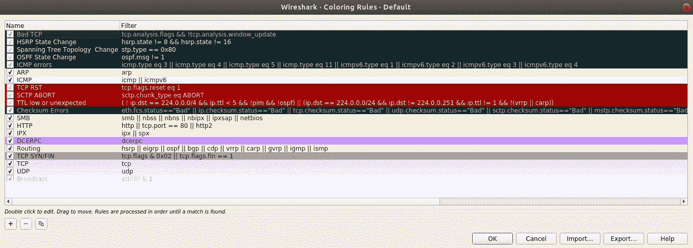

着色规则

此对话框中列出了当前作为全局配置文件的一部分保存的用于着色流量的所有规则。数据包列表窗格中列出的每个数据包都遵循着色规则窗口中定义的规则，这使它们具有独特的外观。

让我们使用这个特性，用我们选择的颜色组合给`http error`包着色。比方说，一个 web 服务器被配置并运行文件共享目的。现在，一个客户端试图做目录列表，得到了`HTTP 404`错误消息。这些错误消息显示在数据包列表窗格中，并使用默认的`http`着色规则进行着色，使这些错误不易被我们看到。为了快速识别这样的数据包，用`black`背景和`cyan`前景对`HTTP 404`错误消息进行着色。按照步骤进行配置。

1.  Linux box 是配置在 IP `172.16.136.129`上的客户端，而 Macintosh 运行在配置为 web 服务器的`172.16.136.1`上:

The web server running on 172.16.136.1

2.  来自访问 Linux 的 web 服务器的正常流量如下所示:

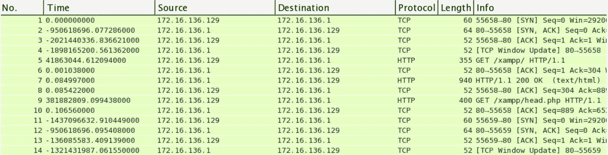

3.  既然一切都已启动并运行，我们将尝试从客户机上手动列出一些目录，以生成`HTTP 404`错误消息。

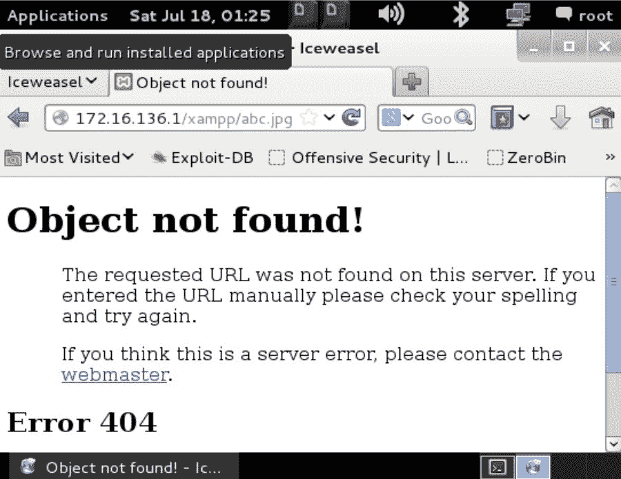

4.  通过此请求生成的流量被捕获，可以在下面的屏幕截图中看到:

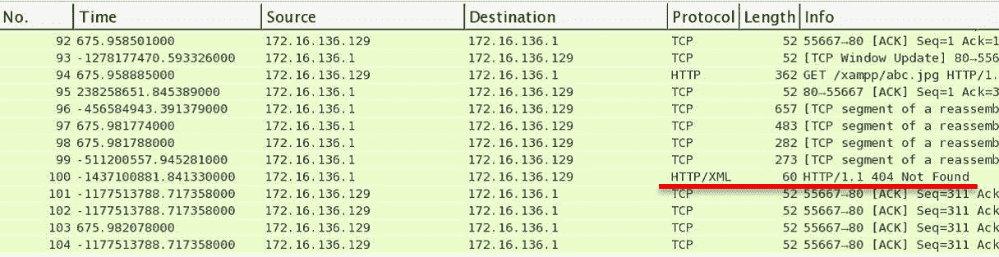HTTP 404 Traffic

我们可以看到，在前面捕获的流量中，客户端请求了`abc.jpg`资源，但该资源不可用；因此，客户端收到 404 未找到错误。

5.  我们很容易发现，因为只有一个客户端请求一个资源。考虑一个有数千个客户端的生产环境。在这种情况下，用不同的规则给一组特定的数据包着色是一个游戏规则改变者。
6.  导航至编辑颜色规则|新建(+)。在“名称”框中键入 HTTP 404。
7.  在过滤器框中输入`http.response.code==404`。选择前景色选项为`Cyan`，选择背景色选项为黑色。然后，点击确定:

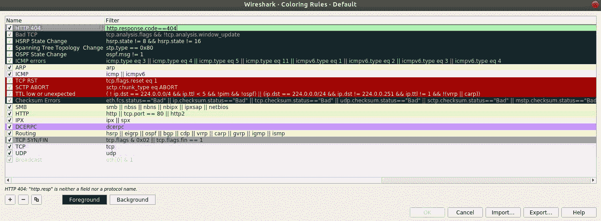

8.  单击 OK，您将看到新规则正在运行:

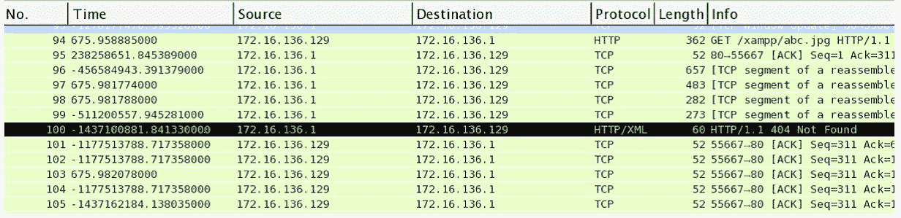After applying the new coloring rule

着色规则以自上而下的方式应用于数据包列表窗格。对于每个数据包，都有附加的着色规则信息，这些信息可以从“帧”部分下的“数据包详细信息”窗格中列出，如下所示:

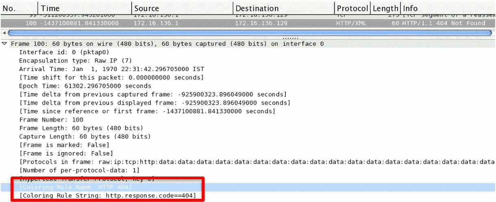

帧头中的颜色信息

# 创建新的 Wireshark 配置文件

配置文件就像定制的虚拟环境，在审计/排除网络故障时可以节省大量时间。

要创建配置文件，请按照下列步骤操作:

1.  右键单击状态栏(窗口右下角)中的配置文件列:

2.  在弹出的对话框中点击 *+* :

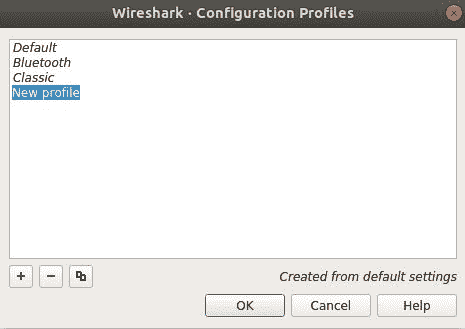

3.  现在，选择您想要用作模板的概要文件(如果有的话),并键入新概要文件的名称。
4.  然后，点击确定。

现在，在状态栏中，您将看到新的配置文件已经被激活。您在此配置文件中所做的更改将保留在此处，例如，您创建捕获/显示过滤器、更改协议首选项和更改颜色首选项，等等。

此外，导入和导出配置文件非常简单，只需将配置文件复制并粘贴到 Wireshark 目录中即可使用。

# 摘要

过滤流量让你捕获和看到只有你想要的包流；有两种类型的过滤器:显示过滤器和捕获过滤器。

显示过滤器隐藏数据包；但是，捕获过滤器会丢弃不符合用户定义的表达式的数据包，并且被丢弃的数据包不会传递给捕获引擎。

捕获过滤器使用 BPF 语法，这是一个行业标准，并被其他几个协议分析器使用。

查找工具非常有用，可以从 Wireshark 的“编辑”菜单中访问。Find 实用工具提供了搜索数据包和相关详细信息的各种向量。

过滤一组流量时，颜色首选项很方便。区分数据包变得很容易，因为匹配的数据包将以独特的颜色显示。

概要文件就像节省时间和精力的虚拟场景。针对显示/捕获过滤器和颜色/协议/时间首选项对配置文件所做的更改保持不变。