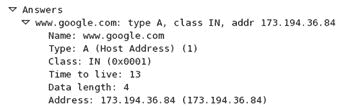
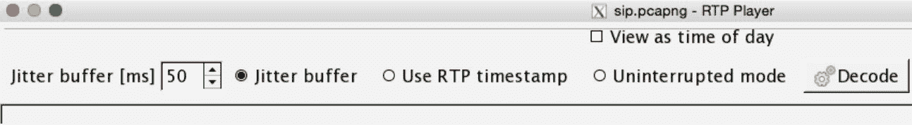

# 四、分析应用层协议

本章将帮助您了解通过 Wireshark 分析应用层协议(如 HTTP、SMTP、FTP 和 DNS)的方法。应用层协议通常是客户端和服务器之间的接口。

为了有效地识别异常，了解应用层协议数据包的结构至关重要。在本课中，我们将详细讨论以下主题:

*   常见应用层协议分析
*   组装 VoIP 数据包
*   解密加密流量

# 域名系统(DNS)

想象一下，在一个互联网世界中，你必须在浏览器的地址栏中输入一个随机的数值
(IP 地址)来访问一个网站，而不是一个名字。同样，想象一下每个数字都是不同的。考虑到这一点，你能记住多少个数字(IP 地址)？5?10?也许，最多 50 岁？所以，现在，你只能访问 50 个网站。

为了无限的网络体验，DNS 来拯救我们。DNS 存储映射到其当前 IP 地址的网站名称的数据集(区域文件)以及域名。区域文件中的每个条目称为一个资源记录(网站名称及其 IP 的组合)。默认情况下，DNS 通过端口`53`使用 TCP 和 UDP，两者的目的不同。

DNS 是如何工作的？因此，作为一个客户端，当您尝试从浏览器访问一个网站时，您的请求(DNS 查询)会被发送到内部 DNS 服务器(如果有)，该服务器会查找它包含的资源记录。如果 DNS 服务器知道您试图访问的域名的 IP 地址，您的电脑将收到一个包含您想要访问的网站的 IP 地址的回复(DNS 响应)，否则您的查询将被转发到网上的外部 DNS 服务器(例如，`8.8.8.8`、`4.4.2.2`的 google DNS 服务器等等)。).

# 剖析 DNS 数据包

DNS 数据包由多个字段组成，下面将简要讨论这些字段:

*   **事务 ID** :这是一个跟踪域查询及其相应响应的号码。
*   **查询/响应**:每个 DNS 包都被标记为查询或响应。
*   **标志位**:每个查询和响应包含一组不同的标志位，如下所示:
    *   **响应**:消息是一个查询或者一个响应。
    *   **操作码**:这决定了包含的查询类型。操作码范围在`0-15`之间。请参考下表:

| `0` | `1` | `2` | `3` | `4` | `5` | `6-15` |
| 标准查询 | 反向查询 | 服务器状态请求 | 未赋值的 | 通知 | 更新 | 未赋值的 |

| `0` | `1` | `2` | `3` | `4` | `5` |
| 没有错误 | 格式错误 | 服务器故障 | 名称错误 | 未实施 | 拒绝 |

*   **问题**:数据包中存在的查询数量。
*   **答案**:响应查询而发送的答案数量。
*   **权限 RRs** :作为响应发送的权限资源记录数。
*   **附加 RRs** :作为响应发送的附加资源记录的数量。
*   **查询部分**:发送给 DNS 服务器的查询；在收到的响应中应该是相同的。
*   **答案部分**:答案由作为响应进来的资源记录组成。
*   **类型**:发送的查询类型。请参考下表了解常见的查询类型:

| `A` | `NA` | `MX` | `SOA` | `PTR` | `AAAA` | `AXFR` | `IXFR` |
| 主机地址 | 名服务程序 | 邮件交换 | 区域授权的开始 | 指针记录 | IPv6 地址 | 全区域转移 | 增量区域转移 |

*   **附加信息**:该字段包括包含资源记录的附加信息。不要求回答该询问。

# 解析 DNS 查询/响应

让我们考虑一个场景来理解 DNS 的工作方式。客户端向拥有名称解析信息的 DNS 服务器发送查询。使用这些信息，客户端可以开始基于 IP 的通信。有时，客户端正在寻找的信息在它请求的 DNS 服务器上不可用。在这种情况下，如果需要递归，DNS 服务器本身会将查询传输到它知道的任何邻居 DNS。参考下面的截图，其中发送了一个访问 https://www.google.co.in 的[的请求。来自位于`192.168.1.103`的客户端的请求被发送到位于`192.168.1.1`的默认网关。此网关会将查询转发到它知道的 DNS 服务器:](https://www.google.co.in)

DNS 查询

您可能会注意到 DNS 使用 UDP 作为底层协议。如果您想了解关于正在生成的 DNS 查询的更多信息，只需展开 Flags 部分。这一节将列出各种细节，比如递归是否可用，递归是否需要，以及响应代码是什么。请参考以下截图:

扩展标志部分

扩展的 Flags 部分告诉我们，DNS 包的类型是查询，包数据没有被截断，并且递归是可取的(如果可用的话)。

作为对此查询的响应，您将观察到一个具有相同事务 ID 的数据包，它表示客户端发送的 DNS 查询的关联。对查询的响应通常包括被访问域的 IP 地址。发出请求的机器将返回一个 IP 地址，或者多个可用的 IP 地址。如果我们正在寻找的域名不可用，那么 CNAMEs 可能会被返回。

参考下面的截图来理解这一点:

DNS 响应

正如我所说的，我们可以得到多个回复。如果你注意到了回复回复部分，我们已经收到了五个关于[www.google.com](https://www.google.com/)域名的回复。为了验证收到的响应只属于前一个查询，只需匹配事务 ID。

展开答案类别中的任何部分以查看更多详细信息。参考以下截图:

# 文件传送协议

自从互联网出现以来，我们一直在使用**文件传输协议** ( **FTP** )。FTP 使用 TCP over port `21`或`20`(默认情况下)通过指定的通道启动和传输文件。只有两种类型的通道命令通道(端口`21`)和数据通道(端口`20`)。命令通道用于发送和接收命令及其响应。数据通道用于在客户端和服务器之间发送和接收数据。但是，您将观察到用于从客户端机器传输 TCP 数据段的随机端口号。

# 剖析 FTP 通信数据包

客户端可以使用两种模式与服务器通信:主动和被动。在早期版本的 FTP 服务器应用中，默认情况下启用主动模式，但在最新版本的 FTP 服务器应用中，默认情况下启用被动模式。为了详细理解这些模式，让我们使用下面的场景。

假设一个 FTP 服务器配置在 IP `172.16.136.129`上，一个客户端配置在 IP `172.16.136.1`上。

通常，客户端发送的每个请求都是一个特定的命令集，服务器用一个数字值后跟一条文本消息来响应。请参见下面的截图以供参考，随后是简短的分析:

服务器请求密码，客户端提供了密码。一旦服务器收到并验证了密码，用户将登录。在我们的例子中，密码是正确的，所以客户端接收到的响应代码是`230`，后面是`Login Successful`消息。

从客户端发出的命令可以有参数，也可以没有参数，设备之间传输的数据可以在数据包的 TCP 报头中看到，如下所示:

FTP-返回的数据

帧`43`显示客户端发出了`LIST`命令，该命令由服务器处理，并且返回了 262 字节的数据。基于 FTP 的通信可以通过协议分析器以明文形式看到，这也是一个经常被利用的弱点。

重组 FTP 数据流很容易，因为除了数据之外，没有任何东西被传输。没有附加到数据包的代码或命令。要重组 FTP 数据包的 TCP 流，只需右键单击选定的数据包，然后选择“跟随 TCP 流”选项进行查看。

参考以下截图:

FTP 流

客户端和服务器之间通过数据和命令通道进行的全部通信都被转换为人类可读的格式。红色的文本是客户端发送的，蓝色的文本是客户端收到的。建议使用 FTP 的安全版本，以减少漏洞。

# 超文本传输协议(HTTP)

网络上的数据使用 HTTP/HTTPS 应用层协议传输。HTTP 中的正常通信遵循请求/响应模型，其中客户机和服务器之间的通信由一组规则来协调。客户端向服务器请求某个资源，然后接收指定所请求资源的当前状态的状态代码。如果可用，那么资源也与状态代码一起发送，否则客户端将收到不可用的状态代码。

# 请求/响应如何工作

Web 服务器利用 HTTP 向发出请求的客户机提供网页。在每个 HTTP 会话的开始，TCP 三次握手发生。它在通信主机之间创建一个专用通道，然后是 HTTP 和数据包，这些数据包在会话活动时发送和接收。例如，假设您正在从位于`172.16.136.1`的客户端访问位于`http://172.16.136.129`的 web 服务器。使用我们的客户机-服务器基础设施，我们将尝试捕获发送的请求和接收的响应。

我将尝试访问位于前面提到的服务器上的主页，并捕获整个会话产生的流量；即发送的请求和接收的响应。采取以下步骤复制该场景。

# 请求

以下是上述场景的步骤:

1.  打开浏览器，输入任意网站的**统一资源定位符** ( **URL** )。
2.  网站位于`http://172.16.132.129`(本地网络服务器)。以下是截图供你参考:

3.  下面的屏幕截图描述了由于访问 web 服务器而捕获的数据包:

4.  只要你按下*键，输入*，所有这些数据包就会生成。如您所见，前三个数据包是 TCP 三次握手数据包，我们的客户端请求服务器创建一个专用通道。但是，如果服务器守护进程没有运行，或者服务器没有接受我们的请求，出于某种原因，我们会看到`RST` `ACK`数据包，如下所示:

5.  此错误表明服务器停止服务或不应该响应我们的请求(防火墙或受限区域)。
6.  在 TCP 包之后，我们观察到客户机发送的第一个 HTTP 请求。每个请求都包含发送到服务器的几个元素:

HTTP 请求

# 反应

1.  在第四个包之后，服务器确认客户机请求到达 web 服务器的根目录。服务器开始传输客户端请求的资源。
2.  列表窗格中的第六个包是客户端收到的包，它是一个状态代码，后跟一条短消息，包括所请求资源的内容。请参考以下说明 HTTP 响应的屏幕截图:

HTTP 响应

3.  作为 TCP 通信的一部分，客户端将确认服务器发送的每个数据包，如第七个数据包所示。
4.  让我们分析一下第六个数据包的响应元素:
    *   第一行包含响应中发送的三个参数。它们表示正在使用的 HTTP
        协议版本、状态代码(在我们的例子中是`304`，它指定
        ，自从在
        `Date`参数中提到的时间以来，所请求的资源没有改变)，最后是状态代码的简要描述(在我们的例子中没有修改)。
    *   在第三行，服务器参数提到了 web 服务器的名称和版本。我们可以看到 Apache/2.2.22 是
        在`172.16.136.129`时所在的服务器。
    *   第四和第五行表示服务器希望保持连接活动。服务器希望这样做的持续时间也在参数的下一行中提到。

# 简单邮件传输协议(SMTP)

SMTP 广泛用于在小型网络上发送和接收电子邮件。该协议使用发送方-SMTP 进程发送电子邮件，使用接收方-SMTP 进程接收电子邮件。这使得 SMTP 成为一个基于客户端-服务器的协议，运行在端口`25`上。

通常，邮件传输的 SMTP 通道是通过成功的 TCP 三次握手以及随后的一系列 SMTP 数据包创建的:

在我们的实验室中，我们有一个配置在 IP `192.168.1.105`的 SMTP 服务器和一个配置在 IP `192.168.1.104`的客户端。客户端将请求服务器向客户端已知的地址发送电子邮件。服务器将用数字代码响应这个请求，后面跟着一个简短的响应参数。

# 剖析 SMTP 通信数据包

在 Kali Linux 机器上使用 Netcat 客户机，我将连接到运行在 Windows 机器上的 SMTP 邮件服务。在成功的三次握手之后，服务器将用数字代码和简短的摘要进行响应。按照以下步骤使用命令行发送电子邮件:

1.  使用`netcat nc -nv 192.168.1.105 25`打开与邮件服务器的连接。
2.  用`HELO testmail`命令初始化一个 SMTP 会话。
3.  使用`MAIL FROM:<abc@charit.com>`命令指定起始地址。
4.  使用`RCPTS TO:<efg@charit.com>`命令指定收件人的地址。

5.  在邮件正文中输入数据，输入`DATA`，按*回车，输入* `.` *(f* *全停；这是一个 t* 终止字符，您可以使用您选择的任何字符)现在，键入您想要发送的消息。一旦你完成了邮件的输入，输入 a(句号)来标记结束，然后按*回车*。
6.  现在，你的信息将被发送。

该过程将生成几个包含我们会话细节的数据包。所有这些提到的命令只有在服务器被配置为允许无任何身份验证的明文消息通信时才起作用；参考以下截图:

SMTP 会话

从`1` - `3`来的包都是 TCP 握手包。握手发生在客户端和服务器之间。在第四个包中，客户端收到一条消息，声明响应代码为`220`。这意味着服务器是可用的，并准备好响应客户端的请求。在第六个数据包中，客户端使用`HELO`命令初始化标准 SMTP 会话，随后是发送者和接收者的电子邮件地址，服务器确认这些地址是正确的，数据包`10`和`13`中有响应代码`250`。然后是使用`DATA`命令的电子邮件正文包，它在包`23`中被服务器成功接收。最后，用户通过发出`QUIT`命令优雅地关闭连接，服务器在包`26`中确认该命令，从而发送`FIN`、`ACK`。

# 会话发起协议(SIP)和互联网协议语音(VOIP)

SIP 是 VOIP 家族的一部分，VOIP 家族是一种信令协议，用于在网络环境中创建、管理和终止 VOIP 会话。SIP 的例子包括双向电话呼叫或电话会议，或者与多个主机的多媒体会话。会话启动后，数据通过专用信道上的**实时传输协议** ( **RTP** )进行传输。基本上，RTP 家族管理所有多媒体项目的传输和流控制(RTCP 控制流)。

Wireshark 可以组装一个 RTP 数据包流，以便回放双方之间发生的对话(使用它要合乎道德！).

SIP 运行于 UDP 之上，通常使用端口`5060`。SIP 为我们提供了不同的呼叫管理功能，例如发起呼叫、断开呼叫、将某人添加到电话会议以及转移呼叫，尽管 SIP 不会帮助您保持呼叫质量。

让我们通过下图来讨论典型的 VoIP 基础设施。有三个节点:其中两个是客户端，一个是 IP 电话服务器，它支持语音通信:

1.  **C1****客户端 1** 发送 **Invite** 请求，使用 SIP 发起会话。
2.  电话服务器将请求传输到**客户端 2** 。
3.  电话服务器用 **100 尝试**分组来确认**客户端 1** 。
4.  **客户端 1** 在**客户端 2** 开始振铃时，接收到一个 **180 振铃**数据包。当另一侧的**客户端** 2 收到呼叫时，发送 **200 OK** 包，该包被转发给**客户端 1** 。
5.  现在，客户端发送 **ACK** 数据包以确认收到
    **200 OK** 数据包。
6.  现在双方都通过专用信道连接起来，RTP/RTCP 数据包开始在信道上来回传输。
7.  为了结束通信，通信主机之一会发送一个 **BYE** 数据包，由另一端确认。
8.  由于只有电话服务器知道信息，所有的数据包将在客户端 1 和 2 之间来回发送。
9.  一旦信道被创建，所有的包将由客户机直接发送和接收，而不需要服务器的干预。

为了便于说明，我使用 Asterisk PBX 配置了一个小型 VoIP 电话基础设施，可以免费下载。因此，我们的 VOIP 服务器位于`192.168.1.107`，客户端 1 位于`192.168.1.104`，客户端 2 位于`192.168.1.107`。我还使用 X-lite 调用应用从客户机 1 调用客户机 2。以下是 Wireshark 列表窗格中捕获的流量截图:

SIP 流量

您应该考虑的一件事是将分析器放置在尽可能靠近电话服务器的地方，以便它能够捕获每一个最后的数据包。在捕获时，如果您看不到任何 SIP 数据包，那么您也将无法捕获 VOIP 数据包。

# 重组数据包以便回放

是的，可以将 VOIP 数据包组装回去，以监听通信的任何一方或双方。假设我想监听发送到 IP 地址为`192.168.1.107`的客户端 2 的消息。我们可以使用 Wireshark 中的电话菜单来重组数据包，并从列表中选择 VOIP 呼叫选项。以下屏幕截图显示了生成的对话框:

VOIP 通话对话

现在选择你想听哪一方的交流。然后点击播放器按钮并配置**抖动**(抖动是数据包发送和接收速率的变化。如果抖动很高，那么您的网络可能正在处理拥塞。具有高抖动值的呼叫不适合收听)和如图所示的**时间**，并点击解码:

玩家对话框

我没有更改默认值，而是直接单击了 Decode 按钮，这将为我选择的通信方重组所有的 VoIP 数据包，如下面的屏幕截图所示:

RTP 播放器

如果您想播放消息，请选中滚动条下方的框，然后单击播放。仅出于道德目的使用此功能。

# 解密加密流量(SSL/TLS)

是的，还可以使用 Wireshark 将您的在线 TLS 流量解密为明文 SSL 流。Google Chrome 和 Firefox 寻找一个存储 TLS 会话密钥的日志文件。按照以下步骤解密加密流量会话:

1.  创建一个名为`SSLKEYLOGFILE`的环境变量，它将指向一个文本文件。您的浏览器每次启动时都会查找该文件。要创建环境变量，请右键单击我的电脑，然后转到高级设置|环境变量|新建|指定名称。输入`SSLKEYLOGFILE`和值:`C:/Users/username/sslkeylog.txt`，点击
    确定。
2.  我已经创建了一个空白的文本文件，`C:/Users/username/sslkeylog.txt`
    (让您的新环境变量指向这个文件)。
3.  现在打开浏览器，访问一个启用了 TLS/SSL 的网站。
    出于演示的目的，我使用位于`192.168.1.105`的客户端，在`192.168.1.106`的
    安装了自己的 SSL web 服务器:

4.  在您访问任何启用了 SSL 的安全网站后，您的`sslkeylog.txt`将被填充一些随机数，如下面的截图所示。如果没有，请在继续之前交叉检查您的设置:

5.  我捕获了客户端和服务器之间的全部加密会话流量。
    现在转到编辑|首选项|协议树| SSL |(预)-主密钥日志文件名。输入`/path/to/sslkeylog.txt`并确定。然后右键单击 SSL 数据包(确保选择解密数据包数据。该选项应该出现在字节窗格中)并遵循 SSL 流。现在你会看到类似下面的截图:

解密 SSL 流量

这是解密 SSL 流量最简单的方法之一，只需点击几下鼠标。还有一种方法是将服务器的 RSA 私钥输入到 Wireshark SSL 首选项中，这将得到相同的结果(我将留给您进行研究)。

# 摘要

DNS 是一种用于将网站名称解析为 IP 地址的协议。通过 DNS，您的机器能够在基于 IP 的网络上通信。

自从互联网出现以来，FTP 就被用来将文件从一台机器传输到另一台机器，并且在今天的现代网络中仍在使用。

Web 浏览器使用 HTTP 来回呈现和传输基于 web 的内容。它通常也称为请求/响应模型，在这种模型中，主机请求某个资源，服务器用状态代码和可用的资源进行响应。

SMTP 非常常用于发送电子邮件。SMTP 命令及其相应的参数以明文形式通过网络传递。

VoIP 流量由两部分组成:用于数据传输的 RTP 和用于会话创建的 SIP。信令协议创建并管理会话，其中 RTP 用于传送语音本身。