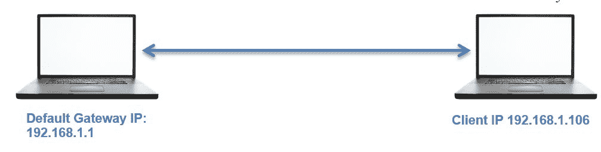

# 五、分析传输层协议 TCP/UDP

本章将通过对传输层协议**传输控制协议** ( **TCP** )和**用户数据报协议** ( **UDP** )的分析，帮助您理解支持跨路由基础设施移动网络流量的底层技术。TCP 和 UDP 是网络协议的基础，了解它们的结构和行为非常重要。

以下是我们将在本章中涉及的主题:

*   TCP 报头及其通信方式
*   了解 TCP 标志
*   在 Wireshark 中检查不同的分析标志
*   了解 UDP 流量
*   TCP 和 UDP 流量的异常模式

我们还将了解日常网络运行中出现的一些常见异常情况。

# 传输控制协议

TCP 是一种面向连接的协议，由多个应用层协议使用，根据序列号和确认号来确保数据在传输过程中不会丢失任何信息。TCP 确保节点间数据包的可靠传输。TCP 位于网络层和应用层之间，使用 IP 数据报在发送方和接收方之间传输数据包。

**三次握手**过程发生在数据传输之前。TCP 连接就像一个双向通信过程，不仅发送方积极参与，甚至接收方也发送确认，使其成为一种可靠的连接形式。

# 了解 TCP 报头及其各种标志

TCP 报头通常为 20 字节长，但是有时，由于`Options`字段的存在，TCP 报头的大小可以变化到 60 字节。下图是简化的 TCP 报头:

以下是对每个 TCP 报头字段的简要说明:

*   **源端口**:发送方用来跟踪现有数据流和新的传入连接。
*   **目的地端口**:与目的地提供的服务相关联的端口号。
*   **序列号和确认号**:每一方使用一个序列号来跟踪数据包的顺序。发送方和接收方使用确认号来传递接收或发送的序列号。
*   **数据偏移量:**表示数据包开始的位置和 TCP 头的长度。由于选项字段的存在，大小会有所不同。
*   **标志**:存在各种类型的标志位；每一个都有自己的意义。它们启动连接、传送数据和拆除连接:
    *   **SYN (synchronize)** :用于发起连接的数据包。
    *   **ACK(确认)**:用于确认数据包已经收到的数据包，也用于确认发起请求和拆除请求
    *   **RST(复位)**:表示连接中断或者服务不接受请求
    *   **FIN (finish)** :表示连接正在被拆除。发送方和接收方都发送 FIN 数据包，以优雅地终止连接
    *   **PSH(推送)**:表示传入的数据应该直接传递给应用，而不是被缓冲
    *   **URG (urgent)** :表示数据包携带的数据应该由 TCP 栈立即处理
    *   **CWR(拥塞窗口减少)**:任一方在发生拥塞时用来降低传输速度，以避免丢包

*   **窗口大小**:表示发送方可以发送的数据量。该大小是在握手过程中决定的，以便进行通信并匹配适合传输的缓冲区大小。
*   **校验和**:接收端用来验证数据段的完整性。
*   **紧急指针**:通常标记为 0，与 URG 标志一起使用，标记消息子集的立即处理。
*   **选项**:该字段长度会因各种选项的存在而变化。该字段有三个部分:第一部分指定选项字段的长度，第二部分表示正在使用的选项，第三部分包含正在使用的选项。其中一个重要的选项，**最大分段大小** ( **MSS** )，也是这个字段的一部分。
*   **数据**:TCP 报头的最后一部分是真正的数据。

上述信息概述了 TCP 报头以及报头各部分的重要性。在分析 TCP 会话时，了解这些细节变得非常重要。

# TCP 如何通信

为了实时理解和分析数据包，我配置了一个在`172.16.136.129`运行的服务器和一个在`172.16.136.1`运行的客户端，如下图所示:

使用 Wireshark，我们将捕获发生在实际数据传输之前的三次握手过程，以及拆卸过程(正常终止)。

# 它是如何工作的

下面的屏幕截图描述了当客户端试图访问托管在`http://172.16.136.129`上的网页时生成的各种数据包:

使用以下显示过滤器来简化分析:

在数据包`282`、`283`和`284`中进行三次握手过程，以创建专用信道。客户端通过发送 SEQ 设置为`0`的`282`数据包中的`SYN`数据包来启动创建。因为服务器是开放通信的，所以服务器用一个`SYN` / `ACK`数据包作出响应，其中`ACK`被设置为`1`并且`SEQ`被设置为`0`，随后是从客户端发送的带有`SEQ=1`和`ACK=1`的数据包编号`284`中的确认。

成功完成通道创建后，客户端发送一个`GET`请求来访问 web 根目录的内容。服务器在数据包编号`287`中对此进行确认，并发送带有`200 OK`状态消息的请求内容，客户端在下一个数据包中对此进行确认。

在所有的数据传输发生后，当客户端没有剩余的请求时，或者当服务器没有剩余的发送时，客户端发送`FIN` / `ACK`包以适当地终止连接。服务器对此进行确认，并发送其自己的`FIN` / `ACK`数据包，这些数据包由客户端在数据包编号`302`中进行确认。这种终止方式通常被称为拆卸过程。参考下面的屏幕截图，它说明了这个过程:

# 序列号是如何生成和管理的

您一定想知道谁给包分配序列号，以及如何分配。发起连接的设备使用主机操作系统生成的**初始序列号** ( **ISN)** 。它可以是任何对数据没有意义的随机数。我们在数据包一中看到的序列号为零是 Wireshark 使用的一种相对引用技术。

从数据包 1 开始，其中`SEQ=0`(实际相对序列号为`704809601`)由服务器接收，并以自己的`SEQ=0`和`ACK=1`回复客户端的`SEQ=0`。在这三次握手结束时，客户端用`SEQ=1`和`ACK=1`进行回复，没有任何进一步的增加，因为在此过程中没有数据被传输。

然后，到第四个包，客户端发送一个带有`SEQ=1`和`ACK=1`的`GET`请求，其中数据净荷长度等于`323`(参考下面的截图)，服务器接收到请求后用`SEQ=1`和`ACK=324`确认。你看到刚才发生了什么吗？服务器通过在`ACK`中添加总数据有效载荷长度来回复，以表示数据被成功接收:

# RST(重置)数据包

通常会出现这样的情况，例如服务器守护进程不可用/不运行，服务器由于过载而无法处理您的请求，您被限制与服务器交互，或者您尝试连接的端口没有准备好/没有为连接开放。`RST`包基本上表示连接请求的突然拒绝。

在我们的场景中，服务器守护进程没有运行，客户端正在尝试通信；因此，每发送一个`SYN`请求，它就会收到`RST`个数据包。客户端只尝试访问网页一次，但是 Wireshark 捕获了不止一个`SYN`和`RST`数据包，因为每个浏览器在无响应或关闭的套接字上以预先配置的时间间隔执行不同次数的尝试。因此，在我们的例子中，我使用的是苹果 Safari 浏览器，它在 3-4 分钟内尝试了三次连接。请参考下面的屏幕截图，它展示了在此过程中捕获的数据包:

# 异常 TCP 流量

失去连接或连接尝试不成功是最常见的异常 TCP 流量形式。您还可能会观察到其他几种情况，例如由于长距离通信导致的高延迟。为了使分析方便和易于排除故障，请使用时间列，对其进行排序，以找出列表窗格顶部数据包之间的大时间间隔。

另一个例子是，一个恶意设备正在您的网络上运行端口扫描，您的防火墙用`RST`数据包进行响应，以避免此类侦测攻击，或者端口也有可能关闭。参考下面的截图，我尝试使用`nmap`扫描网络上的一个节点，它看起来很明显(由于从一个源生成的大量数据包都是发往随机端口号的)，因此很容易跟踪:

观察`Frame 19`，端口扫描启动发送一个`SYN`数据包，以检查端口是打开还是关闭。结果，`21` ( `FTP`)港关闭；因此，服务器发送了一个`RST`包。除了前面讨论的情况之外，还可以有各种不同的情况。如果你对 TCP 和 IP 有很强的基础知识，那么你就很容易指出不寻常的流量形式。

# 用户数据报协议

根据 RFC 768 的定义，UDP 是一种无连接协议，非常适合在主机之间传输实时数据，但通常被称为不可靠的通信形式。原因是，UDP 并不关心数据包的传递，任何丢失的数据包都不会恢复，因为发送方永远不会被告知丢失或丢弃的数据包。然而，许多协议，如 DNS，TFTP，SIP，等等。只靠这个。

使用 UDP 作为传输机制的协议应该依靠其他技术来确保数据传输和错误检查。需要注意的一点是，UDP 提供更快的数据包传输，因为它不执行 TCP 中观察到的三次握手或优雅终止。UDP 被称为面向事务的协议，而不是面向消息的协议，如 Tol lCP。

# UDP 报头

普通 UDP 报头的大小是 8 字节；与报头一起添加的数据理论上可以是 65，535(实际上是 65，507)字节长。与 TCP 报头相比，UDP 报头非常小；它只有四个公共字段:源端口、目的端口、数据包长度和校验和。请参考此处显示的 UDP 报头:

*   源端口:发送方用来接收任何回复(如果需要)的端口号。大多数时候，在 TCP 和 UDP 中，被选作套接字一部分的端口号是短暂的。
*   目的端口:接收端使用的端口号，所有数据都传输到该端口。
*   数据包长度:指定数据包的长度，从报头开始到数据结束；您将观察到的最小长度为 8 个字节，即 UDP 报头的长度。
*   校验和:数据完整性确保发送方发送的内容与接收方得到的内容相同。有时，在使用 UDP 时，您会看到收到的数据包中的校验和值是`0`。这意味着不需要验证校验和。

# 它是如何工作的

让我们分析一下 DHCP、DNS 和 TFTP 等使用 UDP 作为传输协议的协议。

我在`192.168.1.1`配置了一个默认网关，在`192.168.1.106`配置了一个客户端。在它们之间运行的 Wireshark 将捕获 UDP 事务。以下是参考架构图:

# DHCP

管理分配给节点的 IP 地址并使其网络通信兼容的协议是**动态主机配置协议** ( **DHCP** )。这是一种为请求设备分配和管理 IP 地址的自动化方式。

为了从分配了 IP 地址的客户机生成 DHCP 数据包，我将尝试释放当前的 IP 地址。参考以下截图:

在列表窗格中，我们可以看到客户端显式发送的 DHCP 释放包(我在 Linux 终端上使用了`dhclient -v -r`命令来释放 IP 地址)。

默认情况下，DHCP 服务器端口号为`67`，DHCP 客户端端口号为`68`
。我强调了第四个字段，即数据包长度字段，它指定了数据包的长度，从第一个字节开始，直到数据包中的数据结束。然而，在 308 个字节中，8 个字节表示 UDP 报头的长度，其余 300 个字节表示应用数据。

# TFTP

**琐碎文件传输协议** ( **TFTP** )是 FTP 的一个轻量级版本，用于在设备之间传输文件。与 FTP 协议不同，TFTP 不要求用户提供任何凭证。TFTP 使用 UDP 作为传输机制。

最常见的是，TFTP 用于 LAN 环境，当处理交换机和路由器等可管理设备时，网络管理员使用 TFTP 服务器来备份配置文件和更新固件。

TFTP 服务器以 IP 地址`192.168.1.106`运行，TFTP 客户端以 IP 地址`192.168.1.104`运行。有一个文本文件`abc.txt`存储在 TFTP 服务器上，TFTP 客户端将下载该文件。请参考下图:

两台主机之间生成的流量被成功捕获，相应的数据包如下面的屏幕截图所示

现在，让我们看看每个指针代表什么:

1.  描述了客户端一请求`abc.txt`文件，就开始传输数据包。可以在列表窗格中看到请求帧。
2.  如前所述，TFTP 使用 UDP 作为传输机制。请求的相关详细信息显示在详细信息窗格中，它表明请求是从客户端的临时端口号发起的，目的地是服务器上的端口`69`(`69`是 TFTP 协议的默认端口)。
3.  该请求是针对`abc.txt`文件的，该文件也出现在 TFTP 协议部分的详细信息窗格中。

一些应用使用 UDP 作为传输协议，并有自己的内置功能来确保传输。您一定想知道两台主机之间共享的确认数据包。正如我们所讨论的，UDP 是一种不可靠的通信形式，那么为什么我们会在 UDP 中看到`ACK` s 呢？原因是我们请求的 TFTP 服务器具有内置的可靠性特征。

# 异常 UDP 流量

以下是一些在某些环境中可能被发现可疑的流量模式。

**场景 1:** 在 UDP 服务不运行/不可用的场景中，流量会是什么样子？参考以下截图:

客户端请求了一个服务器找不到的无效资源，因此返回了一个错误代码和摘要消息`File not found`(在列表窗格中可以看到)。

**场景 2:** 有时候，服务器守护进程可能没有运行，客户端可能会请求某个资源。在这种情况下，客户端会收到带有错误代码`3`的`ICMP destination unreachable`错误。参考以下
截图:

让我们更详细地讨论每个指针的含义:

1.  当 TFTP 服务器守护程序不起作用时，服务器返回一条`ICMP destination unreachable`消息
2.  客户端收到类型为`3`的错误代码
3.  该请求被发送到当前不起作用的端口`69`
4.  在《TFTP 议定书》一节中列出的所需资源

**场景 3:** 当客户端发起查找与某个地址相关联的域名服务器的请求时，也经常会出现不寻常的 DNS 请求。它看起来就像下面的屏幕截图所示:

现在我们将了解每个指针的含义:

1.  如列表窗格所示，客户端在`192.168.1.106`发起了一个寻找地址`8.0.0.0`的请求，并在`Frame 2 No such Name`收到了一个响应
2.  请求被发送到保存 DNS 缓存的默认网关
3.  网关回应了一个`No such name`错误

在多种情况下，您会看到与 UDP 相关的异常流量。根据您通常的网络活动，建议创建一个流量模式来识别 DNS、DHCP、TFTP 等的异常情况。UDP 协议。

了解恶意 DNS 流量以保护您的数字基础设施。

# 摘要

TCP 是一种可靠的通信形式，它有助于三次握手，而拆卸过程确保了连接的可靠性和交互性。

TCP 报头为 20 字节长，由各种字段组成，例如源端口和目的端口、`SEQ`和`ACK`号、偏移量、窗口大小、标志位、校验和、
和选项。

基于 TCP 的通信使用`SEQ`和`ACK`号来跟踪发送的数据。

UDP 是一种无连接协议，是一种不可靠的 IP 通信方式，其中丢失和丢弃的数据包永远不会恢复。UDP 确实提供了更快的传输和更容易的会话创建。

UDP 报头有 8 个字节长，只有很少的字段，如源端口和目的端口、数据包长度和校验和。常见的协议如 DHCP、TFTP、DNS 和 RTP 大多使用 UDP 作为传输机制。