# 六、网络安全数据包分析

Wireshark 是一种高效的实用工具，具有一系列高级功能，可帮助安全专业人员对网络流量进行被动分析，以识别并指出恶意数据包和异常情况。

本章将指导您如何使用 Wireshark 来分析安全问题，例如分析恶意软件流量和足迹尝试。我们将讨论以下主题:

*   分析端口扫描、足迹和攻击/利用网络流量
*   剖析恶意 ARP 流量
*   分析暴力攻击
*   检查恶意流量
*   为恶意流量创建显示和捕获过滤器签名

使用在虚拟网络基础设施中模拟的真实场景，我们将捕获和了解恶意流量模式，并复制攻击，如信息收集和利用企图。我们将从信息收集活动开始，然后通过恶意的`.exe`文件进行攻击。然后，我们将继续了解通常用于执行**中间人** ( **MiTM** )攻击的 ARP 中毒流量。

# 情报收集

每次攻击的概率和成功因素取决于通过被动和主动扫描网络获得的信息。足迹和侦察是术语*信息收集*的同义词。

下图描述了我们将用于分析和复制攻击的虚拟/物理基础架构:

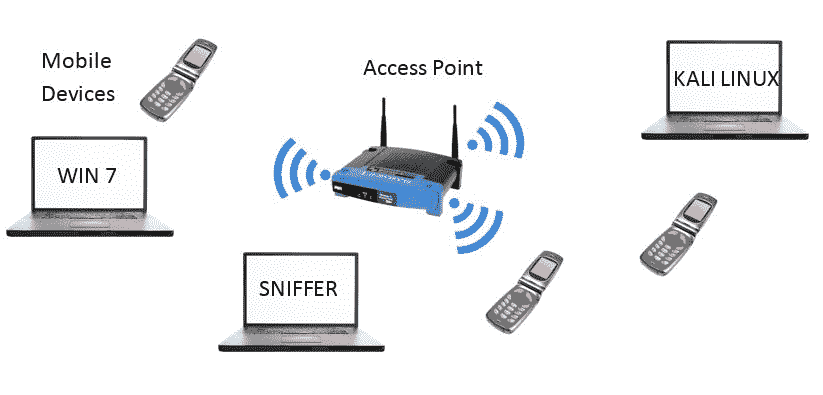

接入点位于`192.168.1.1`，它使用 DHCP 将 IP 地址分配给连接的设备；攻击箱(Kali)配置了一个手动 IP 地址`192.168.1.106`。

# PING 扫描

让我们从第一个场景开始，攻击者试图对他的机器所在的子网执行 ping 扫描攻击(假设:攻击者是内部员工)。参考下面的屏幕截图，它显示了作为运行 bash 脚本(ping sweep scan)的结果而捕获的流量；脚本从`192.168.1.100`到`192.168.1.110`ping 每个 IP:

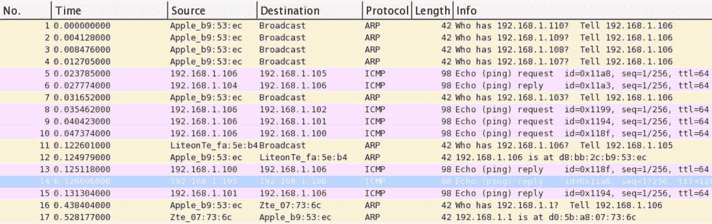

Ping 扫描

从数据包 1-4 开始，由于在 Kali 上发出 ICMP `ping`命令，ARP 请求被观察到，并且由于它是新的网络，配置设备将需要为内部 LAN 通信建立它们的 ARP 缓存表。在包 5 中，`ping`请求被发送到`192.168.1.105`，包 14 中收到对它的回复，这意味着设备可用。DHCP 范围内的其他 IP 也会捕获并观察到类似的流量模式。由于频繁的 ARP 和 ICMP 数据包一个接一个地观察到一系列的 IP，我们可以断定这是局域网上的端口扫描活动。

# 半开扫描

现在让我们扫描 IP 地址范围内的一个特定设备，并以运行在 IP `192.168.1.105`的机器为目标。收集特定设备相关信息的主要方式是端口扫描，以检查目标设备提供的任何开放服务。我所说的服务是指 HTTP 守护进程、邮件服务器守护进程、FTP 服务器、SMB 等等。

你可能想知道什么是半开扫描。看看我们在前一章中讨论的 TCP 三次握手的过程，其中客户端通过发送一个`SYN`包来发起连接，如果服务器可用，客户端接收到`SYN`、`ACK`包，作为回报，客户端向服务器发送一个`ACK`包来完成握手过程。

现在，如果在 TCP 握手的最后一步中发送的`ACK`包从未被发送到服务器，会发生什么？在终止握手过程之前，服务器将等待一段时间，与特定 TCP 服务的连接将永远不会完成。这就是为什么这种类型的扫描被称为半开扫描。

我已经使用带有-sS 开关的 Nmap 从 IP `192.168.1.106`处的 Kali 机器执行了半开放扫描，以针对 IP `192.168.1.105`处的 Win7 机器。Nmap 是一个开源的端口扫描工具，适用于大多数平台，可以从[http://nmap.org](http://nmap.org)免费下载。由于我们执行的`SYN`扫描而生成的流量被捕获并显示在下面的屏幕截图中(使用显示过滤器查看与特定主机相关的数据包，如下所示):

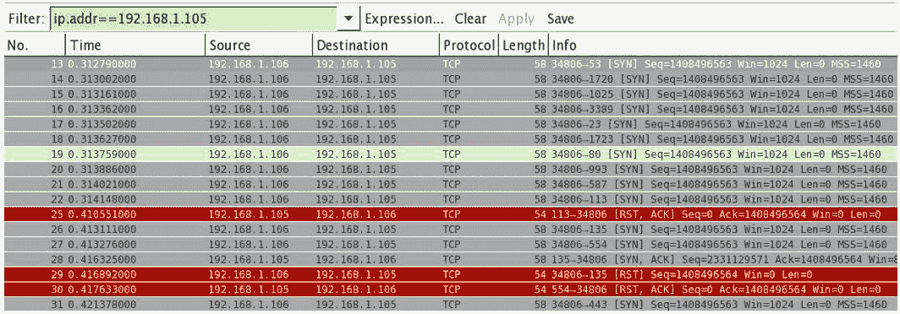

半开扫描

上面列出的数据包中需要注意的要点/模式如下:

*   在很短的时间内，有大量从 IP `192.168.1.106`生成的`SYN`数据包通过随机端口发往 IP `192.168.1.105`。内部机器在如此短的时间内启动多个连接实例是极不可能的(查看 time 列)。
*   在从 13 到 22 的数据包中，一个`SYN`请求在几毫秒内通过随机和众所周知的端口号频繁发送。
*   此外，IP 地址为`192.168.1.106`的主机从未发送回`ACK`数据包来响应`SYN, ACK`接收。

# 操作系统指纹识别

了解目标系统上运行的操作系统将使信息收集过程更上一层楼。如果攻击者知道正在运行的操作系统的品牌和版本，那么就通过瞄准特定的漏洞来进行攻击而言，这就提供了额外的优势。

你认为识别远程机器的操作系统是如何工作的？我将告诉你这个秘密。每个操作系统都有不同的实现 TCP 栈的方式。因此，从远程机器接收到的数据包中会包含某些字段，如 TTL、片段偏移量和窗口大小。通过将数据包中的值与数据库进行比较，工具能够更准确地预测操作系统。例如，如果您尝试 ping 一台 Windows 机器，返回的 TTL 值将是 128，如果您 ping 一台 Linux 机器，TTL 值在大多数情况下将是 64。很简单，不是吗？

使用 nmap 命令`nmap -O 192.168.1.109,192.168.1.104`，让我们为 IP `192.168.1.109`和`192.168.1.104`采集机器操作系统的指纹，并捕获生成的流量。

我们不会仅仅依靠 nmap 的输出来确认操作系统；为了更加清晰，我们还将尝试剖析 Wireshark 的数据包。请参考以下屏幕截图来比较输出:

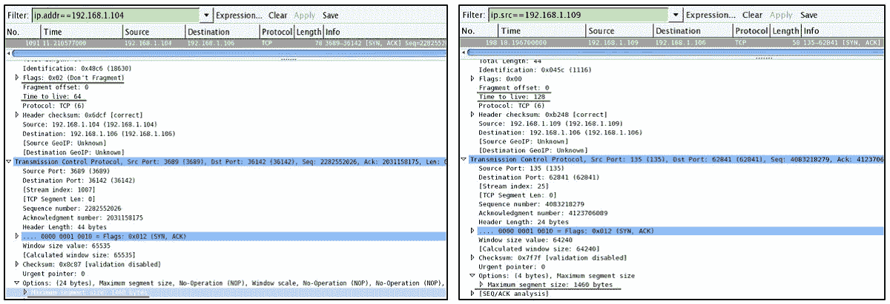

检查突出显示的 TTL 字段值，对于 Linux 机器，该值等于`64`，对于 Windows 机器，该值等于`128`。还要查看底部的最大段大小值，Linux 机器的值是`1460`，Windows 机器的值是`1440`。nmap 等工具存储所有这些基准值，然后在内部与扫描结果进行比较，以识别远程操作系统。识别此类恶意流量需要注意的几个要点如下:

*   以识别远程操作系统为目标的扫描生成的流量类似于`SYN`扫描(半开)流量，其中观察到不完整的 TCP 握手和`ICMP`请求/回复。
*   此外，如果大量的`RST`或`RST`、`ACK`数据包从一个关键服务器发送到网络中的特定主机，那么这是值得进一步研究的事情。

# ARP 中毒

每当任何设备想要与另一台设备通信时，发出请求的设备都会向整个子网发送广播。然后，该 IP 地址所属的设备使用单播数据包回复其 MAC 地址。通过这种方法，局域网中的设备可以相互通信。MAC 地址(物理地址)表存储 MAC 地址及其对应的端口号/IP 地址。

使用`arp -a`命令在您的机器上填充 ARP 表条目。大多数平台上的相同命令。

以下是我们将用于理解的本地网络的一些详细信息:

| **装置** | **IP 地址** | **MAC 地址** |
| 路由器(默认网关) | 192.168.1.1 | D0:5B:A8:07:73:6C |
| 苹果(受害者) | 192.168.1.103 | D8:BB:2C:B9:53:EC |
| Windows 服务器(受害者) | 192.168.1.109 | 00:0C:29:B3:CB:B6 |
| Kali Linux(攻击者) | 192.168.1.106 | 00:0C:29:5D:A7:F7 |

例如，如果苹果机器希望与位于`192.168.1.109`的 Windows 机器通信，苹果将发送一个广播，询问 Windows MAC 地址，声明`Who has 192.168.1.109? Tell 192.168.1.103`。然后，一旦 Windows 机器知道了这个请求，就会发送一个声明`192.168.1.109 is at 00:0C:29:B3:CB:B6`的 ARP 回复单播包。

ARP 中毒是一种毒害/感染/破坏受害者本地 ARP 缓存的攻击形式。请参考下图:

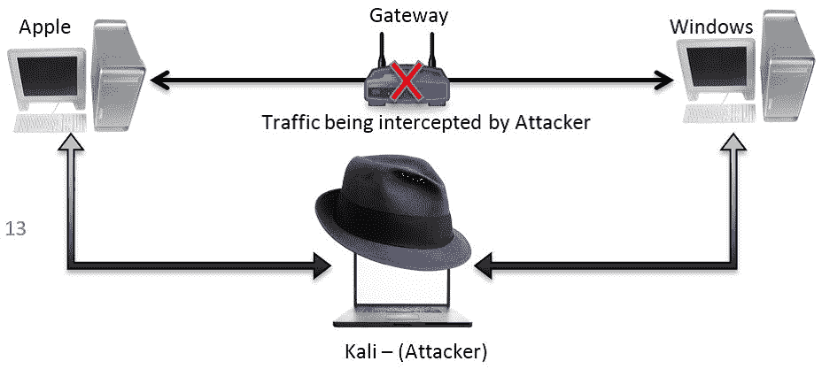

IP 转发是使用 Kali box 上的命令`echo '1'/proc/sys/net/ipv4/ip_forward`预先配置的，用于在 Apple 和 Windows box 之间来回发送流量。

执行以下步骤，以便在实验室环境中复制 MiTM 攻击:

1.  以下屏幕截图显示了在攻击者毒害受害机器的 ARP 缓存之前，客户端和服务器的 ARP 表条目:

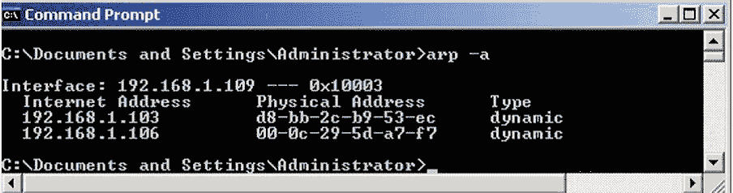

Windows 服务器缓存

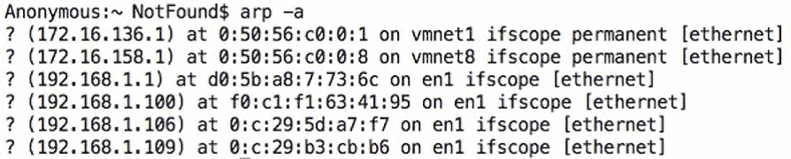

苹果缓存

2.  攻击者使用命令行实用工具 arpspoof，通过伪造的 ARP 回复数据包毒害 ARP 条目:

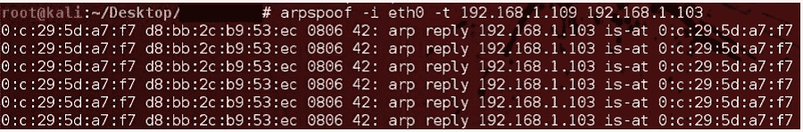

代表 Apple 设备发送到 Windows 服务器的 ARP 回复数据包

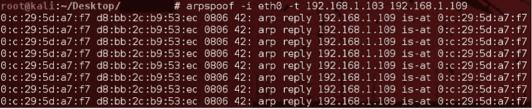

代表 Windows 服务器发送到 Apple 设备的 ARP 回复数据包

3.  由前面的命令生成的流量如下所示:

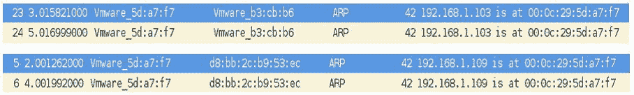

4.  从 Kali box 发送的数据包迫使苹果和 Windows 机器用攻击者的 MAC 地址更新它们保存合法 MAC 地址的本地 ARP 缓存`00:0C:29:5D:A7:F7`:

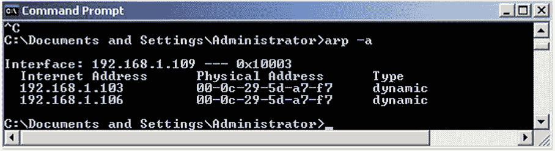

中毒窗口的缓存

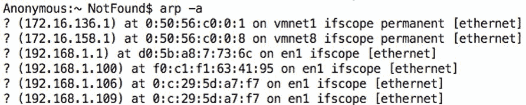

毒化了苹果的缓存

5.  现在苹果和 Windows 盒子之间发送的所有流量都将通过 Kali 转发。为了验证，我关闭了 Windows 服务器，并尝试从 Apple box 发送 ICMP 数据包:

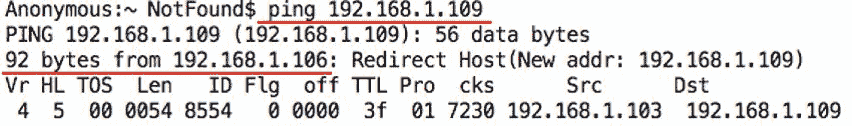

前面的输出确保数据包通过`192.168.1.106`转发，从而使我们的 ARP 中毒攻击成功。

在关键机器中创建静态 ARP 条目，以保护它们免受 ARP 欺骗攻击；有关在 Windows 框中配置静态条目的信息，请参考以下屏幕截图:

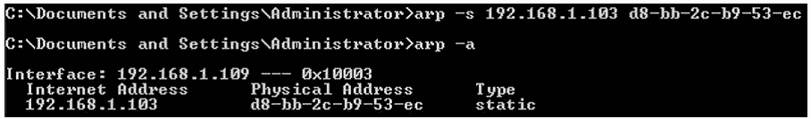

向本地 ARP 缓存添加静态条目

# 分析暴力攻击

你必须意识到暴力攻击的流行。成功的机会不是很高，但也不是不可能，因为公司机器上没有配置复杂的密码。暴力攻击是一种使用自动猜测密码过程的工具来猜测设备中配置的登录密码的方法。

为了分析这种性质的恶意流量，我将尝试在预先配置的 FTP 服务上执行暴力攻击。FTP 用于高效传输文件，确保现代和关键网络基础设施中数据的完整性和确认交付。

出于测试和分析的目的，我在 Windows 7 机器上的`192.168.1.108`处配置了一个 FTP 服务器，攻击者在 Kali 机器上的 IP `192.168.1.106`处。

让我们复制并分析攻击和正常的 FTP 流量模式。如果您想复制它，但仅出于教育目的，请执行以下步骤:

1.  使用最适合您需求的平台配置 FTP 客户端和 FTP 服务器，并确保 FTP 服务器和客户端之间的链接正常工作。
2.  现在，首先，我们将尝试使用合法用户登录 FTP 服务器，并记录流量。稍后，我们将使用 Wireshark 中的 Follow TCP stream 选项，以易于理解的纯文本格式查看流量详细信息。
3.  参考下面的截图，我从 FTP 客户端发起了
    之间的连接。然后，我在第一次尝试中提供了错误的凭据，并在第二次尝试中使用了正确的凭据:

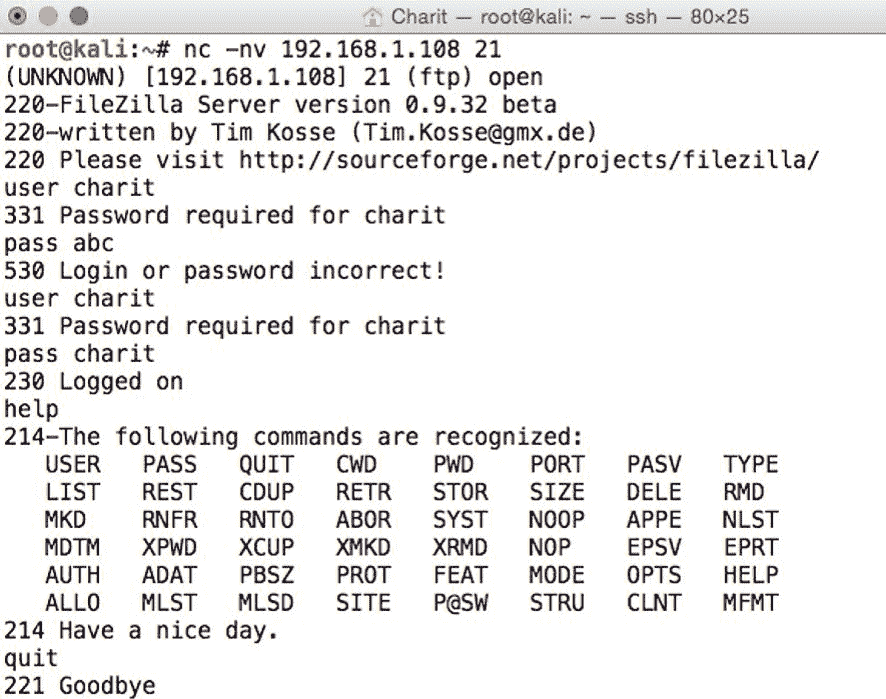

4.  在我成功登录后，我发出了`help`命令来查看可用命令的列表，然后退出来终止连接。

5.  Wireshark 捕获了 FTP 客户端和服务器之间的流量；让我们使用跟随 TCP 流选项(在列表窗格中右键单击|跟随| TCP 流)来查看详细信息:

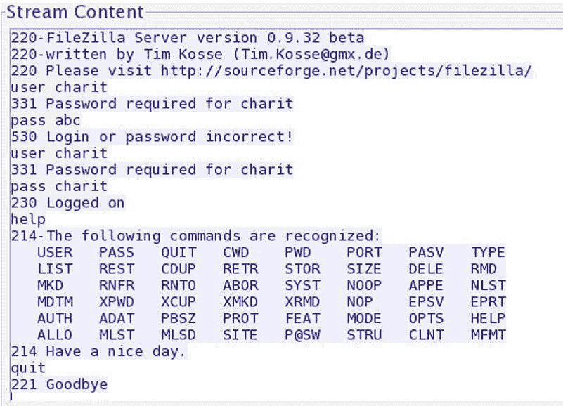

FTP 组装流

6.  现在，我们已经分析了正常的流量模式，让我们看看恶意 FTP 数据包(如暴力攻击企图)会是什么样子。我将使用一个基本的字典文件执行暴力攻击。
7.  发出`hydra -l <username> -P <password file> ftp://<you target's IP address>`命令。参考以下截图: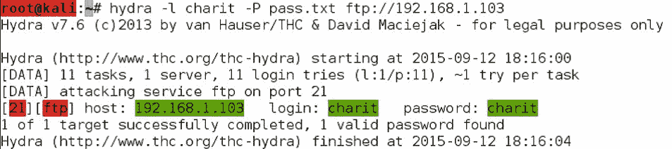
8.  生成的流量被捕获，我没有显示所有流量，而是使用了一个显示过滤器`ftp.request.command==PASS`,以便只查看与 FTP password 命令相关的数据包。下面的截图显示了我用来查询恶意重复数据包的显示过滤器。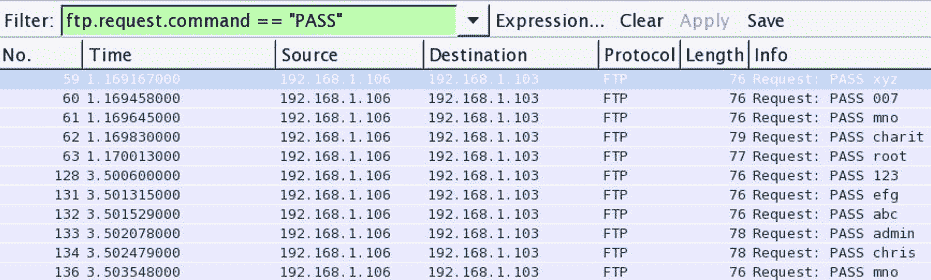

FTP 暴力攻击流量模式

9.  由于单个 IP 在很短的时间内发出 FTP pass 命令，因此很容易识别出前面的流量是恶意的(请参考时间列)。

为了识别此类恶意或敏感流量，创建不同的着色方案(在第 3 章、*分析传输层协议*中讨论)。参考以下截图:

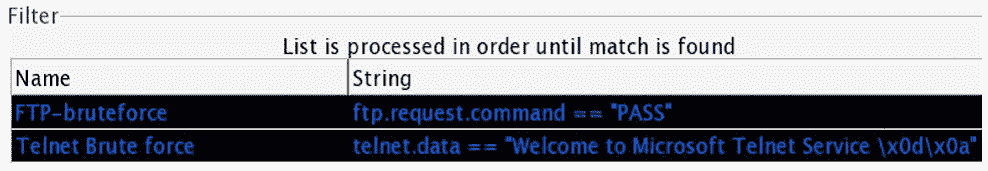

恶意流量的着色方案

使用显示过滤器和彩色流量选项，您可以分析网络基础设施中的恶意流量。

# 检查恶意流量(恶意软件)

恶意软件是任何网络中最常见的客户端攻击形式之一。恶意软件感染的结果可能非常具有破坏性，从拒绝服务攻击到远程代码执行。由于缺乏安全控制和普遍意识，石油和天然气、能源、运输和制造等关键基础设施行业是恶意软件最喜欢的目标之一。参考下面的截图，我们将在实验室中尝试复制基于恶意软件的感染:

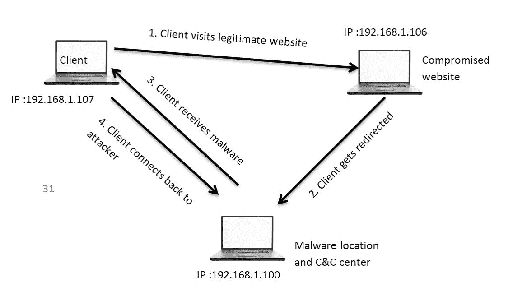

恶意软件一旦安装在受害者的机器上就能够执行任务，例如信息泄露、执行命令和/或破坏系统，即使基础架构中安装了最好的安全解决方案也是如此。

如果您想在自己的虚拟实验室中复制该场景，请遵循以下步骤:

*   您需要三台机器连接到同一个局域网。确保它们能够互相 ping 通，以确保连通性。
*   IP 地址`192.168.1.106`上有一个合法网站，IP 地址为`192.168.1.107`的
    客户端通常会访问该网站。但是，这一次，客户端没有意识到导致重定向到另一个 web 服务器的感染(假设:web 服务器受到威胁并被攻击者接管)。参考以下合法服务器截图:

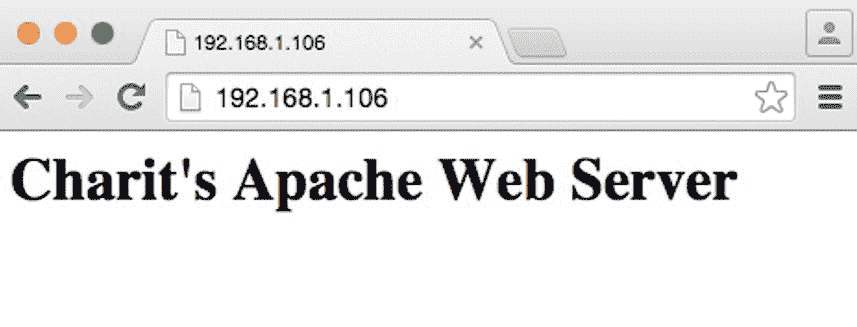

合法网站

*   为了模拟重定向，我配置了运行在`192.168.1.106`上的 Apache 服务器，将 HTTP 请求重定向到 IP `192.168.1.100`，并从那里下载`efg.exe`。
*   当客户端访问在`192.168.1.106`运行的网站时，它被重定向到一个新的 web 服务器，该服务器直接要求客户端运行一个名为`efg.exe`的文件。参考以下截图:

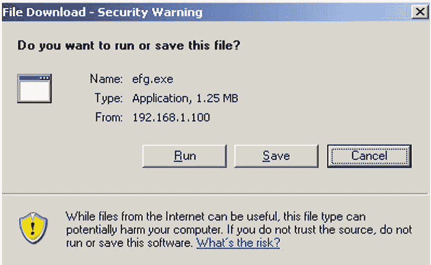

客户端被重定向到 IP 192.168.1.100，并被要求运行应用。

*   应用的发行者未经验证，因此客户端操作系统无法验证它。这将导致未知的发布者错误。参考以下截图:

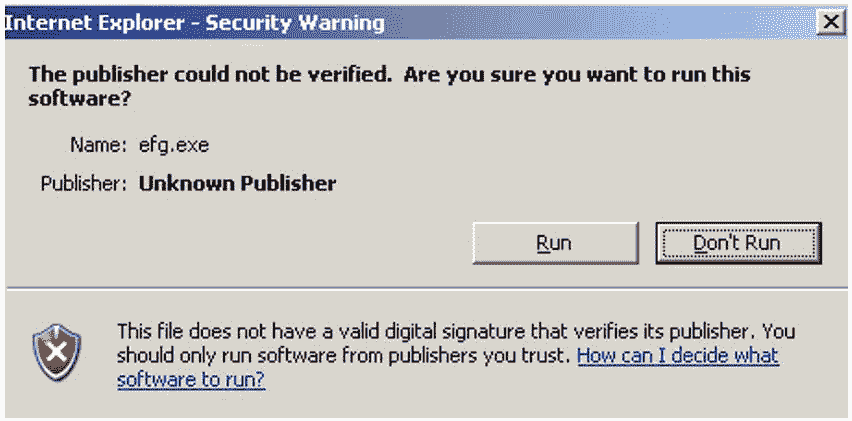

未知的发布者错误

*   一旦客户端点击运行，恶意软件将被执行，从而创建一个连接回到命令和控制中心(攻击者)。
*   我们在攻击过程中截获了流量信息。让我们来看看吧。我没有只显示流量，而是首先在客户机和合法服务器之间组装 TCP 流。
*   为了理解我们的恶意软件的工作方式，我们需要查看数据包的详细信息。参考下面的截图，图中显示了组装好的 TCP 流: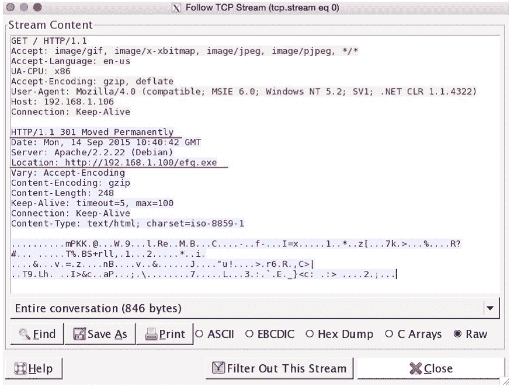

客户端和真实(受损)服务器之间的 TCP 流

*   显而易见，客户端访问 web 服务器，请求通过 HTTP 重定向转发到新地址``http://192.168.1.100/efg.exe``
*   在客户端和服务器之间交换了几个数据包之后，客户端收到了一条`200 OK`状态消息，提示成功下载了可执行应用`efg.exe`

下面的屏幕截图描述了客户端机器发送的从新网址下载可执行文件的请求:

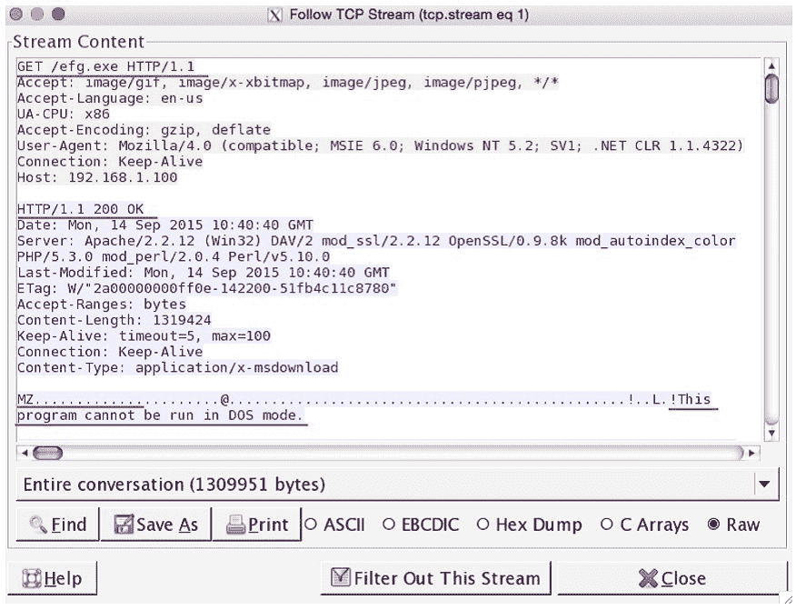

图 7.20:恶意软件签名

搜索`efg.exe`的客户端发起了`GET`请求，服务器用`200 OK`状态消息响应。稍后，您可以看到以字符`MZ`开头的已知恶意软件签名，后跟一些随机字符。

快速谷歌搜索显示，这是一个可执行文件。维基百科声明 16/32 位 DOS 可执行文件可以通过 ASCII 中文件
开头的字母`MZ`来识别。参考以下截图:

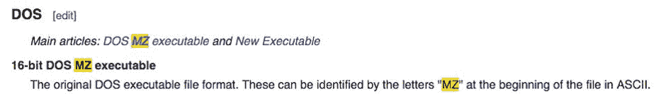

继续我们的调查，让我们导出`efg.exe`文件。执行以下步骤下载文件:

1.  转到文件|导出对象| HTTP:

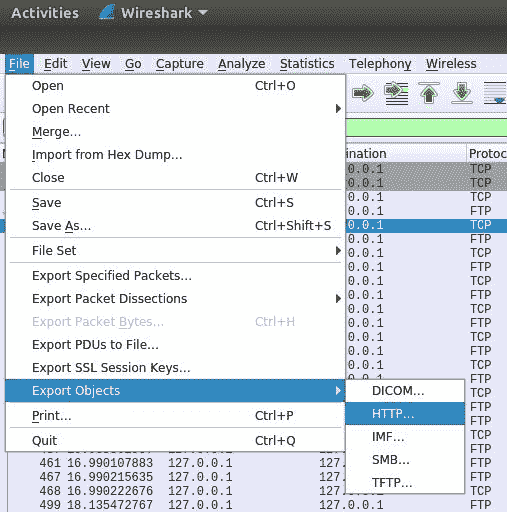

下一个屏幕看起来像下面的屏幕截图:

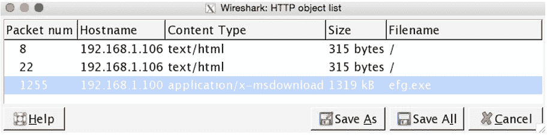

导出 HTTP 对象

2.  现在，选择说明文件名的对话，并单击另存为。
3.  一种选择是将该文件上传到网站，如[http://www.virustotal.com](http://www.virustotal.com)，该网站将通过多个反病毒程序扫描该文件。参考以下截图:

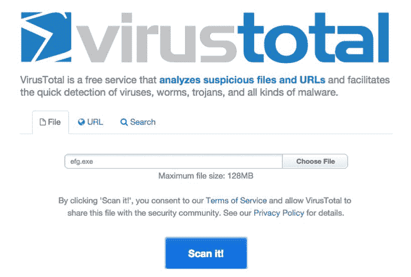Uploadingefg.exeto virustotal.com 

4.  单击扫描并等待结果:

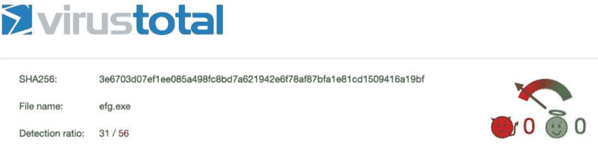

56 种反病毒软件中有 31 种将可执行文件检测为恶意文件。

5.  您还可以通过查看`hex`转储来手动检查受感染客户端与命令和控制中心之间的对话。参考以下截图:

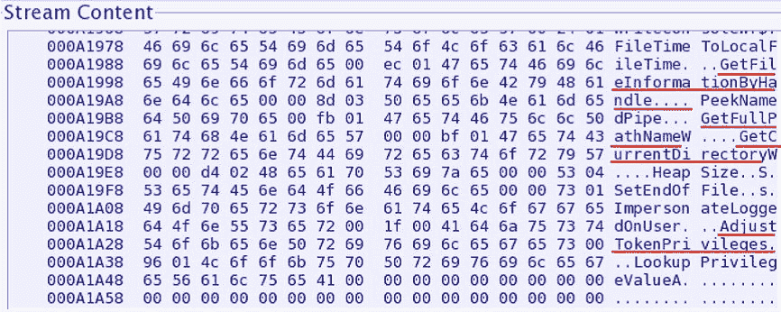

TCP 流对话框中的 Hexdump

攻击者机器似乎正在发出一些命令来收集关于受害者机器的信息。窗口右侧突出显示的内容表示字符串，如`Get File Information`、`Get full PC name`、`Get Current directory`、`Adjust token Privileges`等。

熟悉此类流量模式至关重要，建议在 Wireshark 中设置过滤器捕获过滤器，以执行被动分析来识别恶意流量。当然，您环境中的 IDS/IPS 系统将能够自动检测到它，但是在关键基础设施网络(石油和天然气、能源等)中，部署此类安全解决方案的可能性极小。在这些情况下，Wireshark 是您最好的伙伴，最重要的是，它是免费的！！

# 摘要

使用 Wireshark 防御常见形式的渗透企图，从而保护您的网络安全。从安全角度分析数据包将使您对如何对付恶意用户有新的认识。

诸如端口扫描、足迹和各种主动信息收集尝试等活动是攻击方法的基础，可以利用这些方法绕过您的安全基础设施。创建过滤器和签名来识别恶意流量模式。

猜测密码以获得未经授权的访问被称为暴力攻击。通过 Wireshark，您可以过滤和识别此类恶意形式的流量。

Wireshark 可以帮助您分析恶意软件的行为，使用分析的行为，您将能够为您的 IDS/IPS 安全解决方案创建必要的签名。

下一章将使网络专业人员能够执行无线数据包分析，并教他们如何解密和读取空中的流量。