# 七、分析稀薄空气中的流量

如今，大多数设备都安装了无线功能，了解网络中无线流量的结构和模式至关重要。本章将帮助理解执行无线数据包分析的方法和步骤。

以下是我们将在本章中涉及的主题:

*   了解 IEEE 802.11
*   无线通信模式
*   捕获无线流量
*   分析正常和异常流量模式
*   解密加密的无线流量

无线网络流量分析类似于有线网络分析；这里讨论的主题的目标是了解无线技术和协议的优点和缺点，以及可疑的无线流量。

# 了解 IEEE 802.11

在**电气和电子工程师学会** ( **IEEE** )，几组技术专家作为一个委员会正在进行项目，其中一个是 802，它负责开发**局域网** ( **LAN** )标准。具体来说，802.11 包含 WLAN 标准。

802.11 标准有多种，对于最外层的标准，我们将讨论其中的多种，如 802.11b、802.11a、802.11g 和 802.11n:

*   **802.11** :支持 1-2 Mbps 的网络带宽。这就是
    为什么许多 802.11 兼容设备已经过时的原因。
*   **802.11b** :该规范与 802.11 标准一样，使用 2.4 Ghz 的信令频率。从技术上讲，使用 b 规范，在 2.4 Ghz 频带上可以实现最大 11 Mbit 的传输速率。

802.11b 频带被分成 14 个重叠的信道，其中每个信道具有 22 Mhz 的宽度。在一个实例中，最多可以有三个不重叠的信道同时工作。这种空间分离是必要的，并且是让通道单独操作所必需的。

大多数电器，如微波炉、无绳电话等等。在 2.4 Ghz 频谱上工作，这可能会在 802.11b WLAN 数据包传输中造成严重干扰和拥塞。

*   **802.11a** :这是基于 1999 年发布的**正交频分复用** ( **OFDM** )，支持最高 54 Mbps 5 Ghz 频谱的传输速率。该规范是作为 802.11 标准的第二个标准开发的。它通常用于商业环境中；由于其高成本， *a* 规格不太适合家庭环境。802.11a 不存在信道重叠问题。更高的调节频率有助于防止工作在 2.4 Ghz 频谱上的设备造成的干扰。
*   802.11g :该规范于 2002 年发布，结合了 802.11a 和 802.11b 的最佳特性。它使用 2.4 Ghz 的信号频率，带宽高达 54 Mbps。它还支持向后兼容，这意味着所有 802.11g 接入点将支持使用 802.11b 的网络适配器，反之亦然。
*   **802.11n** :为了进一步提高范围和传输速率，基于技术**多输入多输出** ( **MIMO** )引入了无线规范 *n* 。该规范的最终版本于 2007 年发布，规定传输速率高达 600 Mbps。可配置 2.4 或 5 Ghz 它可以同时使用两种频率，从而支持向后兼容网络适配器。MIMO 技术最多可使用四根天线。

# 无线通信中的各种模式

无线网络使用**载波侦听多路访问和冲突避免** ( **CSMA** / **CA** )协议来管理发送数据的站点，其中每个想要发送数据的主机都应该首先侦听信道，也就是说，如果它是空闲的，那么主机可以继续发送分组；如果没有，那么主人必须等待轮到它。这是因为每个主机共享同一个介质，从而避免了冲突。

802.11 架构由若干组件组成，如一个**站** ( **STA** )、一个无线**接入点** ( **AP** )、**基本** **服务集** ( **BSS** )、**扩展** **服务集** ( **ESS** )、**独立基本** **服务**

STA 和 AP 之间有四种常见的关联模式，如下所示:

*   **基础设施/管理模式:**无线网络，无线客户端在其中与接入点建立连接，以访问数据和网络资源。AP 定义有一个**服务集标识符** ( **SSID** )，它是接入点的名称，用于在一定范围内进行识别(出于安全原因，有时可以禁用广播 SSID，这样可以防止您的无线网络被发现)。例如，当我们扫描附近可用的 Wi-Fi 网络时，会显示多个网络名称供我们选择。另一个需要了解的有用术语是**基本服务集标识符** ( **BSSID** )，即接入点的 MAC 地址。

默认情况下，每个接入点都应该广播 SSID，并在一秒钟内发送 10 次信标帧，让客户端知道 AP 已准备好接受连接。请参考下图:

*   **Ad Hoc 模式**:在 Ad Hoc 模式下，两个客户端相互连接形成一个对等网络。无线客户端发送和接收的数据包不会中继到接入点。请参考下图:

*   **主模式**:当 NIC(网络接口卡)适配器能够通过使用特殊驱动程序充当客户端的接入点时，它就成为主节点。现代操作系统和硬件都具备这种功能，其中主机设备可以通过共享其有线连接来充当接入点。请参考下图:

*   **监控模式**:该模式使网络适配器能够监听无线网络流量；当监控模式被激活时，您的设备将停止发送和接收任何数据包，它只会以被动的方式嗅探实时流量。简而言之，如果 wireshark 运行的接口启用了监控模式，它可以在不属于网络的情况下嗅探流量。这种模式通常被称为**射频监控模式** ( **RFMON)** 。请参考下图:

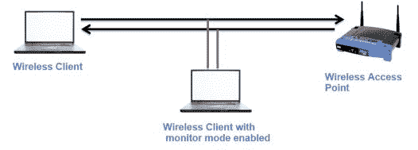

# 常见和不常见的无线流量

2003 年，**保护无线电脑网络安全系统** ( **WPA** )由 Wi-Fi 联盟推出，作为使 WLAN 通信比之前的协议 WEP 更强的措施。WEP 使用的密钥大小是 40/104 位，而 WPA 使用 256 位的密钥大小，这也有助于完整性检查。在 WEP 中，实现了传统的 CRC，但是 WPA 引入了流行的迈克尔 64 位**消息完整性检查** ( **MIC** )。

WPA 使用 RC4 算法来建立基于动态加密密钥的会话(您永远不会在两台主机之间使用相同的密钥对)。请参考下图，了解通过介质传输的密文是如何形成的:

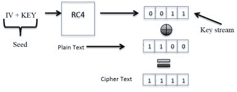

该过程从追加 IV 和动态生成的 256 位密钥开始。随后使用 RC4 算法加密，生成的加密密钥流会附加数据，瞧！我们有最终的密码文本。

请参考下图，该图描述了 WPA 中的身份验证过程:

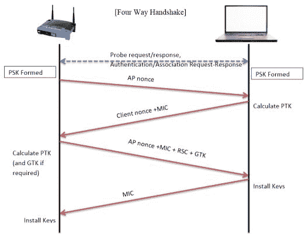

以下是上图所涉及的步骤的摘要:

1.  首先，*主密钥交换(PSK)* 发生，随后向 STA 传输一个 nonce 值(启动连接)。
2.  STA 将使用 AP 的 nonce 值和它自己的 nonce 来计算**成对瞬时密钥**(**【PTK】**)以连同在先前步骤中建立的**预共享密钥**(**【PSK】**)一起发送。结果值将被发送到 AP 以计算 PTK，并为 MIC 添加**接收序列计数器** ( **RSC** )。
3.  现在，STA 将首先验证消息中的 MIC 以确保完整性，然后安装密钥。

4.  将向 AP 发送关于该状态的响应。如果状态显示成功，则 AP 安装将在进一步通信中使用的相同密钥(动态密钥)。

以下屏幕截图描述了成功的 WPA 企业握手过程中涉及的四个身份验证数据包:

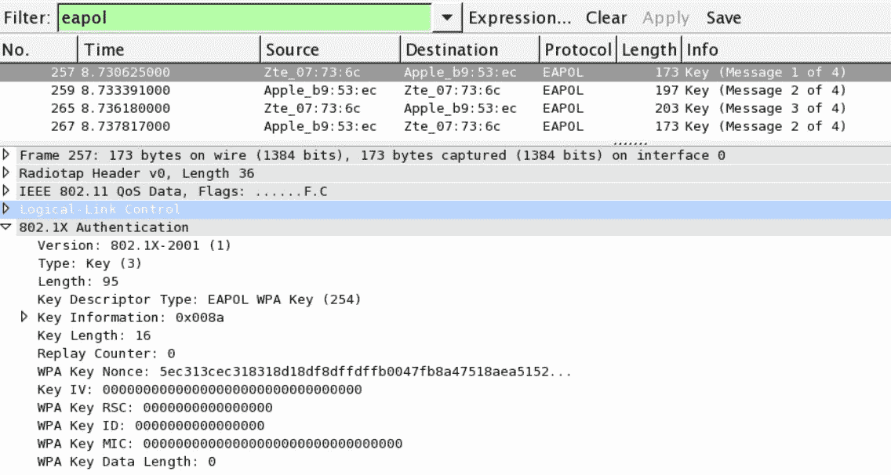

更详细地说，让我们观察握手过程中前面四个身份验证数据包中包含的标志:

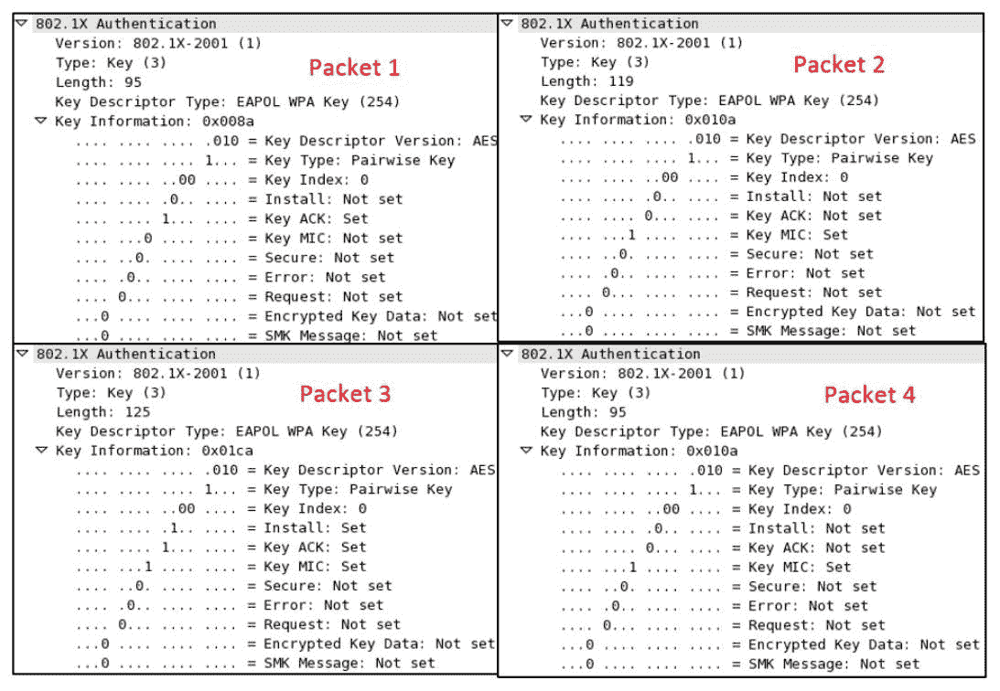

以下是对上述身份验证数据包的描述:

*   **数据包 1** :设置成对主密钥(预共享密钥)和`ACK`位(因为之前交换的关联请求/响应)，由 AP 发送给 STA，以与随机选择的 nonce 值一起启动连接。
*   **数据包 2** :设置成对主密钥和`MIC`标志，STA 将其发送给 AP 以确认请求，并将其自身的随机数值附加到 AP 的随机数和用于完整性检查的`MIC`中。
*   **数据包 3** :设置成对主密钥、安装、密钥`ACK`和`MIC`标志，AP 发送给 STA。接下来，STA 将完成挑战，以便获得认证。
*   **数据包 4** :设置成对主密钥和`MIC`标志，STA 发送给 AP
    完成连接过程。

根据我们对成功身份验证过程的理解，现在让我们尝试观察身份验证不成功情况下的数据包模式。这种情况下的唯一区别是 STA 不知道预共享密钥。

参考以下截图:

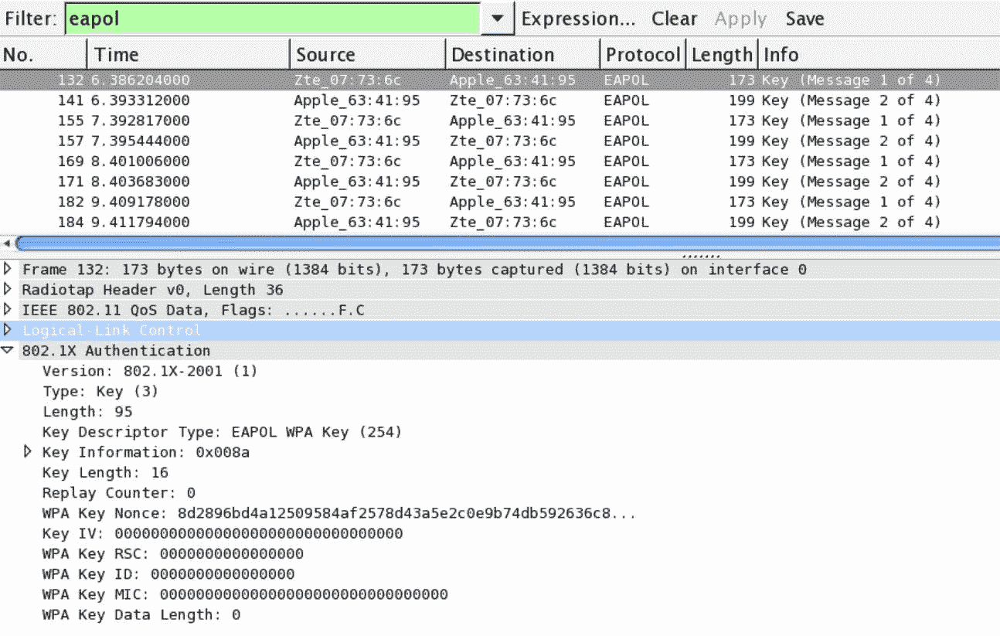

WPA 认证失败

前面的屏幕截图描述了由于 STA 发送了不正确的预共享密钥而在 STA 和 AP 之间传输的数据包链。在对 AP 的暴力攻击事件中，可能会看到这些数据包。

# WPA 企业

为了标准化和强化身份验证过程，并引入一些责任和不可否认的元素，WPA 提供了外部服务器的配置来验证和授权 sta。这个集中式认证和验证单元被称为 **RADIUS** / **TACACS** 服务器。在四向握手发生之前， **RADIUS** 服务器和接入点应该通过一个 MSK。让我们来看看下图:

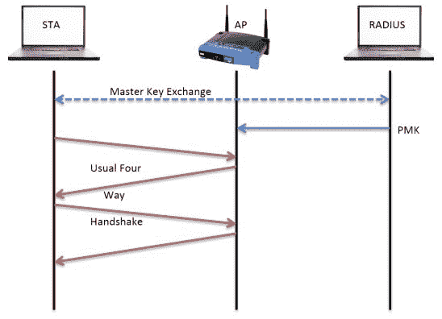

发布主密钥的交换，成对主密钥被创建并被传递给 AP，这将进一步完成四次握手过程。

作为宽限终止的一部分，无线站使用解除关联分组来通知接入点 STA 现在离线，并且可以释放所分配的资源。以下屏幕截图列出了在解除关联阶段观察到的数据包:

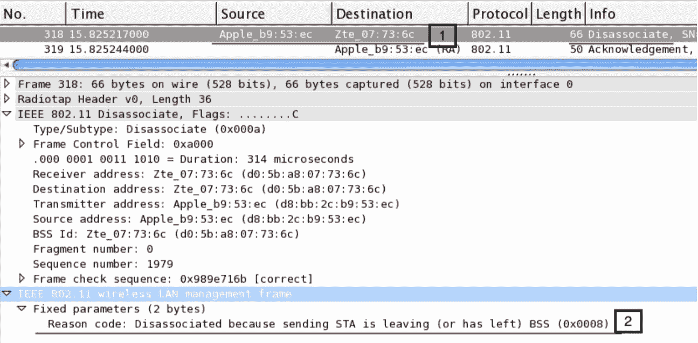

解除关联分组

无线站使用`deauthentication`帧通知接入点 STA 正在离开。正如我们在前面的截图中所看到的，首先，STA 发送一个`disassociation`帧，并接收来自 AP 的`ACK` ( `318`，`319`)。

无线客户端可能会发送`disassociation`帧，这有几种情况。参考下面的截图来理解这一点:

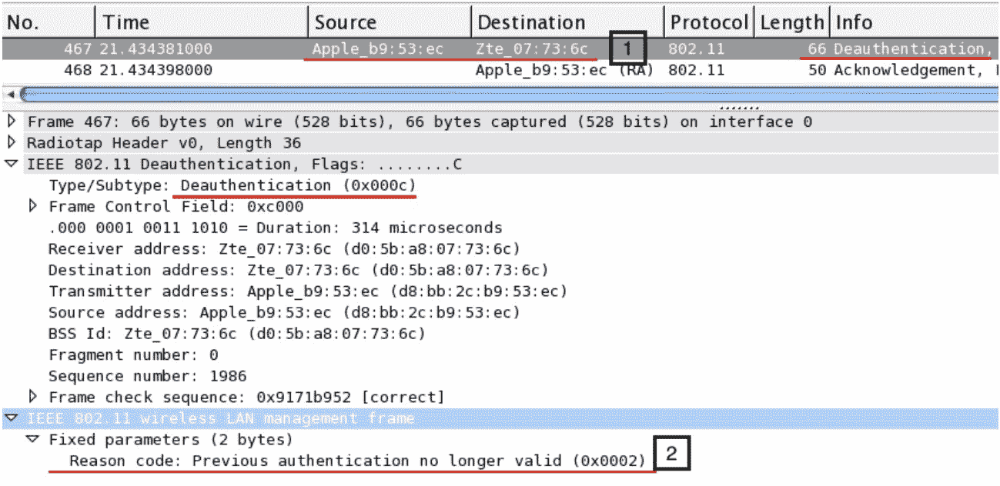

解除身份验证数据包

在前面的数据包列表中，首先，STA 向接入点发送一个`deauthentication`帧，该帧在接下来的数据包中得到确认(`467`、`468`)。

# 解密无线网络流量

Wireshark 还通过在 802.11 协议部分嵌入预共享密钥来帮助解密无线流量。下面的屏幕截图描述了从附近的接入点嗅探到的正常无线流量:

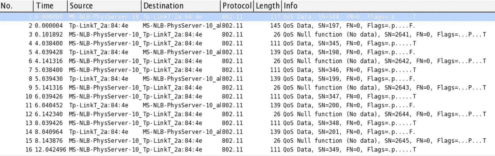

解密前的 WLAN 流量

为了解密前面列出的数据包，我们需要如下配置 IEEE 802.11 部分:

1.  转到编辑|首选项，展开协议部分，选择 IEEE 802.11 并按如下方式进行配置:

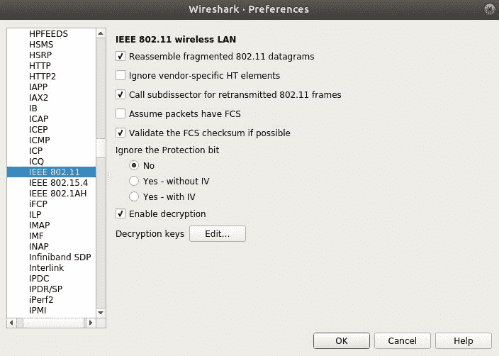

2.  单击解密密钥旁边的编辑按钮。
3.  单击新建并添加 WEP/WPA 密钥以启用解密。完成所有更改后，单击确定:

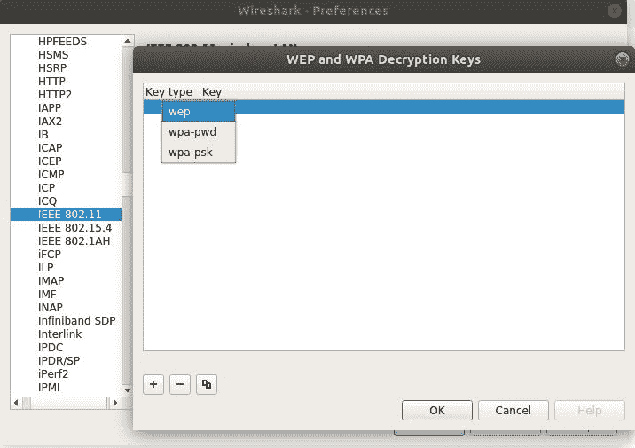

现在，您将看到解密的流量，如下所示:

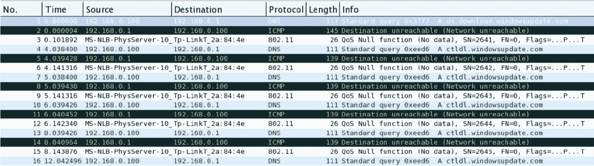

解密后的 WLAN 流量

# 摘要

IEEE 802.11 标准在无线电频率上工作，用于通信目的。CSMA/CD 有助于实现高性能无线网络所需的无冲突环境。

进行无线流量分析时，通常会观察到三种类型的帧:管理帧、控制帧和数据帧。管理帧控制连接的建立，控制帧管理数据包的传输，数据帧由实际数据组成。

**局域网中的企业认证协议** l ( **EAP** )成为 EAPOL，用于 802.11 基础设施(RADIUS/ AAA)交换主密钥。

EAP 用于交换主密钥。根据 RFC 3748 中的定义，EAP 是一种支持多种身份验证方法的身份验证框架，要执行 EAP，您不需要 IP，因为它运行在数据链路层上。

接入点广播无线客户端侦听的信标帧。此外，无线客户端可能会发送探测请求以连接到接入点，然后由接入点或第三方认证服务执行认证。

使用 Wireshark，可以通过在 IEEE 802.11 协议部分添加无线网络密钥来解密无线通信。