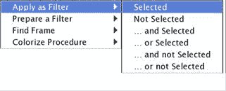

# 八、掌握 Wireshark 的高级功能

在本章中，我们将了解 Wireshark 中可用的高级选项，并使用命令行版本的数据包嗅探器。在这里，我们将讨论以下主题:

*   使用统计菜单分析网络
*   使用 TCP 流
*   使用协议层次选项
*   使用命令行工具进行协议分析

使用 Wireshark，可以查看和分析关于网络数据包、协议和端点的各种统计数据。通过详细查看和分析网络相关信息，了解和认识协议层次结构、对话、端点等高级功能有助于执行故障排除、优化和取证活动。

# 统计菜单

Wireshark 提供了各种有助于收集网络统计数据的工具，帮助用户分析从一般信息到特定协议相关信息的各种信息。

# 使用统计菜单

可以在 Statistics 菜单中查看关于捕获的数据包、应用的过滤器、标记的数据包和各种其他统计信息的详细信息；参考以下截图供参考(来源:[http://wireshark.org](http://wireshark.org)):

# 协议层次结构

“协议层次结构”窗口提供有关网络流量中协议分布的详细信息。每行代表与一个协议相关的统计数据；参考以下截图:

协议层次窗口

如果要检查特定主机的协议分布，则在打开协议层次结构窗口之前，应用显示过滤器，例如`ip.addr==172.20.10.1`。现在，当您再次打开层次窗口时，过滤器将出现在标题栏正下方的协议层次窗口的顶部:

应用显示过滤器后的协议层次窗口

使用协议层次窗口，也可以生成和应用显示过滤器。只需右键单击您希望使用的协议，然后选择所需的选项，如下面的屏幕截图所示:

在需要评估和分析恶意软件相关活动的情况下，协议层级窗口将是值得检查的。

# 会话

要分析与两个特定端点相关的网络通信，可以使用 Conversation 选项(在 Statistics 菜单下可用)。要访问它，点击统计|对话。该窗口将在顶部列出要评估的网络层，并在行中列出端点地址(IP 或 MAC ):

对话窗口

例如，如果我们需要确定网络中产生最多流量的端点，请转到 IPv4 选项卡，并按降序对字节列进行排序:

最繁忙的设备

在前面的屏幕截图中，第一行描述了端点发送和接收了多少数据包和字节。要通过对话对话框创建显示过滤器，请右键单击一行，然后创建所需的表达式。我选择了第一个选项 A B，它将只显示与地址 A 和地址 B 相关联的数据包:

新创建的过滤器表达式将显示在“显示过滤器”对话框中，如以下屏幕截图所示:

对话对话框有助于收集和分析与特定终端相关的详细信息，这在排查和审核网络基础架构时非常方便。

# 端点

通过网络进行通信的设备称为端点。局域网中的端点使用物理地址(即 MAC 地址)进行通信。在交换环境中，使用物理地址进行通信；交换机存储 MAC 地址表，工作在 TCP/IP 模型的第 2 层。

例如，我们观察到来自某些端点的大量网络流量，根据我们的剧本数据(通常的流量模式)，这是不寻常的。为了确定产生多余网络流量的确切端点,“端点”对话框可以提供帮助。要访问它，请单击统计菜单下的端点选项。端点窗口看起来很像我们之前观察到的对话窗口。

默认情况下，大多数情况下会显示以太网选项卡(列出第 2 层 MAC 地址)。除了协议之外，您还必须观察一个数字，该数字表示为该特定协议捕获的端点的数量。在我们的例子中，我们看到 3 行，在主窗格中可以看到相同数量的行。

在主窗格中，可以看到每个端点的更多具体细节，例如
传输的数据包总数、传输的字节总数以及单个端点接收和传输的字节和数据包总数:

端点窗口

现在，如果您想分析其他协议，只需单击您选择的任何选项卡。我单击了 IPv4 选项卡，并使用 Packets 列对主窗格进行了排序，如下面的屏幕截图所示。

通过查看端点对话框，我现在可以很容易地判断出大多数数据是从 IP `172.20.10.7`传输过来的。这可能是一个 IP 与某个服务器对话，或者更有可能是一个服务器以中等速率与我们网络中的多台机器对话:

端点对话框—IPv4 选项卡

要通过“端点”窗口创建显示过滤器，请右键单击传输的数据包最多的行，然后选择“应用为过滤器”下的“选定项”,如以下屏幕截图所示:

您可以在列表窗格上方的显示过滤器对话框中看到相同的显示过滤器，如下所示:

这有助于我们快速分析某个端点的流量，从而提高用户的分析速度。单击“清除”后，您将看到相同的“端点”对话框。在窗口底部，您会看到两个复选框和几个按钮。下面列出了每种方法的用途:

*   **名称解析**:解析以太网标签中列出的每个以太网
    地址的名称。但是在某些情况下，它可能会对应用的性能产生不利影响，例如，当试图从一个巨大的捕获文件中解析唯一的 IP 地址时会产生 T4。
*   **限制显示过滤器**:根据通过 Wireshark 主窗口应用的显示过滤器，限制端点窗口的结果。
*   **复制**:以
    CSV 格式(逗号分隔值)复制当前端点窗口标签的内容。
*   **Map** :在浏览器中绘制所选端点的地理位置。

# 跟随 TCP 流

Wireshark 提供了将纯文本协议数据包流重组为人类可读格式的功能:

跟随 TCP 流窗口

例如，组装一个 HTTP 会话将显示从客户机发送的 GET 请求和从服务器接收的响应。在“跟随 TCP 流”对话框中显示的请求和响应消息后面有特定的颜色编码。客户端请求显示为红色，任何蓝色文本表示从服务器收到的响应。如果协议是 HTTP、FTP、Telnet 等等，那么对话将以纯文本显示；如果使用应用层协议的安全版本，那么请求和响应消息的一些内容将被加密。

在“跟随 TCP 流”对话框的底部，有一个下拉菜单，从中可以过滤“跟随 TCP 流”窗口中的内容，以便仅查看与通信任一端相关的内容。此外，除了查看原始格式的数据，您还可以根据需要在 ASCII、EBCDIC、十六进制转储和 C 数组格式之间进行选择。

要查看 TCP 流，请按照下列步骤操作:

1.  打开`capture/trace`文件
2.  如果需要，应用显示过滤器
3.  从列表窗格中选择任何数据包
4.  右键单击选定的数据包，然后单击跟随 TCP 流

# 命令行-fu

在默认安装 Wireshark 时，还会安装一个名为 Tshark 的命令行版本的协议分析器。有很多基于 CUI 的嗅探工具可用，包括 Capinfos、Dumpcap、Editcap、Mergecap、Rawshark、Reordercap、Text2pcap 和 Tshark。

用于协议分析的最常见和最广泛使用的命令行工具是 Tshark，它可以捕获实时流量并分析保存的捕获文件。Tshark 使用`pcap`库来捕获和翻译数据包。就像 Wireshark 的过滤选项在 Tshark 中也可用一样。像 Tshark 这样的应用证明了自己是有价值的，它们具有低内存需求、易于安装和运行嗅探器的简单命令集等优点。

让我们考虑一个场景来理解命令行嗅探器的用法和优点。比方说，我们有一个 Apache web 服务器和一个 FTP 服务器运行在位于 IP `172.16.136.128`的 Windows box 上，一个 Macintosh 客户端运行在`172.16.136.1`:

我们将从基础开始，最终转向高级功能的使用，如过滤器和一些可用统计选项的使用。

让我们通过使用该工具提供的不同功能来尝试一下:

*   首先要确认的是有多少接口可用于捕获数据包。使用以下命令检查`tshark -D`:

可用接口

*   如果没有为捕获网络流量指定接口，`tshark`将从列表中选择第一个接口。接口可以通过它们的名称和它们出现的序列号来选择。

*   对于我们的场景，我们将使用`pktap0`来监听客户端和服务器之间的流量。启动捕获过程的命令是`tshark -i pktap0`:

*   为了在客户机和服务器之间产生一些流量，我从客户机执行了命令行实用工具`curl`来访问 IP 地址为`172.16.136.128`的网页:

*   由于前面的命令，我们将在 Tshark 控制台上看到一些活动:

在 pktap0 捕获的数据包

如果您想在任何时候停止捕获过程，请按下 *Ctrl + C* 。

*   如果您希望将捕获的网络数据包保存到文件中，请指定`-w`开关，如下所示:

*   由于前面的命令，原始网络数据将存储在名为`http.txt`的文本文件中。以下是保存在文本文件中的内容:

存储在文本文件中的原始数据

*   要以可读的形式保存捕获的数据，只需使用重定向操作符`">>"`到一个文件:

由于发出了前面的命令，数据包被捕获并重定向到文本文件`http2.txt`。下面是保存在文本文件中的内容，它列出了通过端口`80`在两台主机`172.16.136.128`和`172.16.136.1`之间捕获的数据包:

我们刚刚学习了将网络数据包保存到文件的两种不同方法。

*   Tshark 提供了三种类型的过滤选项:捕获、显示和读取。我们已经在前面的章节中讨论了捕获和显示过滤器，所以让我们讨论一下读取过滤器。读取过滤器能够过滤实时流量并保存捕获的文件。通过读取过滤器，一组特定的数据包可以被解码或写入文件。
*   使用读取过滤器是一项处理器密集型任务，可能会出现丢包等问题，捕获过滤器优于读取过滤器。对于捕获滤波器，使用`-f`开关；`-R`用于读取过滤器；并且`-Y`用于显示过滤器。让我们使用`-f`开关来学习捕获过滤器的用法:

开关的用法区分大小写。

*   如果所需的表达式包含空格字符，如前面的屏幕截图所示，例如“【T0”)，请在过滤器表达式两边使用双引号。
*   现在，让我们学习在先前保存的捕获文件`http.pcap`上使用显示过滤器，并在`IP 172.16.136.128`过滤来自 web 服务器的所有 HTTP 数据包:

Tshark 显示过滤器

*   为了收集 HTTP 协议，只有来自`http.pcap`文件的统计数据使用命令`tshark -r <file-name> -q -z <expression>`:

*   `-q`开关使其在标准输出上保持静默(这通常在 Wireshark 中处理统计数据时使用),而`-z`开关用于激活各种统计选项。这两种开关经常结合使用。

*   如果您想检查在捕获网络流量时观察到了多少台主机，请使用以下命令:

Tshark 是一个强大而简单的命令行嗅探器，类似于`tcpdump`。它能够轻松捕获网络数据包，并且需要较少的配置/安装。

# 摘要

“对话”窗口列出了两台主机之间通信的相关信息。

“端点”对话框列出了与连接到网络的设备相关的详细信息。

Wireshark Summary 是一个信息功能，它提供了数据、过滤器和`trace`文件的粒度形式。

“协议层次结构”窗口以表格形式列出了与网络端点使用的协议分布相关的信息。

使用 Wireshark 中的 Follow TCP Stream 选项从捕获的数据包中读取纯文本数据。有不同的查看选项，如 ASCII 和十六进制。

安装 Wireshark 时会安装一个命令行工具。最常用的工具是 Tshark，它的工作方式类似于 Wireshark 和`tcpdump`。它使用其他主要协议分析器使用的 pcap 库。

使用 Tshark，您可以收听实时网络或使用已保存的采集文件。