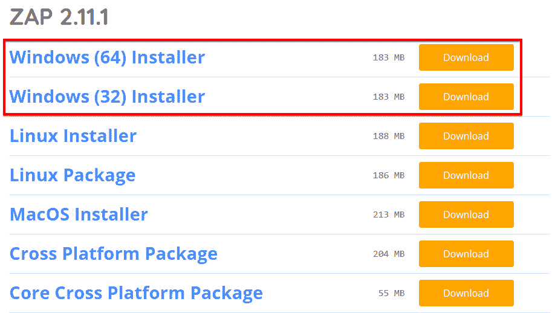
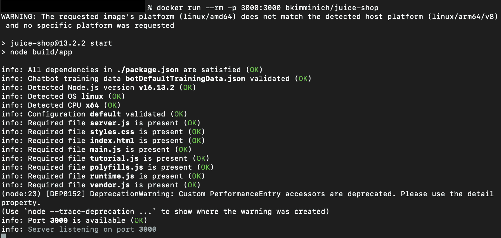
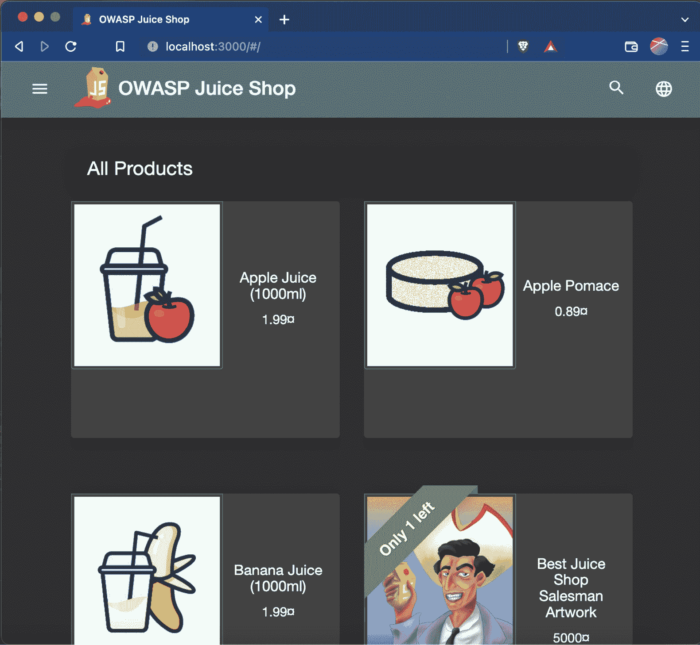

# 第一章：开始使用 OWASP Zed Attack Proxy

在本章中，你将学习如何设置 OWASP `Zed Attack Proxy`（**ZAP**）以及我们将在本书中使用的测试环境。我们将介绍运行 ZAP 所需的软件，并展示如何在本地机器上下载和安装它。你还将学习如何安装 Docker 并使用它设置 OWASP Juice Shop，这是我们将在本书中执行实验的环境。

此外，我们将引导你完成下载和安装 ZAP 的过程，ZAP 是我们将在全书中使用的工具。我们还将介绍几种安装 ZAP 的方法，并解释在什么情况下你可能想选择一种方法而不是另一种方法。我们还将介绍如何直接从 JAR 文件安装 Zed Attack Proxy，以及如何使用 Zed Attack Proxy 的 Docker 镜像来安装它。

ZAP 是由 **开放网页应用安全项目**（**OWASP**）构建和维护的一个开源应用程序。ZAP 专门用于测试网页应用程序的漏洞。ZAP 是一个 **中间人**（**MITM**）代理应用程序。一旦安装并配置完成，ZAP 就会处于网页应用程序和安全测试人员的浏览器之间，也就是客户端。ZAP 通过拦截并检查发送到网页应用程序或从网页应用程序发送的请求和响应来工作。在拦截后，这些请求和响应可以根据需要进行修改，然后继续传送。

我们将在本书中使用的两个测试环境被许多专业人士用来学习和实践他们的技能。OWASP `Juice Shop` 是一个本地托管的环境，你将学习如何在你的机器上部署它。你还将使用 `PortSwigger Academy` 来学习一些更复杂的内容，这些是本地托管环境无法提供的。

本章结束时，你将学会如何设置浏览器以代理 OWASP Juice Shop 和 PortSwigger Academy 的流量。这将是我们用于执行本书中所有不同测试的主要环境。

本章将介绍以下内容：

+   下载 ZAP

+   设置测试环境

+   设置浏览器代理和证书

+   测试 ZAP 设置

# 下载 ZAP

在本节中，我们将详细介绍如何在 Windows 和 macOS 上安装 ZAP，并使用适用于 Windows 和 macOS 的跨平台包。我们还将介绍 ZAP 的要求，如何安装 Java，配置浏览器，以及安装证书。此外，我们将介绍如何安装和设置 Docker，设置测试环境，并测试以确保一切如预期工作。

## 准备工作

为了继续本教程，你需要确保你的笔记本、台式机或所使用的环境具有管理员权限，并且有足够的硬盘空间和内存来运行 ZAP。

## 操作步骤...

使用任何工具的第一步是下载应用程序。这需要其他几个应用程序才能正确运行和使用。在本教程中，您将学习如何在任何常见操作系统上运行 ZAP 的最佳方法，以及如何安装 Java。

### 安装 Java

安装 Java 的步骤如下：

1.  访问 Java 下载页面：[java.com/en/download/](http://java.com/en/download/)。点击**同意并开始免费下载**，如*图 1.1*所示：

图 1.1 – Java 下载协议

1.  下载完成后，打开安装程序，并点击**安装**，如以下截图所示：

图 1.2 – Java 安装提示

这就是如何安装 Java。在接下来的部分，我们将演示根据您的需求安装 ZAP 的几种方法。

### 在 Windows 上安装 ZAP

在 Windows 上安装 ZAP 的第一步是安装 Java。这是因为 ZAP 依赖于 Java。有关如何安装 Java，请参考前面的*安装 Java*部分。

要下载适用于 Windows 的安装程序，请执行以下操作：

1.  访问 ZAP 下载页面：[www.zaproxy.org/download/](http://www.zaproxy.org/download/)。点击**Windows (64) 安装程序**或**Windows (32) 安装程序**旁的**下载**按钮，具体取决于您的计算机处理器。*图 1.3*显示了此界面：

.

图 1.3 – ZAP Windows 安装程序

1.  下载完安装程序后，打开并点击**下一步 >**：

图 1.4 – ZAP Windows 安装向导

1.  通过勾选**我接受协议**旁的圆圈并点击**下一步 >**来接受协议，正如您在*图 1.5*中看到的：

图 1.5 – ZAP 许可协议

1.  然后，勾选**标准安装**旁边的圆圈，并点击**下一步 >**，如以下截图所示：

图 1.6 – 选择安装类型

1.  在下一页面，点击**安装**，如*图 1.7*所示：

图 1.7 – 开始安装

1.  点击**完成**以完成设置。请参见*图 1.8*查看最终效果：

图 1.8 – 安装完成

这就是 ZAP Windows 安装的全部内容；接下来的部分将介绍如何在 macOS 上安装 ZAP。

### 在 macOS 上安装 ZAP

要下载适用于 macOS 的安装程序，请按照以下步骤操作：

1.  前往 ZAP 官方网站的下载部分，网址是 [www.zaproxy.org/download/](http://www.zaproxy.org/download/)。点击 **下载** 按钮旁边的 **macOS 安装程序**，如以下截图所示：

图 1.9 – ZAP macOS 安装程序

1.  下载完成后，打开安装程序。你可能会遇到一个错误提示，显示 **“OWASP ZAP” 无法打开，因为无法验证开发者。** 以下截图展示了该错误消息：

图 1.10 – 错误消息

1.  在这种情况下，前往 Macintosh 计算机上的 **安全性与隐私** 设置，导航到 **常规**，然后点击 **仍要打开**。让我们看看这些步骤的具体操作：

图 1.11 – macOS 安全性与隐私窗口

更新设置后，再次点击安装程序以开始安装。

### 使用跨平台包安装 ZAP

**跨平台包**是一个 ZIP 文件，包含以 `.jar` 格式打包的 ZAP、一个 `.bat` 脚本（适用于 Windows）以及一个 `.sh` 脚本（适用于基于 Unix 的系统）。这些脚本会在从 `.jar` 文件运行 ZAP 之前，检查系统的最佳内存选项。然而，跨平台包需要 Java *版本 8* 或更高版本才能正常工作。因此，Windows 或 Linux 操作系统上需要安装 Java。有关安装 Java 的说明，请参考 *安装 Java* 部分。

下载跨平台包的步骤如下：

1.  前往 ZAP 官方网站的下载部分，网址是 [www.zaproxy.org/download/](http://www.zaproxy.org/download/)。点击 **下载** 按钮旁边的 **跨平台包**，如图所示：

图 1.12 – ZAP 跨平台包

以下截图显示了已解压的文件夹：

图 1.13 – 跨平台下载文件夹

1.  在基于 Unix 的操作系统上使用跨平台包时，打开一个新的终端窗口，导航到我们已下载并包含 `.jar` 文件的文件夹，输入 `sh` 命令，并在文件名后加上 `.sh`。在这个例子中，文件名是 `zap.sh`。

1.  按下 *Enter* 或 *Return*，具体取决于你的键盘布局。运行此命令后，ZAP 将启动：

图 1.14 – 启动 zap.sh

在 Windows 计算机上，安装 Java 版本 8 或更高版本后，导航到存储文件的文件夹，双击 `.bat` 文件（**zap.bat**）。

## 安装 Docker

在本书中，我们将使用`Docker`作为测试环境，本节将帮助你在计算机上安装 Docker，如果你还没有运行它。你需要下载并安装 Docker。你可以访问[`docs.docker.com/get-docker/`](https://docs.docker.com/get-docker/)并安装与你的计算机兼容的 Docker 版本。

### 对于 Windows

你需要检查系统要求并决定是否使用*WSL 2 后端*或*Hyper-V 后端*及 Windows 容器。在确认满足安装要求后，继续安装 Docker，并通过运行`docker -v`命令来确保它在你的系统上运行，如*图 1.15*所示。这样，你应该能看到你在计算机上安装的 Docker 环境的版本。

恭喜！你已经安装了 Docker，并准备好在 Docker 上安装 ZAP：

图 1.15 – Windows 上的 Docker 版本

### 对于 macOS

在苹果计算机上安装 Docker 时，你需要确保根据你的 Mac 是否使用 Intel 芯片或 Apple 芯片来安装正确的版本。安装适合你计算机的版本后，你可以通过在终端上运行`docker -v`命令来测试它，如*图 1.16*所示。现在你已经安装了 Docker，并准备好安装 ZAP：

图 1.16 – macOS 上的 Docker 版本

## 另见

还有其他几种在不同平台上安装 ZAP 的方法。请访问[`www.zaproxy.org/download/`](https://www.zaproxy.org/download/)了解更多信息。

# 设置测试环境

在本节中，你将设置在本书每一章中使用的测试环境。我们将一起完成设置 OWASP Juice Shop 和注册 PortSwigger Academy 的过程。

## 准备就绪

为了准备，我们建议使用常见的浏览器，如 Google Chrome 或 Mozilla Firefox。此外，请确保你具有 root 或管理员权限，以便运行终端（Linux 或 macOS）或命令提示符（Windows）。

## 如何操作...

接下来的配方将帮助你准备将在本书中使用的测试/实验环境。这些是常用的实验室，易于注册或安装，并且可以免费使用。

### OWASP Juice Shop 设置

OWASP Juice Shop 是一个开源的不安全 Web 应用程序，用于培训和学习各种类型的攻击。OWASP Juice Shop 包括 OWASP 的十大漏洞以及在实际中发现的缺陷。你可以在[`owasp.org/www-project-juice-shop/`](https://owasp.org/www-project-juice-shop/)找到更多关于该项目的信息。为了简化设置，我们将使用 Docker 镜像：

1.  第一步是在确认 Docker 正在你的机器上运行后，使用终端运行`docker pull bkimminich/juice-shop`命令，从 Docker Hub 拉取镜像：

图 1.17 – 从 Docker Hub 拉取 Juice Shop 镜像

如果一切正常，你将收到一个与*图 1.17*中截图类似的响应。

1.  下一步是启动 Docker 镜像。你可以在终端中运行`docker run --rm -p 3000:3000 bkimminich/juice-shop`命令，如下图所示：

图 1.18 – 启动 Docker 镜像

1.  Docker 镜像安装完成后，你可以在浏览器中导航到`localhost:3000`，你将看到 OWASP Juice Shop 应用程序在你的机器上运行。请参考*图 1.19*，看看它的示例：

图 1.19 – OWASP Juice Shop

1.  到目前为止，你已经设置好了 OWASP Juice Shop。恭喜你！你已经在计算机上安装了 OWASP Juice Shop。

### 注册 PortSwigger Academy

PortSwigger Academy 是由*Burp Suite*的创建者创建的一个免费的网络安全平台。我们将使用他们的实验室环境来测试一些在 OWASP Juice Shop 中找不到的漏洞，并且可以通过简单的环境设置来使用漏洞实验室：

1.  首先，你需要访问[`portswigger.net/web-security`](https://portswigger.net/web-security)并注册一个免费账户。

1.  注册一个免费账户后，你可以登录并访问[`portswigger.net/web-security/all-labs`](https://portswigger.net/web-security/all-labs)。你可以在该页面找到 PortSwigger 提供的所有实验室，如*图 1.20*所示，我们将在本书的过程中使用其中的一些实验室：

图 1.20 – PortSwigger 实验室

现在你已经设置好了两个测试环境，准备在接下来的章节中学习如何使用 OWASP ZAP 识别和测试漏洞。

## 它是如何工作的...

使用我们描述的测试环境非常重要，以便跟随本书的其余部分和食谱。我们还将使用一些 PortSwigger Academy 的实验室，这些实验室不需要设置复杂的环境和额外的服务器即可进行攻击。

## 还有更多内容...

也可以使用其他测试环境，如`OWASP Mutillidae`或`bWAPP`，来替代 OWASP Juice Shop。

# 设置浏览器代理和证书

本节将介绍如何配置 ZAP 使其与浏览器一起运行，并设置 ZAP CA 证书来代理 HTTPS 连接。此外，我们将使用浏览器扩展 `FoxyProxy`，它提供了一种简单的方法来更改代理配置，并在多个代理之间切换或禁用直接连接。ZAP 代理允许你捕获浏览器发出的所有请求，然后修改或编辑这些请求，以便发现你正在测试的 Web 应用中的漏洞。

## 准备工作

要继续进行此步骤，你需要具备基本的互联网设置或浏览器网络配置的知识。此外，你需要了解如何浏览浏览器市场以安装扩展程序。

## 如何操作...

FoxyProxy 允许你轻松更改那些没有简单设置界面来更改代理设置的浏览器的代理配置。你需要按照以下步骤操作：

1.  打开 Google，搜索 `FoxyProxy`，然后进入 **Chrome 网上应用店**，在浏览器中安装插件。进入 **Chrome 网上应用店** 后，界面应如下图所示，此时可以点击 **添加到 Chrome**，并按照提示完成插件安装：

图 1.21 – 将 FoxyProxy 添加到 Chrome

1.  要将扩展程序固定到 Chrome 上，请点击扩展程序图标，然后点击固定图标，如 *图 1.22* 所示，这样就能将 FoxyProxy 扩展程序固定到浏览器的顶部栏：

图 1.22 – 固定 FoxyProxy

1.  接下来，点击 FoxyProxy 图标，点击 **选项**，如 *图 1.23* 所示，打开选项设置窗口，在这里我们将设置代理设置：

图 1.23 – 选项按钮

1.  在选项界面中，点击 **添加新代理** 来为 ZAP 代理设置新的代理配置：

图 1.24 – 添加新代理

1.  在 **代理设置** 窗口中，进入 **代理详情** 标签，将 **主机或 IP 地址** 字段设置为你的 ZAP 代理配置的值。如 *图 1.25* 所示，我的 ZAP 代理配置为 IP 地址 `127.0.0.1`，端口为 `8080`。然后点击 **保存** 以保存设置：

图 1.25 – 代理设置

1.  要验证设置是否已保存，请点击浏览器中的 FoxyProxy 图标。请注意以下截图，设置中显示 **为所有 URL 使用代理 127.0.0.1:8080**：

图 1.26 – 使用创建的代理

1.  最后一步是验证你的代理是否与 ZAP 代理一起正常工作：

图 1.27 – 验证代理正在使用中

### CA 证书

在进行 Web 流量拦截之前，您需要将自签名的 ZAP 证书安装到您选择的浏览器的根 CA 颁发机构中。这将防止浏览器将 ZAP 代理标记为恶意，并停留在 **浏览器警告** 屏幕上。这是因为您没有在浏览器中安装受信任的 **CA 证书**。本节将重点介绍在 Google Chrome 浏览器中的测试。

要安装 ZAP 证书，请导航到 ZAP 代理，然后进入 **工具** > **选项** > **动态 SSL 证书** 并保存证书。我们将在下一个截图中查看：

图 1.28 – 动态 SSL 证书标签

另一种方法是通过浏览器访问 `http://localhost:8080`，并点击 **HTTPS 警告预防** 下的 **下载** 按钮，如*图 1.29*所示。这将允许您下载证书：

图 1.29 – 证书下载

要将 ZAP 证书安装到 Chrome，请按照以下步骤操作：

1.  通过点击屏幕右上角的三个点，或访问 `chrome://settings`，并进入 **安全性和隐私** 页面来打开 Chrome 的 **设置** 页面。

1.  点击 **管理证书**，位于 **安全性** 下。

1.  在 macOS 计算机上，点击 **文件**，然后点击 **导入项**，选择证书文件，进入 **证书** 标签页，开始证书安装过程。在 Windows 计算机上，在 **预定用途** 框中选择 **<所有>**，进入 **受信任的根证书颁发机构** 标签，点击 **导入**，然后点击 **下一步**。选择证书文件并点击 **下一步**。在此窗口中，保持默认选项并点击 **下一步**，然后点击 **完成**。

要将 ZAP CA 安装到 Firefox，请按照以下步骤操作：

1.  进入**偏好设置**。

1.  打开 **高级** 标签。

1.  打开**加密/证书**标签页。

1.  点击 **查看证书**。

1.  点击**受信任的机构**标签。

1.  点击 **导入**，选择已保存的 `owasp_zap_root_ca.cer` 文件。

1.  在向导中，选择**信任此证书以识别网站**（勾选所有框）。

1.  完成向导。

## 工作原理…

准备浏览器和证书将使您能够在应用程序开始测试的当天迅速开始测试，而不是浪费宝贵时间配置网络代理设置或捕获 Web 请求和响应。

# 测试 ZAP 设置

该操作步骤将帮助排查与 ZAP 的连接问题，并验证每个步骤是否已正确设置。

## 准备就绪

为了继续此操作步骤，您需要重新启动计算机以确保安装过程完成并且工具正常工作。

## 如何操作...

为确保 ZAP 已正确设置，请按照以下步骤操作：

1.  在 Chrome 浏览器中，启动 ZAP，打开**扩展**菜单，然后双击**为所有 URL 使用代理 127.0.0.1:8080**选项，如下图所示：

图 1.30 – 选择已创建的代理

1.  访问 [google.com](http://google.com)。在设置代理并安装证书后首次使用 ZAP 时，您将看到**欢迎使用 ZAP HUD**消息和/或浏览器窗口右侧和左侧的选项，如下图所示：

图 1.31 – ZAP HUD

## 它是如何工作的...

设置并测试 OWASP ZAP 是为了帮助您确定其使用和功能中是否存在错误，并确保在测试窗口（开始/停止日期）期间进行评估时能够拥有一个正常工作的干净安装环境。没有什么比在测试的第一天才发现某些功能损坏或无法使用更糟糕的事情了。
