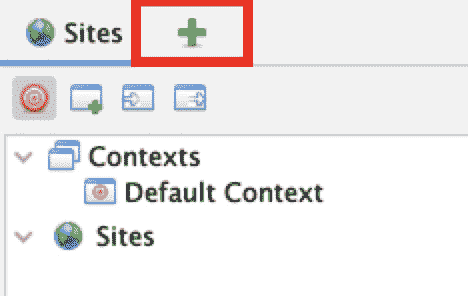
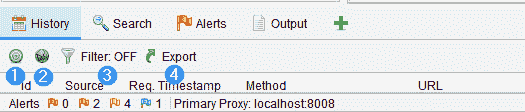
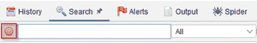
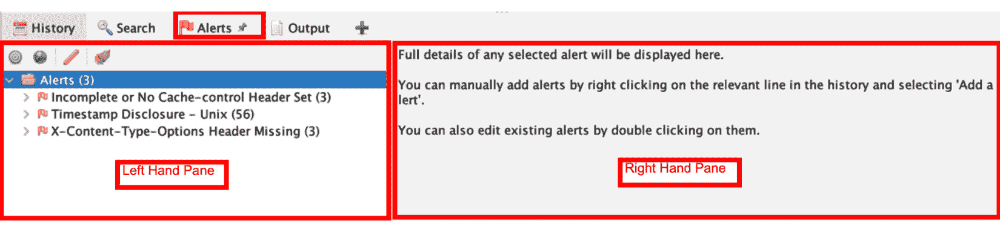

# 第二章：导航界面

本章将介绍 ZAP**图形用户界面**（**GUI**）的基础知识。这将帮助您更好地理解如何导航 GUI 以及在即将到来的章节中如何找到配置设置。我们将 GUI 分为四个主要部分，便于解释如何导航和使用 GUI。每个部分将描述 ZAP GUI 默认配置的一个部分。

在本章中，我们将介绍以下内容：

+   持久化会话

+   菜单栏

+   工具栏

+   树形窗口

+   工作区窗口

+   信息窗口

+   底部

+   编码/解码/哈希对话框

+   使用模糊测试工具

# 技术要求

本章内容需要您在计算机上安装`OWASP ZAP Proxy`。您还需要在您的机器上运行`OWASP Juice Shop`，并且在接下来的章节中需要能够访问 Juice Shop 来进行相关操作。

# 持久化会话

在本节中，我们将介绍如何设置 ZAP Proxy 会话持久化。当您在多天进行评估时，这非常有用，因为您可以关闭 ZAP 而不会丢失任何信息。

## 准备工作

为了能够继续本章的内容，您需要在计算机上安装 ZAP。

## 如何操作…

在从您选择的主机运行 ZAP 应用程序时，会弹出一个对话框询问您是否要持久化 ZAP 会话。在此对话框中，您将有多个选择，决定如何持久化 ZAP 会话，并将会话文件存储在本地数据库中，以便以后检索。

您可以选择三种持久化方式，并且可以勾选一个复选框来记住您的选择。以下是您的选项：

+   **是的，我想根据当前时间戳持久化此会话并命名**：此选项将使用默认的文件名和位置保存会话文件。

+   **是的，我想持久化这个会话，但我想指定名称和位置**：此选项允许您重命名文件并选择文件存储的位置。

+   **不，我此时不想持久化此会话**：当选择此选项时，文件不会被存储。

+   **记住我的选择，并且不要再询问我**：选中此复选框，并与前面三个选项之一一起使用，可以将其设置为默认选择。

让我们在下面的截图中看看它的视觉效果：

图 2.1 – 持久化会话

从这里，我们将继续描述顶部菜单栏，以及其中包含的其他菜单、选项和位于主菜单栏下方的顶级工具栏。

## 工作原理…

持久化会话将允许你保存工作并快速返回已捕获和正在进行的内容。基本上，这就是你如何保存工作的方式。有时，测试是临时的，不需要持久化。其他时候，持久化可能不是你最初想要做的选项，因为捕获一个 Web 应用程序也会开始捕获超出范围的内容，这些内容不会保存到站点树或上下文中。

# 菜单栏

菜单栏将帮助用户理解一般设置并导航工具以查看、配置和更改设置。

## 准备就绪

要继续此方案，你需要安装并运行 ZAP。

## 如何操作…

菜单栏位于 ZAP 应用程序的左上角。它包括**文件**、**编辑**、**视图**、**分析**、**报告**、**工具**、**导入**、**在线**和**帮助**菜单。我将简要解释每个菜单部分的用途，如 *图 2.2* 所示：

图 2.2 – 菜单栏设置

## 工作原理…

我们将查看以下列表中的每个菜单：

+   **文件**：此菜单用于管理 ZAP 会话。在此菜单中，你可以启动会话、继续会话等。

+   **编辑**：此菜单允许搜索请求和响应、查找文本、设置**强制用户模式**和管理 ZAP 的模式。

+   **视图**：此菜单提供显示选项和管理标签页的方法。

+   **分析**：此菜单包含打开**扫描策略管理器**的选项，你可以在其中添加、修改、导入、导出或删除扫描策略。

+   **报告**：此菜单提供生成报告、导出消息和响应、导出 URL 以及将当前会话与先前保存或导入的会话进行比较的选项。

+   **工具**：此菜单包含 ZAP 的工具和选项。

+   **导入**：此菜单提供将不同类型的数据文件导入 ZAP 的选项。

+   **在线**：此菜单包含 ZAP 在线资源，包括**ZAP 市场**、**ZAP 常见问题**和**ZAP 视频**。

+   **帮助**：此菜单提供关于 ZAP 的资源，如**支持信息**、**检查更新**和`OWASP ZAP** `用户指南**。

## 还有更多…

还有许多其他功能，如快捷键，可以帮助你快速导航 OWASP ZAP。利用这些功能可以帮助你更高效地使用工具。

提示

在 Windows 系统上，使用 *Alt* 键将激活快捷方式到顶部菜单。触发后，菜单中的每个选项都会有下划线的大写字母，表示需要与 *Alt* 键一起使用的键。例如，要打开**文件**，使用 *Alt* + *F*。要打开**帮助**，使用 *Alt* + *H*，依此类推。然后你可以使用箭头键进行导航，按空格键或 *Enter* 键选择其他子选项。在 macOS 系统上，使用 *Command* 键将实现相同功能。

# 工具栏

在本方案中，我们将介绍 ZAP 代理工具栏及其每个部分的功能。

## 准备工作

要回顾本教程，您需要在计算机上安装 ZAP，并确保它已启动并运行。

## 如何操作…

从左到右查看工具栏，您将看到模式下拉菜单，如*图 2**.3*所示，它允许您更改 ZAP 中的模式：

+   **安全模式**将防止您对目标执行任何危险操作。

+   在**保护模式**下，您将能够对应用程序范围执行危险操作。

+   **标准模式**是您可以随意操作的模式，没有工具的任何限制。

+   我们最后的模式是**攻击模式**。在此模式下，您将开始扫描任何新增到范围内的目标的漏洞。

图 2.3 – 顶级工具栏中的模式选项

*图 2**.3*中的下一组四个图标是允许您保存、修改和编辑目标会话信息的选项。

*图 2**.3*中的最后一个图标，即齿轮图标，允许您更改 ZAP 代理所有部分的设置。您也可以通过点击**工具**然后选择**选项**来访问此设置。我们将在接下来的章节中详细讨论，当我们开始更改和优化每个部分并执行攻击时。

在*图 2**.4*中，您找到的下一组图标，从顶级工具栏从左到右，允许您将 ZAP 代理的主题更改为八种不同的内置模板：

图 2.4 – 顶级工具栏的中间部分

默认设置是**扁平光亮模式**，但您可以切换到暗模式（**扁平暗模式**），或使用下拉列表中的任何其他视觉设置，如*图 2**.5*所示。请记住，任何更改 ZAP 代理外观的设置都可能改变工具中其他设置的位置。在本书中，我们将始终使用默认设置：

图 2.5 – 选择主题

当我们继续时，工具栏中的下一组图标允许您查看所有标签（标签和灯泡图标），隐藏未固定的标签（带有红色 X 图标的标签），以及显示标签图标并隐藏标签名称（带有绿色方块和字母 T 的标签）。

向右移动，最后七个图标允许您更改 ZAP 代理窗口的布局，并允许您展开**站点树**窗口、**信息**窗口或**工作区**窗口。对于本书，我们将使用默认配置，展开底部半部分的**信息**窗口，并保持**工作区**窗口：

图 2.6 – 窗口布局

在顶级工具栏的最后一部分（*图 2**.7*）中，您将看到以下内容：

+   设置（从左到右）允许您管理附加插件（红色/蓝色/绿色方块）

+   检查插件更新（带蓝色箭头的闪电符号）

+   显示/启用字段（灯泡）

+   设置和自定义断点（绿/红圆圈，线/箭头，右箭头，停车标志和红色 X）

+   扫描策略管理器（控制面板）

+   应用强制用户模式（挂锁）

+   启用 zest 脚本（磁带）

+   打开用户指南（蓝色问号）

+   禁用/启用 HUD（绿色雷达）

+   使用预配置的浏览器代理站点（Firefox 图标）

+   报告生成（螺旋笔记本）

这些将在后面的章节中进一步详细讨论。

图 2.7 – 顶级工具栏的最后一部分

## 工作原理…

工具栏展示了在 OWASP ZAP 中最常用的工具，旨在帮助用户设置和适应，满足不同用户在使用工具进行测试时的偏好。在这里花时间了解和理解可用的选项。

## 另见

打开**帮助**菜单并导航到 OWASP ZAP 用户指南以获取更多信息。

### 快捷键

使用*F1*快速打开信息指南。

# 树窗口

在本方案中，我们将讨论 ZAP 代理树窗口及其每个部分的作用。

## 准备工作

为了能够操作此方案，你需要在计算机上安装 ZAP，并确保它已启动并在运行。

## 如何操作…

在站点树窗口中，ZAP 会显示你已经访问并且可以测试的站点。ZAP 只能攻击显示的站点。站点树窗口包含两个选项卡：**站点**选项卡和**脚本**选项卡（当选择`+`符号后显示）：

图 2.8 – 站点树

### 站点选项卡

**站点**选项卡是显示正在测试的站点的地方。它包含两个树：**上下文**树和**站点**树。

站点树是显示测试站点的地方。ZAP 只能攻击站点树中显示的站点。每个站点会根据 HTTP 请求方法和所使用的参数名称显示一个唯一的节点。

在**上下文**树中，你可以将 URL 分组。最佳实践是为每个正在测试的应用程序创建一个上下文：

图 2.9 – 站点树

还有四个可以使用的选项：

+   **红色目标**：仅显示在范围内的站点

+   **有绿色加号的窗口**：创建一个新上下文

+   **左侧有白色箭头的窗口**：导入上下文

+   **右侧有白色箭头的窗口**：导出上下文

### 脚本选项卡

一旦你点击`+`图标（*图 2.10*），一个新菜单会弹出，允许你选择**脚本**选项卡。

图 2.10 – 加号图标

**脚本**标签会打开一个树状菜单，包含两个可选标签。第一个标签是**脚本**标签，展示你在 ZAP 中已有的脚本，按脚本类型组织。第二个标签是**模板**标签树，包含可用于创建脚本的模板。

图 2.11 – 脚本标签

除了**脚本**和**模板**标签外，**脚本**树状标签中还有三个选项：

+   **文件夹**: 用于从本地文件存储加载脚本

+   **软盘**: 用于将脚本保存到本地文件存储

+   **滚动并添加**: 用于创建新脚本

ZAP 的另一个显著特征是*工作区窗口*。在下一个食谱中，我们将更深入地探讨这些选项。

## 它是如何工作的…

树状窗口的整体目的是帮助测试人员了解已捕获的 Web 应用程序，哪些在范围内，哪些在范围外，以及快速查看在枚举阶段或模糊目录过程中发现的各种路径。这里重要的是要开始将你的站点设置为上下文，以便后续工作中测试更具针对性，同时减少一些由网站连接到其他资源时产生的噪音。

# 工作区窗口

在本食谱中，我们将详细讲解 ZAP 代理的工作区窗口及其各部分的功能。

## 准备开始

为了能够查看本食谱，你需要在计算机上安装 ZAP，并确保它已启动并运行。

## 如何操作…

在 ZAP 代理的工作区部分，你可以查看请求和响应，并开始扫描。以下各点的数字与*图 2.12*中的标签对应：

+   **快速开始` (*1*): `快速开始**显示一个窗口，允许你选择是否启动自动扫描或使用手动探索

+   **请求**和**响应**标签 (*2* 和 *3*): **请求**和**响应**标签允许你查看来自站点各部分的请求和响应

+   **中断` (*4*): `中断**标签允许你更改请求和响应，在 ZAP 中设置断点时停止

+   **脚本控制台` (*5*): `脚本控制台**标签打开一个窗口，允许你修改新创建的脚本

+   **自动扫描` (*6*): `自动扫描**选项允许你对目标启动自动扫描

+   **手动探索` (*7*): `手动探索**选项允许你启动一个浏览器窗口，并设置所有必要的配置，通过 ZAP 代理目标

+   **了解更多` (*8*): `了解更多**选项提供有关 ZAP 的详细信息，并提供需要互联网连接才能获得更多详细信息的链接

图 2.12 – 工作区窗口

## 它是如何工作的…

这个窗口启动了整个项目，并且是 OWASP ZAP 中用于测试的主要功能。与其他机器中间代理工具不同，评估是通过这个窗口捕获的，无论是自动化还是手动进行。内容从这里填充到信息窗口中。在接下来的章节中，我们将讨论这个窗口包含哪些信息，其他标签或插件，以及如何配置这些内容。

# 信息窗口

在本教程中，我们将介绍 ZAP 代理信息窗口以及信息窗口中每个部分的功能。

## 准备工作

为了能够查看这个教程，你需要在你的计算机上安装 ZAP，并且确保它已经启动并在运行。

## 如何操作…

信息窗口包含被测试应用程序的数据。它由**历史**、**搜索**、**警报**和**输出**标签组成，其他 ZAP 工具可以通过使用`+`图标作为标签添加。以下是信息窗口的截图：

图 2.13 – 信息窗口

### 历史标签

在这个标签中，ZAP 显示了所有已发送的请求，从第一个请求开始。此标签包含四个可选项，如*图 2.13*所示：

+   **靶心** (*1*): 选择靶心图标时，只会显示作用范围内的 URL。

+   **地球图标** (*2*): 地球图标用于选择站点。它仅显示树窗口中包含的站点的 URL。你只能选择作用范围（Scope）或站点（Sites）中的一个。

+   **漏斗图标** (*3*): 这个图标允许你基于 HTTP 动词方法、HTTP 动词代码、标签、警报和/或 URL 正则表达式来筛选请求。

+   **绿色箭头导出** (*4*): 这个图标允许你将历史记录以 CSV 格式保存到你选择的主机目录中。

### 搜索标签

在这个标签中，ZAP 提供了一个搜索机制，你可以在所有数据中或仅在 URL、请求、响应、头信息或 HTTP 模糊测试结果中搜索正则表达式。**搜索**标签有八个选项。*图 2.14*展示了**搜索**标签：

图 2.14 – 信息窗口搜索标签

在下图中高亮的图标用于仅在作用范围内的 URL 中进行搜索（**上下文** – 参见*图 2.10*）。为了使用此功能，必须先将**站点**中的 URL 添加到**上下文**中。选中后，靶心图标将变为红色，而不是灰色：

图 2.15 – 上下文按钮

向右滚动，下一个高亮显示为红色的字段是搜索框输入字段。它用于通过正则表达式搜索内容：

图 2.16 – 搜索输入框

搜索参数基于特定的字段，选择项以下拉菜单形式显示。在这个下拉菜单中，你可以选择是否使用正则表达式搜索所有数据，或仅搜索 URLs、请求、响应、头信息或 HTTP 模糊测试结果：

图 2.17 – 搜索下拉菜单

接下来是**反向**复选框。勾选后，如*图 2.18*所示，ZAP 将搜索不包含你搜索的正则表达式的任何内容：

图 2.18 – 反向复选框

输入正则表达式后，你需要点击带有放大镜的**搜索**按钮。点击后，正则表达式的搜索开始。作为替代，你也可以根据键盘的不同按下*回车*或*Enter*键来启动搜索：

图 2.19 – 搜索按钮

一旦搜索完成，你可以使用**下一步**或**上一步**按钮将选择项移动到搜索结果中的下一个或上一个项目：

图 2.20 – 下一步和上一步按钮

在**搜索**标签页中还有一个字段，显示搜索结果的信息。这个字段会显示匹配的数量，正如名称所示，显示多少个结果匹配了搜索的正则表达式：

图 2.21 – 匹配数量指示器

最后，有一个**导出**按钮。点击时，用户可以将搜索结果导出并保存为 CSV 文件到本地文件存储：

图 2.22 – 导出按钮

### 警报标签页

**警报**标签页分为两个窗格，如*图 2.23*所示。左侧窗格包含 ZAP 找到的警报，一旦选择了某个警报，右侧窗格将显示该警报的信息，如*图 2.23*所示。左窗格显示在爬虫、主动扫描或被动扫描过程中找到的所有警报或问题，并以树形视图格式显示。警报还按严重程度排序，从高到低，直到信息级别。**警报**标签页还提供四个可选择的选项。

图 2.23 – 警报标签页

以下是与*图 2.23*对应的这些选项的解释：

+   **上下文** (*1*): 用于仅显示作用域内的 URLs 的警报。

+   **地球** (*2*): 仅选择包含在**站点**树视图中的站点的警报。

+   **铅笔** (*3*): 允许用户编辑警报的属性。

+   **扫帚**（带颜色）(*4*)：删除所有警报按钮。点击时，会显示警告要求用户确认是否确认此操作，或者取消此操作。点击 **确定** 以删除所有警报，点击 **取消** 以返回。

### 加号（+）符号

加号图标可用于向信息窗口添加额外的标签页。标签页为 ZAP 工具。可以添加的标签页有 `AJAX** `爬虫**、**主动` `扫描**、**自动化**、**断点**、**强制` `浏览**、**模糊测试**、`HTTP** `会话**、`OAST`、**输出**、**参数**、**进度**、**爬虫**、`WebSockets` 和 `Zest** `结果**。*图 2.24* 显示了所有这些选项，接下来是每个选项的描述：

图 2.24 – 插件符号的选项

以下是这些选项的解释：

+   **AJAX 爬虫**：此工具用于高效且有效地爬取基于 Ajax 的 Web 应用程序。它为 ZAP 创建一个与 Crawljax（一个开源事件驱动的动态爬虫工具）通信的代理。推荐在测试基于 Ajax 的 Web 应用程序时同时使用本地爬虫工具和 AJAX 爬虫。

+   **主动扫描**：此选项允许启动新的扫描并查看现有扫描的进度。此外，它还展示了各种扫描的数据。

+   **自动化**：此选项允许你创建自动化测试的脚本。

+   **断点**：此选项管理当前会话中设置的所有断点。

+   **强制浏览**：在此标签页中，ZAP 允许你使用强制浏览来查找目录和文件。

+   **模糊测试**：在模糊测试中，有启动新模糊测试和查看已启动模糊测试信息的选项。

+   **HTTP 会话**：在此标签页中，ZAP 显示所选站点的 HTTP 会话。

+   `OAST`：在此标签页中，ZAP 显示发现的带外消息。

+   **输出**：在此标签页中，ZAP 会显示在应用程序中发现的错误信息。这些错误可以用来向 ZAP 团队报告漏洞。

+   **参数**：在此标签页中，ZAP 显示站点的参数和响应头字段。

+   **进度**：在此标签页中，ZAP 显示每个主机的扫描规则的完成或进行状态以及每个扫描规则的详细信息。

+   **爬虫**：爬虫工具是 ZAP 的本地爬虫。在此标签页中，ZAP 显示在扫描过程中由爬虫工具发现的独特 URI。该标签页包含三个子标签：第一个子标签显示已发现的 URI，第二个子标签显示添加的节点，第三个子标签显示任何爬虫消息。

+   `WebSockets`：该标签显示来自 WebSockets 连接的所有消息。

+   **Zest 结果**：此标签将显示 Zest 扫描的结果。

## 它是如何工作的…

信息窗口是从初始爬虫、主动或被动扫描、模糊测试或任何其他插件中获得结果的核心部分。此部分是你开始关注并形成更具体的手动攻击以及测试范围内 Web 应用程序的地方。

## 还有更多…

这里有很多有用的信息，能够帮助测试人员通过提供对*OWASP Top 10*或其他厂商文档的参考，创建好的渗透测试报告。这些信息可以在**警报**标签中找到，并且在选择特定漏洞时会发生变化。

# 底部

在这个食谱中，我们将讨论 ZAP 代理的底部区域以及每个部分的作用。

## 准备工作

要进行此食谱，你需要在计算机上安装 ZAP，并且需要启动并运行它。

## 如何操作…

在 ZAP 代理的底部，你有三个部分：**警报**、代理状态和扫描状态。**警报**部分，如*图 2.25*所示，给你一个快速查看 ZAP 可能在被测试应用中找到的任何问题。

图 2.25 – 警报

接下来，我们有代理状态，显示 ZAP 代理运行的 IP 地址和端口：

图 2.26 – 代理信息

最后，我们有一个当前扫描状态部分，显示当前正在运行的扫描以及 ZAP 代理在扫描过程中的任何时刻所做的工作。

图 2.27 – 当前扫描活动计数

## 它是如何工作的…

底部区域帮助跟踪扫描和警报数据的快速度量，并且是确保你建立的连接没有变化的快速方式。在构建高管报告时，考虑突出显示这些数据，如果需要一些统计数据用于每月**关键` `绩效指标**（**KPI**）报告，或者甚至帮助跟踪漏洞管理的数据。

在接下来的几个食谱中，我们将讨论**编码/解码/哈希**对话框和**模糊器**。我们决定讨论这些内容，因为另一个著名的代理工具的用户习惯使用这些标签，而 ZAP 则以不同的方式包含了这些功能。为了让你能够进行攻击，我们将深入讨论这些功能。

# 编码/解码/哈希对话框

在这个食谱中，我们将讨论如何在 ZAP 代理中执行编码、解码和哈希操作。

## 准备工作

要进行此食谱，你需要在计算机上安装 ZAP，并且需要启动并运行它。

## 如何操作…

编码是将数据从一种形式转换为另一种形式的过程，而解码则是反向转换。ZAP 内置了一个功能，帮助用户快速转换和引导数据。除了这个过程外，在同一设置中，还有一个功能可以创建该数据的简单哈希值。要开始，请从菜单栏上方选择工具，然后在菜单中选择**编码/解码/哈希**。

提示

对于快捷键，在 Windows 系统中，按 *Ctrl* + *E*。在 macOS 系统中，按 *Command* + *E*。

当编辑器打开时，首先要注意的是输入字段，您可以在此输入要编码、解码或哈希的文本，确定非法 UTF-8 字节，或转换为 Unicode。一旦输入所需的文本，所有字段会自动为您转换。

接下来，工具栏提供了几种选项。它们如下：

+   **添加新标签**：添加一个新的标签页

+   **删除选中的标签**：移除当前选中的标签页

+   **添加输出面板**：在当前标签页中添加一个输出面板

+   **重置**：将所有标签页恢复到默认状态

图 2.28 – 编码/解码/哈希对话框

如**脚本**下拉菜单中所示（见图*2.29*），用户可以添加新的字段来比较数据。

图 2.29 – 输出面板

在您编码或哈希过的脚本之后，我们将继续进行模糊测试，并讨论如何配置不同的选项，以优化您的 Web 应用程序渗透测试方法。

## 工作原理……

使用此工具可以快速改变模糊测试应用程序中的操作方式，尤其是使用攻击向量如跨站脚本攻击、SQL 注入等。快速获得不同值的列表有助于绕过在 Web 应用程序中实现不良的验证或编码。

## 另见

对于具有强大操作功能的编码、解码和哈希字符串工具，请查看`CyberChef`：[`gchq.github.io/CyberChef/`](https://gchq.github.io/CyberChef/)。

# 使用 Fuzzer 进行模糊测试

在本教程中，我们将介绍如何在 ZAP 代理中使用 Fuzzer，并讲解攻击者如何使用 ZAP 等工具通过暴力破解密码或尝试使用字典词汇通过试错法登录应用程序。

## 准备工作

要能够完成本教程，您需要在计算机上安装 ZAP 并确保其已启动运行。同时，您还需要运行 Juice Shop，如*第一章*所示。

## 如何操作……

对于不了解的人，*模糊测试*是指一种技术/自动化过程，向目标提交大量无效或意外的数据点，以分析结果中潜在的可利用漏洞。其基本思想是使用内置的有效负载集、任何可选的附加功能或自定义脚本，对任何输入进行*模糊测试*。在 ZAP 中，可以通过以下几种方式实现：

+   在信息窗口中，点击其他插件（**警报**、**爬虫**等）后的绿色`+`按钮

+   在一个标签页（**站点**、**历史记录**等）中右键点击请求，选择**攻击/` `模糊测试…**

+   在请求标签的头部或正文中高亮显示一个字符串，右键点击，然后选择**模糊测试…**

+   在菜单栏中选择**工具 / 模糊测试…**，然后选择要进行模糊测试的请求

提示

快捷键是*Ctrl* + *Alt* + *F*。

要开始，进入 Fuzzer 插件的信息窗口后，点击**新建 Fuzzer**，这将显示当前捕获到的站点（参见*图 2.30*）以及来自 Spider 扫描的请求：

图 2.30 – Fuzzer 选择消息窗口

一旦选择了请求，新的对话框窗口会打开。在这个窗口中，你可以通过几个选项卡来配置模糊操作。我们将在接下来的部分中逐一介绍每个选项。

### 模糊位置标签

这是主选项卡，你可以在这里高亮选中的字符串开始进行模糊测试。要了解你正在查看的窗口，需要注意对话框的左上角显示了标题文本，而左下角显示了正文文本。屏幕的右侧显示了从标题中添加到选定字符串的模糊位置。该位置会与有效载荷和处理器的数量一起标出。此外，在标题上方有几个下拉菜单，可以用来选择标题和正文文本，以及更改如何查看左侧对话框，并且还有一个**编辑**功能。**编辑**允许你修改标题中的文本。

重要提示

编辑标题字符串会自动移除你添加的所有模糊器。

要开始操作，先高亮选中特定字符串区域，然后点击右侧的**添加…**。这将打开一个新的**有效载荷**对话框，你需要再次选择**添加…**，以便打开另一个对话框来选择类型。**类型**字段包括**空/空值**、**文件**（你可以从主机系统目录中添加文件）、**文件模糊器**（包含各种有效载荷，例如缓冲区溢出填充、XSS 漏洞、目录列表等）、`Json`（用于 JSON 输入）、**数字**（从 0 到 10，增量为 2）、**正则表达式**（包含多个有效载荷）、**脚本**和**字符串**等选项：

图 2.31 – 有效载荷 | 添加有效载荷

**有效载荷**中的另一个功能是**处理器**，如*图 2.32*所示。这允许你将当前的有效载荷更改并处理为不同的类型，比如将其转换为*Base64 编码格式*。你可以添加多种类型，然后选择**添加…**和**确定**。这是在启动 Fuzzer 之前对模糊有效载荷进行编码、解码和哈希处理的一种方式。

此外，处理器可以应用于特定的模糊有效载荷（红色标出的部分）或选中的整个字符串（蓝色标出的部分），如*图 2.32*所示。界面上还会显示一个计数器，显示已应用的处理器数量：

图 2.32 – 处理器

一旦选择了处理器类型，点击对话框底部的**添加**，然后点击**确定**。这将把有效负载添加到`Fuzz Locations`，如*图 2.32*所示。完成所有输入后，选择右下角的**开始模糊测试**。模糊测试完成后，信息窗口将显示结果：

图 2.33 – 添加处理器

从左到右，在*图 2.34*中，信息窗口中显示的结果将展示任务编号、消息类型、HTTP 状态（**代码**）、原因（如**禁止访问**或**错误请求**）、**往返时间**（**RTT**）、响应头/响应体的大小、最高警报、状态和使用的有效负载。此外，结果可以导出到 CSV 电子表格。最后需要注意的是**进度**下拉菜单。此菜单跟踪每个模糊字符串，并允许您在结果之间切换。

图 2.34 – 模糊测试信息窗口

### 选项卡

当启动新的模糊测试器时，您将看到**选项**选项卡（*图 2.35*）。此选项卡让您为模糊测试器配置更多选项：

图 2.35 – 模糊测试选项

这些选项如下：

+   **输入/输出错误重试次数**：确定当发生输入/输出错误时，模糊测试器将进行多少次重试。

+   **最大错误数**：当错误数达到此数值时，模糊测试器将停止。

+   **有效负载替换策略**：控制多个有效负载列表的重复顺序。以下是两个选项：

    +   **深度优先**

    +   **广度优先**

+   **每次扫描的并发扫描线程数**：扫描同时执行的线程数。增加此数字将加速扫描，但可能会对运行 ZAP 的计算机或目标造成压力。

+   **模糊测试时延迟（以毫秒为单位）**：在请求目标之间创建延迟，有助于避免被封锁，或如果目标限制过多请求时使用。

+   **跟随重定向**：通过跟随下一个请求继续进行模糊测试。

### 消息处理器选项卡

最后一个选项卡，如*图 2.36*所示，是 HTTP**消息处理器**选项卡，它可以访问并更改正在进行模糊测试的消息，控制处理过程，并与 ZAP GUI 进行交互：

图 2.36 – 模糊测试消息处理器

以下是需要了解的消息处理器类型。请记住，某些类型的处理器可能无法使用或不可用，这取决于看到的响应类型或是否已经构建了脚本：

+   **反 CSRF 令牌刷新**：允许在请求中刷新反 CSRF 令牌，但必须由 ZAP 检测到才能在此处理器中使用。如果检测到反 CSRF 令牌，则会自动添加。

+   **模糊 HTTP 处理器（脚本）**：如果已向 ZAP 添加脚本，允许你选择启用的脚本。

+   **有效载荷反射检测器**：此功能将告诉你是否发现了有效载荷，并使用符号（黄色太阳图标）和词语**反射**来表示这一点。此过程会自动添加。

+   **请求内容长度更新器**：更新或添加内容长度请求头，包含正文的长度。此过程会自动添加。

+   **标签创建器**：根据响应中的内容向结果的状态列添加自定义标签。

+   **用户消息处理器**：对用户进行模糊处理。用户必须存在才能选择并添加此处理器。

恭喜！你现在已经全面掌握了 ZAP 的所有功能、布局、标签、树形结构和选项。

## 工作原理…

处理器是增加模糊处理定制化的方式，可以增加深度和混淆性，或者帮助绕过那些恼人的**Web 应用防火墙**（**WAFs**），以进行针对目标的评估。

## 还有更多…

使用 Kali 或 Parrot 等操作系统时，通常会自带字典列表，另外可以使用 CeWL 等工具生成字典列表，它可以从目标 Web 应用中抓取单词，或者使用 John the Ripper，它提供了自定义字典列表的选项。

## 另见

查看 GitHub 页面，获取已构建的字典列表，以便在进行模糊处理时快速将其添加到 ZAP 中。
