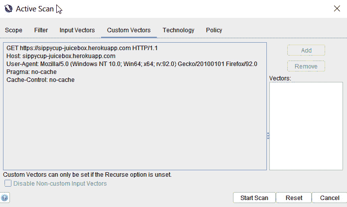
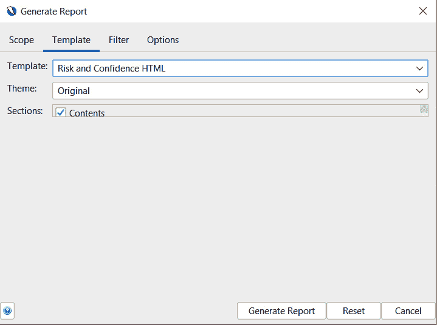

# 第三章：配置、爬行、扫描和报告

我们现在已经进入了*第三章*。在这一章中，我们将深入探讨黑客技术，但在此之前，我们首先需要了解如何设置浏览器和`Zed Attack Proxy`（**ZAP**），以便成功且无错误地捕获流量，并了解作为用户可以选择的不同选项。我们将介绍**爬行**（或*蜘蛛爬行*）的基础知识，使用该应用程序来映射**网站树**并为扫描（*审计*）做准备。最后，我们将讲解报告生成以及如何生成符合你评估要求的报告，并解读这些数据以获得更好的结果。

在本章中，我们将介绍以下食谱：

+   在 ZAP 中设置范围

+   与蜘蛛一起爬行

+   使用 AJAX Spider 进行爬行

+   被动扫描 Web 应用

+   主动扫描 Web 应用

+   生成报告

# 技术要求

对于本章，你需要在机器上安装 OWASP ZAP Proxy 和 OWASP Juice Shop，并希望能够使用 ZAP 拦截浏览器与 OWASP Juice Shop 之间的流量。

# 在 ZAP 中设置范围

在开始应用程序安全评估之前，设置**项目**的范围至关重要。范围定义了评估的目标和边界，例如在*设置 ZAP 范围*部分仅针对`192.168.254.61`中的页面，如*图 3.1*所示。设置范围可以防止范围外的（*未经授权的*）测试。

图 3.1 – 网站 | 会话属性以添加范围

## 准备工作

为了准备此食谱，请启动 ZAP 和 OWASP Juice Shop。确保 ZAP 在 OWASP Juice Shop 应用程序的首页拦截流量。

## 如何操作…

1.  首先，你需要启动`OWASP Juice Shop`。在浏览器窗口中，当 ZAP 正在拦截流量时，使用你的 IP 地址在浏览器中输入`3000`，并访问`OWASP Juice Shop`应用程序，如*图 3.2*所示。

图 3.2 – 使用用户的 IP 地址访问 Juice Shop

1.  打开 ZAP，在*树形*窗口中，点击**新建上下文…**按钮。

1.  在**上下文名称**字段中，选择一个名称。在这个例子中，我为一个新的上下文命名为`OWASP Juice Shop`，如*图 3.3*所示。

1.  在选择名称后，在**顶部节点**字段中，点击**选择…**并选择**https://IP 地址:3000**节点。在这个例子中，我的 IP 地址是`localhost`。

1.  接下来，如果你愿意，可以在**描述**字段中输入一些内容，确保选中**在范围内**旁边的复选框，然后点击**保存**以保存新的上下文。

图 3.3 – 设置范围

在你完成该项目的作用域设置后，我们将讨论为认证的*爬虫*和*扫描*设置用户选项，然后再介绍如何使用`Spider`和`Audit`对应用程序进行操作。

## 工作原理…

通过设置项目的作用域，你将能够选择仅在作用域内的项目进行测试。这样可以确保你只检查那些已经授权测试的应用程序。

# 使用 Spider 进行爬取

Spidering 基于*设置项目选项*部分，我们将使用它来爬取 OWASP Juice Shop 代理。使用 Spider 进行爬取可以帮助我们识别*在作用域内*的应用程序目录。这对于识别用户从公开互联网可见的、易于访问的内容非常有用。ZAP 能够为用户提供更好的结果，使你对 Web 应用程序有更深入的了解，从而进行更全面的、被动和主动扫描。

## 准备工作

开始之前，请确保 ZAP 已启动且 OWASP Juice Shop 正在运行。

## 如何操作…

在你已经选择了需要添加到作用域的应用程序后，我们需要选择 URL。右键点击并选择`Spider`。如*图 3.4*所示，右键点击`Sites`或`Contexts`部分中的 URL，会显示多个选项。

图 3.4 – 从作用域进行 Spidering

一旦你选择了作用域，点击`Spider`来选择**起始点**。点击**选择**图标，绿色高亮显示在*图 3.5*中，这会打开一个下拉菜单。

图 3.5 – Spider 作用域

如*图 3.6*所示，你将选择要在 Spider 中使用的作用域内应用程序。在本例中，我们正在爬取我们本地安装的应用程序，*OWASP* *Juice Shop*。

图 3.6 – 选择节点

点击目标应用程序的**选择**后，你将回到`Spider`对话框，如*图 3.7*所示，**起始点**字段将显示*IP 地址*或*域名*给 Spider。在我们的例子中，它列出了我们应用程序的 IP 地址，这与你的情况会有所不同。

图 3.7 – 起始点

接下来的功能是**用户**字段，允许你选择一个已配置的用户进行认证爬取以及会话管理。我们将在*第四章*中进一步讨论如何设置和一些用户配置选项，*认证与* *授权测试*。

此外，你会看到一个**递归**的复选框。选中后，它将确保当前选定的作用域站点下的所有节点也会用于启动 Spider。

最后，在`Spider`对话框中还有两个选项需要注意。第一个选项是**仅扫描 Spider 子树**，它允许你扫描应用程序目录及其内部的内容，选定的目录将作为*起始点*。此设置将忽略 URL 的子域名，只会使用子目录作为起始点。另一个选项是**显示高级选项**，如*图 3.8*所示。

图 3.8 – Spider 对话框复选框

勾选此选项后，该功能将作为第二个标签显示，您可以在*图 3.9*中看到。它包含更多关于 Spider 扫描器的选项。了解这些选项非常重要，尤其是在用户的应用程序对爬虫敏感的情况下。作为良好实践，如果应用程序没有快速处理请求，你将需要减少线程数，以防止应用程序崩溃。

图 3.9 – Spider 高级选项

## 工作原理…

Spider 的工作原理是发现并识别选定应用程序中的所有超链接和目录。Spider 将通过识别应用程序中的资源为你提供完整的应用视图。

在下一节中，我们将继续介绍另一个常用功能，称为`AJAX Spider`。这个集成的附加组件可以帮助用户抓取**异步 JavaScript 和 XML**（**AJAX**）丰富的 Web 应用程序。

# 使用 AJAX Spider 进行爬取

AJAX Web 应用程序可以使用 XML 来传输数据，但许多 Web 应用程序同样可以使用 JSON 文本或纯文本来传输数据。AJAX 是一种让 Web 应用程序通过与后端 Web 服务器交换数据来异步更新（Web 服务、API 端点和 JavaScript 获取方法）的方式。这使得 Web 页面可以更新页面的一部分而无需完全重新加载。AJAX Spider 为 ZAP 创建了一个与`Crawljax`的代理，Crawljax 是一个开源的、事件驱动的、动态的爬取工具。

## 准备就绪

你需要使用 ZAP 爬取 Juice Shop，因此在开始执行这个操作之前，确保先启动并运行这两个工具。

## 如何操作...

启动 AJAX 爬虫有三种方法。第一种方法是在**站点**树窗口中。要启动 AJAX 爬虫，右键点击要进行 AJAX 爬取的站点，悬停在**攻击**上，点击`Ajax Spider...`，如*图 3.10*所示。

图 3.10 – 通过站点树启动 AJAX Spider

启动 AJAX Spider 的第二种方式是通过**工具**标签，点击`AJAX Spider...`，如*图 3.11*所示。

图 3.11 – 从工具标签启动 AJAX Spider

第三种也是最后一种方法是通过**信息**窗口来启动 AJAX Spider。点击`+`图标，然后添加`AJAX Spider`选项卡。完成后，你可以点击左侧的**新扫描**，如*图 3.12*所示。

图 3.12 – 从信息窗口启动 AJAX Spider

现在我们已经了解了如何启动 AJAX Spider，接下来我们将讨论点击`AJAX Spider`选项卡后发生的事情。通过前两种方法，或者点击**新扫描**作为第三种方法，AJAX Spider 配置窗口将会弹出。配置窗口包含七个选项，如*图 3.13*所示：

+   **起始点**：点击**选择…**后，你可以选择要扫描的节点。

+   **上下文**：在此字段中，你可以选择你想要爬取的上下文。

+   **用户**：在这里你可以选择一个用户。

+   **仅在范围内**：顾名思义，选中此框时，只有在范围内的节点才会被 AJAX-*爬取*。

+   **仅爬取子树**：选中此框时，仅会访问**起始点** URI 下的资源。

+   **浏览器**：在此下拉菜单中，你可以选择所需的浏览器。

+   **显示高级选项**：顾名思义，选中此选项时，将会显示更多可用选项。

图 3.13 – AJAX Spider 范围选项卡

当对话框中的最后一个复选框**显示高级选项**被选中时，**选项**选项卡将显示。在**选项**选项卡中，您将看到七个额外的选项：

+   **浏览器窗口数量**：选择可以同时打开多少个浏览器窗口。

+   **最大爬取深度**：确定爬虫可以深入的层级。

+   **最大爬取状态数**：确定 Spider 可以爬取的最大状态数。

+   **最大持续时间**：此选项定义了爬虫运行的最大时间（以分钟为单位）。

+   **事件等待时间**：在此，你可以设置事件触发后要等待的时间。

+   **重新加载等待时间**：此项配置爬虫加载页面后的等待时间。

+   **允许的资源**：此最后设置将允许额外的资源。例如，第三方脚本。

所有这些选项可以在*图 3.14*中看到。

.

图 3.14 – AJAX Spider 选项卡

一旦选择了你想要的选项，你可以点击**开始扫描**来开始爬取。一旦扫描完成，结果可以在**信息**窗口中的`AJAX Spider`标签中查看。扫描后，结果将开始在**网站**窗口中填充。展开**网站**树形结构可以查看新路径和标记，旁边会显示警告的严重性。此外，由 AJAX Spider 发现的资源将旁边有一个红色蜘蛛图标，如*图 3.15*所示。

图 3.15 – AJAX Spider 爬取的结果

## 它是如何工作的……

就像常规的 Spider 一样，AJAX Spider 会发现并识别所选应用程序中的所有超链接和目录，但它在 AJAX 应用程序中更为有效。

这部分介绍了 AJAX Spider。一旦爬取应用程序完成，ZAP 会执行两种扫描，其中第一种是自动的，但也可以手动触发。在下一部分，我们将教你如何进行被动扫描。

## 还有更多……

AJAX 是一组类似于 DHTML 或 LAMP 的技术，结合了以下内容：

+   HTML 和 CSS 用于标记和样式化数据。

+   **文档对象模型**（**DOM**）用于与数据交互并在浏览器中动态显示它。

+   `XMLHttpRequest`（**XHR**）方法用于在浏览器和 web 服务器之间异步交换数据。这有助于避免页面重载。

+   **JavaScript 对象表示法**（**JSON**）和 XML 格式用于将数据发送到浏览器。其他常见格式包括预格式化的 HTML 和纯文本。

+   JavaScript 用于将所有这些列出的技术组合在一起。

*图 3.16* 显示了该模型如何与传统 Web 通信进行比较。

图 3.16 – AJAX 与传统 Web 应用通信模型

AJAX 引擎，如*图 3.16*中橙色高亮部分所示，是通过使用`XMLHttpRequest`对象手动发起所有请求的地方。否则，开发者会使用如 jQuery、Prototype 和 YUI 等 JavaScript 库，在客户端创建 AJAX 替代的功能。这些库旨在隐藏 JavaScript 开发的复杂性（即跨浏览器兼容性）。

对于服务器端，一些框架也能提供帮助（例如 DWR 或 RAJAX（适用于 Java）），但如果你暴露了一个仅返回部分更新页面所需信息的服务，这也不是必须的。

+   通过 AJAX 从客户端（浏览器）向 Web 服务器发送 HTTP 请求，处理服务器的响应而不重新加载整个页面。

+   然后，JavaScript 提交并接收来自服务器的数据响应（XML 和 JSON）。

+   JavaScript 动态更新 DOM 和用户视图。

## 另见

请访问 W3Schools 了解更多关于 AJAX 工作原理以及 XMLHTTPRequest 选项的信息：[`www.w3schools.com/js/js_ajax_http.asp`](https://www.w3schools.com/js/js_ajax_http.asp)。

# 被动扫描一个 Web 应用

**被动扫描**在 ZAP Proxy 的后台持续运行并记录发现的内容。它通过检查流入 ZAP Proxy 的流量来工作。这是一个被动的后台线程，不会影响应用程序的性能，因为它扫描的是已经存储在 ZAP 上的流量。

## 准备工作

对于这个步骤，你只需要启动并运行 ZAP 即可。

## 如何操作…

打开 **工具** | **选项**，然后在左侧向下滚动，直到看到 **被动扫描器**。在这里，你将看到配置选项复选框，首先询问是否仅扫描在范围内的消息，并且是否包含来自 *模糊测试器* 的流量。最后两个选项是用于编辑每个规则可触发的最大警报数量以及要扫描的应用程序的最大请求体大小（以字节为单位）。

图 3.17 – 被动扫描器选项

提示

使用快捷键时，按住 *Ctrl* + *Alt*，然后按字母 *O*（*Ctrl* + *Alt* + *O*）。

关于被动扫描，最后需要知道的一点是，发现的结果仍会显示在 ZAP Proxy 主界面上的 **信息** 窗口中的 **警报** 标签页。由于这是被动扫描，发现的内容将在你手动浏览应用程序时逐渐填充进来。这些发现的示例可以参见 *图 3.18*。

图 3.18 – 警报标签

## 它是如何工作的…

被动扫描通过非侵入性地捕获并分析流入 ZAP 的流量来工作。这些扫描在一个后台线程中运行，不会影响应用程序的性能。

## 还有更多内容…

有时，使用其他工具进行被动扫描并比较扫描结果可能会有所帮助。这有助于理解误报，并确保 ZAP 正如预期那样捕获信息。

## 另见

另一个流行的被动扫描工具是 Wfuzz。要安装它，请访问 [`github.com/xmendez/wfuzz`](https://github.com/xmendez/wfuzz)。

# 主动扫描一个 Web 应用

**主动扫描**顾名思义，ZAP 将尝试基于已知的漏洞定位、模糊测试并枚举一个应用程序，并利用这些漏洞。主动扫描明确是一种对 Web 应用程序的攻击。

重要提示

*不要扫描*你没有权限测试的 Web 应用。

重要提示

主动扫描无法识别 *业务逻辑漏洞*。你需要手动测试这些漏洞。

在 ZAP 中需要记住的一个功能是可以将脚本添加到所有通过的流量头部中，这将有助于识别 ZAP 流量和 **Web 应用防火墙**(**WAF**) 异常。该脚本是 `AddZAPHeader.js`，它会添加一个头部（即 **X-ZAP-Initiator: 3**）。如果你使用的是 Windows，默认的安装路径是：`C:\Program Files\OWASP\Zed** `攻击代理\scripts\templates\httpsender**。

请注意，新的 *HttpSender* 脚本最初将被禁用。右键点击 **脚本** 树中的脚本并选择 **启用**。

## 准备工作

对于这个任务，你需要确保 ZAP 和 OWASP Juice Shop 正在运行。

## 如何操作…

启动活动扫描有几种方法。第一种也是最简单的方法是在 **工作区** 窗口中，使用 **自动化扫描** 功能可以让你输入正在测试的 URL，然后你可以点击 **攻击**。这将首先启动蜘蛛扫描程序，然后使用默认策略和选项开始活动扫描。要使用特定选项启动活动扫描，可以在 **树状视图** 中右键点击 **站点** 中的一个 URL，选择 **攻击**，然后选择 **活动扫描**。

这将打开一个 **活动扫描** 对话框窗口，如果需要，你可以使用 **选择** 打开 *站点* 列表来重新定义扫描范围。在这里，你可以通过第一个下拉按钮定义其他已创建的策略，通过第二个下拉按钮定义上下文（仅当站点已添加到上下文中时才可用），定义用户（仅在为认证扫描定义了用户时可用），以及如在 **被动扫描** 对话框中看到的 **递归** 选项和 **显示高级选项**。勾选高级选项框后，会打开四个新选项卡，具体如下：

+   **输入向量**：覆盖在 **选项活动扫描输入向量** 页面中定义的默认输入向量。点击 **重置** 按钮将会将输入向量恢复为默认选项。

重要提示

使用所有选项时，扫描的时间将会增加。

这些选项包括以下内容：

+   **可注入目标**：

    +   **URL 查询字符串和` `数据驱动节点**

    +   **添加 URL` `查询参数**

    +   **POST 数据**

    +   **URL 路径**

    +   **HTTP 头部**

    +   **所有请求**

    +   **Cookie 数据**

+   **内建输入` `向量处理器**：

    +   **多部分表单数据**

    +   **XML 标签/属性**

    +   `JSON`

    +   `Google** `Web 工具包**

    +   **OData ID/筛选器**

+   **启用脚本输入向量**：这些是编写或导入的脚本，用于允许用户定位默认不支持的元素。它们还配置了在 **添加警报** 对话框中被活动扫描器忽略的参数。

下图显示了我们刚刚讨论过的 **输入向量** 项目：

图 3.19 – 活动扫描 | 输入向量

+   **自定义向量**：此功能允许用户指定请求中的位置进行攻击。只有在未选择**递归**选项时才可用，因此你需要突出显示要攻击的字符并点击**添加**按钮。可以添加多个自定义输入向量，若要删除它们，只需突出显示任何已选择的字符并点击**删除**按钮。勾选**禁用非自定义输入向量**框将禁用所有输入向量，除非它们是手动定义的。

以下截图显示了**自定义` `向量**窗口：

图 3.20 – 活动扫描 | 自定义向量

+   **技术**：此项指定要主动扫描的技术类型。如果你确定目标应用程序中不存在某种技术，可以通过取消选中旁边的复选框来忽略该技术，如*图 3.21*所示。这样可以加快扫描速度，扫描规则将跳过这些测试。

图 3.21 – 活动扫描 | 技术

+   **策略**：此选项允许你覆盖所选扫描策略中指定的任何设置。在这种情况下，我们使用的是**默认策略**，如下截图所示：

图 3.22 – 活动扫描 | 策略

+   我们还将查看**过滤器**选项卡。此选项卡允许用户根据以下四个过滤标准指定要在活动扫描中筛选的条件：

    +   **HTTP 方法**：修改此项将更改是否允许和检查 HTTP 方法的设置

    +   **状态码**：修改此项将更改是否允许和检查状态码的设置

    +   **包含/排除标签**：与请求相关联的简短文本

    +   **URL 包含/排除正则表达式**：用于包含或排除的正则表达式模式

一旦所有扫描完成，你将需要生成报告，以便轻松查看结果。

## 它是如何工作的…

活动扫描通过对应用程序进行扫描，检查已知的公共漏洞并尝试利用它们。它还会枚举应用程序，查找可用的资源和目录。

一旦所有扫描完成，你将需要生成报告，以便轻松查看结果。

## 还有更多…

简单来说，使用其他工具进行主动扫描可以帮助实现更好的结果，并通过比较不同的扫描器来消除误报。不同的工具会以不同的方式解析应用程序。

## 另见

以下是其他可供下载和安装的开源扫描工具列表：

+   Arachni 扫描器：[`www.arachni-scanner.com/`](https://www.arachni-scanner.com/)

+   Wapiti 扫描器：[`wapiti-scanner.github.io/`](https://wapiti-scanner.github.io/)

# 生成报告

与所有**动态分析安全测试**（**DAST**）扫描器一样，ZAP 提供了生成报告的功能，使用户能够查看发现的问题并获取证据（即请求和响应），以及问题描述和修复建议。报告中的所有数据对于与高层领导沟通时确定指标非常有用，同时对开发人员在更新或解决代码时了解问题也很有帮助。

## 准备开始

为了继续此步骤，你需要确保已启动 ZAP 并且已经扫描了一个应用程序。

## 如何操作...

要开始使用报告，在*顶级菜单*栏中，选择**报告**的下拉菜单以打开选项面板。*图 3.23*显示了可用的各种选项。其他附加插件可以在市场中选择，它们为报告提供附加功能。我们不会讨论这些附加插件，但值得注意的是它们是可用的。

图 3.23 – 报告菜单

以下功能可以根据**报告**下拉菜单中的名称直观识别：

+   **将消息导出到文件...**：在此处保存请求和响应到文本文件。首先，通过在**历史记录**选项卡中选择一个或多个消息来选择要保存的消息，选项卡位于**信息**窗口中。按住*Shift*键可以选择多个消息。

+   **将响应导出到文件...**：使用此选项将特定响应保存到文本文件。同样，在位于**信息**窗口中的**历史记录**选项卡中，选择要保存的相关消息。

重要提示

二进制响应（即图像）可以与测试响应一起保存。

+   **将所有 URL 导出到文件...**：使用此选项将访问的所有 URL 保存到文本或 HTML 文件中。此选项可用于比较你遇到的 URL、比较具有不同角色的用户（即管理员与审计员）或比较在同一系统上不同用户权限。

+   **将选定的 URL 导出到文件...**：使用此选项将特定或多个 URL 和子域从**站点**树导出到文本文件。

+   **导出上下文的 URL**：在**站点**树中，将导出选定*上下文*中的每个 URL。你也可以右键点击**上下文**节点进行导出。只需注意，**站点**树中的 URL 必须先添加到上下文中，才能使用此选项。

+   **与另一个会话比较…**：此选项要求你保存一个先前的 ZAP 会话，然后会打开一个菜单，供你选择从本地目录中保存的输出文件。它会加载到当前的 ZAP 会话中进行比较。该文件将包含一个表格，其中列出了两个会话的 URL 及其 HTTP 状态。在 `.html` 报告中（如*图 3.24*所示），你可以选择查看所有会话的数据 – 仅第一个会话、仅第二个会话，或两者的比较。**两者**选项只显示两个会话中都包含的 URL，而**任何**选项则显示所有 URL。然而，HTTP 状态会区分每个会话中响应的 URL。

图 3.24 – 一个 .html 比较报告

本报告适用于比较两次不同用户访问同一应用程序的会话。它允许你查看哪些用户可以访问哪些 URL，并能够理解用户登录并成功访问的 URL 或路径。

+   **生成报告 …**：这是最后一个选项，它会打开一个对话框窗口，提供自定义报告配置的选项。一开始，你会看到四个不同的选项卡，如*图 3.25*所示，分别是**范围**、**模板**、**筛选器**和**选项**：

    +   在 **范围**中，你可以为报告命名、选择将报告保存到哪个本地目录、简要描述报告内容，并选择一个或多个*上下文*和*站点*加入报告。两个复选框，**如果没有警报则生成报告**和**显示报告**，允许你生成没有警报的报告，并使用你计算机的默认程序打开该报告类型。

图 3.25 – 生成报告对话框 | 范围

+   下一个选项卡是 **模板**，如*图 3.26*所示：

图 3.26 – 生成报告对话框 | 模板

+   这里有一个下拉菜单，包含所有可用的模板。报告中包含的模板可以格式化为多种文件类型，如 HTML、MD 和 PDF（见*图 3.27*）。

图 3.27 – 生成报告对话框 | 模板下拉菜单

+   **主题**用于应用不同的颜色和/或样式，但前提是这些样式在所选模板中已定义。

+   最后，**部分**用于报告中您希望包含或排除的部分。如果所选模板已定义部分，则会显示每个部分的复选框。通过取消选择任何部分，您将从整体报告中排除它们。

重要说明

默认情况下，所有复选框都会被选中。

+   接下来是**过滤器**，它允许您指定报告中要包含的严重性级别，如*图 3.28*所示。此选项还允许您选择置信度级别（或 ZAP 认为高度可能的级别），以及一个用于过滤*假阳性*的复选框。

图 3.28 – 生成报告对话框 | 过滤器

+   最后，存在一个**选项**标签，其中包括**报告名称模式**和**模板目录**字段（*图 3.29*）。**报告名称模式**为您提供了一种简单的方式来定义报告名称的结构。**模板目录**设置了本地目录的路径，该目录是从中加载模板的地方。

重要说明

除非您设计了一个新的报告，否则无需更改**模板目录**设置。否则，ZAP 主目录中的**报告**文件夹会默认设置。

图 3.29 – 生成报告对话框 | 选项 | 模板目录

## 它是如何工作的…

报告通过收集所有发现和证据，并将它们组合成一份可以下载并提交给相关方的报告。**生成报告**对话框中的选项和配置用于自定义报告。

## 另见

查看这些其他用于生成报告的开源工具：

+   WriteHat: [`github.com/blacklanternsecurity/writehat`](https://github.com/blacklanternsecurity/writehat)

+   Serpico: [`github.com/SerpicoProject/Serpico`](https://github.com/SerpicoProject/Serpico)
