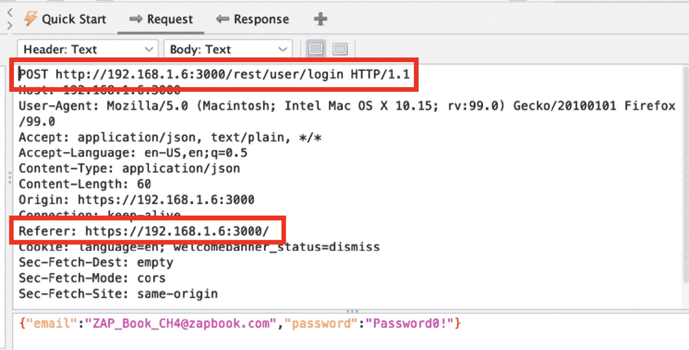
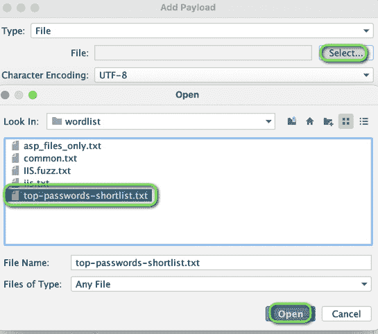
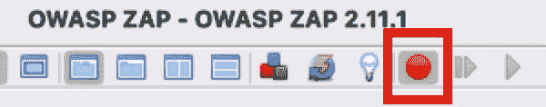

# 第四章：身份验证和授权测试

欢迎来到 *第四章*！我们和你一样激动，能够进入本章。在本章中，我们将涵盖许多关于身份验证和授权测试的主题，以了解攻击这些机制的不同方式。身份验证是验证试图访问系统或应用程序的人的身份有效性的过程。授权也帮助我们验证请求的操作或服务是否已批准特定实体。

在本章中，我们将涵盖以下内容：

+   绕过身份验证的测试

+   测试通过加密通道传输的凭证

+   测试默认凭证

+   测试目录遍历文件包含

+   测试权限提升和绕过授权架构

+   测试不安全的直接对象引用

# 技术要求

对于本章，你需要在你的机器上安装 OWASP ZAP 和 OWASP Juice Shop，因为你需要能够使用 ZAP 拦截浏览器与 OWASP Juice Shop 之间的流量。

# 绕过身份验证的测试

身份验证架构的目标是验证被验证用户的身份。检查身份验证功能首先要了解身份验证过程是如何验证用户账户的。当身份验证架构存在漏洞时，攻击者能够绕过身份验证过程。

有多种方法可以绕过身份验证架构。一些绕过方法包括（但不限于）拦截身份验证请求（如果应用程序使用了弱加密）、未正确实现输入验证（这使得注入攻击成为可能）、预测会话 ID（如果它们遵循某种模式），以及配置错误。

## 准备工作

为了准备这个实验，Juice Shop 必须运行，并且 ZAP 应该拦截浏览器和 Juice Shop 之间的流量。

## 如何进行…

在这个实验中，我们将通过执行基本的 SQL 注入攻击来绕过身份验证架构并登录管理员账户。

要开始实验室，请按照以下步骤操作：

1.  访问 Juice Shop 的登录页面。

1.  打开 ZAP 并通过点击顶部菜单上的绿色圆圈来 *设置对所有请求和响应的断点*，这将使它变为红色，如 *图 4.1* 中所示：

图 4.1 – 设置断点按钮

1.  再次打开 Juice Shop 应用程序，在用户名和密码框中输入一个撇号（**'**），然后按 *Enter*（在 macOS 中是 *return*）。你将看到请求被停止。

1.  点击 `Step` 四到五次。

目标是查看包含撇号用户名和密码的请求响应。在 *图 4.2* 中，我们可以看到该请求：

图 4.2 – 包含用户名和密码字段的请求

在*图 4.3*中，我们可以看到响应：

图 4.3 – 展示错误的响应

你可以看到响应中包含了正在使用的数据库类型以及提交的 SQL 查询。

1.  这些信息不应显示给用户。点击**继续**，你会在**登录**下看到`"[object Object]"`错误。

通过查看这些信息，我们可以判断网站是否存在 SQL 注入漏洞。

1.  现在，在用户名字段中输入`' or 1=1 --+`，并在密码字段中输入任意字符。

因为`1=1`语句为真，SQL 注入成功。`--`符号（短横线）将查询语句之后的部分注释掉。在这种情况下，密码将被注释掉。

1.  点击**登录**，以查看 SQL 注入是否成功，通过显示登录是否成功来验证。

如果你点击右上角的**账户**菜单，你会看到我们已登录为`admin@juice-sh.op`，如*图 4.4*所示：

图 4.4 – 账户登录

## 如何运作…

在这个案例中，我们进行了 SQL 注入，以绕过身份验证方案。SQL 注入是绕过身份验证过程的方法之一。如果应用程序没有验证用户输入，可能会执行 SQL 注入从而绕过身份验证。

# 测试通过加密通道传输的凭据

在本案例中，我们将演示如何验证用户的登录用户名和密码是否通过加密通道从浏览器传输到 Web 服务器。对于应用程序而言，通过加密通道传输登录信息或任何敏感数据（如会话 ID）至关重要。应用服务器和用户浏览器之间传输的数据可能会被攻击者截获，如果流量是加密的，攻击者将无法读取正在传输的数据。

## 准备工作

为了准备这个案例，请启动 ZAP 和 OWASP Juice Shop。确保 ZAP 拦截 OWASP Juice Shop 应用首页的流量。

## 如何操作…

为了了解一个网站是否可访问并通过**超文本传输协议**（**HTTP**）或**超文本传输协议安全**（**HTTPS**）传输数据，我们需要拦截登录的 HTTP 请求。让我们看一下步骤：

1.  配置 ZAP 拦截流量，然后登录到网站。

在拦截**登录**请求后，搜索并在 ZAP 中打开它。它会出现在信息窗口的**历史记录**标签中。*图 4.5*显示了**登录**请求的头部，其中包含你要在此测试中检查的字段：

图 4.5 – 登录请求头部

1.  检查 HTTP 方法和`Referer`字段。

HTTP 方法字段是第一行，用于传输数据。地址的开始部分将决定是否使用 HTTPS 或 HTTP。*图 4.5* 显示的是`http`。

1.  接下来，检查`Referer`字段。

该字段显示请求来源页面的地址。与 HTTP 方法字段一样，`Referer` 字段中的地址开始部分决定了源网页是否可以通过 HTTP 或 HTTPS 访问。

## 工作原理…

有两个主要的互联网协议用于传输 web 应用程序数据。第一个协议是 HTTP，它传输未加密的数据。第二个协议是 HTTP 的扩展——HTTPS，它用于加密 web 流量。HTTPS 使用**传输层安全性**（**TLS**），取代了**安全套接字层**（**SSL**），来加密 web 通信。使用 HTTP 会无意中暴露最终用户的数据，因为它以明文形式发送请求，攻击者可以轻松读取和篡改这些请求。

# 测试默认凭证

在本教程中，我们将讲解如何测试应用程序的默认凭证。通常，新配置的应用程序、服务器、路由器、主机等都附带有默认密码，供系统管理员登录并进行配置。如果这些默认密码未被更改，当攻击者进行暴力破解攻击时，成功登录的可能性较高。我们将演示如何使用字典文件进行简单的暴力破解攻击。

## 准备开始

为了准备本教程，请启动 ZAP 和 OWASP Juice Shop。确保 ZAP 在 OWASP Juice Shop 应用程序的主页上拦截流量。此外，您需要使用任何虚拟电子邮件在 OWASP Juice Shop 中创建一个帐户，但请确保在此部分的密码为`password`。另外，从 GitHub 或 Google 搜索获取密码破解字典文件（**'top-passwords-shortlist'**）。

## 如何操作…

1.  拦截流量，然后登录应用程序。

登录应用程序后，您将看到`POST`请求，如*图 4.6*所示：

图 4.6 – 站点树窗口 POST 请求位置

从这里开始，我们将对**登录**请求凭证进行暴力破解。

1.  右键点击`POST:login()`请求，选择**攻击**，然后选择**模糊...**：

图 4.7 – 站点树窗口

1.  高亮显示要进行暴力破解的字段，并点击**添加...**，如*图 4.8*所示：

图 4.8 – 模糊器对话框和位置

1.  然后，点击**添加...**按钮，如*图 4.9*所示：

图 4.9 – 有效载荷对话框列表

这将打开一个窗口，允许您选择有效载荷。

1.  点击**类型**下拉框，选择**文件**，如*图 4.10*所示：

图 4.10 – 添加有效载荷对话框文件下拉菜单

一旦打开窗口，选择我们在本节中之前下载的词典。

1.  选择`worldlist`，如*图 4.11*所示，然后点击**打开**、**添加**和**确定**。之后，你的`Fuzzer`窗口将如下*图 4.8*所示。现在，你准备好启动 Fuzzer 了。

图 4.11 – 添加有效载荷对话框文件目录视图

1.  点击**启动 Fuzzer**。一个新标签页打开，ZAP 开始测试你所高亮显示的字段，包含已添加的有效载荷。

图 4.12 – Fuzzer 信息窗口

## 它是如何工作的…

正如你所注意到的，"password" 有效载荷起作用了。这是因为应用程序返回了`200`代码，如*图 4.12*所示，表明 Fuzzer 测试的密码字段使用的密码是有效的。这个例子适用于任何其他登录界面以及任何使用密码的应用程序。当与有默认凭据的应用一起使用时，你可以同时测试多个凭据，尝试暴力破解登录页面。

## 还有更多内容…

在选择用于暴力破解等攻击的词典时，要了解你的目标是谁以及目标是什么，以便创建特定的列表（例如，Apache Tomcat 使用的用户名和密码是`tomcat`和**tomcat**）。

## 另见

+   [`github.com/danielmiessler/SecLists`](https://github.com/danielmiessler/SecLists)

# 测试目录遍历文件包含

目录遍历，也称为路径遍历、文件包含，是指攻击者试图利用输入验证的缺失或方法部署不当，读取或写入未经授权或不应访问的文件。在本指南中，我们将探索攻击者如何执行这种攻击，称为“点点斜杠”（**../**）攻击。

## 准备就绪

首先，确保 ZAP 已启动，并使用 PortSwigger Academy 实验室中的**文件路径遍历**，**简单案例**。

## 如何进行操作…

要确定应用程序的哪部分易受输入验证绕过攻击的影响，你需要列举应用程序中所有接受用户内容的部分。这包括 HTTP `GET` 和 `POST` 请求以及文件上传和 HTML 表单等常见选项。让我们看看这些步骤：

1.  在 ZAP 中捕获网络应用。

1.  扫描网络应用并查找任何包含图片文件或其他输入参数的区域：

图 4.13 – 获取：image(filename)

在 PortSwigger Academy 实验室中，查看网页上的任何图片，或者在请求编辑器中打开`GET`请求以查看`image(filename)` 请求，查看文件名的请求。

1.  打开**请求编辑器**，选择`GET` 请求中的`image(filename)`，并修改文件名以注入文件遍历攻击，如*图 4.14*所示：

图 4.14 – 文件路径遍历的请求编辑器

1.  当文件路径存在漏洞时，响应将反映出新请求的文件；在我们的例子中，攻击请求的是`/etc/passwd`文件，如*图 4.15*所示：

图 4.15 – 响应反射 /etc/passwd

## 工作原理…

目录遍历攻击旨在访问位于 Web 根目录之外的文件或其他目录。Web 服务器和 Web 应用程序通常会采用身份验证控制来访问文件和资源。管理员试图识别哪些用户和用户组被允许访问、修改或执行服务器上的特定文件。为了防止恶意行为，**访问控制列表**(**ACL**) 被用来防止访问敏感文件（如 **/etc/passwd**）或避免执行系统命令。

ACL 是管理图像、模板、加载静态文本等的常用方法，不幸的是，输入参数（如表单和 Cookie 值）的验证不当将使应用程序暴露于安全漏洞之下。

## 另见

有时，某些参数被屏蔽，攻击者需要在输入中使用其他方法，比如 HTML 编码或双重编码。对于这些其他字符串，请参考 GitHub，寻找备忘单或其他有效载荷，以帮助构建你的词汇表。然后，使用模糊测试工具快速加载并攻击所选参数。

另见 *第二章*中的 *使用 Fuzzer 进行模糊测试* 部分，*导航 UI*。

# 测试权限提升和绕过授权方案

在本章中，我们将讨论两种漏洞类型：第一种是权限提升，第二种是绕过授权方案。实验室内容涵盖这两种漏洞，因为一旦我们提升了权限，就可以执行未经授权的操作。

在权限提升攻击中，攻击者获得了更高的权限或执行了本应由其他用户执行的操作。通常，这种攻击之所以可能发生，是由于配置错误、软件漏洞或允许攻击者提升权限的漏洞。权限提升攻击有两种类型：第一种是纵向权限提升。在这种攻击中，攻击者成功获得了比其账户应有的更多权限（例如，从用户权限提升到管理员权限）。第二种是横向权限提升。在这种攻击中，攻击者执行了一个并非为其账户设计的操作，而是为一个具有相似权限级别的账户设计的操作。

绕过授权是在攻击者获得访问用户资源的能力时发挥作用的，即使用户没有经过身份验证，从而绕过身份验证。此漏洞会在以下情况下出现：无论是退出应用程序后，还是访问仅对具有适当角色或权限的用户可访问和设计的功能与资源时，都能实现对资源的访问。

## 准备工作

要在此实验中跟随步骤，你应该运行 OWASP Juice Shop，并让 ZAP 拦截流量。

## 如何操作…

在本实验中，我们将通过查看另一个用户购物车中的物品来执行横向权限提升。以下步骤将指导你在 Juice Shop 中执行权限提升：

1.  以管理员身份登录。

管理员邮箱（在本例中作为用户名使用）是 admin@juice-sh.op，密码是`admin123`。用户名来自**评论**部分，当选择**苹果汁**时获得。我们通过使用常见密码列表暴力破解密码获得了密码。

1.  访问管理员页面，网址为**https://[你的 IP 地址或本地主机]:3000/#/administration**。

通过使用浏览器的开发者工具并阅读`main.js`文件，获得了管理员页面的路径。

1.  通过点击用户旁边的*眼睛*符号来获取用户 ID。

需要用户 ID 才能查看`bender@juice-sh.op`用户的购物车。点击眼睛后，你可以看到在`#`符号后的用户 ID，本例中为`3`，如*图 4**.16*所示：

图 4.16 – 用户 ID

现在我们已经获得了用户 ID，我们需要创建一个新用户账户，以便获取一个正常用户权限的账户。

1.  退出管理员账户，点击**账户** | **登录**，点击**还不是客户？**，填写所需的用户账户信息。创建用户账户后，登录该账户。

1.  打开 ZAP，添加`Juice Shop`到作用范围，并通过点击顶部菜单栏的绿色圆圈来*设置拦截所有请求和响应*，这样它会变成红色，如*图 4**.17*所示：

图 4.17 – 设置拦截点

1.  点击顶部菜单中的**您的购物车**。点击后，你会看到被 ZAP 阻止的请求，并可以编辑它。第一行以`GET`（所使用的 HTTP 方法）开头；紧接着，你可以看到由协议版本跟随的路径。请注意，路径的结尾包含数字，表示用户 ID。参见*图 4**.18*：

图 4.18 – 用户 ID 请求头

1.  将 6 替换为用户 ID 3，如图 4.19 所示。点击**继续**：

图 4.19 – 替换请求头

现在，你可以看到`bender@juice-sh.op`的购物篮，如*图 4.20*所示：

图 4.20 – OWASP Juice Shop 购物篮

1.  为了进一步执行未经授权的操作，让我们从 mailto:bender@juice-sh.op 购物篮中删除**树莓汁**。刷新并重复*步骤 5*至*7*，检查购物篮是否为空，如*图 4.21*所示：

图 4.21 – 空购物篮

## 工作原理…

本实验向你展示了权限提升的工作原理。在这个特定的实验中，我们通过更改`GET`请求中的 ID 来查看另一个用户的购物篮。这类攻击非常危险，因为攻击者可以代表他人执行某些操作，如果提升是垂直的，攻击者将拥有可以危及整个系统或应用程序的权限。

# 测试不安全的直接对象引用

**不安全的直接对象引用**(**IDOR**) 出现的情况是，当应用程序以不安全的方式引用对象，允许用户提供的输入操控并直接访问这些对象。利用此漏洞的攻击者能够绕过授权，直接访问服务器上的资源（例如数据库记录或文件）。

## 准备工作

首先，确保启动了 ZAP 并使用 PortSwigger Academy 实验室中的**不安全直接` `对象引用**。

## 操作步骤…

在这里，我们将攻击应用程序的实时聊天功能，允许我们查看其他用户发送给虚拟 Web 应用支持团队的消息。让我们来看一下具体步骤：

1.  首先，在 PortSwigger Academy 实验室中导航到**实时` `聊天**功能。

1.  在捕获流量的同时，点击**查看` `转录**按钮。

你会注意到这会下载一个编号的文本文件。当你在 ZAP 的手动请求编辑器中查看响应时，你可以操控文件的数字，如*图 4.22*所示：

图 4.22 – IDOR 攻击的请求与响应

1.  将数字改为`1`并观察响应。

在响应中，你将看到支持机器人与其他人之间的聊天记录，其中揭示了用户以明文发送密码。

## 工作原理…

最基本的 IDOR 场景发生在应用程序使用容易猜测的数字值（如增量整数）引用对象时，正如我们在测试中所看到的那样。这些字段也可能包含可能的单词，如用户的电子邮件地址或目录名称。其他时候，使用了不良的编码方法，允许攻击者解码某些内容——例如，使用 base64 编码对增量整数进行编码，或者引用用户的头像图像名称哈希值。

测试 IDOR 的最佳方法是请求或创建至少两个用户，以覆盖不同的拥有对象和功能——例如，两个用户分别访问不同的对象（如购买信息、私密消息等）——并且（如果相关并且可能）创建具有不同权限的用户（即管理员与审计员），以查看是否存在对应用功能的直接引用。通过多个用户，测试人员可以节省时间，而不必猜测在尝试访问属于其他用户的对象时，不同对象的名称是什么。

## 还有更多…

测试时需要关注的其他领域如下：

+   参数的值是否直接用于检索数据库记录

+   参数的值是否直接用于在系统中执行操作

+   参数的值是否直接用于检索文件系统资源

+   参数的值是否直接用于访问应用功能
