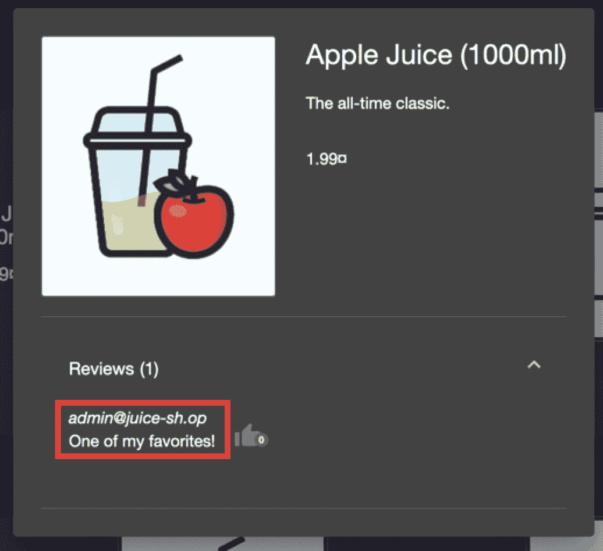

# 第六章：验证（数据）输入 – 第一部分

你已经来到了*第六章*，黑客攻击的核心内容！在这一章中，你将会了解每个黑客都认识、喜爱、憎恨并希望重现的攻击方法。在这里，我们将开始深入研究利用容易受到输入验证问题、糟糕编码实践或后端缺乏参数化的字段或对象的攻击方法。

尽管许多人都知道**跨站脚本攻击**（**XSS**）等攻击，它们可以利用会话或**结构化查询语言**（**SQL**）注入攻击来绕过身份验证或从数据库中拉取数据，但我们还将深入探讨更多利用相同糟糕编码实践的攻击。

本章将涵盖以下教程：

+   测试反射型 XSS

+   测试 HTTP 动词篡改

+   测试**HTTP 参数污染**（**HPP**）

+   测试 SQL 注入

# 技术要求

对于本章内容，要求你在本机上安装`OWASP Zed Attack Proxy`（**OWASP ZAP**）和 OWASP Juice Shop，以便拦截浏览器与 OWASP Juice Shop 之间的流量。此外，还需要使用你的 PortSwigger 账户访问 PortSwigger Academy 的实验室，这些实验室将用于本章的教程。最后，为了完成某些攻击，需要使用 Mutillidae II Docker 环境。

# 测试反射型 XSS

XSS 漏洞是最常见的 Web 应用程序注入攻击之一。这种攻击位于*OWASP Top 10:2021 – 注入*类别中的第 3 位。XSS 欺骗用户的浏览器运行攻击者精心设计的恶意 JavaScript 代码，以窃取用户的敏感信息，例如会话 cookie 或密码。在某些情况下，如果管理员帐户的会话信息被泄露，攻击者可能会接管整个应用程序。任何使用用户输入数据生成输出的应用程序都有可能遭受 XSS 攻击。XSS 漏洞有多种类型：反射型 XSS、存储型 XSS 和 DOM XSS。DOM XSS 将在*第九章*，*客户端测试*中讨论。

在这个教程中，我们将使用反射型 XSS 负载攻击 OWASP Juice Shop 应用程序，并利用 ZAP 拦截流量，操控请求并观察攻击在浏览器中反映出来。

## 准备工作

本实验要求运行 Juice Shop 应用程序，并且 ZAP 能够拦截来自服务器到浏览器的请求和响应。

## 如何操作…

反射型 XSS 漏洞发生在应用程序接受用户输入并将其显示在响应输出中时。与存储型 XSS（持久性）不同，反射型 XSS 不会在应用程序中永久存储（非持久性）。

以下步骤用于利用 XSS 漏洞：

1.  打开 OWASP Juice Shop。

1.  使用启用**设置` `中断**的 OWASP ZAP 拦截 Web 应用程序。

1.  将以下有效负载输入到**搜索**字段中：

    ```
     <image src=1 href=1 onerror="javascript:alert(1)"></image>
    ```

1.  请观察浏览器中反射的负载弹出警告，如*图 6.1*所示：


图 6.1 – XSS 负载反射

## 它是如何工作的…

无论 XSS 攻击是反射型还是存储型，结果总是一样的。负载进入服务器系统的方式使这两者有所不同。永远不要假设一个“只读”网站可以免疫反射型 XSS 攻击。最终用户可能会因为 XSS 而经历一系列问题，从小麻烦到完全账户泄露不等。通过泄露用户的会话 Cookie，XSS 攻击为攻击者提供了访问用户会话和账户的权限。根据用户的权限等级，例如管理员权限，这可能会增加风险。

## 还有更多…

XSS 攻击很常见，防止这些攻击至关重要。以下是两种防止 XSS 攻击的方法。请记住，这些并不是唯一的防护 XSS 攻击的选项：

+   **对非字母数字字符进行编码以防止浏览器执行代码**：你可以利用一个库或框架自动编码或转义用户输入，使其不被视为代码。例如，在 HTML 环境中，你可以使用 Python 的`html.escape()`方法或 JavaScript 的`HTMLElement.textContent`属性来编码用户输入，使其被解释为纯文本而不是可执行代码。

+   **验证用户提交的输入并允许特定类型或列表的输入**：使用允许字符的白名单，而不是禁止字符的黑名单，是实现这一目标的一种技术。例如，你可以限制输入为字母数字字符和一些基本符号，同时禁止任何包含 HTML 或 JavaScript 元素的输入。

+   使用**内容安全策略**（**CSP**）来指定哪些源被允许在你的网站上执行脚本也是一个好主意，同时在服务器端验证过程中包含输入清理。即使攻击者成功绕过客户端验证，这也有助于避免 XSS 攻击。

重要说明

**存储型 XSS**（**XSS 类型 II**）是一种持久性攻击，也被称为二次 XSS。它发生在应用程序从不可靠的来源获取恶意数据，将其存储在服务器上，并随后在 HTTP 响应中不经意地包含该数据时。这种攻击使用与反射型 XSS 相同的方法。

## 另请参阅

获取更多关于 XSS 的信息，请访问以下链接：

+   [`cheatsheetseries.owasp.org/cheatsheets/Cross_Site_Scripting_Prevention_Cheat_Sheet.html`](https://cheatsheetseries.owasp.org/cheatsheets/Cross_Site_Scripting_Prevention_Cheat_Sheet.html)

+   [`owasp.org/www-community/attacks/xss/`](https://owasp.org/www-community/attacks/xss/)

要查看更多负载，请访问 GitHub 搜索更多，或访问以下链接：

+   [`github.com/payloadbox/xss-payload-list`](https://github.com/payloadbox/xss-payload-list)

# 测试 HTTP 动词篡改

当使用各种 HTTP 方法访问系统对象时，HTTP 动词篡改评估 Web 应用的反应。测试人员应尝试使用每种 HTTP 方法访问爬取期间找到的每个系统对象。

`GET` 和 `POST` 请求并不是 HTTP 规范支持的唯一请求类型。开发人员可能没有预料到符合标准的 Web 服务器将如何对这些替代方法做出反应。虽然*动词篡改*是这些请求的通常术语，但 *RFC 9110* 规范将它们称为各种 HTTP 方法。

在这个示例中，我们将探讨使用一些这些 HTTP 动词来了解服务器响应以及如何利用它。

## 准备工作

本实验室需要一个 PortSwigger Academy 账户和一个可用的 ZAP 副本来拦截从服务器到您的浏览器的请求和响应。我们将利用*由于不安全配置而导致信息泄露*实验室来进行这个示例。

## 如何做…

在这个示例中，管理界面存在身份验证绕过漏洞。为了利用它，攻击者必须了解前端使用的特定 HTTP 头。

利用 HTTP 动词篡改的步骤如下：

1.  通过在**快速开始**菜单中使用**手动探索**在 ZAP 中拦截 Web 流量，并在**手动探索**中启用**设置中断**并刷新网页开始。

1.  通过浏览到 `/admin` 路径，注意 `GET` 请求。响应将披露一个**仅供本地用户使用的管理员界面**消息。

1.  重新发送请求，但将`GET`替换为`TRACE`方法（见*图 6**.2*）：

    ```
     TRACE /admin
    ```


图 6.2 – TRACE 请求

1.  `X-Custom-IP-Authorization` 头现在将包含您的 IP 地址，附加到您的请求中。这用于确定请求是否来自本地主机 IP 地址，如*图 6**.3*所示：


图 6.3 – 包含 IP 地址的响应

1.  打开`Replacer`（*Ctrl* + *R*）。这将用于匹配和替换头部。创建一个描述，并将**匹配类型**保留为**响应主体字符串**。将以下内容添加到**替换字符串**字段中：

    ```
    X-Custom-IP-Authorization: 127.0.0.1
    ```

注意

IP 地址与您在*第 3 步*尝试访问 /admin 页面时在 HTTP 响应中看到的 IP 地址相同。

1.  将以下内容添加到**替换字符串**字段中，如*图 6**.4*所示：

    ```
    X-Custom-IP-Authorization: 127.0.0.1
    ```


图 6.4 – 匹配 / 替换字符串

重要提示

根据 OWASP 文档的**替换**规则：

**响应` `主体字符串：**

*在这种情况下，匹配字符串实例将被视为字符串或正则表达式（regex）。如果它出现在响应体中，那么它将被* *替换文本* 替换。*

1.  勾选 **启用** 复选框并点击 **保存**。ZAP 将把此设置应用到你发送的每一个请求中。

1.  返回主页浏览。注意，现在你可以访问 **管理员面板** 链接（显示在 *图 6.5* 中），然后可以删除用户 `Carlos`：


图 6.5 – 管理面板

## 它是如何工作的…

HTTP `TRACE` 方法用于故障排除。当你启用 `TRACE` 方法时，Web 服务器会沿着到目标资源的路径进行消息回环测试。

尽管这种行为通常是无害的，并且开发人员经常用它进行有用的调试，但如果配置不当，可能会导致私人数据泄露，包括由反向代理添加的内部认证头。

以下是常用的其他标准方法：

+   `GET`：传输目标资源的当前表示

+   `HEAD`：与 `GET` 相同，但不传输响应内容

+   `POST`：对请求内容执行资源特定的处理

+   `PUT`：用请求的内容替换目标资源的所有当前表示

+   `DELETE`：删除目标资源的所有当前表示

+   `CONNECT`：建立到目标资源所识别的服务器的隧道

+   `OPTIONS`：描述目标资源的通信选项

+   `TRACK`：为带有 `audio>` 或 `video>` 组件定义文本轨道

## 还有更多…

请记住，Web 服务器处理 `TRACE` 动词。你的请求可能会通过到达 Web 服务器的附加组件路由，例如 **Web 应用防火墙**（**WAF**）或负载均衡器。如果该 WAF 包含头信息，你的 `TRACE` 响应将包含这些头信息，从而让你获得更多信息。

重要提示

`XMLHttpRequest`（**XHR**）在现代浏览器中不再发送 `"TRACE"` 请求，且 **跨源资源共享**（**CORS**）框架阻止 XHR 请求向未明确允许的外部站点发送请求。因此，在 **跨站点追踪**（**XST**）中出现的旧攻击不再有效。

## 另见

有关 *RFC 9110* 的更多信息，请访问 [`www.rfc-editor.org/rfc/rfc9110.html#method.overview`](https://www.rfc-editor.org/rfc/rfc9110.html#method.overview)。

有关 **Web 分布式创作与版本控制**（**WebDAV**）的更多阅读，请访问 [`www.webdav.org/specs/rfc2518.html`](http://www.webdav.org/specs/rfc2518.html) 或 [`datatracker.ietf.org/doc/html/rfc4918`](https://datatracker.ietf.org/doc/html/rfc4918)（*RFC 4918*）。

重要提示

如果启用了 WebDAV 扩展，这些扩展可能允许更多的 HTTP 方法：`PROPFIND`，`PROPPATCH`，`MKCOL`，`COPY`，`MOVE`，`LOCK`，和 `UNLOCK`。

# 测试 HTTP 参数污染（HPP）

在本教程中，我们将讨论 HPP，你将了解到通过污染一个参数，攻击者可以利用这一点创建账户并接管另一个用户的账户。

## 准备就绪

为了准备此步骤，请启动 ZAP 和 OWASP Juice Shop。确保 ZAP 在 OWASP Juice Shop 应用首页拦截流量。

## 如何进行…

在本教程中，我们将引导你了解如何在 OWASP Juice Shop 中进行 HPP 攻击。我们将通过向电子邮件字段添加第二个值来污染它，这将使账户创建过程用攻击者的电子邮件替代受害者的电子邮件来建立账户。

以下步骤将引导你完成此过程：

1.  打开 ZAP，并通过点击**在所有请求和响应上设置断点**来启用 ZAP 的拦截功能，启用时会从绿色变为红色。参见*图 6.6*：


图 6.6 – 设置断点

你还需要逐个处理每个请求，因为这个配置会阻止浏览器发送的所有请求和响应。

1.  从**账户**进入，然后点击**登录**，接着选择**还不是客户**。

1.  创建一个`victim@email.com`的电子邮件地址，设置任意密码和安全问题的答案。

1.  在你点击**注册**后，前往 ZAP 查看请求，然后通过复制字段名和值（如*图 6.7*所示）输入攻击者电子邮件，并在 ZAP 中转发请求：


图 6.7 – 更改为攻击者电子邮件的请求

1.  发送请求后，响应会显示账户成功注册，但现在使用的是攻击者的电子邮件，而不是受害者的电子邮件。参见*图 6.8*：


图 6.8 – 攻击者成功注册账户的响应

1.  最后，使用你创建的攻击者电子邮件地址和密码登录。注意，个人资料下显示的账户是攻击者的电子邮件。参见*图 6.9*：


图 6.9 – 攻击者账户登录

## 其工作原理是…

这种攻击有效的原因是应用程序接受多个相同名称的参数。由于没有标准规定应用程序应如何处理具有相同名称的多个参数，这可能导致应用程序以意想不到的方式处理参数。

此外，HPP 攻击包括将多个相互矛盾的值插入到 HTTP 请求的查询字符串参数中，以便混淆或操纵处理请求的服务器端程序。

攻击者可能尝试通过将参数转换为数组来利用这种方法。例如，攻击者可能会发出以下请求：

```
 GET /search?q[]=var1&q[]=var2 HTTP/1.1
Host: example.com
```

在这种情况下，攻击者试图通过将`q`参数转换为数组来注入两个矛盾的值。这可能被利用来绕过输入验证或导致程序出现意外行为。

## 另请参见

可以考虑进一步阅读，以了解 HPP 及此类攻击的修复措施。您可以参考以下资源：[`owasp.org/www-project-web-security-testing-guide/latest/4-Web_Application_Security_Testing/07-Input_Validation_Testing/04-Testing_for_HTTP_Parameter_Pollution`](https://owasp.org/www-project-web-security-testing-guide/latest/4-Web_Application_Security_Testing/07-Input_Validation_Testing/04-Testing_for_HTTP_Parameter_Pollution)。

# 测试 SQL 注入

SQL 注入是一种攻击，主要通过输入字段注入 SQL 查询，以未经授权的方式查看数据库数据、修改数据库数据或执行命令来控制底层基础设施。SQL 注入被认为是最常见的 Web 应用程序攻击之一。SQL 注入是一种严重的 Web 应用程序漏洞；成功的攻击可以使攻击者修改（删除、查看或编辑）数据库中存储的所有数据，或在底层系统上执行命令。

防止 SQL 注入攻击非常重要；以下是一些防止 SQL 注入攻击的技术：

+   使用参数化查询，防止应用程序将用户输入直接添加到数据库查询中。这使得开发人员能够硬编码 SQL 查询，然后将用户输入作为参数传递给查询。

+   转义用户输入，转义查询中的特殊字符。SQL 注入攻击依赖于特殊字符来完成 SQL 查询，如`'`或`"`。

+   输入净化，通过编程方式指定接受哪些类型的字符——例如，只接受字母字符。

请记住，这些技术并不是防止 SQL 注入攻击的唯一方法。

## 准备工作

要在本实验中进行操作，请确保 Juice Shop 正在运行，且 ZAP 正在拦截请求。

## 如何操作…

以下说明将指导您通过步骤利用 OWASP Juice Shop 应用程序登录页面中的 SQL 注入漏洞。在本实验中，我们将执行一次 SQL 注入攻击，绕过身份验证机制并以管理员身份登录。在执行步骤之前，请确保 OWASP Juice Shop 应用程序正在运行，并且 ZAP 正在拦截应用程序与浏览器之间的流量：

1.  打开 OWASP Juice Shop 后，我们需要找到管理员账户的电子邮件/用户名。在主页（**所有产品**页面），点击**苹果汁**，在**评论**部分，您可以看到管理员写的评论，并显示了他们的电子邮件，如*图 6.10*所示：



图 6.10 – 管理员电子邮件在评论中的显示

1.  通过点击**账户**，然后点击**登录**来导航到登录页面，如*图 6.11*所示：


图 6.11 – 登录

1.  输入`admin@juice-sh.op`作为电子邮件，密码可以输入任何值。登录将会失败。

1.  一旦登录失败，打开 ZAP。在**历史记录**标签中，找到登录请求。该请求将是一个`POST`请求，URL 将是`/rest/user/login`，状态码将是`401`。右键点击请求并选择**使用请求编辑器打开/重新发送…**，如*图 6.12*所示：


图 6.12 – 使用请求编辑器打开/重新发送…

1.  一旦**请求编辑器**打开，在底部窗口你将看到电子邮件。在电子邮件的最后一个字符后，添加`' OR 1=1 --`来利用 SQL 漏洞并绕过登录机制，如*图 6.13*所示：


图 6.13 – SQL 注入攻击

1.  点击编辑器右上角的**发送**按钮。HTTP 响应将打开，展示一个成功的 HTTP 响应状态码`200 OK`，以及一个创建的`JSON Web Token`（**JWT**）身份验证令牌，如*图 6.14*所示：


图 6.14 – HTTP 200 响应状态

重要提示

SQL 注入漏洞也可以直接通过登录网页来利用，通过输入登录用户名并添加`' OR 1 = 1 --`注入代码，如*图 6.15*所示：


图 6.15 – 登录绕过

## 其工作原理…

SQL 中的布尔值可以是`TRUE`或`FALSE`。在 SQL 中，布尔逻辑用于将多个条件结合在`WHERE`子句中，以过滤查询结果集。

SQL 注入漏洞在页面或参数（例如 Juice Shop 登录页面）连接到后端数据库时发挥作用。因此，对于添加的查询，在语句 ' OR `1=1 --` 中，`1=1` 条件始终是一个 True 查询语句。当数据库解析时，加上的 OR 语句会让数据库尝试匹配任何该用户名的记录。语句还告知数据库，如果没有匹配，则使查询为真。即使攻击者没有正确的用户名，查询也会返回一个 true 结果，从而成功登录。在后端数据库中，SQL 查询看起来会像这样：

```
 admin' - SELECT * FROM users WHERE useranme = '' OR 1=1 --' AND password = 'anything';
```

然后，紧接着`"--"`注释符，忽略了`True`语句后的所有其他查询语句。因此，攻击者永远不需要知道真实的密码。攻击者输入一个单引号来结束后端原始查询语句，原查询语句在寻找用户名输入时已关闭。接着，数据库服务器继续读取剩余的布尔语句。在这个简单的场景下，攻击者将成功绕过身份验证。

`' OR 1=1 --` 查询是初步测试潜在漏洞时最常用的查询和语句之一。此外，添加`' --` 在简单的情况下也会生效，因为它同样会产生一个`True`语句，并且`--` 会注释掉查询语句中剩余的需要密码的部分。

## 还有更多……

要利用 SQL 漏洞，熟悉数据库及如何编写数据库查询语句将非常有帮助。所有 SQL 服务器的语法略有不同。不过，如果你学会了其中一种，你将理解它们的基本结构。常见的 SQL 服务器有 MySQL、Microsoft SQL Server、PostgreSQL 和 Oracle。虽然本示例使用的注入攻击是 SQLite，但其他常见的绕过技术如下：

+   `admin' -`

+   `admin' #`

+   `admin'/*`

+   `'** `或 1=1--+**

+   `'** `或 1=1#**

+   `'** `或 1=1/***

+   `')** `或 '1'='1–**

+   `')** `或 ('1'='1–-**

除了常见的 SQL 数据库之外，**轻量级目录访问协议**(**LDAP**) 也以类似于 SQL 注入的方式进行攻击。LDAP 是一种基于客户端-服务器模型的目录服务，类似于数据库，但包含基于属性的数据。可以采用类似于 SQL 注入的绕过技术来进行 LDAP 注入：

```
 user=*)(uid=*))(|(uid=*
pass=password
```

## 另见

有许多工具专门用于发现和利用 SQL 注入漏洞。其中一个著名的工具（也是我个人的最爱）是 SQLMap。SQLMap 允许你指纹识别**数据库管理系统**(**DBMS**)，获取用户名和数据库表或列，并列举和利用潜在存在的 SQL 漏洞。有关 SQLMap 的更多信息，请访问 Kali Linux 网站 [www.kali.org/tools/sqlmap/](https://www.kali.org/tools/sqlmap/)。

关于 LDAP 注入攻击的更多信息，请访问 [`owasp.org/www-project-web-security-testing-guide/v41/4-Web_Application_Security_Testing/07-Input_Validation_Testing/06-Testing_for_LDAP_Injection`](https://owasp.org/www-project-web-security-testing-guide/v41/4-Web_Application_Security_Testing/07-Input_Validation_Testing/06-Testing_for_LDAP_Injection)。
