# 第七章：验证（数据）输入 - 第二部分

在*第七章*中，我们将继续进行输入验证的内容。我们将讨论**代码注入**，它使攻击者能够向程序中插入自定义代码并执行。接下来我们将讲解**命令注入**，它通过使用现有代码来执行命令，通常是在 Shell 环境下进行。然后我们会讨论**服务器端模板注入**（**SSTI**），即用户输入以不安全的方式插入模板，导致在服务器上执行远程代码。最后，我们会介绍**服务器端请求伪造**（**SSRF**），该漏洞通过利用服务器功能读取或更改内部资源。

本章将涵盖以下内容：

+   测试代码注入

+   测试命令注入

+   测试服务器端模板注入

+   测试服务器端请求伪造

# 技术要求

本章要求你安装 OWASP ZAP 并使用 PortSwigger 账户访问 PortSwigger Academy 实验。

# 测试代码注入

代码注入是一种漏洞，指的是将代码注入到应用程序中，后者会解释或执行这些代码。此漏洞允许攻击者从应用程序的后台获取信息，甚至完全控制应用程序。

在本章中，我们将带你通过*通过 Web Shell 上传进行远程代码执行*的 PortSwigger 实验，创建并上传一个包含代码注入有效载荷的新文件，通过 Web 应用程序功能实现上传。

## 准备工作

本实验需要一个 PortSwigger Academy 账户以及 ZAP 工具，用于拦截从服务器到浏览器的请求和响应。

## 如何操作...

在本实验中，你将接触到一个存在漏洞的图片上传功能，该功能没有验证用户上传的文件，在将其存储到服务器之前存在安全隐患。

你将通过上传一个简单的 PHP Web Shell 并利用它来提取`/home/carlos/secret`文件的内容，从而利用此漏洞。

导航至*通过 Web Shell 上传进行远程代码执行*的 PortSwigger Academy 实验，并获取实验说明中提供的凭据。以下 URL 指向该实验：[`portswigger.net/web-security/file-upload/lab-file-upload-remote-code-execution-via-web-shell-upload`](https://portswigger.net/web-security/file-upload/lab-file-upload-remote-code-execution-via-web-shell-upload)：

1.  将浏览器通过 ZAP 代理后，登录 PortSwigger Academy 网站以启动实验。

1.  启动实验后，导航至**我的账户**并使用`wiener`账户登录，密码为`peter`。这些信息也可以在实验说明页面找到，点击即可启动应用。

1.  在**我的账户**页面，点击**选择文件**并选择要上传的任何图片。如*图 7.1*所示，你可以看到我选择了自己的头像并上传了照片。上传图片后，点击**返回我的账户**，你会注意到现在可以看到已上传的图片。

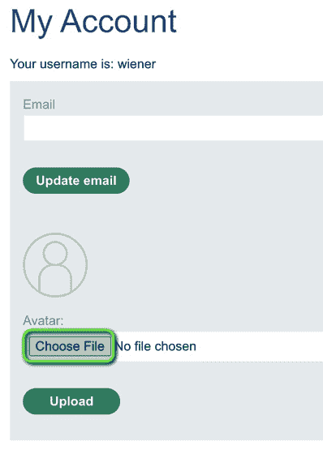

图 7.1 – 我的账户页面

1.  接下来，检查 ZAP Sites 窗口，查看应用程序用来从**我的账户**页面获取头像图片的请求，如*图 7.2*所示：

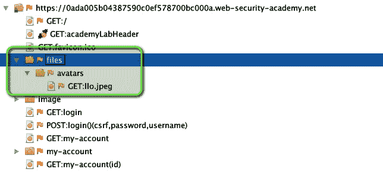

图 7.2 – 头像图片请求

1.  然后，右键点击图片，如*图 7.3*所示，点击**使用请求编辑器打开/重发**：

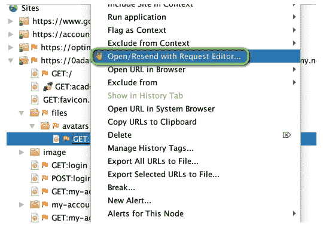

图 7.3 – 使用请求编辑器的打开/重发选项

1.  从这里，你可以最小化当前的**请求编辑器**窗口，创建一个包含代码注入有效载荷的新文件。你将要创建的文件名为`exploit.php`，文件中的代码如下所示：

    ```
     <?php echo file_get_contents('/home/carlos/secret'); ?>
    ```

在你创建并保存了有效载荷文件后，按照上传个人资料图片的方式上传该文件。

1.  注意，一旦你选择了`exploit.php`文件作为头像图片上传，文件名会在上传文件之前显示，如*图 7.4*所示：

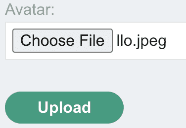

图 7.4 – 上传图片功能

1.  一旦上传了漏洞文件，你可以回到 ZAP，并在之前最小化的**手动请求编辑器**窗口中，将 URL 末尾的路径更改为`/files/avatars/exploit.php`，然后发送请求。注意，它返回了一个随机生成的字符串。这是完成实验所需的解决方案，演示了我们如何读取服务器中位于与我们用于`/****home/carlos/secret`漏洞相同路径的文件。

1.  恭喜！你已经通过利用应用程序中的代码注入漏洞读取了服务器中的文件。

## 它是如何工作的...

代码注入是一种将任意代码注入程序或进程中并执行的技术。这可以出于多种原因，比如测试、调试或恶意目的，例如恶意软件。

代码注入可以通过多种方式发生：

+   **缓冲区溢出**：缓冲区溢出漏洞发生在软件尝试存储比其预定容量更多的数据到缓冲区（一个临时数据存储区）时。这可能会覆盖附近的内存，从而允许攻击者执行任意代码。

+   **SQL 注入**：SQL 注入是一种代码注入攻击，攻击者可以通过易受攻击的应用程序向数据库服务器发送恶意 SQL 语句。

+   **跨站脚本攻击（XSS）**：XSS 是一种代码注入，攻击者将恶意代码注入网页，随后该代码由受害者的浏览器执行。

+   **远程代码执行（RCE）**：RCE 是一种代码注入，攻击者通过利用网络服务或应用程序中的漏洞，可以在远程计算机上执行代码。

通过使用有效的输入验证和清理、编写安全的代码技术以及定期进行安全更新和修补，可以避免代码注入。

# 测试命令注入

命令注入是一种漏洞，它允许攻击者在应用程序的底层操作系统（主机）上执行命令。当应用程序接受未经清理和验证的用户输入并将其执行为系统命令时，就会发生此漏洞。系统命令的例子有`grep`、`exec`和`system`等。系统命令会根据应用程序开发所用的编程语言不同而有所不同。通常，要进行命令注入攻击，你需要为应用程序提供预期输入，之后再加上一个特殊字符，以执行所需的命令。特殊字符如`|`、`&`、`;`、`|`、`||`、`&`、`&&`和`\n`，可以将更多命令附加到已执行的命令中。通过使用这些特殊字符，你可以同时执行多个命令。漏洞的严重性取决于应用程序用户帐户所授予的权限。它的影响可能极为严重，像是查看存储在系统中的密码、窃取数据或与网络上的其他系统交互等。

在本教程中，我们将带你完成 PortSwigger Web 安全学院中的*操作系统命令注入，简单案例*实验，并学习如何利用成功触发的输入命令的漏洞。

## 准备就绪

你需要启动 ZAP，并确保它能够拦截浏览器与 PortSwigger 学院实验之间的请求和响应。

## 如何操作...

为了展示如何利用常见的注入漏洞，我们将使用 PortSwigger Web 安全学院中的一个实验。ZAP 将拦截流量，我们将修改请求以利用该漏洞。

以下步骤将指导你完成实验并利用该漏洞：

1.  启动 ZAP，并在浏览器中访问 PortSwigger 学院。登录后点击**所有` `实验**按钮。

1.  向下滚动至**操作系统命令注入**部分，点击**操作系统命令注入，简单案例**实验，链接位于[`portswigger.net/web-security/os-command-injection/lab-simple`](https://portswigger.net/web-security/os-command-injection/lab-simple)：

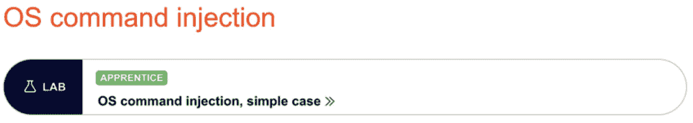

图 7.5 – 操作系统命令注入实验

1.  点击**访问实验**，易受攻击的应用程序将在新标签页中打开。

1.  将应用程序添加到范围内，以限制你所看到的结果仅限于该范围。

1.  在这个应用程序中，用于检查每个显示项库存水平的功能存在命令注入漏洞。因此，打开任何一个商品，滚动到底部，直到你可以选择**检查库存**按钮，如*图 7.6*所示：


图 7.6 – 检查库存按钮

1.  我们点击按钮生成请求。现在请求已经发送，找到它在 ZAP 的**历史**选项卡中。它将是一个`POST` HTTP 请求，发送到`/product/stock`，如*图 7.7*所示：

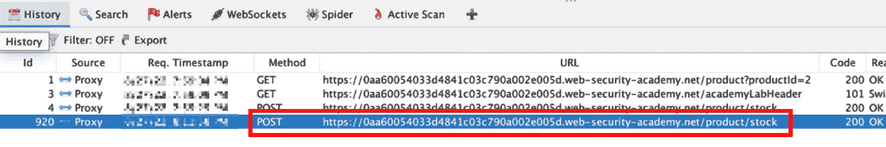

图 7.7 – 一个发送到 /product/stock 的 POST 请求

1.  右键点击请求，然后点击**使用请求编辑器打开/重新发送**，也称为**手动请求编辑器**。

1.  **手动请求编辑器**将在新窗口中打开。为了利用该漏洞，在`storeId=1`后添加`|`管道符号和命令。在此步骤中，添加`|pwd`，如*图 7.8*所示，以查看我们在哪个目录，并点击**发送**按钮：

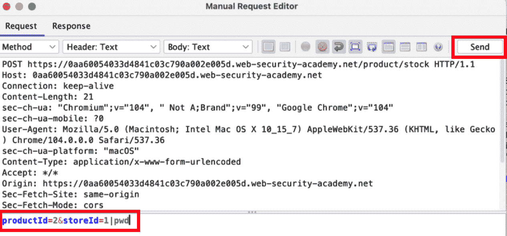

图 7.8 – storeId 请求

1.  如你所见，我们发送的带有系统命令的请求已经执行，现在我们可以看到我们所在的目录是`/home/peter-IkA8ei`。

1.  现在，为了好玩，我们来创建一个文件。返回到**请求**选项卡中的**手动请求编辑器**，添加`|`管道符号和`cat > CommandInjection.txt`，如*图 7.9*所示。`200` HTTP 响应状态码告诉我们请求成功：

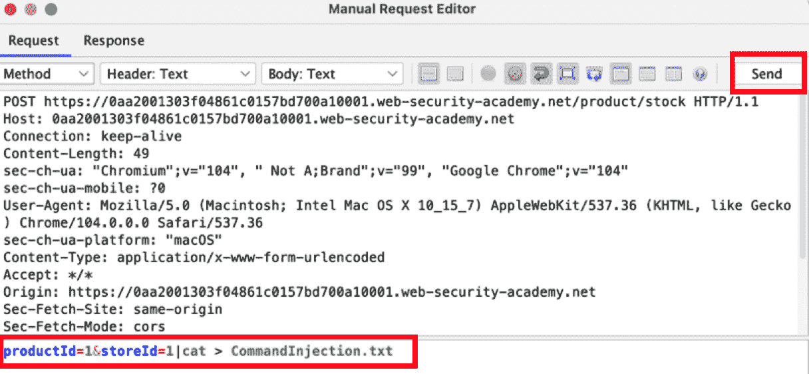

图 7.9 – 命令注入请求

1.  现在，要查看我们创建的文件，请重复相同的步骤，但这次添加`|`管道符号和`ls`命令，如*图 7.10*所示，然后点击**发送**：

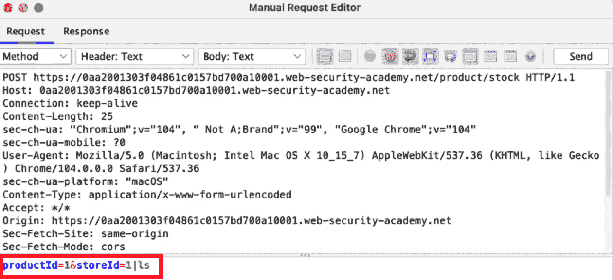

图 7.10 – 请求中的 ls 命令

1.  在响应中，你可以看到命令已经成功执行，我们可以看到我们创建的文件已列出，如*图 7.11*所示：

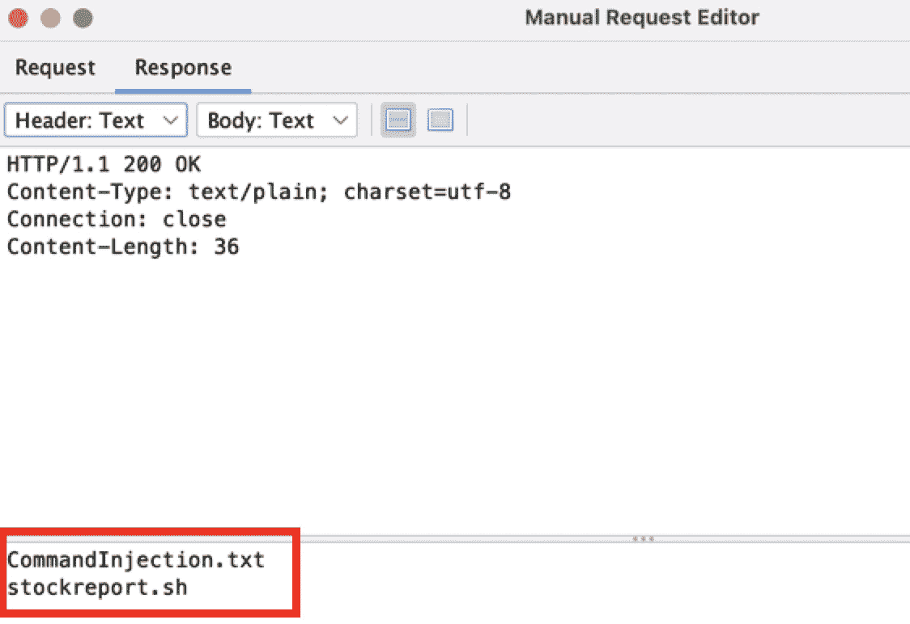

图 7.11 – 执行的命令注入

这就是本实验的结束。在本实验中，你成功利用了命令注入漏洞。

## 它是如何工作的...

由于该应用程序存在命令注入漏洞，因此没有验证用户输入。因此，我们可以执行系统命令，查看当前目录，并创建文件。如果我们愿意，我们还可以删除文件。

针对命令注入漏洞的修复措施可以通过清理用户输入来防止。

## 还有更多...

ZAP 活跃扫描可以检测到命令注入漏洞。对应用程序运行活跃扫描，扫描完成后转到**警报**标签页，搜索是否存在**远程操作系统命令注入**。在警报中，您将获得有关漏洞的更多信息，在**攻击**字段中，您会看到成功的有效载荷。使用在**攻击**字段中观察到的有效载荷，您可以重新创建攻击，查看密码文件或其他内容。*图 7.12* 是警报的截图：

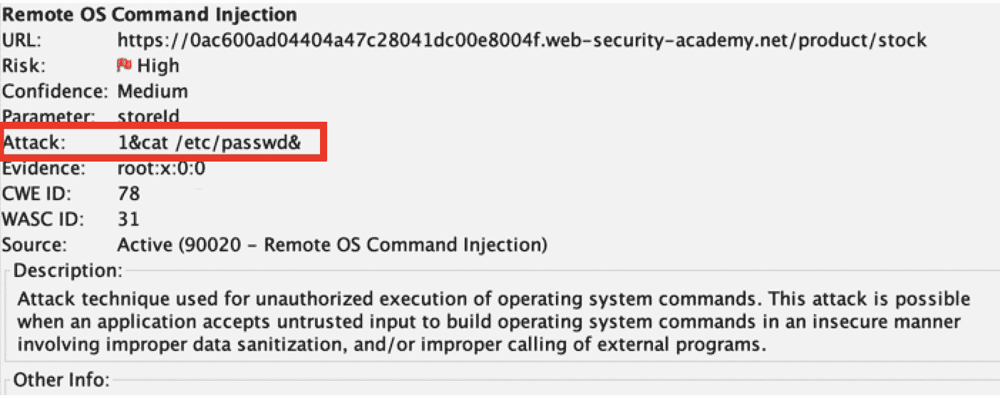

图 7.12 – 警报标签页攻击描述

## 另见

Commix 是一个开源工具，旨在自动检测并利用命令注入漏洞。它也作为一个工具包含在 Kali Linux 中。欲了解更多关于 Commix 的信息，请访问该工具的 GitHub 页面 ([`github.com/commixproject/commix`](https://github.com/commixproject/commix))。

# 测试服务器端模板注入

在本教程中，您将学习如何使用 PortSwigger Academy 的实验室进行基本的 SSTI 攻击。由于 ERB 模板的构建不安全，本实验室中的应用程序容易受到 SSTI 攻击。通过完成实验室，您将了解什么是 SSTI。首先，阅读 ERB 文档，学习如何运行任意代码，然后删除`morale.txt`文件，该文件位于 Carlos 的主目录中。

此外，您将学习服务器端模板的工作原理，以及这如何导致攻击者利用漏洞控制服务器。

## 准备工作

启动本地 ZAP 工具并登录到您的 PortSwigger Academy 账户，然后访问 [`portswigger.net/web-security/server-side-template-injection/exploiting/lab-server-side-template-injection-basic`](https://portswigger.net/web-security/server-side-template-injection/exploiting/lab-server-side-template-injection-basic) 中的*基本服务器端模板注入*实验室。

## 如何操作...

进行漏洞利用的一个好方法是通过注入一系列在模板表达式中常用的特殊字符来模糊化模板，例如以下字符：

```
 ${{<%%'"}}%\
```

因此，当模糊化产生错误或结果时，例如使用数学方程式，这将表明模板存在注入漏洞，因为服务器正试图评估有效载荷。这样做对于在能够利用漏洞之前识别其上下文是非常重要的：

1.  首先，点击**查看详情**以了解第一个产品的更多信息。一个`GET`请求使用消息参数进行渲染；然后您将看到首页上的**很抱歉，该产品已售罄**信息，如*图 7.13*所示：

![图 7.13 – 显示缺货信息的 GET 请求图 7.13 – 显示缺货信息的 GET 请求 1.  查阅 ERB 文档（*另见*部分有链接到文档），你可以看到表达式的语法是`<%= someExpression %>`，用于评估表达式并将结果渲染到页面上。你还可以使用该表达式生成错误，从而泄露模板正在使用 Ruby ERB。（见*图 7.14*）：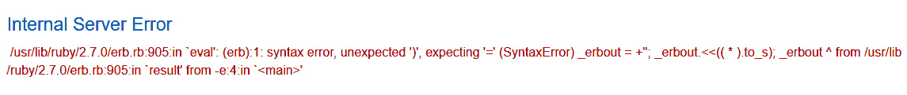

图 7.14 – 内部服务器错误泄露 Ruby ERB

1.  在`message=`后输入一个测试有效载荷，包含一个使用 ERB 表达式语法的简单数学运算：

    ```
     - https://your-lab-id.web-security-academy.net/?message=<%25%3d+8*11+%25>
    ```

你会注意到数学公式已经被求解并渲染到 web 应用程序页面中，如*图 7.15*所示。它将出现在与之前相同的位置，如*图 7.16*所示。这表明我们可能存在 SSTI 漏洞：


图 7.15 – 数学运算结果渲染到网页

1.  请参考 Ruby 文档并使用`system()`方法。此方法可用于执行任意操作系统命令。你可以通过一个简单的 Linux 命令来测试这些命令是否有效：

    ```
    <%= system("pwd") %>
    ```

    ```
    <%= system("ls -a") %>
    ```

在这里我们可以看到命令在 web 应用程序中显示的结果：

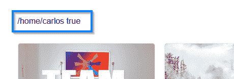

图 7.16 – pwd 命令结果

1.  现在我们可以看到服务器正在执行命令以打印当前工作目录并列出所有文件，让我们构造一个有效载荷，以便从 Carlos 的目录中删除一个文件：

    ```
    <%= system("rm /home/carlos/morale.txt") %>
    ```

成功执行实验将显示一个祝贺页面：

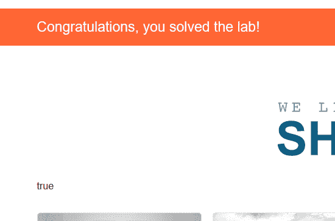

图 7.17 – 实验已解决

重要说明

如果命令导致错误消息或没有执行，请将有效载荷转换为 URL 编码，例如，`%3C%25%3D%20system%28%22ls%20-a%22%29%20%25%3E`。

使用 OWASP ZAP **编码/解码/哈希**工具或快捷键*Ctrl + E*，如*图 7.18*所示：

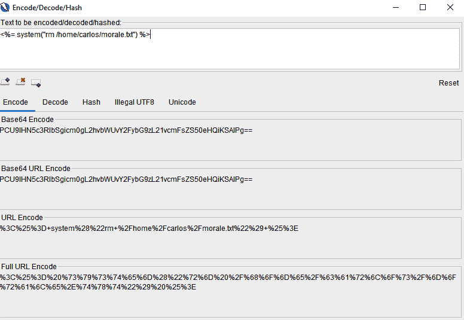

图 7.18 – 编码/解码/哈希工具

## 它是如何工作的...

你可以通过使用像 Smarty（PHP）、Freemarker（Java）或 Jinja2（Python）这样的模板引擎，在你的应用程序中使用静态模板文件。模板引擎会在运行时将模板文件中的变量替换为实际用户提供的值，并将模板转换为 HTML 文件，然后发送给客户端。

通过提交无效的语法，结果错误消息将向攻击者指示正在使用的模板引擎，并在某些情况下指明其版本。这使攻击者能够构造恶意有效载荷或将无效语法嵌入模板中，从而执行服务器端命令。

## 还有更多...

开发者使用服务器端模板预先在服务器上加载自定义用户数据的网页。现代网页框架通常动态生成 HTML 代码，模板包含所需 HTML 输出的静态部分以及描述如何插入动态内容的语法。

模板引擎随后处理模板文件，帮助将动态数据融入网页。当收到 HTTP 请求时，模板引擎会生成 HTML 输出响应。

## 参见

GitHub SSTI Payloads: [`github.com/payloadbox/ssti-payloads`](https://github.com/payloadbox/ssti-payloads)

若要进一步阅读有关模板框架的内容，请访问以下链接：[`www.smarty.net/`](https://www.smarty.net/)

[对于 PHP:](https://www.smarty.net/)

+   [Smarty:](https://www.smarty.net/) [`www.smarty.net/`](https://www.smarty.net/)

+   Twig: [`twig.symfony.com/`](https://twig.symfony.com/)

+   PHPTAL: [`phptal.org/`](https://phptal.org/)

对于 Java：

+   JSP/JSTL: [`www.oracle.com/java/technologies/jstl-documentation.html`](https://www.oracle.com/java/technologies/jstl-documentation.html)

+   Apache Velocity: [`velocity.apache.org/`](https://velocity.apache.org/)

+   Apache FreeMarker: [`freemarker.apache.org/`](https://freemarker.apache.org/)

+   Thymeleaf: [`www.thymeleaf.org/`](https://www.thymeleaf.org/)

+   Pippo: [`www.pippo.ro/`](http://www.pippo.ro/)

+   `Groovy Server Pages** (`GSP**): [`gsp.grails.org/latest/guide/index.html`](https://gsp.grails.org/latest/guide/index.html)

对于 Python：

+   Jinja2: [`pypi.org/project/Jinja2/`](https://pypi.org/project/Jinja2/)

+   Mako: [`www.makotemplates.org/`](https://www.makotemplates.org/)

+   Tornado: [`pypi.org/project/tornado/`](https://pypi.org/project/tornado/)

对于 Ruby：

+   ERB: [`ruby-doc.org/stdlib-3.1.2/libdoc/erb/rdoc/index.html`](https://ruby-doc.org/stdlib-3.1.2/libdoc/erb/rdoc/index.html)

+   `system()`: [`www.rubyguides.com/2018/12/ruby-system/`](https://www.rubyguides.com/2018/12/ruby-system/)

+   Haml: [`rubygems.org/gems/haml/versions/5.1.2`](https://rubygems.org/gems/haml/versions/5.1.2)

+   Slim: [`rubygems.org/gems/slim/versions/4.1.0`](https://rubygems.org/gems/slim/versions/4.1.0)

# 服务器端请求伪造的测试

内部和外部资源经常与 Web 应用程序交互。虽然你会期望只有预定的资源接收到你提供的数据，但不当的数据管理可能导致 SSRF，这是一种注入攻击。成功的 SSRF 攻击可以让攻击者访问限制性操作、内部服务或程序或公司内部的文件。在本教程中，我们将展示如何对后端系统执行 SSRF 攻击，寻找内部 IP 地址并随后删除用户。

## 准备工作

启动本地 ZAP 工具并登录你的 PortSwigger Academy 账户，然后访问 [`portswigger.net/web-security/ssrf/lab-basic-ssrf-against-backend-system`](https://portswigger.net/web-security/ssrf/lab-basic-ssrf-against-backend-system) 上的 *Basic SSRF against another back-end system* 实验。

## 如何操作...

我们将在本食谱中使用 PortSwigger Academy 的 *Basic SSRF versus another back-end system* 实验。SSRF 是一种攻击，攻击者通过易受攻击的服务器向目标服务器发送恶意请求，从而获取本来受限的资源或信息。后端系统是支撑网站或应用程序正常运行的基础设施和组件。这些系统通常对最终用户不可见，负责数据存储与处理、请求与响应管理以及系统集成等功能。

后端系统包括以下内容：

+   数据库

+   应用服务器

+   集成系统

后端系统通常是网站或应用程序整体架构的重要组成部分，负责大多数幕后工作，确保程序能够成功运行。

此实验包含一个库存检查功能，该功能从内部系统获取数据，然后扫描内部 IP 地址范围以查找管理接口，接着利用该接口删除用户 Carlos。

以下步骤将引导你完成实验并利用该漏洞：

1.  访问网页应用并通过 ZAP 进行手动或自动扫描以捕获流量。

1.  接下来，访问任何产品并点击 **检查库存**，使用 `Break Set` 拦截请求，或者从 `Sites` 窗口选择路径，右键点击并进入 `Manual Request Editor`，如*图 7.19*所示：

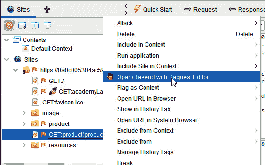

图 7.19 – 从 Sites 窗口定位 stockAPI

1.  将 `stockApi` 参数值更改为 `http://192.168.0.1:8080/admin/...`，这将允许我们访问管理员门户，如*图 7.20*所示：

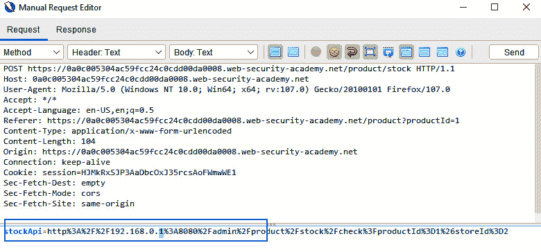

图 7.20 – 手动请求编辑器中的 stockAPI 请求

1.  高亮显示 IP 地址的最后一个八位字节（数字**1**），右键点击以在 `Fuzzer` 中打开（如*图 7.21*所示）：

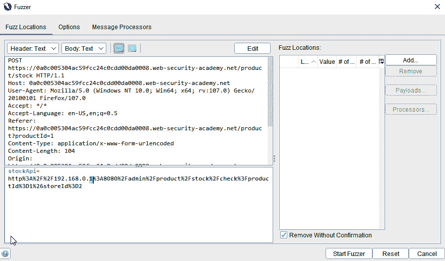

图 7.21 – Fuzz stockAPI 参数值

1.  在 `Fuzz Locations` 中，点击 **添加** 两次以打开菜单，并将 **类型** 切换为 `Numberzz`。然后，按照提供的值填写以下字段：

    +   **从`: **1`

    +   **到`: **255`

1.  点击 **添加** 完成负载（如*图 7.22*和*图 7.23*所示）。

1.  点击 **启动 Fuzzer**：

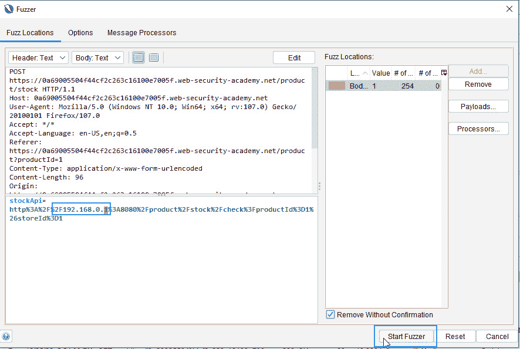

图 7.22 – 对 API 端点进行 Fuzz 测试

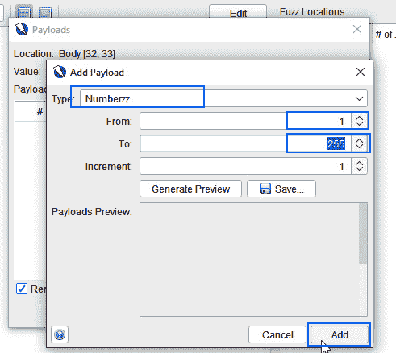

图 7.23 – Numberzz 有效载荷

1.  点击 **状态** 列在 Fuzzer **信息** 窗口中按状态码对攻击进行排序。你将看到一个状态为 `200` 的条目，展示该位置存在一个成功的管理员页面 IP 地址。

1.  在 **手动请求编辑器** 中再次打开请求，并将 `stockApi` 中的路径更改为以下字符串：

    ```
     /admin/delete?username=carlos
    ```

重要提示

将参数转换为 HTML 编码字符串。

1.  发送请求以删除用户。

## 它是如何工作的...

SSRF 是一种攻击形式，利用与内部/外部网络或主机本身交互的应用程序进行攻击。例如，URL 参数因素或 Webhook 自定义的处理不当，用户指定 Webhook 处理程序或回调 URL。攻击者还可以通过与其他服务的请求交互来提供特定功能。通常，用户数据被发送到服务器进行处理，如果处理不当，可能会被用来执行特定的注入攻击。

SSRF 攻击涉及说服服务器代表攻击者向外部资源发起请求。例如，即使 **Web 应用防火墙**(**WAF**) 阻止了常规请求，攻击者也可能通过发现绕过 WAF 的方法来实施 SSRF 攻击。

攻击者可能通过利用绕过方法来避免被 WAF 检测到。例如，攻击者可能使用 URL 编码、Unicode 编码或其他方式改变请求的外观，使得 WAF 无法识别为恶意请求。攻击者还可能通过发现应用程序中的弱点绕过 WAF，从而发起 SSRF 攻击。

例如，攻击者可能会发现应用程序输入验证中的弱点，允许他们将 URL 注入到表单字段中，服务器会代表他们执行该请求，如 *图 7.24* 所示：

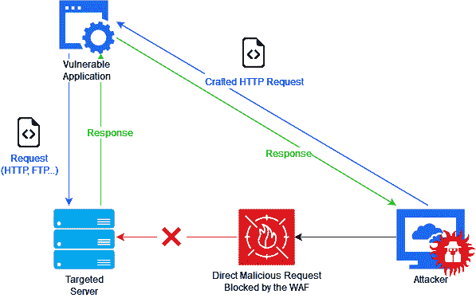

图 7.24 – SSRF 攻击示意图

## 还有更多内容…

HTTP 协议并不是唯一可能发生 SSRF 攻击的协议。HTTP 首先在请求中使用，但如果应用程序执行第二次请求，它可能会使用多种其他协议，例如 FTP、SMB、SMTP 或其他协议和/或方案，如 `file:/`、`data:/` 和 `dict:/` 等。

此外，SSRF 经常在云环境中使用，用于获取并窃取凭证或访问令牌，如在 AWS 或 Azure 环境中的元数据服务（如元数据服务器）。

最后，考虑其他攻击方式，如 **XML 外部实体**(**XXE**)，它可以被用来利用 SSRF 漏洞。

## 另见

有关 XXE 的更多信息，请参阅 *第十三章*。
