# 第十章：高级攻击技巧

欢迎来到 *第十章*，*高级攻击技巧*。在本章中，我们将介绍一些高级攻击技术，如 **XML 外部实体**（**XXE**）攻击和 Java 反序列化，我们将解释并演示如何在测试应用程序中利用这些漏洞。我们还将有趣地进行密码更改的暴力破解、Web 缓存中毒以及处理 JSON Web Tokens。

本章将介绍以下内容：

+   执行 XXE 攻击

+   处理 JSON Web Tokens

+   执行 Java 反序列化攻击

+   密码暴力破解通过密码更改

+   Web 缓存中毒

# 技术要求

本章中，你需要使用常见的浏览器，如 Mozilla Firefox。你还需要使用你的 PortSwigger 账户来访问将用于本章实验的 PortSwigger Academy 实验室。

# 执行 XXE 攻击

在 XXE 攻击中，攻击者向应用程序发送包含外部实体引用的 XML 输入。此 XML 输入会导致应用程序表现出未预期的行为。成功利用 XXE 攻击可能导致攻击者查看文件内容、窃取数据、**服务器端请求伪造**（**SSRF**）以及远程代码执行。

## 准备工作

本实验需要一个 PortSwigger Academy 账户，并且需要 ZAP 来拦截来自服务器到浏览器的请求和响应。

## 如何做到...

在本实验中，我们将演示执行 XXE 攻击以检索 `passwd` 文件的内容。请按照以下说明操作：

1.  使用代理到 ZAP 的浏览器导航到 URL，并登录到 PortSwigger Academy 网站以启动实验室。我们将在本节中进行的实验是 *利用外部实体的 XXE 攻击来检索文件*。实验链接如下：[`portswigger.net/web-security/xxe/lab-exploiting-xxe-to-retrieve-files`](https://portswigger.net/web-security/xxe/lab-exploiting-xxe-to-retrieve-files)。

1.  启动实验，将其添加到上下文中，并点击 **仅显示范围内的 URL**。

1.  在实验室主页上，点击任意产品下方的 **查看详情**。然后点击 **检查库存**。

1.  点击 **检查库存** 会向应用程序发送一个 `POST` 请求。让我们找到这个 `POST` 请求。右键点击请求并选择 **使用请求编辑器打开/重新发送**。

1.  一旦 **请求编辑器** 窗口打开，在 XML 声明后添加以下有效负载，并将产品 ID 替换为 `xxe` 外部实体引用，如 *图 10.1* 所示。然后，点击 **发送**：

    ```
     <!DOCTYPE test [ <!ENTITY xxe SYSTEM "file:///etc/passwd"> ]>
    ```

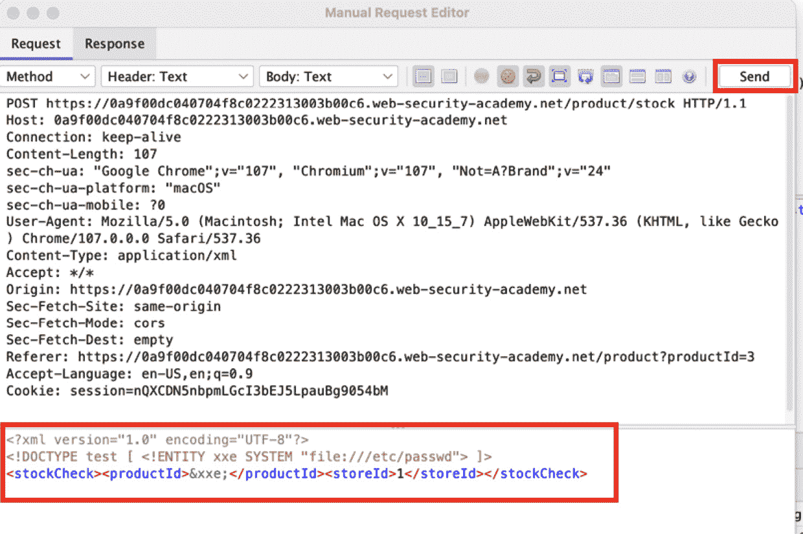

图 10.1 – XXE 攻击

1.  正如你在 **响应** 标签页中看到的，`passwd` 文件的内容在返回的响应中列出，如 *图 10.2* 所示：

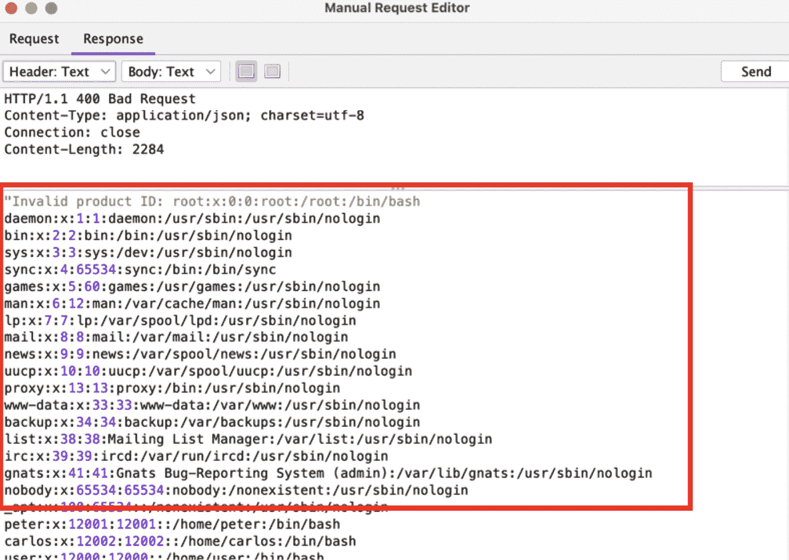

图 10.2 – passwd 文件

这就是本实验的全部内容。

## 原理...

XXE 攻击是一种可以在处理 XML 输入的应用程序中发现的漏洞。此类攻击发生在攻击者能够将恶意外部实体注入到 XML 文档中，然后这些外部实体可以用来危害应用程序或底层系统的安全性。

在 XXE 攻击中，攻击者首先创建一个包含外部实体引用的 XML 文档，通常是远程文件或资源。然后，攻击者将这个恶意的 XML 文档提交给易受攻击的应用程序，应用程序尝试处理并访问外部实体。这可能导致应用程序崩溃或泄露敏感信息，例如内部网络地址或系统文件。

在这个教程中，我们通过执行 XXE 注入攻击查看了 `/etc/passwd` 文件的内容。为了执行 XXE 注入攻击，我们通过添加 `DOCTYPE` 元素更改了 XML 输入，以便加入包含 `passwd` 文件路径的外部实体。然后，外部实体被用在 `productId` 值中，导致应用程序在响应中返回 `passwd` 文件内容，这使我们能够收集更多关于系统账户的信息。

# 操作 JSON Web Tokens

`JSON Web Tokens`（**JWTs**）用于身份验证、会话管理和系统间的数据授权。JWT 漏洞通常是设计缺陷、配置错误或使用不安全的库所导致的。在测试 JWT 漏洞时，测试者尝试绕过签名验证过程，从而绕过身份验证或授权机制。JWT 中传递的信息称为声明（claims），并且是经过加密签名的 JSON 对象。每个 JWT 由三部分组成：第一部分是头部，第二部分是负载，第三部分是签名。每个部分用 `.`（点）分隔，并使用 `base64` 编码。头部包含有关令牌的信息，负载部分包括声明，签名通常是头部和负载部分的哈希值，常用于完整性检查。

在这个教程中，你将攻击一个配置错误的服务器，该服务器发放允许接受未签名令牌的 JWT。为了完成实验，我们将指导你停用用户 – Carlos – 并更改会话令牌，以便你可以访问管理员面板。

## 准备开始

本实验需要一个 PortSwigger Academy 账户，一个 `Base64` 编码/解码器，并且 ZAP 应该能够拦截从服务器到浏览器的请求和响应。

## 如何操作...

在本部分，我们将完成 PortSwigger Academy 的 *JWT 身份验证绕过通过签名验证漏洞* 实验，演示如何更改 JWT 负载中的值，以管理员身份登录并删除用户账户。按照以下步骤开始实验：

1.  使用浏览器代理到 ZAP，导航到 URL 并登录 PortSwigger Academy 网站以启动*JWT 认证绕过通过错误签名验证*实验室 ([`portswigger.net/web-security/jwt/lab-jwt-authentication-bypass-via-flawed-signature-verification`](https://portswigger.net/web-security/jwt/lab-jwt-authentication-bypass-via-flawed-signature-verification))。

1.  一旦访问实验室，点击**我的账户**，并使用实验室描述中提供的凭据登录。

1.  打开 ZAP，找到`GET`请求到**/my-account 页面**。右键点击请求并选择**使用请求编辑器打开/重发…**。

1.  你可以在请求中看到 cookie 会话是一个 JWT，因为它是通过一个点分隔的。这个实验的目标是通过操作 JWT cookie 来访问管理员门户。我们需要一个`Base64`编码/解码器；在这个实验中，我使用的是 CyberChef ([`gchq.github.io/CyberChef`](https://gchq.github.io/CyberChef))。复制令牌中的头部，它是点之前和`session=`之后的第一部分。打开你最喜欢的 Base64 解码器并编码头部。将`alg`值从`RS256`更改为`none`，然后再次编码，如*图 10**.3*所示。复制编码后的值并保存，以便稍后在实验中使用：

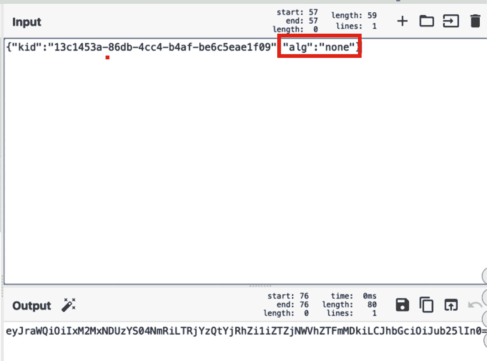

图 10.3 – 无算法

1.  现在，复制 JWT 中的有效负载；它是位于两个点之间的第二部分。将其解码到 Base64 解码器中，并将`sub`值从你使用的用户名改为`administrator`，如*图 10**.4*所示。对有效负载进行编码，并复制并保存编码后的有效负载，以便在下一步中使用：

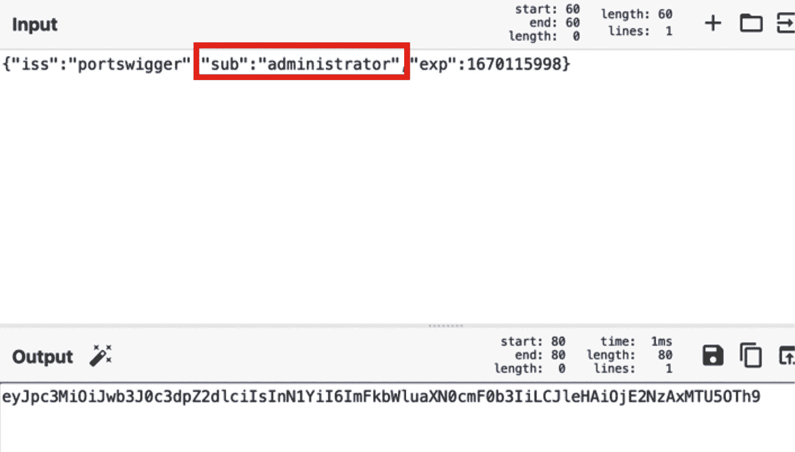

图 10.4 – 修改用户账户

1.  在 ZAP 的**请求编辑器**中，将`/my-account`改为`/admin`。删除`session=`之后的所有内容，并添加我们之前创建的编码头值。添加一个点，然后添加我们之前创建的编码有效负载值。有效负载后再添加一个点。*图 10**.5*显示了所添加的值：

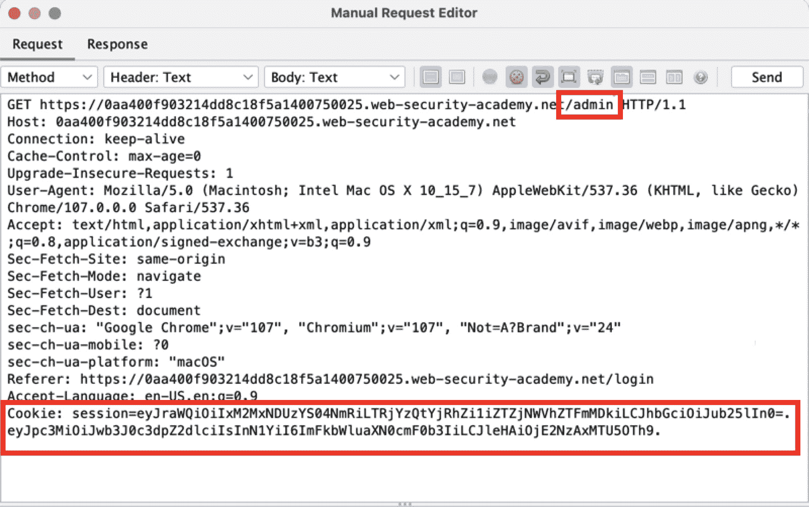

图 10.5 – 会话 cookie

1.  点击**发送**；如你所见，在**响应**标签中，应用程序返回了管理员面板的代码。

1.  打开浏览器，进入`/admin`页面，如你所见，你无法查看管理员页面。为了查看管理员页面，我们需要更改 cookie 值。我使用 Chrome 浏览器来更改 cookie 值。我必须打开**开发者工具**，导航到**应用程序**标签，找到`Cookies`下的 cookie。在**值**栏中，我双击了该值并粘贴了我们创建的 JWT。

1.  在添加我们创建的 JWT 后，刷新页面。如你所见，我们可以查看管理员页面，如*图 10**.6*所示。现在让我们删除用户`carlos`。

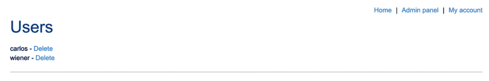

图 10.6 – 用户页面

这结束了本教程的实验部分。我们已经绕过了身份验证和授权机制，成功访问了管理员页面。

## 工作原理...

在这个实验中，我们解码了令牌的头部，并将`alg`属性的值改为`none`。通过将`alg`属性更改为`none`，我们可以绕过令牌中签名的验证。接着，我们解码了有效载荷并将`sub`属性的值改为`administrator`，以便能够使用管理员帐户。之后，我们重新编码了头部和有效载荷，并将其用作我们的会话 cookie 值。通过这样做，我们成功绕过了网站的身份验证和授权机制。

## 还有更多...

使用`none`值作为`alg`属性的值并不是让应用服务器接受你创建的 JWT 的唯一方法。另一种绕过身份验证和授权的方法是找到或暴力破解密钥。`HS256`是另一种使用密钥的`alg`值。如果攻击者找到了密钥，他们就可以签署任何他们创建的 JWT 并将其发送到服务器。像 Hashcat 这样的工具可以使用字典列表对密钥进行暴力破解。

# 执行 Java 反序列化攻击

Java 使用一种名为**序列化**的过程，将对象转换为字节流。相反，**反序列化**是将序列化的字节流还原为机器内存中的对象。在这种类型的攻击中，攻击者通过修改序列化对象将恶意数据注入应用程序代码。此类攻击只有在网站反序列化用户提供的数据时才有可能。如果必须反序列化用户提供的数据或来自不可信源的任何数据，则必须实现检查和保护措施，以防止不可信的源篡改数据。检查和保护措施必须在开始反序列化过程之前进行，否则将不起作用。由于防止反序列化攻击的难度较大，只有在无法避免的情况下才应使用数据反序列化。

在本教程中，你将攻击一个易受序列化基础会话机制的漏洞，该漏洞易受到权限提升攻击。进行此攻击时，你将编辑会话 cookie 中的序列化对象，利用此漏洞获得管理员权限，删除 Carlos 的帐户。

## 准备工作

本实验需要一个 PortSwigger Academy 账号和 ZAP 工具，以便拦截来自服务器到浏览器的请求和响应。

## 如何操作...

以下步骤将指导你完成解决 PortSwigger Academy *修改序列化对象*实验的过程。在本实验中，你将修改会话 cookie 中的序列化对象，以提升你的帐户权限，并能够删除一个用户帐户。请按照以下说明操作：

1.  在浏览器中代理到 ZAP，导航到网址并登录 PortSwigger Academy 网站以启动实验室 ([`portswigger.net/web-security/deserialization/exploiting/lab-deserialization-modifying-serialized-objects`](https://portswigger.net/web-security/deserialization/exploiting/lab-deserialization-modifying-serialized-objects))。

1.  打开 ZAP 并转到 `Manual Explorer`。在 Firefox 启动器中输入实验室 URL。

1.  使用 PortSwigger 提供的凭证登录实验室应用程序。

1.  点击登录后的 `GET /my-account` 请求的响应，其中包含一个会话 cookie。这个 cookie 似乎是 URL 和 Base64 编码的。

1.  要理解该字符串中的数据，可以通过右键单击选定的 cookie 值，将其发送到 `Encode/Decode/Hash` 工具。点击 `Decode` 标签并查看 `Base64 Decode` 行。你将看到以下值：

    ```
     O:4:"User":2:{s:8:"username";s:6:"wiener";s:5:"admin";b:0;}
    ```

1.  这个 cookie 实际上是一个序列化的 PHP 对象。字符串值总是包含在双引号中。`s` 是对象的大小，后面跟着对象名称，且用双引号括起来。在代码字符串的末尾，admin 属性包含 `b:0`，表示一个布尔值 `false`。在 `Manual** **Request Editor` 中打开此请求。

1.  在解码后的形式中，打开 CyberChef，将 `b:0` 的值更改为 `b:1`，表示 `true`，然后再次进行 Base64 编码并进行 URL 编码 `=`。将这个编码后的字符串重新插入到 cookie 中并发送请求。见 *图 10.7*：

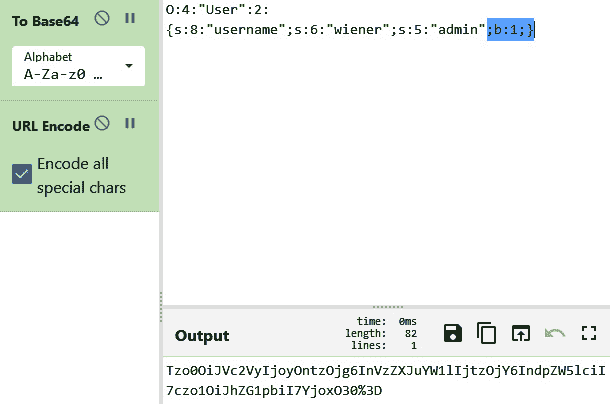

图 10.7 – CyberChef 编码的会话数据

1.  当你收到响应时，滚动查看 HTML 代码的内容，如 *图 10.8* 所示，找到一个显示 `/admin` 的链接。这表明你访问了一个具有管理员权限的页面：

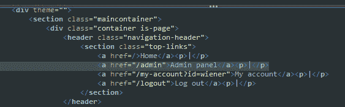

图 10.8 – 带有 /admin 路径的响应

1.  在下一步中，返回到 `Request` 标签并更新 `GET` 请求路径为 `/admin`，然后再次点击 `Send`。你将收到 `200` HTTP 状态，然后看到一个特定的 `href` 用于删除用户账户：

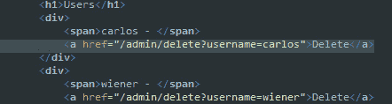

图 10.9 – /admin 响应

1.  更新路径以包含 `/admin/delete?username=carlos` 并再次发送请求以完成此步骤。你可能需要刷新浏览器页面以查看实验室的完成状态。

## 它是如何工作的…

当使用 Java 构建对象并且这些对象不再使用时，它们会被保存在内存中，稍后会被垃圾回收器删除。在传输数据、将数据存储在磁盘上或通过网络传输数据之前，Java 必须将这些对象转换成字节流。该对象的类必须实现 Serializable 接口才能完成此操作。如前所述，序列化使我们能够将一个对象的状态转化为字节流。实际的代码不包含在该字节流中。

恶意用户试图将修改过的序列化对象引入系统，以破坏系统或其数据，从而导致 Java 反序列化漏洞。

## 还有更多...

Java 应用程序通过一种称为**垃圾回收**的过程自动管理其内存。Java 应用程序可以通过编译为字节码在**Java 虚拟机**（**JVM**）上执行。对象在堆内存中创建，堆是为 Java 程序在 JVM 上启动时保留的一块内存区域。一些对象最终会变得过时。为了释放内存，垃圾回收器会发现这些无用的对象并将其删除。

至于 Serializable 接口，它包含在`java.io`包中。它是一个标记接口，没有方法或字段。因此，实现该接口的类不需要定义任何方法。如果类希望能够序列化或反序列化其实例，必须实现该接口。

## 另见

有关 PHP 序列化的更多信息，请访问[`www.php.net/manual/en/function.serialize.php`](https://www.php.net/manual/en/function.serialize.php)。

对于 CyberChef，请访问[`gchq.github.io/CyberChef/`](https://gchq.github.io/CyberChef/)。

# 密码暴力破解通过密码更改

暴力破解攻击是一种通过试错法来破解登录信息、加密密钥和密码的方式。这是一种简单但有效的方法，用于未经授权访问用户账户、商业系统或网络。直到恶意用户发现正确的登录信息为止，他们会尝试多种用户名和密码组合来获得正确的认证凭证。

在这个实例中，我们将通过暴力破解攻击应用程序中的一个脆弱的密码更改功能。

## 准备工作

此实验需要一个 PortSwigger 学院账户和 ZAP 来拦截从服务器到浏览器的请求和响应。

## 如何操作...

在这个实例中，我们将通过完成 PortSwigger 学院的*密码暴力破解通过密码更改*实验来演示暴力攻击，寻找正确的凭证。要开始实验，请按照以下说明操作：

1.  在通过 ZAP 代理的浏览器中导航到 URL，并登录到 PortSwigger 学院网站以启动实验([`portswigger.net/web-security/authentication/other-mechanisms/lab-password-brute-force-via-password-change`](https://portswigger.net/web-security/authentication/other-mechanisms/lab-password-brute-force-via-password-change))。

1.  下载 PortSwigger 提供的认证实验室密码并保存到计算机上的文本文件中。您将专门使用这些密码来进行本教程([`portswigger.net/web-security/authentication/auth-lab-passwords`](https://portswigger.net/web-security/authentication/auth-lab-passwords))。

1.  打开 ZAP 后，进入**手动探索**，通过启动器打开 Firefox，并解析 PortSwigger 实验室 URL。继续进入 PortSwigger 认证实验室。

重要提示

在 ZAP 中，为了更轻松地查看请求和响应，务必通过右键点击**站点**窗口中的网址，并选择**将站点包含到上下文中**，然后点击靶心图标以隐藏其他站点。这可以在**信息**窗口的**历史**选项卡中以及其他有靶心图标的地方完成。

1.  使用提供的凭据登录实验室应用程序，并在 HUD 中设置断点。

1.  登录后，你将进入可以更新当前密码的网页。在这里，我们将开始测试其功能。请记住，用户名是在请求中作为隐藏输入提供的。

1.  我们将通过这个功能进行实验来枚举正确的密码，但首先，我们来看一下获取不同响应的几种方式：

    1.  输入错误的当前密码，然后输入两个匹配的新密码。如果你这样输入密码两次，账户会退出并被锁定。然后，当尝试重新登录时，会收到被锁定一分钟的错误信息，如*图 10.10*所示：

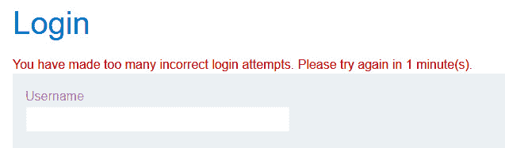

图 10.10 – 锁定账户信息

1.  但如果你使用错误的当前密码，并且新密码不匹配，你将不会被登出或锁定。会出现**当前密码不正确**的错误信息。

1.  最后，如果你使用正确的当前密码，但输入了两个不同的新密码，你将收到一个**新密码不匹配**的错误信息，显示在网页上。

1.  在**历史**选项卡中，打开你在`Fuzzer`中输入了正确的当前密码和两个不同的新密码的请求，如*图 10.11*所示：

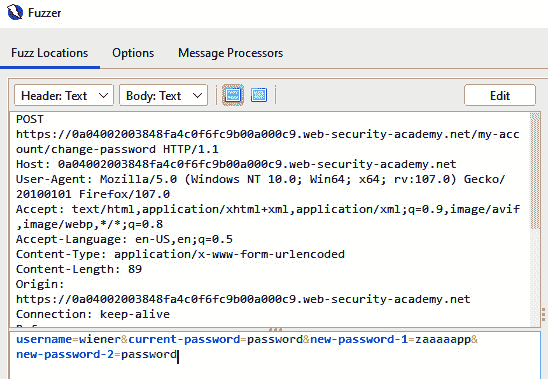

图 10.11 – 更改密码的 POST 请求

1.  点击**编辑**以将用户名参数更改为`carlos`。

1.  接下来，选择`password`在`current-password`参数中，并点击**添加**，再次点击**添加**，然后从下拉菜单中选择**文件**。这将添加我们的密码列表，用于暴力破解。确保其他两个新的`password`参数有不同的值，如前面的示例所示，*图 10.11*。

1.  在**文件**有效负载中，点击**选择...**以打开计算机目录，导航到你保存文件的位置。

1.  接下来，在第二个密码后面空白的地方添加第二个有效负载，`strings`，添加**新密码不匹配**的行，勾选**多行**框，点击**添加**，然后点击**确定**。

重要提示

添加 Stings 有效负载类型有助于你在响应体的内容中执行*grep 匹配*。

你的页面应该包含两个有效负载，如*图 10.12*所示：

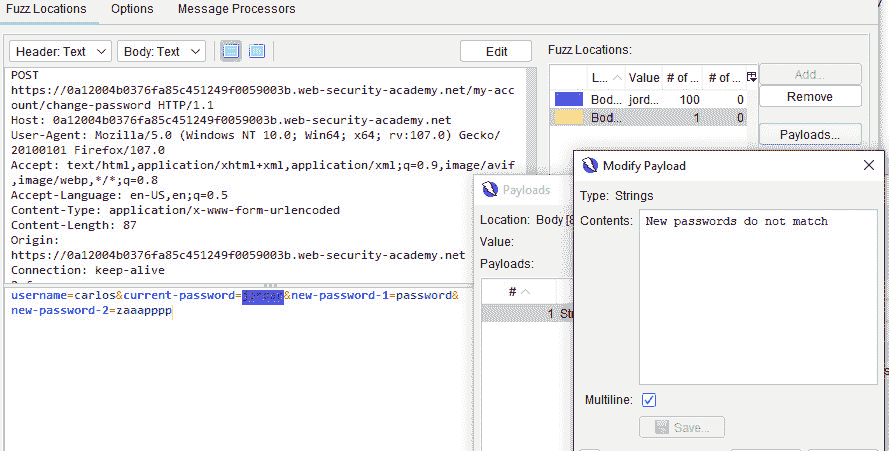

图 10.12 – Fuzzer 有效负载

1.  开始 Fuzz 测试。

1.  攻击会运行一段时间，停止后，查看包含`Reflected`一词的响应，这些响应可以在**信息**窗口的`Fuzzer`标签页中找到。排序**状态**栏，如*图 10.13*所示。滚动浏览有效载荷时，查看响应的主体，寻找`<p class=is-warning>New passwords do not match`。此有效载荷将是你的密码：

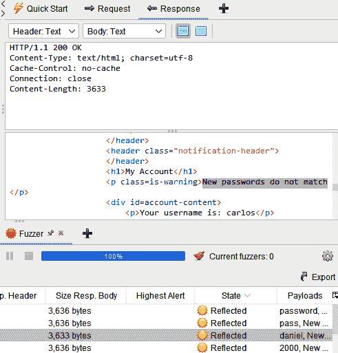

图 10.13 – 模糊器历史

1.  返回浏览器中的应用程序，登出当前登录的账户，然后使用`carlos`用户名和新发现的密码重新登录。

## 它的工作原理...

攻击者寻找应用程序中的区域，强行尝试多个用户名或密码，并采取不同的技术来实施攻击。最常见的四种方式如下：

+   简单的暴力破解攻击是攻击者通过逐个手动输入来尝试猜测用户的登录信息。

+   字典攻击是一种密码猜测攻击，攻击者输入一系列可能的密码，这些密码由将字母与符号或数字互换组成，然后与目标用户名进行对比。通常，这种攻击需要更长的时间才能成功，因此成功的可能性较低。

+   彩虹表攻击包含一个由密码及其哈希值构成的数据库，然后将其与目标哈希进行比对。这个过程破解的时间较短。

+   混合攻击结合了字典攻击和彩虹表攻击。

许多密码和表格来自以前泄露的地下来源，这些密码和表格被出售或在互联网上传播，并帮助进行更精准的网络攻击。

## 另请参见

其他可帮助构建密码列表的资源可以通过搜索引擎搜索关于所用技术的默认凭据，或利用以下链接之一：

凭据：

+   [`github.com/ihebski/DefaultCreds-cheat-sheet`](https://github.com/ihebski/DefaultCreds-cheat-sheet)

+   [`www.vulnerabilityassessment.co.uk/passwordsC.htm`](http://www.vulnerabilityassessment.co.uk/passwordsC.htm)

+   [`192-168-1-1ip.mobi/default-router-passwords-list/`](https://192-168-1-1ip.mobi/default-router-passwords-list/)

+   [`datarecovery.com/rd/default-passwords/`](https://datarecovery.com/rd/default-passwords/)

+   [`bizuns.com/default-passwords-list`](https://bizuns.com/default-passwords-list)

+   [`github.com/danielmiessler/SecLists/blob/master/Passwords/Default-Credentials/default-passwords.csv`](https://github.com/danielmiessler/SecLists/blob/master/Passwords/Default-Credentials/default-passwords.csv)

+   [`www.cirt.net/passwords`](https://www.cirt.net/passwords)

+   [`www.passwordsdatabase.com/`](https://www.passwordsdatabase.com/)

+   [`many-passwords.github.io/`](https://many-passwords.github.io/)

字典：

+   [`github.com/Dormidera/WordList-Compendium`](https://github.com/Dormidera/WordList-Compendium)

+   [`github.com/danielmiessler/SecLists`](https://github.com/danielmiessler/SecLists)

+   [`github.com/kaonashi-passwords/Kaonashi`](https://github.com/kaonashi-passwords/Kaonashi)

+   [`crackstation.net/crackstation-wordlist-password-cracking-dictionary.htm`](https://crackstation.net/crackstation-wordlist-password-cracking-dictionary.htm)

# Web 缓存中毒

**Web 缓存中毒**是一种复杂的技术，攻击者通过操纵 Web 服务器及其缓存功能，向其他用户发送恶意 HTTP 响应。在本实验中，我们将利用一个脆弱的实验环境，该环境没有正确验证易受 Web 缓存中毒攻击的无密钥头部中的输入。此攻击将利用 Web 应用程序的首页，毫无防备的访问者将成为攻击目标。我们将引导你完成 Web 缓存中毒的过程，该响应将导致访问者的浏览器执行恶意 JavaScript 代码。

## 准备工作

此实验需要一个 PortSwigger Academy 帐号，并且需要 ZAP 来拦截从服务器到浏览器的请求和响应。

## 操作步骤...

在本节中，我们将列出你可以采取的步骤，以完成 PortSwigger Academy *Web 缓存中毒与无密钥头部* 实验，并中毒缓存以显示 cookie。启动实验的步骤如下：

1.  在浏览器代理到 ZAP 的情况下，访问网址并登录 PortSwigger Academy 网站以启动实验：

    ```
    https://portswigger.net/web-security/web-cache-poisoning/exploiting-design-flaws/lab-web-cache-poisoning-with-an-unkeyed-header
    ```

1.  捕获网站的首页。为了重新获取此响应，可以刷新网页或点击首页按钮。

1.  查找从首页生成的`GET`请求，并在**手动请求编辑器**中打开，如*图 10.14*所示：

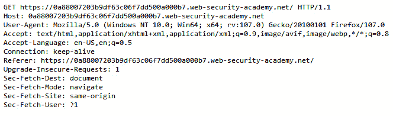

图 10.14 – GET 请求

1.  接下来，在网址后添加缓存破坏查询参数（**/?cb=1337**）。

**缓存破坏头**是一种 HTTP 响应头，用于防止网页浏览器缓存网页中的特定资源。在需要确保用户始终看到资源的最新版本，而不是可能已经存储在浏览器缓存中的过时版本时，这种方式非常有用。缓存破坏头通常包含一个唯一的标识符或时间戳，每次请求资源时都会发生变化，这迫使浏览器下载最新版本的资源，而不是使用缓存版本。这有助于确保用户始终可以访问网站上的最新内容。

重要提示

使用名为`Parameter Digger`的扩展可以自动化定位可能导致 Web 缓存中毒的漏洞参数。更多信息，请参见*另见*部分。

1.  此外，添加 `X-Forwarded-Host` 头部，使用任何随机主机名，如 *图 10.15* 所示，诸如 `zaproxy.org`，然后点击 **发送**。

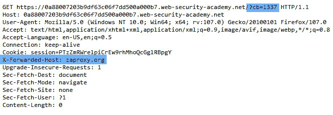

图 10.15 – 缓存清除查询和 X-Forwarded-Host 头部

1.  当使用 `X-Forwarded-Host` 头部时，网页应用源代码中会显示一个动态生成的引用，用于导入存储在 `/resources/js/tracking.js` 的 JavaScript 文件。

查找资源所需的所有细节都包含在这个绝对 URL 中，如 *图 10**.16* 所示：

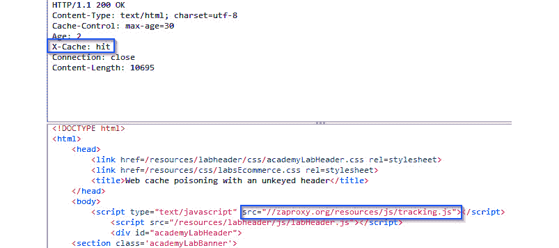

图 10.16 – 网页应用源代码中的动态 URL

1.  此外，在查看响应时，如 *图 10**.16* 所示，响应中包含 `X-Cache: hit` 头部。如果看到 `X-Cache: miss` 头部，请继续点击 **发送**，直到获得命中结果：

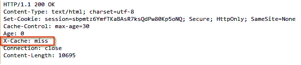

图 10.17 – X-Cache: miss 响应

`X-Cache` 头部是一个 HTTP 响应头部，用于指示资源是从网页服务器的缓存中提供的，还是直接从源服务器提供的。如果头部包含 `hit` 的值，则表示资源是从缓存中提供的，这比直接从源服务器提供资源更快捷、更高效。这对于提高网站性能非常有用，因为它可以减少服务器与客户端之间传输的数据量。

1.  通过这些信息，点击链接前往攻击服务器并更新文件名为来自绝对 URL 的 JavaScript 路径：

    ```
     /resources/js/tracking.js
    ```

1.  接下来，输入一个 JavaScript XSS 负载到请求体中，并点击 **保存** 以保存攻击：

    ```
     alert(document.cookie)
    ```

1.  再次打开 `GET` 请求并在 **手动响应编辑器** 中删除缓存清除参数，然后添加指向攻击服务器的 `X-Forwarded-Host` 头部（确保使用攻击页面顶部提供的 **EXPLOIT-SERVER-ID**）：

    ```
     X-Forwarded-Host: EXPLOIT-SERVER-ID.exploit-server.net
    ```

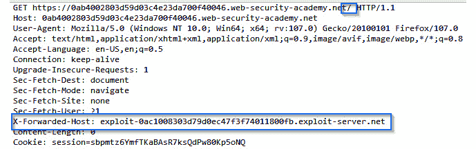

图 10.18 – 网页缓存污染的 GET 请求

重要提示

在构造 `GET` 请求时，务必移除缓存清除头部，并且在添加攻击服务器 URL 时，不要包括 `https://` 或尾部的 `/`。

1.  点击 **发送**，并继续发送请求，直到攻击服务器 URL 在响应中显示，并且头部中包含 `X-Cache: hit`，如 *图 10**.19* 所示：

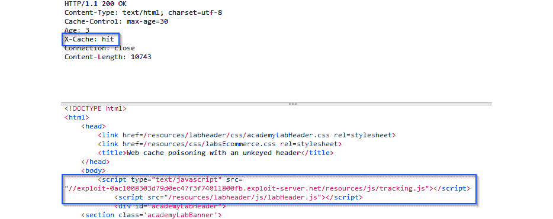

图 10.19 – 成功的攻击请求

1.  一旦获得命中结果，打开浏览器中的网页应用并刷新页面。这将把被污染的网页缓存 URL 加载到浏览器中，触发 `alert()` JavaScript 负载，如 *图 10**.20* 所示。

重要提示

这个实验的网页缓存会在每 30 秒过期。务必迅速进行测试。

1.  你可能需要继续发送恶意的 `GET` 请求，然后刷新 Web 应用浏览器页面，才能使网页中毒并加载执行载荷：

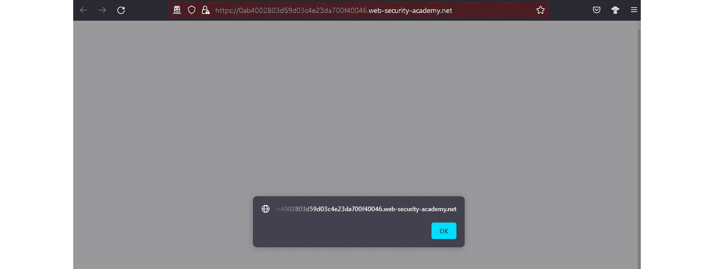

图 10.20 – XSS 载荷执行

## 它是如何工作的...

Web 缓存中毒通常涉及通过篡改对 Web 服务器请求的 HTTP 头部，以使服务器缓存一个恶意或错误的响应版本。例如，攻击者可能会发送一个伪造的 `Last-Modified` 头部，指示响应应该被视为新鲜的，并由服务器缓存，即使它包含恶意或错误的内容。当后续请求相同资源时，服务器将从缓存中提供被污染的响应，而不是从原始服务器请求新副本。

## 另见

查找参数的工具被称为 `Param Digger`。它揭示了那些晦涩、不相关或隐藏的特征，这些特征有助于扩大攻击面，并使发现漏洞变得更加简单。它使用暴力破解技术，通过提供的种子 URL 来查找参数：[`www.zaproxy.org/docs/desktop/addons/parameter-digger/`](https://www.zaproxy.org/docs/desktop/addons/parameter-digger/)。
