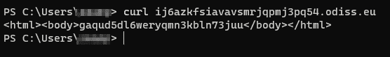

# 第十一章：ZAP 高级探索

这里是最后一章。你已经了解了 `Zed Attack Proxy`（**ZAP**）提供的各种选项，从浏览界面到配置，从爬取 web 应用、扫描和报告，到了解身份验证、授权、会话管理、未经验证输入的注入攻击，以及业务逻辑测试、客户端攻击和一些高级技术。最后一章将节奏有所变化，探讨 ZAP 的其他实现和用途。我们将介绍如何使用 OWASP ZAP GUI 开始 web 爬虫并扫描 API 漏洞，同时也会介绍如何使用 Docker 中的 API 扫描 web 应用。我们还将讨论并演示如何将 ZAP 集成到 Jenkins 流水线中，进行 web 应用的动态分析，并讲解如何安装、构建和配置 ZAP GUI OAST 服务器，进行带外漏洞检测。

在本章中，我们将涵盖以下内容：

+   如何使用 ZAP GUI 本地 API 扫描目标

+   如何通过 Docker 使用 ZAP API

+   在 Jenkins CI DevOps 流水线中利用 ZAP DAST 测试

+   安装、配置和运行 ZAP GUI OAST 服务器

# 技术要求

在本章中，你需要安装多个工具，这些工具将与 ZAP 协同工作以完成各项配方。对于 API 配方，你需要安装 Docker 和 OWASP ZAP API 的命令行脚本。Docker 还将用于 Jenkins 流水线以及独立的 BOAST 服务器。此外，我们将继续使用 Mozilla Firefox 浏览器和 GitHub Juice-shop 应用代码的分支。最后，我们将使用命令行工具 cURL 进行测试。

# 如何使用 ZAP GUI 本地 API 扫描目标

ZAP API 扫描是 ZAP Docker 镜像中包含的脚本。它经过优化，能够通过本地文件或 URL 扫描由 OpenAPI、SOAP 或 GraphQL 指定的 API。它会导入你提供的定义，然后对发现的 URL 进行主动扫描。ZAP API 使得将 ZAP 功能集成到脚本和应用程序中成为可能。在这个配方中，我们将演示如何下载 ZAP Docker 镜像，然后运行它以扫描 Juice-Shop URL。

## 准备工作

需要安装 Docker 以及 ZAP Docker 镜像。确保 ZAP 镜像能够拦截从服务器到浏览器的请求和响应。我们还将使用命令行来运行镜像并启动爬虫和扫描。还需要使用 OWASP ZAP Desktop：

```
 https://www.docker.com/products/docker-desktop
```

## 如何操作…

基于 ZAP API 的有效自动化分析可以帮助识别新出现的漏洞。通过使用当前的功能回归测试套件和 ZAP Python API，OWASP ZAP 将帮助你将安全测试自动化，并将其集成到应用程序的**持续集成`/`持续交付**（`CI**/`CD**）流水线中。

重要提示

ZAP API 扫描是 ZAP Docker 镜像中可用的脚本。在这里下载 OWASP ZAP Docker：`docker** **pull owasp/zap2docker-stable`。

1.  通过运行桌面可执行文件、`zap.sh`脚本（Linux/macOS）或`zap.bat`脚本（Windows）启动 OWASP ZAP：

    ```
     Windows: .\zap.bat
    ```

    ```
     Linux/Mac: ./zap.sh
    ```

    ```
     Cross Platform: java -Xmx512m -jar zap-2.12.0.jar
    ```

重要说明

要以无头模式运行 ZAP，请使用 -*daemon* 标志。OWASP ZAP 守护程序模式是一个功能，允许工具作为守护程序或后台服务在计算机上运行。如果您希望设置对 Web 应用程序的持续扫描或希望使用 OWASP ZAP API 远程控制工具，则此功能可能会非常有用。

1.  在 OWASP ZAP UI 中，打开**工具**然后选择**选项**，转到`API`选项卡。注意 API 密钥，如*图 11**.1*所示，以及与 API 使用允许的 IP 地址和其他选项。您可以勾选以启用 API 和 Web UI（`127.0.0.1:PORT**/**UI`或/**json**）。此外，还有一些仅推荐用于测试目的的调试选项，如**禁用 API 密钥**。


图 11.1 – API 选项

1.  要开始，请确保从 Marketplace 添加适当的插件。OWASP ZAP 支持 OpenAPI、GraphQL 和 SOAP。

1.  要启动扫描，只需从**快速启动**菜单中使用**自动化扫描**并扫描端点。唯一的区别是确保 URL 具有适当的 API 范围：

    ```
     OpenAPI: https://www.example.com/openapi.json
    ```

    ```
     GraphQL: https://www.example.com/graphql
    ```

1.  结果将显示在同一**信息**窗口下的**警报**选项卡中，如*图 11**.2*所示：


图 11.2 – GraphQL 警报结果

## 工作原理…

您可以使用多种不同的方法与 ZAP API 扫描程序进行交互，以执行各种任务，例如蜘蛛爬行 Web 应用程序以了解其内容、寻找应用程序漏洞或生成报告。通过向由活动 ZAP 实例提供的 ZAP API 端点发出 HTTP 请求，这是使用 ZAP API 的标准过程。根据您设置工具的方式，端点将位于特定的 URL 上。

有几种方法可以使用 ZAP API 扫描程序。它允许您扫描单个网页、整个 Web 应用程序或一组连接的在线应用程序。此外，它还可用于自动执行多种与安全相关的操作，包括计划扫描、生成报告和与其他安全解决方案连接。

# 如何通过 Docker 使用 ZAP API

使用 Docker 执行和管理 ZAP 应用程序称为通过 Docker 运行 ZAP。

如果您希望在容器化环境中运行 ZAP 或快速安装和操作多台机器上的 ZAP，则这可能会有所帮助。

## 准备工作

您必须在计算机上安装 Docker，并从 Docker Hub 获取 ZAP Docker 镜像，以便通过 Docker 访问 ZAP API。

然后可以将镜像作为 Docker 容器运行，并在容器运行时通过 ZAP API 与容器进行通信。

## 如何操作…

当你运行 ZAP Docker 镜像时，ZAP 应用程序将在容器内启动。然后，ZAP 将处理任何发送到运行中容器的请求，使用 ZAP API。你可以使用 ZAP API 提供的各种方法与 ZAP 交互，例如爬取一个 Web 应用程序以了解其内容，寻找应用漏洞或生成报告：

1.  除了通过图形用户界面（GUI）运行 API 扫描，你还可以通过命令行使用 Docker 启动扫描。

1.  要通过 Docker 命令行使用 API，打开终端会话并运行 Docker 拉取 ZAP 镜像：

    ```
    docker pull owasp/zap2docker-stable
    ```

1.  接下来，在下载完镜像后，再次运行 Docker，但这次是为了创建一个运行 ZAP API 的 ZAP 容器，如下所示：

    ```
    docker run -t owasp/zap2docker-stable zap-api-scan.py -t https://www.example.com/openapi.json -f openapi
    ```

1.  过一会儿，命令行会展示正在运行的攻击及其结果，是否通过、失败或有其他警告，如 *图 11.3* 所示。


图 11.3 – Juice-Shop 的 Docker API 扫描

你将在最后看到结果（见 *图 11.4*）。


图 11.4 – Docker API 扫描结果

默认情况下，脚本执行以下操作：

+   导入指定的 API 定义

+   使用针对 API 特定扫描配置文件的扫描主动扫描 API

+   通知命令行任何发现的问题

重要提示

如果没有发现漏洞，并不意味着你的 API 是安全的。你可能需要进行手动渗透测试。

## 它是如何工作的…

该 API 提供了一组方法，可以用来执行各种操作，例如启动和停止扫描、设置扫描目标以及检索扫描结果。

要使用 OWASP ZAP API，你需要向 API 端点发送 HTTP 请求，该端点通常与 ZAP 应用程序托管在同一台机器上。该 API 使用 **表现层状态转移**（**RESTful**）设计，这意味着你可以使用标准的 HTTP 方法（如 `GET`、`POST`、`PUT` 和 **DELETE**）来执行不同的操作。

当你使用 OWASP ZAP API 启动扫描时，工具将开始爬取目标 Web 应用程序，并执行各种类型的测试来识别漏洞。这些测试可能包括寻找 SQL 注入（SQLI）漏洞、**跨站脚本**（**XSS**）漏洞以及其他可能被攻击者利用的漏洞。

扫描完成后，OWASP ZAP API 将提供一份报告，详细说明所识别的任何漏洞。报告通常会包括漏洞类型、漏洞在应用程序中的位置以及修复漏洞的建议。

## 还有更多…

除了通过 HTTP 请求使用 OWASP ZAP API 外，还有许多客户端库和语言绑定可供使用，使得在不同编程语言中使用 API 更加方便。这些库提供了一组函数和方法，可以用来发起 API 调用并与 ZAP 工具交互，而不需要手动构造和发送 HTTP 请求。

例如，针对 Python、Java 和 C# 等语言，提供了客户端库，允许您在自己的程序中使用 OWASP ZAP API。使用这些库可以更容易地将 ZAP 工具集成到您的应用程序或流程中，同时通过处理 API 调用和分析响应的复杂性，为您节省时间。

还有许多其他方法可以根据您的具体需求使用 OWASP ZAP API。例如，您可以将 API 用于自动化安全测试，作为 CI/CD 管道的一部分，或将 ZAP 工具集成到自定义的安全工具或平台中。您还可以使用 API 定期执行扫描，或响应特定事件，例如将新代码部署到生产环境中。

## 另请参阅

在运行 API 脚本时，以下是一些可以与 ZAP API 一起使用的命令选项：

```
 Options: -c config_file config file for INFO, IGNORE or FAIL warnings -u config_url URL config file for INFO, IGNORE or FAIL warning -g gen_file generate default config file(all rules set to WARN) -r report_html file to write the full ZAP HTML report -w report_md file to write the full ZAP Wiki(Markdown) report -x report_xml file to write the full ZAP XML report -a include the alpha passive scan rules as well -d show debug messages -P specify listen port -D delay in seconds to wait for passive scanning -i default rules not in the config file to INFO -l level minimum level to show: PASS, IGNORE, INFO, WARN or FAIL, use with -s to hide example URLs -n context_file context file which will be loaded prior to scanning the target -p progress_file progress file which specifies issues that are being addressed -s short output format - don't show PASSes or example URLs -z zap_options ZAP CLI options (-z "-config aaa=bbb -config ccc=ddd")
```

更多信息，请访问以下链接：

+   *OWASP ZAP 官方文档：ZAP – API* *扫描*：[`www.zaproxy.org/docs/docker/api-scan/`](https://www.zaproxy.org/docs/docker/api-scan/)

+   *OWASP ZAP 官方文档：选项 API* *界面*：[`www.zaproxy.org/docs/desktop/ui/dialogs/options/api/`](https://www.zaproxy.org/docs/desktop/ui/dialogs/options/api/)

+   *OWASP ZAP 官方文档：使用* *ZAP* 扫描 API：[`www.zaproxy.org/blog/2017-06-19-scanning-apis-with-zap/`](https://www.zaproxy.org/blog/2017-06-19-scanning-apis-with-zap/)

+   *OWASP ZAP 官方文档：使用* *ZAP* 探索 API：[`www.zaproxy.org/blog/2017-04-03-exploring-apis-with-zap/`](https://www.zaproxy.org/blog/2017-04-03-exploring-apis-with-zap/)

+   *OWASP ZAP 官方文档：为什么默认需要 API 密钥？*：[`www.zaproxy.org/faq/why-is-an-api-key-required-by-default/`](https://www.zaproxy.org/faq/why-is-an-api-key-required-by-default/)

+   *OWASP ZAP 官方文档：如何远程连接到 ZAP* *？*：[`www.zaproxy.org/faq/how-can-i-connect-to-zap-remotely/`](https://www.zaproxy.org/faq/how-can-i-connect-to-zap-remotely/)

+   *OWASP ZAP 官方 FAQ 文档：如何使用 ZAP* *API*： [`www.zaproxy.org/faq/how-can-you-use-zap-to-scan-apis/`](https://www.zaproxy.org/faq/how-can-you-use-zap-to-scan-apis/)

+   *GitHub Action 用于运行 OWASP ZAP API* *扫描*：[`github.com/marketplace/actions/owasp-zap-api-scan`](https://github.com/marketplace/actions/owasp-zap-api-scan)

# 利用 ZAP DAST 测试与 Jenkins

Jenkins 是一种开源 CI/CD 技术，帮助自动化软件开发过程。Jenkins 允许开发人员无缝合并代码更改，并自动创建、测试和部署应用程序，使软件开发过程更加高效和可靠。Jenkins 被各种规模的团队广泛使用，以自动化他们的软件交付过程，并且可以轻松定制以满足每个项目的需求。在此背景下，OWASP ZAP 是一种**动态应用程序安全**（**DAST**）漏洞检测工具，用于 Web 应用程序。它可以与 Jenkins 管道连接，作为 CI/CD 过程的一部分来自动化安全测试。

## 准备就绪

本食谱要求在 Ubuntu 22.04 虚拟机上安装 Jenkins 和 Docker。确保 Juice-Shop 已在本地运行，以便进行扫描。

重要提示

如果您在本地系统上运行 Jenkins，必须通过终端命令`sudo chmod 777 /var/run/docker.sock`为所有者、普通用户和非用户提供访问权限。除非您为所有者、普通用户和非用户提供访问权限，否则脚本将无法运行。

请记住，这个脚本仅用于扫描已经在**生产/沙盒/UAT/SIT**环境中的应用程序。

## 如何操作…

在本食谱中，我们将引导您完成在 Jenkins 管道中安装 OWASP ZAP 并设置自动化扫描的过程，以便在新代码迭代和推送期间运行扫描。此外，我们还将把 JIRA 的票务系统集成到该过程中，完成 DevOps 生命周期：

1.  在 Jenkins 运行并安装 Docker 后，打开您选择的浏览器，访问 Jenkins 应用程序：

    ```
     http://<VM_IP_ADDR>:8080
    ```

重要提示

Jenkins 启动默认运行在`https://localhost:8080/`。通过编辑安装位置的`jenkins.xml`文件，您可以调整启动配置。其他启动配置参数，例如 JVM 选项、HTTPS 配置等，也可以在此文件中修改。

1.  使用您在首次设置 Jenkins 时创建的凭据登录。如果您还没有完成这一步，您需要输入`initialAdminPassword`，该密码可以在以下路径中找到：

    ```
     Windows: C:\ProgramData\Jenkins\.jenkins\secrets
    ```

    ```
     Linux: /var/lib/jenkins/secrets/
    ```

    ```
     MacOS: /Users/Shared/Jenkins/Home/secrets/
    ```

1.  在主页屏幕上，我们将创建一个*新项目*，命名为`ZAP`，并选择`Pipeline`，如*图 11.5*所示：


图 11.5 – 新的 Jenkins 项目

1.  在下一个屏幕上，您将看到几个设置或构建触发器，但我们将跳过这些，直接进入**管道**脚本（见*图 11.6*）。


图 11.6 – 管道脚本

1.  我们将输入以下 Groovy 脚本：

    ```
     pipeline {
    ```

    ```
     agent any
    ```

    ```
     parameters {
    ```

    ```
     choice(name: "ZAP_SCAN", choices: ["zap-baseline.py", "zap-full-scan.py"], description: "Parameter to choose type of ZAP scan")
    ```

    ```
     string(name: "ENTER_URL", defaultValue: "http://192.168.1.1:3000", trim: true, description: "Parameter for entering a URL to be scanned")
    ```

    ```
     }
    ```

    ```
     stages {
    ```

    ```
     stage('Get Write Access'){
    ```

    ```
     steps {
    ```

    ```
     sh "chmod 777 \$(pwd)"
    ```

    ```
     }
    ```

    ```
     }
    ```

    ```
     stage('Setting up OWASP ZAP docker container') {
    ```

    ```
     steps {
    ```

    ```
     echo "Starting container --> Start"
    ```

    ```
     sh "docker run --rm -v \$(pwd):/zap/wrk/:rw --name owasp -dt owasp/zap2docker-live /bin/bash"
    ```

    ```
     }
    ```

    ```
     }
    ```

    ```
     stage('Run Application Scan') {
    ```

    ```
     steps {
    ```

    ```
     sh "docker exec owasp ${params.ZAP_SCAN} -t ${params.ENTER_URL} -I -j --auto"
    ```

    ```
     }
    ```

    ```
     }
    ```

    ```
     stage('Stop and Remove Container') {
    ```

    ```
     steps {
    ```

    ```
     echo "Removing container"
    ```

    ```
     sh '''
    ```

    ```
     docker stop owasp
    ```

    ```
     '''
    ```

    ```
     }
    ```

    ```
     }
    ```

    ```
     }
    ```

    ```
     }
    ```

1.  点击**保存**后，您将进入**阶段视图**屏幕。在这里，您可以查看状态、查看更改、立即构建、配置、删除管道、查看完整阶段视图、重命名管道，并查看管道语法，如*图 11.7*所示：


图 11.7 – 阶段视图

1.  要运行我们刚刚输入的脚本，点击**带参数构建**。

1.  这将启动脚本并执行我们输入的步骤。你将看到新的构建在**构建历史**中运行，以及步骤在**阶段视图**中运行，如*图 11.8*所示：


图 11.8 – 新构建

1.  你还可以点击**构建历史**中的编号，进入构建查看更多细节，例如**控制台输出**，它显示管道执行的命令和可能发生的任何错误，如*图 11.9*所示。错误会非常明显，控制台输出中的红色`X`符号或**构建历史**中的编号旁边的红色标记，或者在**阶段视图**中出现红色，表示错误发生的位置。


图 11.9 – 控制台输出

1.  扫描完成后，你可以点击**阶段视图**中的阶段，再点击**日志**来查看结果，如*图 11.10*所示。


图 11.10 – 日志

该视图将显示扫描的详细信息，你可以在这里消化所有发现，并查看这些问题发生在哪个 URL 中（参见*图 11.11*）。


图 11.11 – 阶段日志

成功的构建和扫描需要通过大量试错来调整管道设置，这需要查看管道错误或在脚本中注释掉某些部分。

## 它是如何工作的…

Jenkins 管道被配置为在构建过程中运行 OWASP ZAP 作为一个步骤。这可以通过使用 Jenkins 插件或直接从 Jenkins 脚本调用 OWASP ZAP **命令行界面**（**CLI**）来完成。当管道执行时，Jenkins 会触发 OWASP ZAP 对正在测试的应用程序进行安全扫描。OWASP ZAP 将尝试发现应用程序中的任何漏洞，如 SQL 注入（SQLI）缺陷或跨站脚本（XSS）漏洞。

OWASP ZAP 然后生成报告，详细列出发现的任何漏洞，并提供修复建议。此报告可以自动发送给开发团队进行审查。如果安全扫描识别到任何关键漏洞，Jenkins 管道可以配置为使构建失败，从而防止脆弱的代码被部署到生产环境。

总的来说，将 OWASP ZAP 集成到 Jenkins 管道中有助于自动化识别和解决 Web 应用程序安全漏洞的过程，使软件开发过程更加高效和安全。

## 还有更多…

流水线脚本只是一个简单扫描 URL 并查看流水线结果的示例。通过进一步处理脚本，您可以生成报告，并将这些报告从 Docker 容器复制到您选择的目录中。此外，我们编写的这个流水线构建还将创建参数，允许您在基线扫描和完整扫描之间切换，并输入要扫描的 URL，从而让您更快地构建应用程序的流水线。

重要提示

如果由于某种原因，您的构建未进行扫描，请检查您的 Docker 是否已停止容器。如果没有停止，您需要在再次运行构建之前停止它。

## 另请参阅

有关在运行 Docker 扫描时的更多详细信息，请参见以下内容：

+   对于基线扫描，请参阅[`www.zaproxy.org/docs/docker/baseline-scan/`](https://www.zaproxy.org/docs/docker/baseline-scan/)

+   完整扫描，请参阅[`www.zaproxy.org/docs/docker/full-scan/`](https://www.zaproxy.org/docs/docker/full-scan/)

# 安装、配置和运行 ZAP GUI OAST 服务器

BOAST 服务器是为接收和报告带外应用程序安全测试结果而创建的。一些应用程序安全测试只会导致被检查的应用程序产生带外响应。由于这些特定用例场景的性质，请求不会作为响应传回给攻击者，并且在客户端被隐藏在第三方 NAT 后时也不会被看到。因此，需要另一个组件来正确感知这些响应。该组件需要能够在互联网上自由访问，并且在不受第三方 NAT 限制的情况下通信接收的协议和端口。

在这个教程中，我们将指导您如何安装、配置和测试需要 OOB 的应用程序，使用 OWASP ZAP BOAST 服务器，并介绍如何安装您自己的 BOAST 服务器进行测试。

## 准备工作

这个教程需要 ZAP 设置为拦截并发送 BOAST 服务器和客户端应用程序之间的请求和响应。需要安装以下工具：

+   Docker: [`www.docker.com/products/docker-desktop/`](https://www.docker.com/products/docker-desktop/)

+   GoLang: [`go.dev/doc/install`](https://go.dev/doc/install)

## 如何操作…

在这个教程中，我们将介绍如何安装、配置和运行您自己的 BOAST 服务来进行带外攻击的不同技术：

1.  首先，为了使用 OAST 服务器，您需要从 ZAP Marketplace 下载附加组件（参见*图 11**.12*）。


图 11.12 – ZAP Marketplace

1.  安装完成后，转到**工具**菜单，然后选择**选项**。

然后，要么转到**工具** | **选项…` | **OAST`，单击主工具栏中的齿轮图标，然后单击`OAST`，要么按下*Ctrl* + *Alt* + *O*，然后单击`OAST`。

1.  要查看`OAST`选项，请向下滚动工具的**选项**菜单，直到看到`OAST`（参见*图 11.13*）。


图 11.13 – OWASP OAST 选项

1.  在**常规**下的第一个设置中，有一个下拉菜单可选择`BOAST`或`Interactsh`，并且旁边有一个复选框用于选择**使用` `永久数据库**。

1.  从下拉菜单中选择`BOAST`，然后进入`OAST`选项屏幕中的`BOAST`标签。**永久数据库**是可选项。

通过勾选**使用永久数据库**，你可以在 ZAP 的永久数据库中跟踪已注册的带外有效载荷。根据预定的轮询周期，持久化的有效载荷将被放入内存并与其他有效载荷一起查询。目前，只有 BOAST 服务可以提供永久数据库。

请注意，这意味着即使这些警报与第一次分析或扫描没有直接关系，ZAP 会话期间仍然可能会显示警报。

1.  输入一个有效的服务器 URI 或使用默认 URI。用于注册和轮询的 URI 应由此地址指向：

[`odiss.eu:1337/events`](https://odiss.eu:1337/events)

1.  方案、主机、端口和`/events`端点是有效 URI 的必要组成部分。必须在主机上运行一个有效的 BOAST 实例。

1.  选择一个轮询间隔。这是轮询已注册 BOAST 服务器的频率，单位为秒。没有最大允许值，但需要至少 10 秒。默认设置为 60 秒。

1.  点击**注册**，新条目将添加到**活动服务器**表中，包括有效载荷和 Canary。复制此有效载荷以在你的攻击中使用。

当请求发送到相应的有效载荷地址时，系统会返回一个被称为 Canary 值的随机字符串，该值会返回到目标 Web 应用程序。

1.  接下来，为了测试 BOAST 有效载荷是否工作，打开命令行终端并使用 curl 请求给定的 URI（参见*图 11.4*）：

    ```
    curl ij6azkfsiavavsmrjqpmj3pq54.odiss.eu
    ```



图 11.14 – 一个 curl 请求

1.  ZAP 现在将按照你设置的频率轮询该服务器，并报告所有交互（DNS、HTTP 等）。要查看有效载荷 URI，请打开信息窗口中的`OAST`标签，如*图 11.5*所示：


图 11.15 – BOAST

我们还可以通过 curl 发送其他数据，以查看在 OAST 轮询中捕获了什么。

1.  这里是一个发送`POST`请求的 curl 请求示例，包含一个简单的头部且没有数据：

    ```
    curl -X POST -H "Content-Type: application/json" ij6azkfsiavavsmrjqpmj3pq54.odiss.eu
    ```

`-X` 标志指定要使用的 HTTP 方法——在本例中为`POST`。`-H` 标志用于设置自定义头部——在本例中，`Content-Type` 头部设置为`application/json`，以表明请求体包含 JSON 数据。你还可以使用`--data`或**-d 标志**来包含请求体，例如：

```
 curl -X POST -H "Content-Type: application/json" -d '{"key": "value"}' secret.ij6azkfsiavavsmrjqpmj3pq54.odiss.eu
```

这发送了一个带有 JSON 编码请求体的`POST`请求，其中包含`{"key": "value"}`数据，如*图 11.6*所示：


图 11.16 – 一个带有秘密的 curl 请求示例

## 它是如何工作的…

跨信道攻击发生在攻击者使用与受害者不同的通信路径时。这使得攻击者能够更容易地访问敏感数据或系统，因为它可以帮助他们绕过主通信路径上的任何安全措施。

有几种技术可以进行跨信道利用。例如，攻击者可能会向目标发送钓鱼邮件，诱使其点击一个链接，从而在受害者的计算机上安装恶意软件。病毒随后可能被用来访问受害者的计算机，使得攻击者能够利用它来破坏操作或窃取重要数据。

另一种技术是攻击者使用不同的通信渠道来控制已经植入受害者计算机中的恶意软件。例如，攻击者可能通过其他渠道，如电话或短信，指示病毒执行某个操作，例如删除文件或加密数据勒索。

一般而言，由于跨信道攻击使用了与防御通信路径不同的通信方式，因此它们可能很难被识别和阻止。个人和组织应当意识到这些攻击带来的危险，并采取预防措施来保护自己。这可能包括设置安全密码、安装安全软件并保持更新，以及在打开链接或下载不可信来源的文件时保持谨慎。

## 还有更多…

这些类型的漏洞极其微妙且对公司来说至关重要，因为恶意行为者可以利用它们。它们主要出现在 REST API 和 Web 应用程序中。

以下是一些跨信道攻击的示例：

+   **盲服务器端 XML/SOAP 注入**：类似于 SQL 注入，攻击者向服务器发送 XML 或 SOAP 请求，意图操控服务器的行为，可能读取或修改数据、执行任意代码或发起其他攻击，且此攻击为“盲”攻击，因为攻击者无法立即获得攻击是否成功的反馈。

+   **盲 XSS（延迟 XSS）**：一种隐蔽且难以检测的攻击方式，攻击者通过将恶意代码注入到网站中，等待其他人通过访问被攻击的网页来触发攻击，可能会窃取个人信息或控制受害者的浏览器。

+   **主机头攻击**：操控 HTTP 请求中的主机头，欺骗 Web 服务器运行恶意代码或提供敏感信息，可能允许攻击者控制服务器或暴露敏感信息。

+   **带外远程代码执行（OOB RCE）**：一种攻击方式，攻击者通过在单独的通信渠道上传递代码并接收结果，在目标系统上运行任意代码，可能泄露敏感信息或使攻击者控制系统。

+   **带外 SQL 注入（OOB SQLI）**：一种 SQL 注入攻击，攻击者利用单独的通信渠道发送命令并接收结果，在目标数据库上执行任意 SQL 指令，可能暴露敏感信息或允许攻击者控制数据库。

+   **电子邮件头注入**：将恶意代码注入电子邮件消息的头部，以操控电子邮件客户端或服务器的行为，可能误导受害者提交敏感信息或下载恶意软件。

+   **服务器端请求伪造（SSRF）**：一种攻击方式，攻击者通过易受攻击的服务器向网络中的其他服务器、资源或服务发送任意请求，可能泄露敏感信息或让攻击者发起更多攻击。

+   **XML 外部实体（XXE）注入**：一种利用 XML 解析器漏洞访问文件或在目标系统上执行任意代码的攻击，可能暴露敏感信息或允许攻击者控制机器。

+   **操作系统代码注入 – OOB**：一种攻击方式，攻击者通过将命令注入到易受攻击的应用程序中，在目标系统上执行任意系统指令，可能暴露敏感信息或让攻击者控制系统。

+   **XXE – OOB**：XXE 攻击的一种版本，其中 XXE 攻击的结果通过不同的通信路径带外发送，而非被滥用的路径，可能让攻击者在不被检测到的情况下获取敏感信息或控制系统。

重要提示

如果安装了 *Script Console* 和 *GraalVM JavaScript* 插件，ZAP 引入了一个新的扩展脚本模板，名为 `OAST Request Handler.js`。该模板可以用来开发一个脚本，检测到带外请求时执行某个命令。这个动作可以是任何内容，例如运行另一个 ZAP 脚本或发送电子邮件给自己。

## 另请参见

还有一些其他在线服务允许我们与带外攻击进行交互，例如：

+   免费的 Web GUI Interactsh: [`app.interactsh.com/#/`](https://app.interactsh.com/#/)

+   对于 ZAP 扩展，请参阅 [`github.com/zaproxy/zap-extensions`](https://github.com/zaproxy/zap-extensions)
